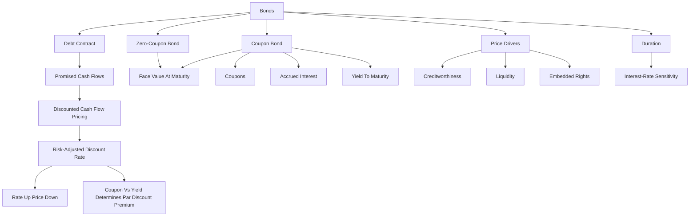

# Exercise 06-07: Bonds I

Source files:

- `finance-and-investment-management/raw/Exercise_6_Bonds_I_Without_Solutions.pdf`
- `finance-and-investment-management/raw/moodle-export-investment-and-financial-management-950881761-s26-20260604/Investment and  950881761 (S26)_2026064_1514/CW 21  19.05. _ 20.05./Exercise 6 - Solutions.pdf`
- `finance-and-investment-management/raw/moodle-export-investment-and-financial-management-950881761-s26-20260604/Investment and  950881761 (S26)_2026064_1514/CW 23  02.06. _ 03.06./Exercise 7.pdf`
- `finance-and-investment-management/raw/moodle-export-investment-and-financial-management-950881761-s26-20260709/CW 23  02.06. _ 03.06./Exercise 7 - Solutions.pdf`
- `finance-and-investment-management/raw/moodle-export-investment-and-financial-management-950881761-s26-20260709/CW 23  02.06. _ 03.06./Video Resource - Excel Sheet.xlsx`
- `finance-and-investment-management/raw/Formulary.pdf`

Lecture folder: `finance-and-investment-management/`
Date processed: 2026-05-16; refreshed with solution and Exercise 7 material on 2026-06-06; refreshed with Exercise 7 solutions and Excel return-resource source on 2026-07-09

## High-Yield 80/20 Summary

Bond valuation applies discounted cash flow logic to financial securities. A bond price is the present value of promised coupon payments and principal repayment, discounted at a risk-adjusted rate. The most important exam intuition is the inverse relationship between interest rates and bond prices.

Core logic:

1. Identify the bond type: zero-coupon or coupon bond.
2. Identify promised cash flows and timing.
3. Discount at the appropriate risk-adjusted rate or term structure.
4. Interpret price changes when market interest rates change.
5. Know that creditworthiness, coupon, rights, liquidity, and interest rates affect bond prices.
6. For coupon bonds, separate market price, accrued interest, and final settlement price.
7. Understand that discount bonds move upward toward face value over time, while premium bonds move downward toward face value.
8. Connect bond yields to Cost of Capital: market YTM on comparable debt can estimate `r_D`, the debt-cost input in WACC.

## Bond Definition

A bond is a long-term contract where the issuer borrows money and commits to repay debt at a specified date and, if applicable, pay coupons at predetermined dates.

Bond cash flows are often easier to predict than stock cash flows, except for:

- Variable coupons.
- Insolvency / default risk.
- Embedded rights such as convertibility or issuer options.

## Bond Price Drivers

The slides highlight these drivers:

- Creditworthiness.
- Interest rate / discount rate.
- Coupon.
- Rights attached to the bond.
- Liquidity.

Real-life interpretation: a German government bond and a risky corporate bond with the same face value and maturity should not have the same discount rate because their credit risks differ.

## Bond Types

| Bond Type | Meaning |
|---|---|
| Coupon bond | Fixed coupon payments plus principal at maturity |
| Zero-coupon bond | No coupons; repayment at maturity only |
| Floater | Coupon adjusts to market interest rates |
| Perpetual / consol bond | No maturity date |
| Convertible bond | Can be exchanged for shares under defined conditions |
| Warrant / option bond | Includes option rights traded separately |
| Reverse convertible | Issuer may repay with shares instead of cash |

## Core Variables

```text
B_0 = present bond price
B_0^ZB = present zero-bond price
B_N = face value / redemption value at maturity
C = coupon
C_k = coupon payment at time k
r = risk-adjusted discount rate
N = maturity in periods
D = duration
D_mod = modified duration
q = 1 + r
```

## General Pricing Principle

```text
PV = sum of all CF_n / (1+r)^n
```

Equivalent principle: the present value of a group of cash flows equals the sum of the present values of each individual cash flow.

## Zero-Coupon Bond

A zero-coupon bond pays only the face value at maturity.

```text
B_0^ZB = B_N / (1+r)^N = B_N x q^(-N)
```

Example from slides:

A zero bond with face value 100, maturity 20 years, and annual rate 6.75%:

```text
B_0 = 100 / 1.0675^20 = 27.08
```

Interpretation: the investor pays far below face value because all return comes from price appreciation to face value at maturity.

## Coupon Bond

A coupon bond pays coupons and face value.

```text
B_0 = sum from k=1 to N of C/(1+r)^k + B_N/(1+r)^N

Equivalent annuity form:
B_0 = C x [1 - 1/(1+r)^N] / r + B_N/(1+r)^N
```

Equivalent interpretation:

```text
Bond price = PV(coupon annuity) + PV(face value)
```

Exam trap: if coupon is given as a percentage of face value, convert it into the coupon cash flow before using the formula.

### Face Value, PV Of Face Value, And Coupon Annuity

Keep three layers separate:

| Concept | Meaning | Example with face value 1,000 and 6% coupon |
|---|---|---|
| Face value | Principal amount contractually repaid at maturity | `1,000` repaid at maturity |
| Coupon cash flow | Periodic promised interest payment | `1,000 x 6% = 60` each year |
| Coupon annuity | Repeated coupon cash flows valued as an annuity | `60, 60, 60, ...` discounted to today |
| PV of face value | Today's discounted value of the future principal repayment | `1,000 / (1+r)^N` |

This means the amount repaid at maturity is not the discounted number. If `1,000 / (1+r)^N = 244.35`, then `244.35` is the **present value of the future face-value repayment**, while the contractual maturity repayment remains `1,000`.

For a coupon bond, the final-year cash flow is:

```text
Final-year CF = coupon + face value
```

Example:

```text
Face value = 1,000
Coupon rate = 6%
Annual coupon = 60
Final-year cash flow = 60 + 1,000 = 1,060
```

Exam trap: do not answer the maturity repayment with the present value of the face value. The PV belongs in the price calculation; the face value is the amount paid at maturity.

### Par, Discount, And Premium

The refreshed Exercise 7 slides categorize coupon-bond prices relative to face value:

| Price relation | Meaning | Typical condition |
|---|---|---|
| `B_0 = 100` | Bond trades at par | Coupon rate equals market yield |
| `B_0 < 100` | Bond trades below par / at discount | Coupon rate below market yield |
| `B_0 > 100` | Bond trades above par / at premium | Coupon rate above market yield |

For a 10% coupon bond with face value 100 and market interest rate 10%, the price is 100 because the coupon rate equals the market-required return.

## Accrued Interest And Settlement Price

If bond ownership changes between coupon dates, the buyer compensates the seller for the interest earned since the last coupon date.

The lecture separates:

| Term | Meaning |
|---|---|
| Market price / ex-coupon price | Quoted fair price of the bond excluding accrued interest |
| Accrued interest | Pro-rata coupon compensation between the last coupon date and sale date |
| Settlement / dirty price | Market price plus accrued interest, and in real markets possibly fees |

The simplified accrued-interest formula in the slides is:

```text
I_0 = (t_1 - t_0) x (1/360) x C
```

where `t_1 - t_0` is the number of days between the last coupon payment date and the selling date, and `C` is the annual coupon amount.

Exam trap: the exchange quote is usually the clean market price. The cash paid by the buyer can be higher because accrued interest is added.

## Price Path Toward Maturity

The Exercise 7 deck emphasizes how bond prices move as maturity approaches:

- At maturity, the price equals nominal/face value, assuming repayment at par.
- A discount bond tends to increase toward face value as maturity approaches.
- A premium bond tends to decrease toward face value as maturity approaches.

This is separate from market-yield shocks. Even if market rates do not change, time-to-maturity changes the present-value calculation.

## Yield To Maturity

Yield to maturity is the annual return earned if the bond is held to maturity and the assumptions of the calculation hold.

```text
Bond price = PV(promised coupons and redemption discounted at YTM)
```

The Exercise 7 slides add the reinvestment assumption: coupon cash flows are assumed to be reinvested at the market rate used in the YTM logic.

Exam trap: YTM is not the same as coupon rate. YTM is solved from price and cash flows.

## 2026-07-09 Exercise 7 Solution Refresh

The later Moodle export added the official Exercise 7 solution deck and an Excel video resource. These do not create a separate spaced-repetition topic; they confirm and support the existing Bonds I note.

Solution-backed confirmations:

- Coupon-bond price remains `PV(coupons) + PV(redemption value)`.
- Par, discount, and premium bond categories depend on coupon rate versus market yield.
- Accrued interest must be separated from the quoted clean market price.
- Yield to maturity is solved from market price and promised cash flows, not copied from the coupon rate.
- The price path toward maturity must be interpreted separately from an unexpected market-yield shock.

The Excel video resource contains monthly Daimler return data. Treat it as source support for return-series handling rather than a new examinable formula topic inside Bonds I. If a later exercise asks for return statistics from the file, make the calculation route explicit: identify monthly returns, compute the requested statistic, state the period unit, then interpret the result.

### Bridge To Cost Of Capital

Full bridge note: [Bridge: Bonds To Cost Of Capital](../session-07-08-cost-of-capital/bonds-to-cost-of-capital-bridge.md).

In the Bonds exercise, YTM is solved from a bond's price and promised cash flows. In Cost of Capital, that same market-required yield can help estimate `r_D`, the pre-tax debt cost of capital, when the bond has similar maturity, seniority, liquidity, and credit risk.

Clean route:

```text
Bond price + promised coupons/principal
-> YTM / comparable bond yield
-> debt cost of capital r_D
-> after-tax r_D inside WACC
-> project NPV
```

Important boundary: the bond yield is not the whole project discount rate. It is the debt component. WACC blends after-tax `r_D` with the equity cost of capital when project risk and target financing match.

Value-added language:

```text
Bond investor value = PV(promised bond cash flows at required yield) - market price.
Project value added = PV(operating FCF at WACC) - initial investment.
```

Both use discounted cash flow, but the decision question is different.

## Interest Rate And Price Relationship

Bond prices move inversely with market yields:

- If discount rates rise, existing fixed cash flows are discounted more heavily, so bond price falls.
- If discount rates fall, existing fixed cash flows become more valuable, so bond price rises.

Zero-coupon bonds are especially sensitive because all cash flow occurs at maturity.

For coupon bonds:

- If the market yield falls below the coupon rate, the bond trades above par.
- If the market yield rises above the coupon rate, the bond trades below par.
- Investors who sell before maturity face interest-rate risk because the sale price depends on the market yield at the sale date.
- If an investor holds a fixed promised-payment bond to maturity and all payments occur as promised, interim market price changes matter less for cash-flow receipt, but reinvestment assumptions can still matter for realized return.

## Sloping Yield Curves And Term Structure

If rates differ by maturity, discount each cash flow with the rate corresponding to its time.

The formulary includes:

```text
(1 + I_t,T)^(T-t) = (1 + I_t,S)^(S-t) x (1 + r_S,T)^(T-S)
```

Meaning: long-term spot rates can be decomposed into earlier spot rates and forward rates.

Exam implication: if a question gives a term structure, do not use one flat discount rate unless explicitly allowed.

## Duration

Duration measures the weighted average timing of bond cash flows and approximates interest-rate sensitivity.

From the formulary:

```text
D = (1/B_0) x [sum from k=1 to N of k x C_k/(1+r)^k + N x B_N/(1+r)^N]
D_mod = D / (1+r)
Approximate price change: Delta B_0 / B_0 ≈ -D_mod x Delta r
```

Interpretation:

- Higher duration means higher interest-rate sensitivity.
- Longer maturity usually increases duration.
- Lower coupons usually increase duration because more value is paid later.

## Full Source Worked Solution Bank

Source basis:

- Exercise 6 introduction concept question on bond definitions and market role.
- Exercise 6 official solutions: zero-coupon bond tasks A.1-A.2.
- Exercise 7 official solutions: coupon-bond tasks A.3-A.8.
- Formulary section `2.2 Bond Valuation`.

Source-label note: the official Exercise 7 deck labels two consecutive coupon-bond examples as `A.3`, and the available official decks do not contain a separate numeric `A.6` question. This note preserves the source sequence by calling them `A.3.1`, `A.3.2`, and `A.6 source gap`.

### Source Formula Router

```text
Zero-coupon bond:
B_0^ZB = B_N / (1+r)^N

Coupon bond, cash-flow form:
B_0 = sum from k=1 to N of C/(1+r)^k + B_N/(1+r)^N

Coupon bond, annuity form:
B_0 = C x [1 - 1/(1+r)^N]/r + B_N/(1+r)^N

Holding-period annual return:
r_HPR = (terminal wealth / initial price)^(1/holding years) - 1

Accrued interest:
I_0 = days/360 x C
settlement price = clean market price + accrued interest
```

The repeated bond-price pattern is:

```text
Bond type -> promised cash flows -> market-required rate -> discount to one date -> interpret price, return, or risk.
```

### Task Intro.1: Which Statement About Bonds Is Correct?

#### Problem

The source asks which statement is correct:

```text
A: Whereas some types of bonds are debt instruments, others can also be described as hybrid instruments - a combination of securitized debt and equity claims.
B: Compared to the overall market value of stocks, bonds do not seem to play a major role in financial markets.
C: Due to the fact that future cash flows of bonds are in general very hard to predict, e.g. compared to stocks, applying the basic pricing principle is much more complicated.
D: While the creditworthiness of the issuer counts as one of the major factors influencing the bond price for private corporations, this does not hold for countries or states when issuing bonds.
```

#### Answer

Correct answer: **A**.

Route:

- Bonds are debt instruments because the issuer borrows money and promises repayment.
- Some bonds have equity-like or option-like features, especially convertible bonds, option/warrant bonds, and reverse convertibles.
- That makes statement A the only exam-safe statement: some bond types are hybrid instruments combining debt with equity-linked claims or option rights.

Why the others are wrong:

| Option | Verdict | Reason |
|---|---|---|
| B | Wrong | Bonds are a major part of financial markets; the source market table shows bond markets are economically large, not minor. |
| C | Wrong | Bond cash flows are usually easier to forecast than stock cash flows, except for variable coupons, default risk, or embedded rights. That is why discounted cash-flow pricing is often more direct for plain bonds. |
| D | Wrong | Creditworthiness matters for sovereign issuers too. Countries can have different default risk, credit spreads, and required yields. |

Interpretation: the introduction question is not a calculation; it checks whether you know the bond-category router before pricing. First classify the instrument, then choose the cash-flow model.

Exam trap: do not say "all bonds are simple debt only." Plain bonds are debt, but some bond types add conversion, warrant, or issuer-choice features.

### Task A.1: Wailua/Bamboo Cars Zero Bond

#### Problem

A firm issues a zero-coupon bond with face value `B_N = EUR 100`, maturity `N = 25`, and effective risk-adjusted interest rate `r = 8%`. The unsolved deck names Wailua AG and the solution deck names Bamboo Cars AG; the numerical task is identical.

#### Part A: Issue Price Today

Model selection: a zero bond has no coupons, so discount the face value once.

```text
B_0^ZB = B_N / q^N
q = 1.08

B_0^ZB = 100 / 1.08^25
1.08^25 = 6.84848
B_0^ZB = EUR 14.60
```

Interpretation: the investor pays EUR 14.60 today for a promise of EUR 100 in 25 years. The low price is not a mistake; all return is packed into price appreciation.

Exam trap: do not add coupon payments to a zero-coupon bond.

#### Part B: Market Value After Ten Years If The Rate Drops To 6%

At year 10, only `15` years remain until maturity.

```text
B_10^ZB(6%) = 100 / 1.06^15
1.06^15 = 2.39656
B_10^ZB(6%) = EUR 41.73
```

Useful comparison if the rate had stayed at 8%:

```text
B_10^ZB(8%) = 100 / 1.08^15
1.08^15 = 3.17217
B_10^ZB(8%) = EUR 31.52
```

Interpretation: the rate drop raises the bond value because the same future EUR 100 is now discounted less heavily.

Exam trap: after ten years, discount over `15` remaining years, not the original `25`.

#### Part C: Annual Return If The Investor Sells At `k = 10`

The investor paid `B_0 = EUR 14.60` and sells at `B_10 = EUR 41.73`. The holding period is ten years.

```text
q_HPR = (B_10 / B_0)^(1/10)
q_HPR = (41.73 / 14.60)^(1/10)
q_HPR = 1.1107

r_HPR = 1.1107 - 1
r_HPR = 11.07%
```

Interpretation: the investor earns more than the original 8% because the market rate fell and created a capital gain at sale.

Exam trap: use a 10th root for a 10-year holding-period return. Do not use the full 25-year maturity.

### Task A.2: Multiple-Choice Zero Bond

#### Part A: Issue Price

Inputs:

```text
B_N = 100
r = 6.75% = 0.0675
N = 20
q = 1.0675
```

```text
B_0^ZB = 100 / 1.0675^20
1.0675^20 = 3.69282
B_0^ZB = EUR 27.08
```

Answer: `B = EUR 27.08`.

Interpretation: a long-maturity zero bond trades far below face value because the only cash flow is at maturity.

#### Part B: Interest Rate Drops After Eight Years

After eight years, the remaining maturity is `12` years. The new market rate is `6.25%`.

```text
B_8^ZB = 100 / 1.0625^12
1.0625^12 = 2.06989
B_8^ZB = EUR 48.31
```

Annual return if sold at year 8:

```text
q_HPR = (48.31 / 27.08)^(1/8)
q_HPR = 1.0750

r_HPR = 7.50%
```

Interpretation: statement A is correct: the investor who bought at issuance and sells after eight years earns about `7.50%` p.a. Statement B is not correct without limitation because a zero-bond investor who holds to maturity still receives the fixed EUR 100 maturity cash flow; the interim price change matters only if the bond is sold before maturity.

Exam trap: distinguish realized return from selling early versus yield locked in by buying and holding the zero bond to maturity.

### Task A.3.1: Three-Year Par Coupon Bond

#### Problem

A coupon bond has a 10% coupon, face value `100`, maturity `3` years, and market interest rate `10%`.

Model selection: coupon bond = PV of coupons plus PV of face value.

```text
C = 10
B_N = 100
r = 10%
N = 3
q = 1.10

B_0 = 10/1.10 + 10/1.10^2 + 110/1.10^3
B_0 = 9.09 + 8.26 + 82.64
B_0 = EUR 100.00
```

Interpretation: coupon rate equals market yield, so the bond trades at par.

Exam trap: the last cash flow is `C + B_N = 110`, not just `100` and not just `10`.

### Task A.3.2: BMW Coupon Bond Price

#### Problem

The BMW AG bond pays an annual coupon of `6%`, has face value `100`, is repaid at par after ten years, and the effective annual market interest rate is `6.5%`.

```text
C = 6
B_N = 100
r = 6.5% = 0.065
N = 10
q = 1.065
```

Use the coupon-bond annuity form:

```text
B_0 = C x [1 - 1/q^N]/r + B_N/q^N
B_0 = 6 x [1 - 1/1.065^10]/0.065 + 100/1.065^10
B_0 = EUR 96.41
```

Interpretation: the bond trades at a discount because its 6% coupon is below the required market yield of 6.5%.

Rate variation from the official solution:

```text
If r = 5.5%, B_0 = EUR 103.77 -> premium
If r = 6.0%, B_0 = EUR 100.00 -> par
If r = 6.5%, B_0 = EUR 96.41 -> discount
```

Exam trap: do not use the coupon rate as the discount rate unless the problem states that the market-required rate equals the coupon rate.

### Task A.4: Twenty-Year Coupon Bond

#### Problem

A bond has a coupon of `6%`, time to maturity `20` years, and is repaid at face value. The effective annual market interest rate is `6.2%`.

```text
C = 6
B_N = 100
r = 6.2% = 0.062
N = 20
q = 1.062
```

```text
B_0 = 6 x [1 - 1/1.062^20]/0.062 + 100/1.062^20
B_0 = EUR 97.74
```

Interpretation: the price is slightly below par because the coupon is slightly below the market-required return.

Exam trap: small yield differences matter more over long maturities because many cash flows are discounted.

### Task A.5: Wailua Coupon Bond With Later Rate Increase

#### Problem

The effective annual interest rate is `4%`. Wailua AG issues a 10-year coupon bond with face value `100` and coupon `6%`. After five years, the market interest rate rises to `5%`.

#### Part A: Issue Price

```text
C = 6
B_N = 100
r = 4% = 0.04
N = 10
q = 1.04

B_0 = 6 x [1 - 1/1.04^10]/0.04 + 100/1.04^10
B_0 = EUR 116.22
```

Interpretation: the bond is issued above par because a 6% coupon is attractive when the market-required return is only 4%.

#### Part B: Market Value After Five Years

At year 5, five years remain. The new market interest rate is 5%.

```text
C = 6
B_N = 100
r_new = 5% = 0.05
N_remaining = 5
q_new = 1.05

B_5 = 6 x [1 - 1/1.05^5]/0.05 + 100/1.05^5
B_5 = EUR 104.33
```

Interpretation: the bond is still above par because coupon `6%` is still above the new 5% market rate, but the value has fallen from `116.22` because market rates increased from 4% to 5%.

#### Part C: Average Annual Return If Sold After Five Years

The official solution assumes coupon reinvestment at the initial market rate of 4% until the sale date.

Future value of coupons at year 5:

```text
FV_5(coupons) = 6 x 1.04^4 + 6 x 1.04^3 + 6 x 1.04^2 + 6 x 1.04 + 6
FV_5(coupons) = 7.02 + 6.75 + 6.49 + 6.24 + 6.00
FV_5(coupons) = EUR 32.50
```

Terminal wealth at sale:

```text
terminal wealth = B_5 + FV_5(coupons)
terminal wealth = 104.33 + 32.50
terminal wealth = EUR 136.83
```

Average annual return:

```text
q_HPR = (136.83 / 116.22)^(1/5)
q_HPR = 1.0332

r_HPR = 3.32%
```

Interpretation: the investor earns less than the initial 4% yield because the market-rate increase reduces the sale price.

Exam trap: for sell-before-maturity return, include both the sale price and the reinvested coupon payments.

### Task A.6 Source Gap: Accrued Interest Concept

The available official Exercise 7 decks do not contain a separate numeric `A.6` question. Between A.5 and A.7, the source presents the accrued-interest concept.

Exam-use formula:

```text
I_0 = (t_1 - t_0) x (1/360) x C
settlement price = clean market price + accrued interest
```

If a question gives a clean price, annual coupon, and days since the last coupon, calculate:

```text
accrued interest = days/360 x annual coupon
cash paid by buyer = clean price + accrued interest
```

Interpretation: the seller earned part of the next coupon before the sale, so the buyer compensates the seller.

Exam trap: the exchange-listed price is normally the clean price; the simplified settlement price adds accrued interest.

### Task A.7: Allianz Coupon Bond With Redemption Premium

#### Problem

Allianz AG has a corporate bond with nominal value `100`, maturity `4` years, annual coupon `8%`, redemption amount `101`, and market interest rate `8.5%`.

#### Part A: Market Value

```text
C = 8
B_N = 101
r = 8.5% = 0.085
N = 4
q = 1.085

B_0 = 8 x [1 - 1/1.085^4]/0.085 + 101/1.085^4
B_0 = EUR 99.08
```

Interpretation: the bond trades slightly below 100. The coupon rate is below the required 8.5% return, while the EUR 1 redemption premium partly offsets that discount.

#### Part B: Future Wealth With Coupon Reinvestment

The investor buys today, holds until maturity, and reinvests all coupons at the market rate.

```text
FV = B_N + sum from k=1 to N of C x (1+r)^(N-k)
FV = 101 + 8 x 1.085^3 + 8 x 1.085^2 + 8 x 1.085 + 8
FV = 101 + 10.22 + 9.42 + 8.68 + 8.00
FV = EUR 137.32
```

Check the yield:

```text
q_YTM = (137.32 / 99.08)^(1/4)
q_YTM = 1.085

YTM = 8.50%
```

Interpretation: if the bond is priced at the market-required return and coupons are reinvested at that same return, the annualized return equals the market yield.

Exam trap: future wealth is not the same as profit. Compare terminal wealth with the purchase price over the holding period.

### Task A.8: Fiat Coupon Bond And Zero-Bond Variant

#### Problem

Fiat AG issues a 10-year bond with coupon `5%`. The interest rate for long-term government bonds is `5.75%`, and comparable A-rated securities trade with a risk premium of `50` basis points.

First determine the risk-adjusted rate:

```text
r = 5.75% + 0.50%
r = 6.25% = 0.0625
q = 1.0625
```

#### Coupon-Bond Issue Price

```text
C = 5
B_N = 100
N = 10

B_0 = 5 x [1 - 1/1.0625^10]/0.0625 + 100/1.0625^10
B_0 = EUR 90.91
```

Interpretation: the bond trades below par because the 5% coupon is below the risk-adjusted market return of 6.25%.

#### Zero-Bond Variant

If the bond pays no coupons, only the face value is paid at maturity.

```text
B_0^ZB = 100 / 1.0625^10
B_0^ZB = EUR 54.54
```

Answer: the option pair in the source is `B_0 = EUR 90.91` and `B_0^ZB = EUR 54.54`.

Exam traps:

- `50` basis points means `0.50%`, not `50%`.
- Add the risk premium to the government yield before discounting.
- For the zero-bond variant, remove all coupon cash flows.

## Exam Decision Tree

1. Does the bond pay coupons?
   - No: zero-coupon formula.
   - Yes: coupon bond = PV coupons + PV face value.
2. Is coupon annual, semiannual, or another frequency?
   - Match periods, coupon, and rate frequency.
3. Is the rate flat or term-structure based?
   - Flat rate: one `r`.
   - Yield curve: discount each cash flow with its maturity-specific rate.
4. Is the question about price change from rate movement?
   - Use inverse relation or duration approximation.
5. Is credit risk mentioned?
   - Higher risk requires higher discount rate, lowering price.
6. Is the bond sold between coupon dates?
   - Add accrued interest to the quoted market price to obtain the simplified settlement price.
7. Is the question asking for YTM?
   - Solve the discount rate that equates price to promised cash flows; do not use coupon rate automatically.

## Common Mistakes

- Forgetting to include face value for coupon bonds.
- Using coupon rate as discount rate automatically.
- Failing to convert coupon percentage into euro coupon.
- Mixing annual and intra-year periods.
- Assuming bond price is always face value.
- Thinking rate increases raise bond prices.
- Ignoring credit risk and liquidity effects.
- Forgetting accrued interest when a bond is sold between coupon dates.
- Confusing clean market price with settlement price.
- Confusing coupon rate with YTM.
- Forgetting that discount and premium bonds converge toward face value as maturity approaches.

## Practice Questions

1. A zero bond pays EUR 100 in 10 years. Discount rate is 5%. What is price?
   - Answer: `100 / 1.05^10`.
2. A coupon bond has face value 100, annual coupon 4, maturity 3 years, discount rate 5%. What is price setup?
   - Answer: `4/1.05 + 4/1.05^2 + 104/1.05^3`.
3. What happens to a fixed-rate bond price when market rates fall?
   - Answer: price rises.
4. Why does a zero-coupon bond tend to have high duration?
   - Answer: all cash flow occurs at maturity.
5. What does modified duration approximate?
   - Answer: percentage price change for a small yield change.
6. A 6% coupon bond is priced with a market yield of 4%. Is it below or above par?
   - Answer: above par.
7. What is accrued interest?
   - Answer: pro-rata coupon compensation paid by the buyer to the seller between coupon dates.
8. Why can the settlement price differ from the quoted market price?
   - Answer: accrued interest is added to the clean market price.

## Mermaid Knowledge Map



## Subject Knowledge Graph

| Node | Meaning |
|---|---|
| Bond | Debt security with promised payments |
| Zero-coupon bond | Bond with only maturity payment |
| Coupon bond | Bond with coupons plus redemption value |
| Face value | Amount repaid at maturity |
| Coupon | Periodic interest payment |
| Discount rate | Risk-adjusted required return |
| Clean price | Quoted bond market price excluding accrued interest |
| Accrued interest | Pro-rata coupon earned since last coupon date |
| Settlement price | Clean price plus accrued interest in the simplified exercise setting |
| Yield to maturity | IRR that equates price to promised cash flows through maturity |
| Duration | Weighted average timing of cash flows |
| Modified duration | Price sensitivity approximation |

| From | Relationship | To |
|---|---|---|
| Bond price | equals | present value of promised cash flows |
| Zero-coupon bond | pays | face value only |
| Coupon bond | pays | coupons plus face value |
| Higher discount rate | decreases | bond price |
| Coupon rate below market yield | implies | discount bond |
| Coupon rate above market yield | implies | premium bond |
| Accrued interest | added to | clean market price |
| Yield to maturity | solves | bond price equation |
| Lower creditworthiness | increases | discount rate |
| Duration | measures | timing and rate sensitivity |
| Modified duration | approximates | percentage price change |
| Term structure | determines | maturity-specific discounting |

## Links

- Previous exercise: `finance-and-investment-management/wiki/exercise-05-redemptions/exercise-05-redemptions.md`
- Related concept: `finance-and-investment-management/wiki/exercise-01-02-interest-calculation/exercise-01-02-interest-calculation.md`
- Bridge to Cost of Capital: `finance-and-investment-management/wiki/session-07-08-cost-of-capital/bonds-to-cost-of-capital-bridge.md`
