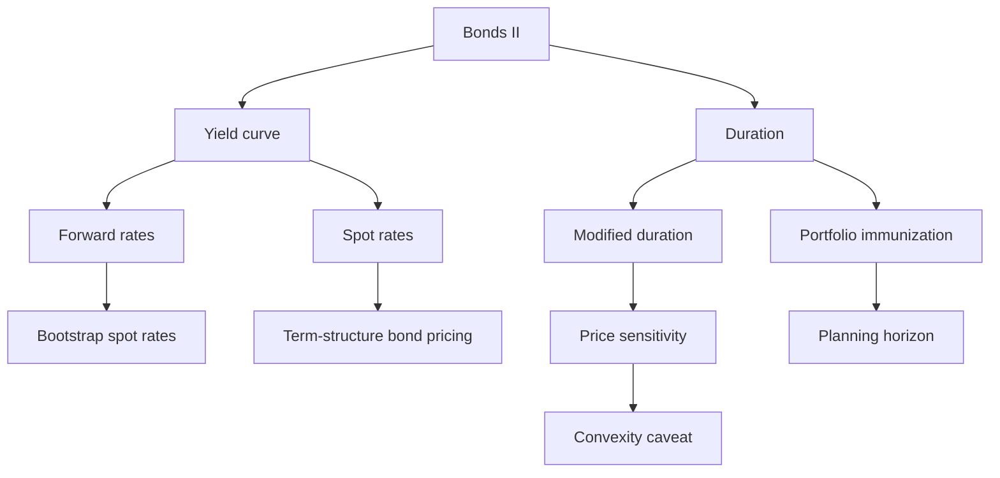

# Exercise 08-09: Bonds II - Yield Curves And Duration

Source files:

- `finance-and-investment-management/raw/moodle-export-investment-and-financial-management-950881761-s26-20260709/CW 24  09.06. _ 10.06./Exercise 8.pdf`
- `finance-and-investment-management/raw/moodle-export-investment-and-financial-management-950881761-s26-20260709/CW 24  09.06. _ 10.06./Exercise 8 - Solutions.pdf`
- `finance-and-investment-management/raw/moodle-export-investment-and-financial-management-950881761-s26-20260709/CW 25  16.06. _ 17.06./Exercise 9.pdf`
- `finance-and-investment-management/raw/moodle-export-investment-and-financial-management-950881761-s26-20260709/CW 25  16.06. _ 17.06./Exercise 9 - Solutions.pdf`

Lecture folder: `finance-and-investment-management/`
Processed: 2026-07-09

## High-Yield 80/20 Summary

Exercises 8 and 9 extend bond valuation beyond one flat yield. Exercise 8 asks how to use spot rates, forward rates, and yield curves. Exercise 9 asks how duration measures the time-weighted cash-flow center and approximates interest-rate sensitivity.

Exam moves:

1. If the problem gives spot rates, discount each cash flow with its maturity-specific spot rate.
2. If the problem gives forward rates, compound them into spot rates before pricing.
3. If the question asks for a missing forward rate, equate the multi-period spot investment with the chain of one-period forward investments.
4. Duration is a weighted average of payment dates, with present-value weights.
5. Modified duration approximates percentage price change: `Delta B / B approx -D_mod x Delta r`.
6. Duration immunization means matching portfolio duration to the investor's planning horizon.

## Core Concepts

### Spot Rate

A spot rate is the rate for an investment from today to a future date. `I_2` is the two-period spot rate from `t=0` to `t=2`.

### Forward Rate

A forward rate is an implied future one-period rate. `r_2` is the rate from `t=1` to `t=2`, implied by today's term structure.

For two years:

```text
(1 + I_2)^2 = (1 + r_1) x (1 + r_2)
r_2 = (1 + I_2)^2 / (1 + r_1) - 1
```

### Duration And Modified Duration

```text
D = (1 / B_0) x sum[t x PV(CF_t)]
D_mod = D / (1 + r)
Delta B_0 / B_0 approx -D_mod x Delta r
```

Interpretation: duration is the bond's cash-flow center of gravity. Modified duration is the first-order price sensitivity to a yield change.

## Worked Exercise Routes

### A.1: Implied Forward Rate From Two Spot Rates

Decision problem: one-year spot rate is `6%`; two-year spot rate is `7%`. Find the implied second-year forward rate.

Known inputs:

```text
r_1 = I_1 = 6% = 0.06
I_2 = 7% = 0.07
```

Formula and substitution:

```text
(1 + I_2)^2 = (1 + r_1) x (1 + r_2)
r_2 = (1.07^2 / 1.06) - 1
r_2 = 1.1449 / 1.06 - 1
r_2 = 0.080094 = 8.0094%
```

Interpretation: if a one-year investment earns 6% and a two-year spot investment earns 7% per year, the market-implied rate for year 2 alone must be about `8.0094%`.

Exam trap: do not average 6% and 7%. Use compound equivalence.

### A.2: Bootstrap One-Year Rate, Two-Year Spot Rate, And Forward Rate

Decision problem: two coupon bonds reveal the term structure.

Known inputs:

```text
Face value = 100
Coupon = 4
One-year bond price = 99.05
Two-year bond price = 96.37
```

Step 1: use the one-year bond.

```text
99.05 = 104 / (1 + r_1)
1 + r_1 = 104 / 99.05 = 1.04997
r_1 = I_1 = 4.997%
```

Step 2: use the two-year bond and discount the first coupon with `r_1`.

```text
96.37 = 4/(1+r_1) + 104/(1+I_2)^2
4/(1.04997) = 3.81
96.37 = 3.81 + 104/(1+I_2)^2
104/(1+I_2)^2 = 92.56
(1+I_2)^2 = 104 / 92.56
I_2 = 5.998%
```

Step 3: convert the two-year spot rate into the second-year forward rate.

```text
(1+r_1) x (1+r_2) = (1+I_2)^2
r_2 = (1.05998^2 / 1.04997) - 1
r_2 = 7.009%
```

Interpretation: the second-year forward rate is higher than the first-year rate, so the implied yield curve is upward sloping.

Exam trap: the coupon at `t=1` is not discounted at the two-year rate.

### A.3: Price A Three-Year Coupon Bond From Forward Rates

Known inputs:

```text
Face value = 100
Coupon = 4
Forward rates: r_1 = 2%, r_2 = 3%, r_3 = 4%
```

Price each cash flow by chaining the forward rates:

```text
B_0 = 4/1.02 + 4/(1.02 x 1.03) + 104/(1.02 x 1.03 x 1.04)
B_0 = 3.9216 + 3.8062 + 95.1822
B_0 = 102.91
```

Corresponding spot rates:

```text
I_1 = r_1 = 2.000%
I_2 = sqrt(1.02 x 1.03) - 1 = 2.499%
I_3 = (1.02 x 1.03 x 1.04)^(1/3) - 1 = 2.997%
```

Interpretation: the bond trades above par because its 4% coupon is high relative to the early spot/forward rates.

### A.4: Duration Of Two Coupon Bonds

Bond A:

```text
C = 6
N = 3
Repayment = 101% of 100 = 101
Final cash flow = 6 + 101 = 107
r = 9%
```

Price:

```text
B_0 = 6/1.09 + 6/1.09^2 + 107/1.09^3
B_0 = 93.1783
```

Duration numerator:

```text
1 x 6/1.09 + 2 x 6/1.09^2 + 3 x 107/1.09^3 = 263.4756
D_A = 263.4756 / 93.1783 = 2.83 years
```

Bond B:

```text
C = 12
N = 6
Final cash flow = 112
r = 9%
B_0 = 113.4578
Duration numerator = 532.7000
D_B = 532.7000 / 113.4578 = 4.70 years
```

Interpretation: Bond B has longer maturity and duration despite higher coupons. It is more interest-sensitive than Bond A.

### A.5/A.6: Duration Approximation Versus Actual Zero-Bond Price Changes

Base zero bond:

```text
Face value = 100
Maturity = 10
Current r = 6%
D_ZB = 10
D_mod = 10 / 1.06 = 9.43
Base price = 100 / 1.06^10 = 55.84
```

For a `2 percentage point` change:

```text
Approximate relative change = -9.43 x Delta r
If r falls to 4%: approx +18.86%
Actual price = 100 / 1.04^10 = 67.56, actual gain = +20.99%
If r rises to 8%: approx -18.86%
Actual price = 100 / 1.08^10 = 46.32, actual loss = -17.05%
```

For a `4 percentage point` change:

```text
If r falls to 2%: actual price = 82.03, actual gain = +46.91%
Approximation = +37.72%
If r rises to 10%: actual price = 38.55, actual loss = -30.96%
Approximation = -37.72%
```

Interpretation: duration is a linear approximation. It is good for small rate changes and less accurate for larger changes because the true bond price curve is convex.

Exam trap: duration overestimates losses and underestimates gains when convexity matters.

### A.7: Immunize A Portfolio At A Four-Year Planning Horizon

Known inputs:

```text
D_A = 2.8277
D_B = 4.6951
Target portfolio duration = 4
x_A + x_B = 1
```

Set up:

```text
x_A x 2.8277 + x_B x 4.6951 = 4
(1 - x_B) x 2.8277 + x_B x 4.6951 = 4
x_B = 0.6278
x_A = 0.3722
```

Interpretation: put about `62.78%` in the longer-duration bond and `37.22%` in the shorter-duration bond to target duration 4.

### A.8: Immunization With One-Year And Seven-Year Zero Bonds

Known inputs:

```text
Investment = 10,000
Target horizon = t=4
Current flat rate = 10%
Zero-bond durations: D_A = 1, D_B = 7
```

Portfolio weights:

```text
x_A x 1 + x_B x 7 = 4
x_A + x_B = 1
x_B = 0.5
x_A = 0.5
```

Invest:

```text
5,000 in the one-year zero bond
5,000 in the seven-year zero bond
```

Wealth at `t=4` if the rate changes after year 1:

```text
r = 10%:
V_4 = 5,500 x 1.10^3 + 5,000 x 1.10^7 / 1.10^3
V_4 = 14,641.00

r = 8%:
V_4 = 5,500 x 1.08^3 + 5,000 x 1.10^7 / 1.08^3
V_4 = 14,663.18

r = 12%:
V_4 = 5,500 x 1.12^3 + 5,000 x 1.10^7 / 1.12^3
V_4 = 14,662.40
```

Interpretation: the portfolio is approximately immunized around `t=4`; rate changes alter reinvestment return and price value in opposite directions.

## Visual Knowledge Map



## Subject Knowledge Graph

| Node | Type | Description |
|---|---|---|
| Spot rate | rate | Return from today to a future maturity. |
| Forward rate | rate | Implied future rate between two future dates. |
| Yield curve | structure | Set of spot rates by maturity. |
| Bootstrap | method | Extract spot/forward rates from traded bond prices. |
| Duration | risk measure | Present-value weighted average cash-flow timing. |
| Modified duration | sensitivity measure | Duration divided by `1+r`, used for price-change approximation. |
| Immunization | portfolio method | Match duration to planning horizon to reduce interest-rate risk. |

| From | Relationship | To |
|---|---|---|
| Forward rates | compound into | Spot rates |
| Spot rates | discount | Maturity-specific cash flows |
| Duration | measures | Average commitment period |
| Modified duration | approximates | Percentage price change |
| Portfolio duration | equals | Value-weighted duration |
| Immunization | targets | Planning horizon |

## Retrieval Prompts

1. Why is the second-year forward rate not the arithmetic average of year-one and two-year rates?
2. In A.2, why is the first coupon discounted with `r_1` rather than `I_2`?
3. Explain why a zero bond with maturity 10 has duration 10.
4. Use modified duration to estimate the price effect of a 1 percentage point yield increase.
5. Why does convexity make duration less accurate for large interest-rate changes?
6. How do you choose portfolio weights for duration immunization?

## Practice Tasks

1. Recompute A.1 without looking: `I_2 = 7%`, `r_1 = 6%`.
2. Build a three-cash-flow timeline for A.3 and label each discount factor.
3. Redo A.4 for Bond A and show the duration numerator before dividing by price.
4. Explain A.8 in one sentence: what happens to the short zero and the long zero when rates change?

## Connections

- Previous note: `exercise-06-bonds-i/exercise-06-bonds-i.md`
- Related lecture: `session-07-08-cost-of-capital/session-07-08-cost-of-capital.md`
- Formula base: `exercise-01-02-interest-calculation/exercise-01-02-interest-calculation.md`

## Open Uncertainties

- The source provides official solutions for Exercises 8 and 9, but some graph-heavy intuition slides lose visual detail in text extraction. The note preserves the calculation routes and the examinable logic.
