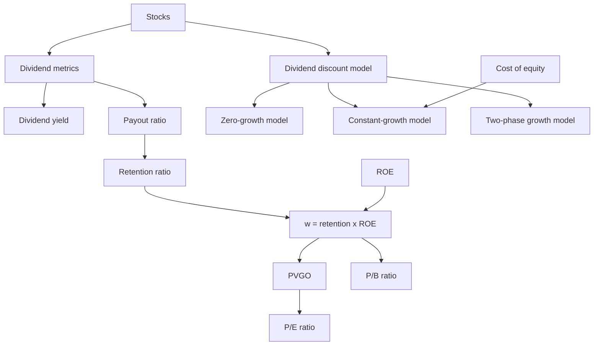

# Exercise 10-11: Stocks And Equity Valuation

Source files:

- `finance-and-investment-management/raw/moodle-export-investment-and-financial-management-950881761-s26-20260709/CW 26  23.06. _ 24.06./Exercise 10.pdf`
- `finance-and-investment-management/raw/moodle-export-investment-and-financial-management-950881761-s26-20260709/CW 26  23.06. _ 24.06./Exercise 10 - Solutions.pdf`
- `finance-and-investment-management/raw/moodle-export-investment-and-financial-management-950881761-s26-20260709/CW 27  30.06. _ 01.07./Exercise 11.pdf`
- `finance-and-investment-management/raw/moodle-export-investment-and-financial-management-950881761-s26-20260709/CW 27  30.06. _ 01.07./Exercise 11 - Solutions.pdf`

Lecture folder: `finance-and-investment-management/`
Processed: 2026-07-09

## High-Yield 80/20 Summary

Exercises 10 and 11 turn stock valuation into cash-flow logic. A stock price is the present value of expected future dividends, but the hard part is forecasting dividends, growth, and required return.

Exam moves:

1. Separate dividend per share, dividend yield, and payout ratio.
2. For a one-period stock holding, price equals `PV(dividend + sale price)`.
3. For mature firms, use the dividend discount model.
4. For constant growth, use `P_0 = D_1 / (r_e - w)`.
5. For two-stage growth, explicitly value the high-growth dividends plus the terminal value.
6. Growth creates value only if reinvested earnings earn `ROE > r_e`.
7. P/E and P/B ratios are valuation shortcuts; they need peer context and growth/ROE interpretation.

## Core Formulas

```text
Dividend per share = total dividend payments / shares entitled to dividends
Dividend yield = dividend per share / share price
Payout ratio p = dividend per share / EPS
Retention ratio = 1 - p
Growth w = (1 - p) x ROE
One-year stock price = (D_1 + P_1) / (1 + r_e)
Zero-growth DDM: P_0 = D / r_e
Constant-growth DDM: P_0 = D_1 / (r_e - w)
PVGO = P_0 - EPS_1 / r_e
P/E = P_0 / EPS_1
P/B = P_0 / book value per share
```

## Worked Exercise Routes

### A.1: Dividend Metrics

Known inputs:

```text
Total dividends = 3,047 million EUR
Shares outstanding = 4,358 million
Treasury shares = 5 million
EPS = 1.00 EUR
Share price = 9.165 EUR
```

Dividend per share:

```text
Eligible shares = 4,358 - 5 = 4,353 million
Dividend per share = 3,047 / 4,353 = 0.70 EUR
```

Dividend yield:

```text
Dividend yield = 0.70 / 9.165 = 0.0764 = 7.64%
```

Payout ratio:

```text
Payout ratio = 0.70 / 1.00 = 70%
```

Interpretation: the stock paid out 70% of earnings and delivered a 7.64% dividend yield at that price.

Exam trap: do not include treasury shares as dividend-entitled shares if the source excludes them.

### A.2: One-Year Stock Price

Known inputs:

```text
Expected dividend D_1 = 0.56 EUR
Expected sale price P_1 = 45.50 EUR
Required return r_e = 6.8%
```

Formula:

```text
P_0 = (D_1 + P_1) / (1 + r_e)
P_0 = (0.56 + 45.50) / 1.068
P_0 = 46.06 / 1.068
P_0 = 43.13 EUR
```

Interpretation: paying more than 43.13 would earn less than the required return, given the dividend and resale expectation.

### A.3/A.4: Constant-Growth Dividend Discount Model

A.3 compares firms that differ only by growth.

```text
D_0 = 12.50
r_e = 11.8%
w_A = 0%
w_B = 8%
```

Firm A:

```text
P_0A = 12.50 / (0.118 - 0)
P_0A = 105.93 EUR
```

Firm B:

```text
D_1B = 12.50 x 1.08 = 13.50
P_0B = 13.50 / (0.118 - 0.08)
P_0B = 355.26 EUR
```

Interpretation: a small growth difference has a large valuation effect when `r_e - w` becomes small.

A.4 solves the implied growth rate.

```text
D_1 = 8.50
P_0 = 215
r_e = 8%
P_0 = D_1 / (r_e - w)
w = r_e - D_1/P_0
w = 0.08 - 8.50/215
w = 0.0405 = 4.05%
```

Exam trap: the numerator in the Gordon formula is next year's dividend `D_1`, not last year's dividend unless no growth is implied.

### A.5/A.6: Two-Phase Dividend Discount Model

A.5:

```text
D_0 = 2
w_a = 8% for three years
w_b = 4% forever after year 3
r_e = 12%
```

Route:

```text
D_1 = 2 x 1.08 = 2.16
D_2 = 2 x 1.08^2 = 2.3328
D_3 = 2 x 1.08^3 = 2.5194
Terminal value at t=3 = D_3 x 1.04 / (0.12 - 0.04)
Terminal value = 2.5194 x 1.04 / 0.08 = 32.7522

P_0 = 2.16/1.12 + 2.3328/1.12^2 + 2.5194/1.12^3 + 32.7522/1.12^3
P_0 = 28.89 EUR
```

A.6:

```text
D_1 = 2.50
D_2 = 2.75
D_3 = 2.96
w_b = 4%
r_e = 12%
Market price = 36
```

Route:

```text
Terminal value at t=3 = 2.96 x 1.04 / (0.12 - 0.04) = 38.48
P_0 = 2.50/1.12 + 2.75/1.12^2 + 2.96/1.12^3 + 38.48/1.12^3
P_0 = 33.92 EUR
```

Interpretation: intrinsic value is 33.92 while market price is 36, so the stock is overvalued under these assumptions.

### A.7/A.8/A.10: Reinvestment, ROE, And Share Price

Base:

```text
EPS_1 = 6
Zero-growth payout p = 1
P_0 zero-growth = 60
r_e = EPS_1 / P_0 = 6 / 60 = 10%
```

If payout falls to 75%, retention is 25%.

China case, `ROE = 12%`:

```text
D_1 = 0.75 x 6 = 4.50
w = (1 - p) x ROE = 0.25 x 0.12 = 3%
P_0 = 4.50 / (0.10 - 0.03)
P_0 = 64.29 EUR
```

Decision interpretation: price rises because retained earnings are invested above the cost of equity.

Europe case, `ROE = 8%`:

```text
w = 0.25 x 0.08 = 2%
P_0 = 4.50 / (0.10 - 0.02)
P_0 = 56.25 EUR
```

Decision interpretation: price falls because retained earnings earn less than shareholders' required return.

USA case, `ROE = r_e = 10%`:

```text
w = 0.25 x 0.10 = 2.5%
P_0 = 4.50 / (0.10 - 0.025)
P_0 = 60.00 EUR
```

Decision interpretation: price is unchanged because reinvestment earns exactly the required return.

Managerial rule:

```text
ROE > r_e -> retention creates value
ROE = r_e -> retention is value-neutral
ROE < r_e -> retention destroys value
```

### A.9: Present Value Of Growth Opportunities

Formula:

```text
PVGO = P_0 - EPS_1 / r_e
```

Using the stock prices above:

```text
Zero-growth value = EPS_1 / r_e = 6 / 0.10 = 60.00
PVGO at ROE 12% = 64.29 - 60.00 = 4.29 EUR
PVGO at ROE 8% = 56.25 - 60.00 = -3.75 EUR
```

Interpretation: growth is valuable only when new investments earn above the cost of equity.

### A.11: P/E Ratio Under Dividend Policy Change

Known inputs:

```text
ROE = 12%
EPS_1 = 2
r_e = 10%
Initial dividend = 1.50
```

Part a:

```text
p = 1.50 / 2.00 = 0.75
w = (1 - 0.75) x 0.12 = 0.03
P_0 = 1.50 / (0.10 - 0.03) = 21.43
P/E = 21.43 / 2 = 10.71
```

Part b, payout `p = 0.60`:

```text
D_1 = 0.60 x 2 = 1.20
w = 0.40 x 0.12 = 0.048
P_0 = 1.20 / (0.10 - 0.048) = 23.08
P/E = 23.08 / 2 = 11.54
```

Interpretation: lower payout can increase value if retained earnings earn above the cost of equity.

### A.12: Price-Book Ratio From ROE

Known inputs:

```text
Book value per share = 10
r_e = 15%
p = 40%
ROE_ABC = 20%
ROE_DEF = 15%
```

ABC:

```text
EPS_1 = ROE x book value = 0.20 x 10 = 2
D_1 = 0.40 x 2 = 0.80
w = 0.60 x 0.20 = 0.12
P_0 = 0.80 / (0.15 - 0.12) = 26.67
P/B = 26.67 / 10 = 2.67
```

DEF:

```text
EPS_1 = 0.15 x 10 = 1.50
D_1 = 0.40 x 1.50 = 0.60
w = 0.60 x 0.15 = 0.09
P_0 = 0.60 / (0.15 - 0.09) = 10.00
P/B = 10.00 / 10 = 1.00
```

Interpretation: ABC gets a higher P/B because its ROE exceeds the cost of equity. DEF earns exactly the cost of equity, so market value equals book value.

### A.13: Multiple Valuation

The Deutsche Bank mini case uses peer multiples:

- P/E multiple: implied price = peer P/E x Deutsche Bank expected EPS.
- P/B multiple: implied price = peer P/B x Deutsche Bank book value per share.
- Compare implied price to actual market price to assess relative undervaluation or overvaluation.

Interpretation: multiple valuation is fast but fragile. It assumes the peer group has comparable risk, growth, profitability, accounting, and capital structure.

## Visual Knowledge Map



## Subject Knowledge Graph

| Node | Type | Description |
|---|---|---|
| Dividend per share | metric | Cash dividend per dividend-entitled share. |
| Dividend yield | metric | Dividend per share divided by current share price. |
| Payout ratio | policy variable | Fraction of EPS distributed as dividends. |
| Retention ratio | policy variable | Fraction of EPS retained for reinvestment. |
| Dividend discount model | valuation model | Values a stock as PV of expected future dividends. |
| Gordon growth model | valuation model | Constant-growth DDM. |
| PVGO | valuation component | Present value of growth opportunities. |
| P/E ratio | multiple | Price divided by expected EPS. |
| P/B ratio | multiple | Price divided by book value per share. |

| From | Relationship | To |
|---|---|---|
| Retention ratio | drives | Dividend growth |
| ROE above cost of equity | creates | Positive PVGO |
| ROE below cost of equity | destroys | Value through retention |
| Dividend discount model | values | Stock price |
| P/E ratio | reflects | Growth opportunities and risk |
| P/B ratio | reflects | ROE relative to cost of equity |

## Retrieval Prompts

1. Why is `D_1`, not `D_0`, the numerator in the Gordon growth formula?
2. In A.7, why does reducing the dividend increase stock price?
3. What happens when `ROE < r_e` and management retains earnings?
4. How do you compute PVGO?
5. Why can two firms with the same book value have different P/B ratios?
6. What is the limitation of peer multiple valuation?

## Practice Tasks

1. Recompute A.2's maximum price.
2. Recompute A.6 and decide whether `36 EUR` is fair.
3. Use the Crane Sporting Goods setup to explain the rule `ROE > r_e`.
4. Recompute ABC and DEF P/B ratios from book value, payout, ROE, and cost of equity.

## Connections

- Earlier exercise base: `exercise-01-02-interest-calculation/exercise-01-02-interest-calculation.md`
- Related lecture: `session-01-02-financial-analysis/session-01-02-financial-analysis.md`
- Related lecture: `session-07-08-cost-of-capital/session-07-08-cost-of-capital.md`

## Open Uncertainties

- The source gives official solutions for Exercises 10 and 11. Some mini-case peer-group table details are compact in the extracted text, so this note preserves the valuation route rather than every table cell.
