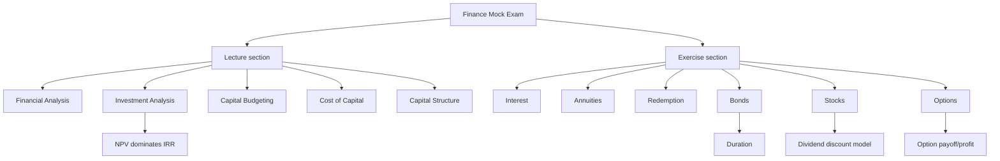

# Exercise 13: Mock Exam

Source file:

- `finance-and-investment-management/raw/moodle-export-investment-and-financial-management-950881761-s26-20260709/CW 29  14.07. _ 15.07./Exercise 13 Mock Exam.pdf`

Lecture folder: `finance-and-investment-management/`
Processed: 2026-07-09

Course direction checked against `finance-and-investment-management/wiki/_course-logistics.md`: the mock exam is integrated practice for both the corporate-finance lecture track and the mathematical-basics exercise track.

Source status: the provided file contains questions and an answering sheet, but no official answer key. The answer routes below are inferred study-coach routes based on the processed notes and source formulas.

## Mock Exam Structure

| Section | Topic | Points |
|---|---|---:|
| 1.1 | Financial Analysis | 4 |
| 1.2 | Investment Analysis | 5 |
| 1.3 | Capital Budgeting | 3 |
| 1.4 | Cost of Capital Estimation | 5 |
| 1.5 | Capital Structure | 5 |
| 2.1 | Interest | 7 |
| 2.2 | Annuities | 6 |
| 2.3 | Redemption | 3 |
| 2.4 | Bonds | 6 |
| 2.5 | Stocks | 5 |
| 2.6 | Options | 2 |

Total: `120 minutes`, `120 points`, multiple choice, one correct answer per question, no negative points.

## Exam-Management Rules From Source

- Only answers on the answer sheet count.
- Use a dark pen.
- No negative points.
- Do not round intermediate results.
- Thousands are separated by commas and decimals by dots.
- Allowed resources: dark pen, non-electronic dictionary, non-graphical and non-programmable calculator.

## Inferred Answer Routes

### Q1: Financial Statements

Route: financial statements are accounting-standard-based reports prepared for consistency/comparability. They are not analyst reports and not generally "relatively unreliable" for decision-making.

Inferred answer: **B**.

### Q2: Net Income And Interest Coverage

Known inputs:

```text
Sales = 900 million
Net profit margin = 12%
Interest expense = 150 million
```

Net income:

```text
Net income = 900 x 0.12 = 108 million
```

Interest coverage:

```text
EBIT = net income + interest expense = 108 + 150 = 258
Interest coverage = 258 / 150 = 1.72
```

Inferred answer: **A**.

### Q3: NPV And IRR Rules

Project A at `4%`:

```text
NPV_A = -75,000 + 38,000/1.04 + 40,000/1.04^2
NPV_A approx -1,480
```

So statement A is true.

Project A at `2%`:

```text
NPV_A = -75,000 + 38,000/1.02 + 40,000/1.02^2
NPV_A approx +703
```

So rejecting Project A at 2% by IRR logic is false.

Project C at `6%`:

```text
NPV_C = -100,000 + 8,500/0.06 = 41,667
```

Project B at `6%`:

```text
NPV_B = -90,000 + 55,000/1.06 + 45,000/1.06^2
NPV_B approx 1,940
```

So C is more attractive than B at 6%.

Inferred answer: **B**.

### Q4: IRR Limitations

For mutually exclusive projects, the highest IRR is not always the best choice because scale and timing can differ. NPV is the master rule.

Inferred answer: **B**.

### Q5: Annual Free Cash Flow

Known inputs:

```text
Revenue = 100,000
Cash costs = 40,000
Depreciation = 150,000 / 3 = 50,000
Tax rate = 30%
```

Calculation:

```text
EBIT = 100,000 - 40,000 - 50,000 = 10,000
Tax = 10,000 x 0.30 = 3,000
Net income = 7,000
FCF = net income + depreciation = 7,000 + 50,000 = 57,000
```

Inferred answer: **C**.

### Q6: Debt Beta From Asset Beta

Use the asset-beta weighted-average relation. Treat enterprise value as equity plus debt minus cash:

```text
E = 98
D = 40
Cash = 10
V = 98 + 40 - 10 = 128
beta_A = 1.0
beta_E = 1.16

1.0 = (98/128) x 1.16 + (40/128) x beta_D
beta_D = [1.0 - (98/128 x 1.16)] / (40/128)
beta_D approx 0.36
```

Inferred answer: **C**.

### Q7: Comparable Beta Procedure

Correct order:

```text
select comparable -> estimate comparable beta -> unlever comparable beta -> relever for target financial risk
```

Inferred answer: **B**.

### Q8: MM Proposition II

The formula says levered equity cost equals unlevered cost plus a leverage premium:

```text
r_E = r_U + (D/E)(r_U - r_D)
```

None of the listed descriptions states that relation cleanly.

Inferred answer: **D**.

### Q9: Asset Beta And Relevered Equity Beta

With debt beta zero and no taxes:

```text
beta_A = beta_E / (1 + D/E)
beta_A = 1.50 / 1.40 = 1.07

new beta_E = beta_A x (1 + new D/E)
new beta_E = 1.07 x 1.60 = 1.71
```

Inferred answer: **C**.

### Q10: Euro-Zone Key Interest Rates

Main ECB rates: deposit facility, main refinancing operations, marginal lending facility.

Inferred answer: **B**.

### Q11: Doubling Time At 3% Compound Interest

```text
2 = 1.03^N
N = ln(2) / ln(1.03)
N = 23.45 years
```

Inferred answer: **B**.

### Q12: Continuous Compounding Versus Simple Interest

Goal: grow `1,000` by `2,000`, so final wealth is `3,000`.

Simple interest:

```text
3,000 = 1,000 x (1 + rN_simple)
N_simple = 2/r
```

Continuous compounding:

```text
3,000 = 1,000 x exp(rN)
N = ln(3)/r
```

Continuous compounding is 30 years earlier:

```text
2/r - ln(3)/r = 30
r = (2 - ln(3))/30 = 3.00%
N = ln(3)/0.0300 = 36.6 years
```

Inferred answer: **C**.

### Q13: Monthly Annuity-Due Future Value

Known inputs:

```text
Monthly payment = 200
Nominal annual rate = 5.2%
Monthly rate = 0.052 / 12 = 0.004333
Number of months = 6 x 12 = 72
Payment timing = beginning of month -> annuity due
```

Calculation:

```text
FV_due = 200 x [((1+i)^72 - 1) / i] x (1+i)
FV_due approx 16,930
```

Inferred answer: **C**.

### Q14: Monthly Annuity-Due Present Value

```text
Payment = 100
i = 0.045 / 12 = 0.00375
n = 8 x 12 = 96
PV_due = 100 x [1 - (1+i)^(-96)] / i x (1+i)
PV_due approx 8,080
```

Inferred answer: **A**.

### Q15: Interest-Paid During Study Versus Deferred Interest

The loan is received at the beginning of the second year and the degree program lasts three years, so the remaining study period after borrowing is two years.

If interest is paid during study:

```text
Repayment base after graduation = 120,000
n = -ln(1 - PV x r / A) / ln(1+r)
n = -ln(1 - 120,000 x 0.055 / 12,000) / ln(1.055)
n approx 14.91 years
```

If all payments are deferred:

```text
Repayment base = 120,000 x 1.055^2 = 133,563
n approx 17.69 years
Difference = 17.69 - 14.91 = 2.78 years
```

Inferred answer: **A**.

### Q16: Bond Price Event

Credit reassessment, bankruptcy, and yield-curve changes alter value drivers. A coupon payment is scheduled and mechanically handled in bond pricing rather than a new information shock.

Inferred answer: **B**.

### Q17: Zero-Bond Held To Maturity

A zero-coupon bond has no interim coupons, so it avoids reinvestment risk. Default risk remains. Market price still fluctuates before maturity, so do not say all risks disappear.

Inferred answer: **B**.

### Q18: Duration Price Approximation

Known inputs:

```text
D = 4.79
r = 6%
D_mod = 4.79 / 1.06 = 4.5189
Price = 95.46
Delta r = 3% - 6% = -0.03
```

Approximation:

```text
Delta B/B approx -D_mod x Delta r
Delta B/B approx -4.5189 x (-0.03) = +0.1356
New price = 95.46 x 1.1356 = 108.40
```

Inferred answer: **C**.

### Q19: Required Return From Gordon Growth

```text
P_0 = D_1/(r_e - w)
r_e = D_1/P_0 + w
r_e = 4/100 + 0.05 = 0.09 = 9%
```

Inferred answer: **D**.

### Q20: Dividend Discount Model Statement

The defensible statement is that the constant-growth DDM is suited to mature, stable companies with stable dividend growth.

Inferred answer: **D**.

### Q21: Short European Call

Known inputs:

```text
Premium received = 2.50
Strike = 50
```

Seller profit:

```text
Profit = 2.50 - max(S_T - 50, 0)
Profit > 0 if S_T < 52.50
```

Inferred answer: **C**.

## Visual Knowledge Map



## Subject Knowledge Graph

| Node | Type | Description |
|---|---|---|
| Mock exam | exam practice | Integrated MCQ-style Finance practice. |
| Lecture section | exam section | Corporate-finance topics. |
| Exercise section | exam section | Mathematical basics topics. |
| Inferred answer key | study artifact | Solution routes inferred from course notes because no official key was provided. |
| Duration MCQ | calculation | Uses modified duration to estimate new price. |
| Stock MCQ | calculation | Uses Gordon growth model. |
| Option MCQ | payoff logic | Uses short-call break-even. |

| From | Relationship | To |
|---|---|---|
| Mock exam | integrates | Lecture and exercise tracks |
| Investment Analysis MCQs | test | NPV versus IRR hierarchy |
| Capital Budgeting MCQ | tests | Annual FCF construction |
| Bonds MCQs | test | Duration and risk categories |
| Stocks MCQs | test | Gordon growth model |
| Options MCQ | tests | Short call profit |

## Retrieval Prompts

1. Which mock questions are pure concept checks and which require calculation?
2. Recompute Q5 annual FCF without looking.
3. Recompute Q18 duration approximation.
4. Explain why Q17 is reinvestment risk rather than default risk.
5. Derive Q19 required return from the Gordon model.
6. What is the fastest way to decide Q21?

## Practice Tasks

1. Redo Q1-Q9 as a timed 25-minute lecture block.
2. Redo Q10-Q21 as a timed 35-minute exercise block.
3. Build a formula checklist for the calculation questions: Q2, Q3, Q5, Q6, Q9, Q11-Q15, Q18-Q19, Q21.
4. After finishing once, mark each question as `green`, `yellow`, or `red` and update the mistake ledger after active recall.

## Open Uncertainties

- No official answer key or official solution deck was present in the export. The answer key above is inferred and should be replaced or checked if an official solution is later provided.
