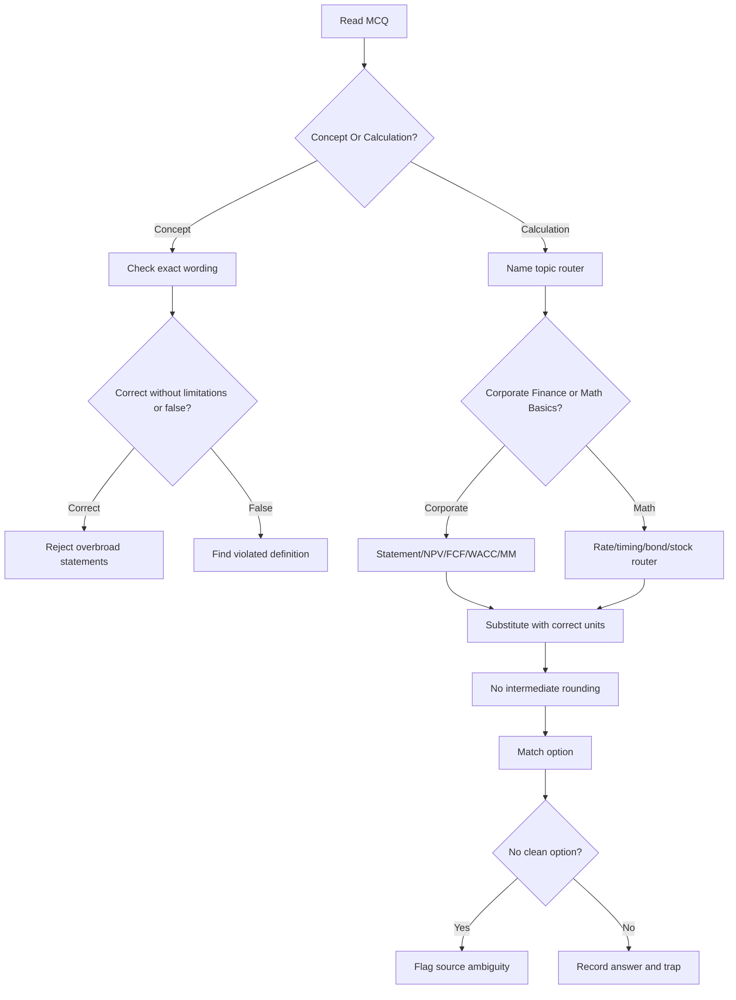

# Ubiquitous Language: IFM Exam Papers Practice Pack

Source note: `ifm-exam-papers.md`
Source file: `finance-and-investment-management/raw/external-mock-exams/IFM EXAM PAPERS.pdf`
Course: Finance and Investment Management
Processed: 2026-07-29
Refreshed: 2026-07-30 after the detailed all-question solution bank was added to the source note.

The source contains three exam-paper blocks. It is useful for final diagnostic practice, but it is not an official solution key. Use the canonical terms below to avoid learning source ambiguities or handwritten marks as doctrine.

## Source And Practice Status

| Term | Definition | Aliases to avoid |
|---|---|---|
| **Practice Pack** | A grouped set of mock/exam-style papers used for timed diagnostics and repair, not a completed study checkpoint by itself. | first pass, completed review |
| **Annotated Paper** | A question paper that contains handwritten marks or calculations in addition to printed questions. Marks are evidence, not authority. | official key |
| **Clean Paper** | A question paper without visible answer annotations. Answers must be inferred from formulas and course doctrine. | answer key |
| **Annotated/Inferred Answer Route** | A proposed answer derived from handwriting, calculations, course notes, and formula logic rather than official solutions. | official solution |
| **Source Ambiguity Flag** | A warning that the printed question, option, numbering, or handwriting is internally inconsistent. | trick question |
| **Timed Diagnostic** | Closed-book attempt under exam-like timing, followed by correction and targeted repair. | rereading session |

## MCQ Wording Terms

| Term | Definition | Aliases to avoid |
|---|---|---|
| **Correct Without Limitations** | Choose the statement that is valid under the full course assumptions without hidden exceptions or overbroad wording. | sounds plausible |
| **False Statement Prompt** | Choose the statement that violates the course definition, formula, or assumption. | least true |
| **No Single Clean Option** | The computed or conceptual result does not match the printed alternatives because of a source issue. | failed calculation |
| **Option Matching** | The final step where the computed result is rounded to the closest valid answer choice. | formula selection |
| **No Intermediate Rounding** | Keep full precision through chained calculations and round only at the option-matching step. | round each line |

## Corporate-Finance Routers

| Term | Definition | Aliases to avoid |
|---|---|---|
| **Book-Versus-Market Router** | Decide whether the denominator or weight uses accounting book value or market value. Ratios like book D/E use book equity; WACC weights use market values. | one equity value |
| **Financial Statement Router** | Pick the correct statement before choosing a ratio: balance sheet for position, income statement for performance, cash flow statement for cash movement. | ratio first |
| **DuPont Identity** | `ROE = net profit margin x asset turnover x equity multiplier`; decomposes shareholder return into profitability, efficiency, and leverage. | ROA decomposition |
| **NPV Master Rule** | `NPV` measures euro value created today and dominates IRR/payback in mutually exclusive conflicts. | highest IRR rule |
| **Normal Cash Flow Project** | A cash-flow stream with exactly one sign change, typically one initial outflow followed by inflows. | always positive project |
| **Incremental Cash-Flow Filter** | Include only cash flows caused by accepting the project; exclude sunk costs and financing flows when valuing operating FCF. | total company cash flow |
| **Break-Even Analysis** | Find the input level where NPV equals zero. | NPV equals one |
| **Sensitivity Analysis** | Change one input while holding others constant to see how NPV reacts. | scenario analysis |
| **Scenario Analysis** | Change multiple coherent assumptions together, such as downside/base/upside cases. | sensitivity analysis |
| **CAPM Equity Cost** | `r_E = r_f + beta_E x (r_M - r_f)`; estimates equity investors' required return for systematic risk. | average stock return |
| **Pre-Tax WACC** | `E/(E+D) x r_E + D/(E+D) x r_D`; blends debt and equity required returns before tax effects. | coupon average |
| **MM Repackaging Logic** | In perfect markets, financing transactions repackage cash-flow claims without changing total firm value. | financing creates value |

## Mathematical-Basics Routers

| Term | Definition | Aliases to avoid |
|---|---|---|
| **Rate Convention Router** | Choose simple, annual compound, intra-year compound, or continuous compounding before substitution. | interest formula guessing |
| **Growth Factor** | `1 + r`, the multiplier for one compounding period. | interest rate itself |
| **Effective Annual Rate** | Actual one-year return after compounding: `(1 + nominal rate/m)^m - 1`. | nominal annual rate |
| **Continuous Compounding** | Limit case where the period length tends to zero and `FV = PV x e^(rn)`. | infinite interest rate |
| **Annuity-Immediate** | Equal payments at the end of each period. | beginning payment annuity |
| **Annuity-Due** | Equal payments at the beginning of each period; future value is one period higher than annuity-immediate. | end payment annuity |
| **Equal Principal Repayment** | Each period repays the same principal amount; interest is calculated on remaining principal. | annuity repayment |
| **Annuity Repayment** | Each period pays the same total payment; the interest/principal split changes over time. | equal installment |
| **Bond Cash-Flow Router** | Build the coupon and face-value timeline before pricing, duration, yield, or price-difference calculations. | maturity shortcut |
| **Spot-Forward Compounding** | Forward rates compound into spot rates: `(1+I_0,n)^n = product of one-period forward growth factors`. | arithmetic averaging |
| **Macaulay Duration** | Present-value-weighted average timing of a bond's cash flows. | maturity |
| **Dividend Forecast Router** | Choose zero-growth, constant-growth, two-stage/time-varying DDM, PVGO, or peer multiple before calculating. | one stock formula |
| **PVGO** | Present value of growth opportunities: stock price minus no-growth earnings value. | total stock value |

## Solution-Bank Formula Terms

| Term | Definition | Aliases to avoid |
|---|---|---|
| **Interest Coverage Ratio** | `EBIT / interest expense`; measures how many times operating profit covers interest obligations. It is a multiple, not a percent. | interest margin |
| **Total Ex-Rights Price (TERP)** | Post-capital-increase share price in perfect markets: `(old equity value + new cash raised) / total shares after issue`. | dilution loss, subscription price |
| **Unlevered Net Income** | `EBIT x (1 - tax rate)`; project operating profit after tax before financing effects. | net income after interest |
| **Project EBIT Route** | `units x (price - variable production cost) - fixed operating costs - depreciation`; operating earnings before interest and tax. | cash flow, net income |
| **Remaining Loan Amount** | Present value, at a checkpoint date, of the unpaid future annuity payments. | original loan balance |
| **Equal Principal Instalment** | Constant principal repayment each period; interest is computed on the outstanding balance at the start of the period. | annuity payment |
| **Annuity Loan Payment** | Constant total payment each period, found by discounting the payment stream to the original loan amount. | equal principal |
| **Duration Portfolio Weight** | Weight choice that makes the weighted-average duration of zero bonds equal the target duration. | face-value weight |
| **Two-Stage DDM Terminal Value** | The continuing dividend value at the date just before constant growth begins, `D_next/(r_E - g)`. | value at year 0 |
| **Peer P/E Multiple Value** | Stock value estimated as own `EPS x average peer P/E`. | dividend discount value |

## Exam-Safe Calculation Relationships

- **Project EBIT Route** feeds **Unlevered Net Income**; financing costs stay outside both when building operating project value.
- **Interest Coverage Ratio** belongs to financial analysis; **Pre-Tax WACC** belongs to cost-of-capital/project valuation. Do not mix the two because both contain interest-related words.
- **Total Ex-Rights Price (TERP)** is a price after new cash enters the firm; it does not prove that shareholders lost wealth in perfect markets.
- **Equal Principal Instalment** keeps principal constant and interest falling; **Annuity Loan Payment** keeps total payment constant and changes the interest/principal split.
- **Two-Stage DDM Terminal Value** must be discounted from the date where it is calculated, usually `t=2` when constant growth starts with `D_3`.
- **Duration Portfolio Weight** for zero bonds uses maturity as duration; coupon-bond duration requires present-value weights over each cash flow.

## Relationships

- **Practice Pack** stays pending until a real closed-book **Timed Diagnostic** or coached recall is completed.
- **Annotated/Inferred Answer Route** must always be checked against formula logic, especially when a **Source Ambiguity Flag** is present.
- **Financial Statement Router** comes before ratio choice; **Book-Versus-Market Router** comes before denominator choice.
- **NPV Master Rule** controls investment decisions; **IRR** supports break-even-rate interpretation.
- **Incremental Cash-Flow Filter** produces operating cash flows; **Pre-Tax WACC** or later after-tax WACC discounts same-risk operating cash flows.
- **Rate Convention Router** and **Payment Timing Router** are prerequisites for annuities, redemptions, bonds, and stock terminal-value discounting.
- **Bond Cash-Flow Router** prevents confusion between coupon rate, debt cost of capital, bond price, and duration.

## Visual Router



## Example Dialogue

Student: "Paper C Q42 has no option matching my bond price difference. Should I choose the marked-looking one?"

Professor: "No. First trust the **Bond Cash-Flow Router**: price the zero bond, price the coupon bond, subtract. If the result is about 19.13 EUR and no option matches, record a **Source Ambiguity Flag**. Do not train yourself to force a wrong formula just to fit the options."

Student: "For the ratio questions, I keep switching book and market values."

Professor: "Use the **Book-Versus-Market Router** before calculating. Accounting leverage uses book equity; market leverage and WACC weights use market values unless the question states otherwise."

## Flagged Ambiguities

| Ambiguity | Canonical Recommendation |
|---|---|
| Paper A Q12 printed and handwritten inputs conflict | Learn the EBIT structure; do not memorize the visual tick. |
| Paper A Q18 missing | Treat as absent from the source page. |
| Paper A Q30 has A-C conceptually true but no "all correct" option | Mark invalid; memorize the key-rate/interbank facts. |
| Paper A Q52 has unclear DDM rate/growth line | Use as setup practice only. |
| Paper B Q8 likely prints `1000%` instead of `10.00%` | Compute IRR from cash flows and note the typo. |
| Paper C Q42 computed value does not match options | Trust the bond-pricing calculation and flag the item. |

## Exam Trap Corrections

| Trap | Correction |
|---|---|
| Market cap confused with book equity. | Use market cap for market equity value and WACC weights; use book equity only for book ratios. |
| EBIT margin confused with net profit margin. | EBIT margin uses `EBIT / sales`; net profit margin uses `net income / sales`. |
| IRR used to rank mutually exclusive projects. | Use NPV for value ranking; IRR is a break-even rate. |
| Sunk costs included in FCF. | Exclude past/non-incremental costs; include opportunity cost and cannibalization if accepting the project causes them. |
| Coupon rate used as `r_D`. | Coupon rate defines payments; market yield or debt cost discounts payments. |
| Annuity-due treated like annuity-immediate. | Multiply the ordinary annuity factor by one extra growth factor. |
| Forward rates averaged. | Compound forward growth factors and take the appropriate root. |
| Terminal value discounted from the wrong date. | Discount terminal value from the period where it is calculated. |

## Cheat-Sheet Language

```text
Mock-paper correction route:
1. Try closed-book first.
2. Name the topic router before calculating.
3. Keep full precision.
4. Match answer choices only at the end.
5. If no option matches, flag the source rather than bending the formula.
6. Convert every miss into one corrective sentence.
```
