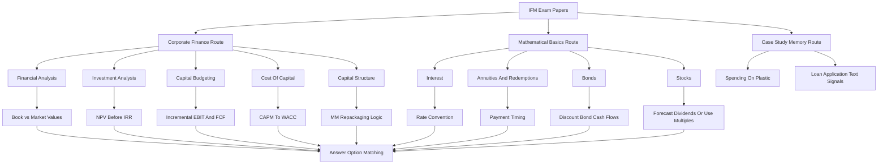

# IFM Exam Papers Practice Pack

Source file:

- `finance-and-investment-management/raw/external-mock-exams/IFM EXAM PAPERS.pdf`

Original user-provided location: `/Users/ardaerkan/Downloads/IFM EXAM PAPERS.pdf`

Lecture folder: `finance-and-investment-management/`
Processed: 2026-07-29
Detailed solution expansion: 2026-07-30

Course direction checked against `finance-and-investment-management/wiki/_course-logistics.md`: Finance is a closed-notes, 120-minute multiple-choice exam covering both the corporate-finance lecture track and the mathematical-basics exercise track. The formulary reduces memorization pressure, but the exam still tests formula selection, timing, rate-period matching, and interpretation.

Source status: the PDF contains three exam-paper blocks across 50 pages. It does not identify itself as an official solution key. The first paper has handwritten answer marks and calculations; the second and third papers are cleaner question papers. The answer routes below are therefore **annotated/inferred**, not official solutions.

## High-Yield 80/20 Summary

These papers strongly confirm the Finance exam pattern:

1. The corporate-finance half repeats financial ratios, NPV/IRR rule selection, capital-budgeting cash-flow construction, CAPM/WACC/debt-market-value estimation, and MM capital-structure logic.
2. The exercise half repeats interest conventions, annuity timing, redemption schedules, bond price/yield/duration/spot-forward routes, stock valuation, and a short tutorial case-study block.
3. Most calculation questions are not difficult algebraically; the risk is selecting the wrong object: book vs market value, EBIT vs net income, simple vs compound interest, coupon rate vs market yield, duration vs modified duration, and NPV vs IRR.
4. Wording questions use "correct without limitations" and "false" heavily. Reject absolute claims unless the course assumptions clearly support them.
5. Do not round intermediate results. The options often differ only after two or three chained steps.

Use this pack as a timed diagnostic after the main Finance routers are fresh. If time is short before the exam, run Paper B or Paper C first because they are cleaner than the annotated Paper A.

## Exam-Paper Inventory

| Paper | Source Character | Question Count | Main Use |
|---|---|---:|---|
| Paper A | Annotated paper with handwritten answers/calculations and some source-quality issues | 56 nominal questions, but Q18 is absent in the source page | Fast trap scan and comparison against handwritten marks |
| Paper B | Clean full paper | 54 questions | Best first timed diagnostic |
| Paper C | Clean full paper with a few numbering/option inconsistencies | 56 questions | Second timed diagnostic and formula repair |

## Coverage Map

| Area | Repeated Question Types | Fast Router |
|---|---|---|
| Financial analysis | ROA, ROE, EBIT margin, P/E, P/B, debt-to-equity, coverage, DuPont, statement definitions | Identify statement/rate numerator first, then book vs market denominator |
| Investment analysis | NPV, IRR, normal cash flows, payback, profitability index, mutually exclusive projects | NPV is the master rule; IRR is a break-even rate, not a ranking device |
| Capital budgeting | EBIT, unlevered net income, sunk cost, opportunity cost, cannibalization, sensitivity/scenario/break-even | Build incremental operating cash flow before financing |
| Cost of capital | CAPM, market value of equity/debt, pre-tax WACC, beta statements, debt-cost estimation | Estimate `r_E`, estimate `r_D`, then weight by market values |
| Capital structure | MM I/II, firm value, equity value after leverage/capital increase, EPS/dilution fallacy | In perfect markets, financing repackages claims; it does not create operating value |
| Interest | Simple, compound, continuous, nominal/effective rates, key rates, day-count conventions | Direction first: target FV/PV; then choose compounding convention |
| Annuities/redemptions | Immediate vs due, growing annuity, remaining loan amount, equal principal vs annuity repayment | Draw the payment timing before formula selection |
| Bonds | Bond type statements, premium/discount, spot-forward conversion, duration, duration matching | Cash-flow table first; yield/spot rate discounts each payment |
| Stocks | Dividend metrics, DDM, growth models, PVGO, multiples | Separate dividend forecast valuation from peer-multiple valuation |
| Case studies | `Spending on Plastic`; Netzer/Lemaire/Herzenstein text-based creditworthiness | Memorize the case-study identification pair |

## Annotated/Inferred Answer Route Matrix

These are not official solutions. Use them after a closed-book attempt, not before.

### Paper A

| Section | Questions | Annotated/Inferred Answers | Notes |
|---|---|---|---|
| Financial Analysis | 1-5 | B, B, D, A, D | ROA uses the course-style `net income + interest expense` numerator in the annotation. |
| Investment Analysis | 6-11 | B, A, A, A*, C, A | Q9 is worded too strongly; the precise rule is "at most as many IRRs as sign changes." |
| Capital Budgeting | 12-16 | Q12 ambiguous; C, C, A, C | Q12 has no clean printed input. With the handwritten SG&A/labor correction, EBIT computes to 2,000 EUR, so D would be coherent even though the annotation tick looks unreliable. |
| Cost of Capital | 17-22 | 17:A; 18: missing in source; 19:A; 20: statement 1; 21:D; 22:C | The original page jumps from Q17 to Q19. |
| Capital Structure | 23-29 | B, C, B, C, A, B, A | Q28 uses the ex-rights price after fresh capital: `(old equity value + cash raised) / new share count`. |
| Interest | 30-34 | Q30 invalid/all A-C; B, C, C, A | Q30 has A-C conceptually true but no "all correct" printed option. |
| Annuities/Redemptions | 35-40 | C, D, D, B, D, A | Q37 is the annuity-immediate monthly FV route. |
| Bonds | 41-48 | A, D, C, A, B, B, C, A | Q44 uses forward-rate compounding into spot rates. |
| Stocks | 49-54 | C, B, D, A*, A, B | Q52 is marked A, but the rate/growth line is visually ambiguous; treat it as annotation-based. |
| Case Study | 55-56 | A, D | External check supports credit-card over-indebtedness for `Spending on Plastic` and text elements for Netzer/Lemaire/Herzenstein. |

### Paper B

| Section | Questions | Inferred Answers | Main Route |
|---|---|---|---|
| Financial Analysis | 1-5 | A, C, B, D, D | ROE/P-B; book-vs-market D/E; EBIT/interest; DuPont; accounting rules. |
| Investment Analysis | 6-11 | D, C, A*, A, D, D | Q8 is A if the first option is meant to read `10.00%`, not `1000%`. |
| Capital Budgeting | 12-16 | C, C, A, A, B | EBIT -> unlevered net income -> sunk cost -> opportunity-cost false statement -> break-even. |
| Cost of Capital | 17-22 | A, B, D, C, B, D | Beta wording, CAPM graph, market debt value, CAPM, pre-tax WACC, debt-cost methods. |
| Capital Structure | 23-27 | B, B, D, C, B | MM asset value, Plane Corp share price, financial-transactions trap, Ronki expected return, capital increase TERP. |
| Interest | 28-32 | A, C, A, C, A | Key rates, simple tripling rate, quarterly nominal/effective rate, continuous comparison, continuous compounding wording. |
| Annuities/Redemptions | 33-37 | C, B, C, D, C | Geometric-series annuity formula, monthly annuity-due FV, due-vs-immediate difference, equal principal, annuity loan balance. |
| Bonds | 38-45 | A, C, B, C, C, C, D, C | Bond risks, premium statement, price difference, yield-curve false statement, spot rates, reverse convertible, duration, duration portfolio. |
| Stocks | 46-52 | D, B, B, A, C, A, C | Dividend metrics, non-standard dividend model, two-stage DDM, false DDM superiority, multiple, PVGO. |
| Case Study | 53-54 | C, B | Credit-card over-indebtedness; text elements in P2P loan applications. |

### Paper C

| Section | Questions | Inferred Answers | Main Route |
|---|---|---|---|
| Financial Analysis | 1-5 | A, B, B, C, D | ROE/equity multiplier, EBIT margin, book-vs-market D/E, DuPont, accounting rules. |
| Investment Analysis | 6-11 | B, C, A, D, D, A | NPV pair, alternative investment rules, IRR/perpetuity, IRR pitfalls, payback, PI constraint trap. |
| Capital Budgeting | 12-16 | D, C, B, D, B | Source labels Q12 as Q11; EBIT differs by period, then unlevered net income, sunk cost, false incremental-earnings statement, IRR as cost-of-capital sensitivity. |
| Cost of Capital | 17-22 | A, A, C, A, D, D | Market value of equity/debt, CAPM, pre-tax WACC, beta false statement, debt-cost methods, operating leverage/beta. |
| Capital Structure | 23-29 | C, C, D, C, D, A, C | MM assumptions, `U`, MM II graph, Plane Corp share price, Ronki expected return, capital increase TERP, financial transactions as risk repackaging. |
| Interest | 30-34 | A, C, C, A, A | Key rates, simple doubling rate, compound-vs-continuous FV, monthly nominal/effective rate, continuous compounding wording. |
| Annuities/Redemptions | 35-40 | D, C, D, C, B, B | Annuity definition traps, growing annuity-due difference, monthly annuity-due FV, equal principal, annuity loan balance, repayment duration. |
| Bonds | 41-48 | C, Q42 inconsistent, B, B, C, A, A, A | Q42 computes to about 19.13 EUR, which does not match the printed options; nearest option is C at 18.59 EUR. |
| Stocks | 49-54 | C, D, B, C, A, D | Dividend announcement, dividend metrics, non-standard dividend model, two-stage DDM, PVGO, false multiple-peer statement. |
| Case Study | 55-56 | B, C | Same case-study pair as Paper B, with shifted option letters. |

## Source Ambiguities To Flag During Practice

| Item | Problem | Exam-Safe Handling |
|---|---|---|
| Paper A Q12 | Printed table omits/obscures labor cost and handwritten correction changes SG&A. | Do not learn the marked answer blindly. Learn the EBIT structure: revenue minus production, labor, SG&A, and depreciation. |
| Paper A Q18 | The original page skips from Q17 to Q19. | Treat as absent, not a failed extraction. |
| Paper A Q30 | A-C appear true, but only "none" is printed as a fourth option. | Mark the item invalid; remember the concepts. |
| Paper A Q52 | Dividend-growth inputs are visually ambiguous, while A is marked. | Use it as a DDM setup drill, not as a clean answer-key item. |
| Paper B Q8 | Option A appears as `1000%`; the intended value is likely `10.00%`. | Compute from cash flows; do not trust OCR or typography. |
| Paper C Q42 | Computed bond price difference is about 19.13 EUR, not a printed option. | Trust the cash-flow discounting route and flag the options as inconsistent. |

## Representative Worked Routes

### 1. Book-Versus-Market Debt-To-Equity Factor

Decision problem: compare how leverage looks under accounting values versus market values.

Paper C inputs:

```text
Net debt = 290 million EUR
Book equity = 212 million EUR
Market equity = 316 million EUR
```

Formula:

```text
Factor = (book debt-to-equity) / (market debt-to-equity)
Book D/E = net debt / book equity
Market D/E = net debt / market equity
```

Substitution:

```text
Book D/E = 290 / 212 = 1.3679
Market D/E = 290 / 316 = 0.9177
Factor = 1.3679 / 0.9177 = 1.49
```

Interpretation: the firm looks more levered on book values because book equity is lower than market equity.

Exam trap: do not change the debt numerator when the question says the same net debt value is used for both ratios.

### 2. NPV And IRR In The Same Project Set

Paper C Project A:

```text
CF_0 = -10,000
CF_1 = 0
CF_2 = 15,000
r = 4%
NPV_A = -10,000 + 15,000 / 1.04^2
NPV_A = -10,000 + 13,868.34
NPV_A = 3,868.34 EUR
```

Paper C Project D:

```text
CF_0 = -20,000
Perpetual annual cash flow = 1,200
IRR solves 20,000 = 1,200 / IRR
IRR = 1,200 / 20,000 = 6%
```

Interpretation: NPV tells the euro surplus at the market rate; IRR tells the break-even rate embedded in the project.

Exam trap: for mutually exclusive projects, highest IRR is not automatically best. Use NPV unless the question only asks for the IRR value.

### 3. Capital-Budgeting EBIT

Paper C inputs:

```text
Initial investment = 40,000 EUR
Linear depreciation over 2 years = 20,000 EUR per year
Revenue per unit = 180 EUR
Production cost per unit = 60 EUR
Labor cost = 60,000 EUR per year
SG&A = 5,000 EUR per year
Sales units: t1 = 720, t2 = 800
```

Route:

```text
EBIT_t = units_t x (price - variable production cost) - labor - SG&A - depreciation
EBIT_1 = 720 x (180 - 60) - 60,000 - 5,000 - 20,000
EBIT_1 = 86,400 - 85,000 = 1,400 EUR

EBIT_2 = 800 x (180 - 60) - 60,000 - 5,000 - 20,000
EBIT_2 = 96,000 - 85,000 = 11,000 EUR
```

Interpretation: the project is much more profitable in period 2 because unit volume rises while fixed labor, SG&A, and depreciation stay constant.

Exam trap: interest expense is excluded from operating EBIT/FCF when project value is evaluated before financing.

### 4. Market Value Of Debt From Bond Cash Flows

Paper C Highfly bond:

```text
Face value = 100 million EUR
Coupon rate = 7%
Coupon = 7 million EUR
Maturity = 4 years
Debt cost of capital = 6.5%
```

Formula:

```text
Debt market value = sum coupon_t / (1+r_D)^t + face value / (1+r_D)^T
```

Substitution:

```text
B_0 = 7/1.065 + 7/1.065^2 + 7/1.065^3 + 107/1.065^4
B_0 approx 101.71 million EUR
```

Interpretation: because the coupon rate is above the market yield, the bond trades slightly above face value.

Exam trap: coupon rate sets promised payments; debt cost of capital/market yield discounts those payments.

### 5. Pre-Tax WACC

Paper C assumed values:

```text
E = 950 million EUR
D = 500 million EUR
r_E = 9%
r_D = 6.5%
```

Formula:

```text
r_U = E/(E+D) x r_E + D/(E+D) x r_D
```

Substitution:

```text
r_U = 950/1450 x 0.09 + 500/1450 x 0.065
r_U = 0.05897 + 0.02241
r_U = 0.08138 = 8.14%
```

Interpretation: WACC blends investor-required returns by market value weights. It is a hurdle rate for same-risk operating cash flows.

Exam trap: use market values, not book values, unless the question explicitly asks for book-based ratios.

### 6. Annuity-Due Future Value

Paper C monthly annuity-due:

```text
Payment = 100 EUR
Monthly rate = 1%
Maturity = 20 years = 240 months
```

Formula:

```text
FV_due = PMT x ((1+i)^n - 1) / i x (1+i)
```

Substitution:

```text
FV_due = 100 x ((1.01)^240 - 1) / 0.01 x 1.01
FV_due = 99,914.79 EUR
```

Interpretation: beginning-of-month payments earn one extra month of interest compared with annuity-immediate payments.

Exam trap: monthly payment plus monthly rate means `n = 20 x 12`; do not use 20 annual periods.

### 7. Spot Rates From Forward Rates

Paper C bond section:

```text
r_0,1 = 2%
r_1,2 = 3%
r_2,3 = 6%
```

Formula:

```text
(1 + I_0,2)^2 = (1+r_0,1)(1+r_1,2)
(1 + I_0,3)^3 = (1+r_0,1)(1+r_1,2)(1+r_2,3)
```

Substitution:

```text
I_0,2 = sqrt(1.02 x 1.03) - 1 = 2.50%
I_0,3 = cubert(1.02 x 1.03 x 1.06) - 1 = 3.65%
```

Interpretation: a spot rate is the single average annual rate from today to a maturity; forward rates are the one-period links that compound into that average.

Exam trap: do not average rates arithmetically when compounding is required.

### 8. Two-Stage Dividend Discount Model

Paper C stock valuation:

```text
D_1 = 5.00 EUR
D_2 = 5.50 EUR
Permanent growth from year 3 = 0.5%
r_E = 10%
```

Formula:

```text
P_0 = D_1/(1+r_E) + D_2/(1+r_E)^2 + [D_2(1+g)/(r_E-g)]/(1+r_E)^2
```

Substitution:

```text
Terminal value at t=2 = 5.50 x 1.005 / (0.10 - 0.005) = 58.18
P_0 = 5.00/1.10 + 5.50/1.10^2 + 58.18/1.10^2
P_0 = 57.18 EUR
```

Interpretation: most of the stock value comes from the terminal continuing dividend stream, not the first two dividends.

Exam trap: discount the terminal value from the date where it is calculated. Here it is a `t=2` value.

## Case-Study External Check

The case-study questions are narrow memory items. External sources support the following route:

- `Spending on Plastic` points to the UK credit-card market and the launch of Barclaycard in 1966, with the exam option framing it as first-credit-card introduction and private over-indebtedness.
- Netzer, Lemaire, and Herzenstein's loan-default study uses text from online loan applications as a predictive signal for repayment/default behavior.

External references used only to verify these case-study identifiers:

- FCA speech: `https://www.fca.org.uk/news/speeches/growth-uk-credit-card-market`
- Journal of Marketing article page/PDF: `https://journals.sagepub.com/doi/pdf/10.1177/0022243719852959`

## Detailed Solution Bank

Status of this section: **annotated/inferred, not official**. The solution bank gives the answer route for each recoverable question. For calculation questions, trust the formula route before matching an answer option. For ambiguous source items, keep the ambiguity flag instead of forcing a clean answer.

### Paper A Detailed Solutions

#### Paper A - Financial Analysis

**Q1 - Answer B: 6.03%.**

Use the course-style ROA route visible in the annotation:

```text
ROA = (net income + interest expense) / total assets
ROA = (9 + 15) / 398
ROA = 24 / 398 = 0.0603 = 6.03%
```

The decision logic is that ROA measures operating asset productivity before splitting returns between creditors and shareholders. The trap is using only net income, which would measure return after debt-holder claims and would not match the options.

**Q2 - Answer B.**

Price-earnings ratio can be computed, but net profit margin cannot:

```text
P/E = market capitalization / net income
P/E = 255 / 9 = 28.33
```

Net profit margin needs sales:

```text
Net profit margin = net income / sales
```

Sales are not given in Paper A, so the margin cannot be calculated. The trap is inventing sales from another accounting item.

**Q3 - Answer D: 1.39.**

Use the same debt numerator and switch only the equity denominator:

```text
Book D/E = 214 / 184 = 1.1630
Market D/E = 214 / 255 = 0.8392
Factor = 1.1630 / 0.8392 = 1.3859 = 1.39
```

The book-based ratio exceeds the market-based ratio because book equity is lower than market equity. The exam trap is changing the debt value as well, even though the question gives one debt value.

**Q4 - Answer A.**

Financial ratios are used for time-series comparison within the same firm and cross-sectional comparison against similar firms. The income statement is not a balance-sheet snapshot; it records performance over a period. Net income belongs to shareholders after expenses and interest, not to debt holders.

**Q5 - Answer D.**

The prompt asks for the false statement. Statements A-C are all acceptable: DuPont decomposes ROE into profitability, asset efficiency, and leverage; different combinations can lead to the same ROE; and the identity helps analysts see the source of shareholder value. Therefore none of the three statements is false.

#### Paper A - Investment Analysis

**Q6 - Answer B: Project A NPV = 430.04 EUR; Project B NPV = 630.32 EUR.**

For Project A:

```text
NPV_A = -6,000 + 7,500 / 1.08^2
NPV_A = -6,000 + 6,430.04
NPV_A = 430.04 EUR
```

For Project B, the recoverable route behind the option is:

```text
NPV_B = -7,000 + 5,000 / 1.08 + 3,500 / 1.08^2
NPV_B = -7,000 + 4,629.63 + 3,000.69
NPV_B = 630.32 EUR
```

The table extraction is visually noisy, so learn the PV route: discount each dated cash flow back to `t=0`, then subtract the initial outflow.

**Q7 - Answer A: IRR(C) = 6.25%; IRR(D) = 9.00%.**

Project C is a one-period normal cash flow:

```text
0 = -8,000 + 8,500 / (1 + IRR)
1 + IRR = 8,500 / 8,000 = 1.0625
IRR = 6.25%
```

Project D is a perpetuity:

```text
0 = -10,000 + 900 / IRR
IRR = 900 / 10,000 = 9.00%
```

The managerial meaning: IRR is the break-even discount rate. If the market cost of capital is below the IRR, the project has positive NPV.

**Q8 - Answer A.**

Accepting a project with `NPV > 0` is the clean NPV decision rule. The NPV is based on present values, not future values, so option B is wrong. Alternative investment rules can conflict with NPV, but the safe exam anchor here is the positive-NPV rule.

**Q9 - Intended Answer A, with wording correction.**

The source wording says the number of IRRs corresponds to the number of sign changes. The exam-safe statement is more precise:

```text
Number of possible positive IRRs <= number of cash-flow sign changes
```

So A is the intended answer, but do not memorize the overly strong wording. Multiple sign changes can create multiple IRRs; one sign change gives one IRR for a normal project.

**Q10 - Answer C.**

A normal cash-flow project has exactly one sign change: usually a cash outflow at `t=0`, followed by future inflows. This matters because the IRR rule behaves much more reliably for normal projects than for non-normal cash-flow patterns.

**Q11 - Answer A.**

The profitability index can fail under multiple resource constraints. It ranks value per unit of one constraint, but if there are several simultaneous constraints, the best package of projects may not be found by a simple PI ranking. The NPV rule remains the value-creation anchor.

#### Paper A - Capital Budgeting

**Q12 - Source Ambiguity Flag; route supports Answer D if using handwritten corrections.**

The printed table is not clean. Using the visible handwritten route with labor cost `45,000 EUR`, SG&A `2,000 EUR`, and depreciation `22,000 / 2 = 11,000 EUR`:

```text
EBIT = units x (price - production cost) - labor - SG&A - depreciation
EBIT = 480 x (165 - 40) - 45,000 - 2,000 - 11,000
EBIT = 60,000 - 58,000
EBIT = 2,000 EUR
```

That matches option D. The source-quality trap is that the printed SG&A/labor area is inconsistent. Learn the EBIT structure, not the visual tick.

**Q13 - Answer C: 2,720 EUR.**

Unlevered net income taxes EBIT before financing:

```text
Unlevered net income = EBIT x (1 - tax rate)
Unlevered net income = 4,000 x (1 - 0.32)
Unlevered net income = 4,000 x 0.68 = 2,720 EUR
```

The trap is subtracting interest expense. In project valuation, operating income is kept separate from financing.

**Q14 - Answer C: cannibalization.**

Cannibalization means the new product reduces sales of an existing product. It is incremental because it happens because the firm accepts the new project, so it can matter for FCF even though it is not an explicit cash invoice from the new project.

**Q15 - Answer A.**

Fixed administrative overhead that is not caused by the project should not be included in project FCF. The exam distinction is incremental vs allocated: a cost can be assigned to a project in accounting but still be irrelevant for NPV if the project does not cause it.

**Q16 - Answer C, interpreted as scenario-analysis wording.**

Sensitivity analysis changes one input at a time. Break-even analysis finds the input level that makes `NPV = 0`, not `NPV = 1`. Scenario analysis changes several coherent assumptions together. The source wording is slightly absolute, but C is the intended route.

#### Paper A - Estimation Of The Cost Of Capital

**Q17 - Answer A: market capitalization = 916.32 million EUR; debt market value = 104.27 million EUR.**

Market capitalization:

```text
Market cap = share price x shares outstanding
Market cap = 38.18 x 24 = 916.32 million EUR
```

Debt is priced as the present value of bond cash flows. Coupon is `6.5% x 100 = 6.5 million EUR`; discount rate is the debt cost of capital, `5.5%`:

```text
D = 6.5/1.055 + 6.5/1.055^2 + 6.5/1.055^3 + 6.5/1.055^4 + 106.5/1.055^5
D = 104.27 million EUR
```

Because the coupon rate is above the market yield, the bond trades above face value.

**Q18 - Missing In Source.**

The source jumps from Q17 to Q19. Treat this as absent from Paper A, not as a failed extraction or a question you need to solve.

**Q19 - Answer A: 7.19%.**

Pre-tax WACC/unlevered cost of capital uses market-value weights:

```text
r_U = E/(E + D) x r_E + D/(E + D) x r_D
r_U = 700/1,600 x 9.37% + 900/1,600 x 5.50%
r_U = 4.10% + 3.09%
r_U = 7.19%
```

The business interpretation: the firm needs about `7.19%` before taxes on same-risk operating assets to satisfy both equity and debt investors.

**Q20 - Answer: Statement 1 only.**

Debt cost of capital should reflect the current debt market rate for the firm's risk. "Yield-to-duration" and "equity-rating" are not the correct labels; use yield-to-maturity or debt-rating routes. Debt betas are often hard to estimate because corporate bonds do not trade as frequently as large public stocks.

**Q21 - Answer D.**

The false statement is D. Beta estimation often uses historical return covariance/correlation and volatility through regression. A beta above one means the security tends to move more than the market; beta measures systematic risk; and regression is a common estimation method.

**Q22 - Answer C: cost of equity.**

For an all-equity-financed project with the same risk as the firm, the discount rate is the cost of equity. WACC is needed when the project is financed with a debt/equity mix; debt cost alone ignores shareholder risk.

#### Paper A - Capital Structure

**Q23 - Answer B: Case 2.**

In MM Proposition I without taxes and distress costs, total firm value is independent of leverage. The correct graph is the flat firm-value line. Financing changes how claims are split between debt and equity, not the value of the operating assets.

**Q24 - Answer C.**

MM perfect-market assumptions include homogeneous expectations: market participants agree about future cash-flow distributions and asset values. The wrong options introduce unequal pricing, taxes, agency costs, or non-perpetual cash-flow assumptions that violate the clean MM setup.

**Q25 - Answer B: market value of the firm's assets.**

In `E + D = U = A`, `E` is levered equity value, `D` is debt value, `U` is unlevered firm value, and `A` is the market value of assets. The equality says the same operating asset value is packaged into different financial claims.

**Q26 - Answer C: 60.00 EUR per share.**

Fly's total firm value:

```text
V_Fly = equity value + debt value
V_Fly = 10 x 100 + 400 = 1,400 million EUR
```

Under MM, Plane has the same firm value:

```text
E_Plane = 1,400 - 800 = 600 million EUR
Share price = 600 / 10 = 60 EUR
```

The trap is ranking the firm with more debt as more valuable. In perfect markets, leverage only reallocates claims.

**Q27 - Answer A: 8.00%.**

Ronkin is all-equity financed, so equity return equals asset return:

```text
Expected value in one year = 0.60 x 300 + 0.40 x 900
Expected value = 180 + 360 = 540 million EUR
Expected return = (540 - 500) / 500 = 8.00%
```

**Q28 - Answer B: 13.00 EUR.**

The ex-rights price equals old equity value plus new cash, divided by total shares:

```text
Old equity value = 15 x 13.60 = 204 million EUR
Cash raised = 3 x 10 = 30 million EUR
Total value after issue = 234 million EUR
Total shares = 15 + 3 = 18 million
TERP = 234 / 18 = 13.00 EUR
```

The shareholder wealth effect depends on rights and fair pricing; the mechanical ex-rights price can differ from the old price.

**Q29 - Answer A.**

With a fair issuance price in perfect capital markets, a capital increase does not create or destroy value. EPS/dilution arguments are not value creation by themselves; they often just repackage ownership claims.

#### Paper A - Interests

**Q30 - Source Ambiguity Flag; no single clean printed option.**

Statements A-C are conceptually true:

- The ECB key-rate set can be described through deposit facility, main refinancing rate, and marginal lending facility.
- The marginal lending rate concerns overnight borrowing from the central bank.
- LIBOR/EURIBOR are interbank reference rates.

The printed options appear to lack an "all correct" answer, while D says none are correct. Do not train D as finance doctrine.

**Q31 - Answer B.**

The common day-count conventions include `30/360`, `Actual/360`, and `Actual/Actual`. The continuous-compounding statement is wrong because the period length, not the number of periods, converges to zero. Deposit facility rates can be negative.

**Q32 - Answer C: 10.00%.**

Simple interest:

```text
FV = PV x (1 + r x n)
3 x PV = PV x (1 + r x 20)
3 = 1 + 20r
r = 2 / 20 = 10.00%
```

The trap is using compound interest. The question explicitly says simple interest.

**Q33 - Answer C: about 261.41 EUR.**

Opportunity 1 uses simple interest:

```text
FV_1 = 2,500 x (1 + 0.08 x 2)
FV_1 = 2,900 EUR
```

Opportunity 2 uses continuous compounding:

```text
FV_2 = 2,500 x e^(0.027 x 2)
FV_2 approx 2,638.6 EUR
Difference approx 261 EUR
```

The option route is C. The minor cent difference depends on the rounded continuous-rate input in the source.

**Q34 - Answer A.**

Monthly nominal rate is `0.5%`, so nominal annual rate is:

```text
j = 12 x 0.5% = 6.00%
```

Effective annual rate:

```text
EAR = (1 + 0.005)^12 - 1 = 0.0617 = 6.17%
```

Nominal rate reports the quoted annualized rate; effective rate reports the actual one-year growth.

#### Paper A - Annuities And Redemption Calculation

**Q35 - Answer C: 280.08 EUR.**

For equal annual payments, annuity-due future value is one interest period larger than annuity-immediate future value:

```text
FV_immediate = 1,000 x ((1.025^10 - 1) / 0.025)
Difference = FV_due - FV_immediate
Difference = FV_immediate x 0.025
Difference = 280.08 EUR
```

The timing intuition: every annuity-due payment earns one extra year of interest.

**Q36 - Answer D.**

The prompt asks for the false statement. End-of-period payments define annuity-immediate, beginning-of-period payments define annuity-due, practical savings contracts are annuity-like, and the future-value formula comes from a geometric series. None of A-C is false.

**Q37 - Answer D: 231,020.45 EUR.**

Monthly annuity-immediate:

```text
PMT = 500 EUR
i = 0.5% per month = 0.005
n = 20 x 12 = 240 months
FV = PMT x ((1+i)^n - 1) / i
FV = 500 x ((1.005^240 - 1) / 0.005)
FV = 231,020.45 EUR
```

The trap is using 20 annual periods instead of 240 monthly periods.

**Q38 - Answer B: 14,920.39 EUR remaining.**

First find the annual annuity payment:

```text
A = L x i / (1 - (1+i)^-n)
A = 100,000 x 0.05 / (1 - 1.05^-20)
A = 8,024.26 EUR
```

After 18 payments, two payments remain. The remaining loan amount is the present value at `t=18` of those two payments:

```text
R_18 = 8,024.26 x (1 - 1.05^-2) / 0.05
R_18 = 14,920.39 EUR
```

**Q39 - Answer D: interest = 750 EUR; instalment/principal = 5,000 EUR.**

Equal-instalment repayment means equal principal repayment:

```text
Principal repayment each year = 100,000 / 20 = 5,000 EUR
Outstanding before year 18 = 100,000 - 17 x 5,000 = 15,000 EUR
Interest in year 18 = 15,000 x 0.05 = 750 EUR
```

The total cash payment in year 18 would be `5,750 EUR`, but the option asks for the interest and principal instalment components.

**Q40 - Answer A: 15 years.**

Solve the annuity-loan equation for `n`:

```text
100,000 = 10,000 x (1 - 1.05^-n) / 0.05
0.50 = 1 - 1.05^-n
1.05^-n = 0.50
n = ln(2) / ln(1.05) = 14.21
```

Since the loan is paid through annual payments, it takes 15 full years.

#### Paper A - Bonds

**Q41 - Answer A.**

A perpetual bond has no fixed maturity. Convertible bonds, reverse convertibles, and floaters are described broadly correctly in the other options.

**Q42 - Answer D.**

None of the listed statements is correct without limitation. Accrued interest matters when ownership changes between coupon dates, not exactly at the coupon date. Yield to maturity is the return if the bond is held to maturity under the reinvestment assumptions, not a sale one year before maturity. A coupon above the market rate leads to a premium, not a discount.

**Q43 - Answer C: 3.77 EUR.**

Price the zero bond and the coupon bond separately:

```text
P_zero = 100 / 1.04^2 = 92.46
P_coupon = 2/1.04 + 102/1.04^2 = 96.23
Difference = 96.23 - 92.46 = 3.77 EUR
```

The coupon bond is more valuable because it pays cash earlier and returns the face value at maturity.

**Q44 - Answer A: I_0,2 = 3.50%; I_0,3 = 4.00%.**

Forward rates compound into spot rates:

```text
(1 + I_0,2)^2 = 1.03 x 1.04
I_0,2 = sqrt(1.03 x 1.04) - 1 = 3.50%

(1 + I_0,3)^3 = 1.03 x 1.04 x 1.05
I_0,3 = cubert(1.03 x 1.04 x 1.05) - 1 = 4.00%
```

Do not average `3%, 4%, 5%`; compound them.

**Q45 - Answer B.**

The false statement is B. If spot rates increase with maturity, the yield curve is normally upward sloping, not inverse. The expectation, liquidity preference, and market segmentation theories are yield-curve theories.

**Q46 - Answer B.**

Duration measures a bond's interest-rate sensitivity through the weighted average timing of its cash flows. It is not coupon-rate sensitivity.

**Q47 - Answer C: 3.77.**

Cash flows are `4, 4, 4, 105` because the coupon is 4 and redemption is `101%` of face value:

```text
P = 4/1.05 + 4/1.05^2 + 4/1.05^3 + 105/1.05^4 = 97.28
Duration = [1 x PV(CF_1) + 2 x PV(CF_2) + 3 x PV(CF_3) + 4 x PV(CF_4)] / P
Duration = 3.77 years
```

The large final repayment dominates the weighted average, so duration is close to but below maturity.

**Q48 - Answer A: 25% in bond A and 75% in bond B.**

Zero-bond duration equals maturity. Let `w_A` be the weight in the 2-year bond:

```text
2w_A + 6(1 - w_A) = 5
2w_A + 6 - 6w_A = 5
w_A = 0.25
w_B = 0.75
```

#### Paper A - Stocks

**Q49 - Answer C.**

A stock is a securitized equity claim of a corporation. Dividends are not mandatory for listed companies and need not always be paid as cash dividends.

**Q50 - Answer B.**

Zero-growth, constant-growth, and time-varying growth models forecast dividends. The multiple approach values a stock by comparing market multiples of peer firms; it does not predict a dividend path.

**Q51 - Answer D.**

All three calculations are correct:

```text
DPS = total dividends / shares = 0.5 / 5 = 0.10 EUR
Dividend yield = DPS / share price = 0.10 / 10 = 0.01
Payout ratio = dividends / earnings = 0.5 / 1.0 = 0.50
```

The trap is mixing total-company values and per-share values.

**Q52 - Source Ambiguity Flag; annotation points to Answer A.**

The DDM route should be:

```text
P_0 = D_1/(1+r_E) + D_2/(1+r_E)^2 + [D_2(1+g)/(r_E-g)]/(1+r_E)^2
```

The source line containing the cost of equity and permanent growth rate is visually unclear. A is marked in the annotation, but the printed input is not reliable enough to make the option letter exam-safe. Use this item as a setup drill: identify `D_1`, `D_2`, `g`, `r_E`, compute terminal value at `t=2`, then discount.

**Q53 - Answer A.**

The stock price can be decomposed into the no-growth earnings value plus the present value of growth opportunities:

```text
P_0 = EPS / r_E + PVGO
```

The P/E ratio compares price with earnings, not dividends. High-growth firms usually have higher, not lower, P/E ratios.

**Q54 - Answer B.**

The dividend-discount model is future-oriented and requires assumptions about future dividends, growth, and the cost of equity. The multiple approach can be used for firms without dividends, but comparable peers are not always easy to find.

#### Paper A - Case Study

**Q55 - Answer A.**

`Spending on Plastic` is the tutorial case about credit-card introduction and private over-indebtedness in the UK, framed around the 1966 Barclaycard context.

**Q56 - Answer D.**

Netzer, Lemaire, and Herzenstein use text elements from loan applicants as signals for creditworthiness/default risk. The memory anchor is "language in loan applications predicts repayment behavior."

### Paper B Detailed Solutions

#### Paper B - Financial Analysis

**Q1 - Answer A.**

Both ratios can be calculated:

```text
ROE = net income / book equity
ROE = 4 / 122 = 0.0328 = 3.28%

Price-to-book equity = market capitalization / book equity
P/B = 280 / 122 = 2.30
```

This is a clean book-vs-market router question: ROE uses book equity in the denominator; P/B compares market equity to book equity.

**Q2 - Answer C: 2.30.**

```text
Book D/E = 304 / 122 = 2.4918
Market D/E = 304 / 280 = 1.0857
Factor = 2.4918 / 1.0857 = 2.2951 = 2.30
```

Because book equity is much lower than market equity, book leverage looks much higher.

**Q3 - Answer B: 1.35.**

```text
EBIT/interest coverage = EBIT / interest expense
EBIT/interest coverage = 23 / 17 = 1.35
```

This is a coverage multiple, not a percentage. It measures how many times operating profit covers interest expense.

**Q4 - Answer D.**

The prompt asks for the false DuPont statement. A-C are all true, so none is false. The DuPont identity decomposes ROE into net profit margin, asset turnover, and equity multiplier.

**Q5 - Answer D.**

Financial statements must follow accounting standards such as GAAP or IFRS. The cash flow statement is not a balance-sheet snapshot, and net income is not debt-holder earnings.

#### Paper B - Investment Analysis

**Q6 - Answer D.**

All three statements are correct: IRR is the rate making NPV zero; NPV is present value of benefits minus present value of costs; and alternative rules can disagree with the NPV rule. The exam anchor is: NPV remains the master value-creation rule.

**Q7 - Answer C: 1,545.12 EUR.**

```text
NPV_B = -3,000 + 400/1.04 + 4,500/1.04^2
NPV_B = -3,000 + 384.62 + 4,160.50
NPV_B = 1,545.12 EUR
```

The timing trap is discounting the second cash flow by two periods, not one.

**Q8 - Source Ambiguity Flag; intended Answer A if `1000%` means `10.00%`.**

Project C:

```text
0 = -4,000 + 4,400/(1+IRR)
IRR = 4,400/4,000 - 1 = 10.00%
```

Project D:

```text
0 = -10,000 + 800/IRR
IRR = 800 / 10,000 = 8.00%
```

Option A appears to print `1000%`; the formula route gives `10.00%`. Treat A as intended only if that is a typography/OCR error.

**Q9 - Answer A.**

The profitability index can break down with multiple resource constraints because it ranks value per unit of one bottleneck. If several constraints bind at once, the best package requires a portfolio/optimization view, not a simple ratio ranking.

**Q10 - Answer D.**

The payback rule accepts a project if the payback period is below a pre-specified cutoff. It is simple, not complex, and the basic payback rule ignores time value of money.

**Q11 - Answer D.**

Delayed investments, multiple IRRs, and nonexisting IRRs are classic IRR problems. Negative interest rates by themselves are not usually listed as the IRR-rule pitfall that creates conflict with NPV.

#### Paper B - Capital Budgeting

**Q12 - Answer C: 21,000 EUR.**

Depreciation:

```text
Depreciation = 50,000 / 2 = 25,000 EUR per year
```

EBIT:

```text
EBIT = units x (price - variable production cost) - labor - SG&A - depreciation
EBIT = 1,520 x (100 - 25) - 60,000 - 8,000 - 25,000
EBIT = 114,000 - 93,000
EBIT = 21,000 EUR
```

Interest and NWC are excluded from this EBIT calculation.

**Q13 - Answer C: 11,840 EUR.**

```text
Unlevered net income = EBIT x (1 - tax rate)
Unlevered net income = 16,000 x (1 - 0.26)
Unlevered net income = 16,000 x 0.74 = 11,840 EUR
```

The key is that "unlevered" means after operating tax, before financing effects.

**Q14 - Answer A.**

The intended route is to exclude fixed administrative overhead that is not incremental to the project. The wording says sunk costs, but the practical project-valuation rule is broader: exclude costs that accepting the project does not cause. Cannibalization and future project-related R&D can be incremental; success-based consulting costs are not simply sunk if they depend on the project outcome.

**Q15 - Answer A.**

Option A is false because it defines opportunity cost incorrectly. Opportunity cost is the value a resource could generate in its best alternative use, not cannibalization cost. Cannibalization is lost sales of existing products caused by the new product.

**Q16 - Answer B.**

Break-even analysis finds the value of an input that makes `NPV = 0`. Sensitivity analysis changes one input at a time; scenario analysis changes several coherent inputs together.

#### Paper B - Estimation Of The Cost Of Capital

**Q17 - Answer A.**

The false statement is A. A beta greater than `1`, not merely greater than `0`, indicates stronger movement than the market. A beta below zero means opposite co-movement with the market, not simply "less movement." Statements B-D are acceptable beta-estimation statements.

**Q18 - Answer B.**

In the CAPM/portfolio diagram, A is the efficient frontier of risky securities, B is the risk-free investment, and C is the market portfolio/efficient portfolio. The exam trap is confusing the efficient frontier with an investor utility curve.

**Q19 - Answer D: market capitalization = 724.00 million EUR; debt market value = 101.89 million EUR.**

```text
Market cap = 36.20 x 20 = 724.00 million EUR
```

Debt value:

```text
Coupon = 5% x 100 = 5 million EUR
D = 5/1.04 + 105/1.04^2
D = 101.89 million EUR
```

The coupon rate sets cash flows; the debt cost of capital discounts them.

**Q20 - Answer C: 10.90%.**

```text
r_E = r_f + beta_E x (r_M - r_f)
r_E = 1.00% + 1.1 x (10.00% - 1.00%)
r_E = 1.00% + 9.90%
r_E = 10.90%
```

**Q21 - Answer B: 8.40%.**

```text
r_U = E/(E+D) x r_E + D/(E+D) x r_D
r_U = 800/1,000 x 9.50% + 200/1,000 x 4.00%
r_U = 7.60% + 0.80%
r_U = 8.40%
```

Use market-value weights, not book weights.

**Q22 - Answer D.**

None of the statements is correct. Debt cost should reflect current risk-adjusted debt market rates, not historical average rates. The correct labels are not "yield-to-duration" or "equity-rating." Debt betas are hard to estimate because many corporate bonds trade infrequently.

#### Paper B - Capital Structure

**Q23 - Answer B: market value of the firm's assets.**

In MM Proposition I, `E + D = U = A`. `A` is the market value of the firm's assets. The formula says the asset value is independent of how the claims are split into debt and equity in perfect markets.

**Q24 - Answer B: 32.50 EUR per share.**

```text
V_Fly = 40 x 40 + 600 = 2,200 million EUR
E_Plane = 2,200 - 900 = 1,300 million EUR
Share price = 1,300 / 40 = 32.50 EUR
```

Same operating assets imply same firm value; more debt leaves less equity value.

**Q25 - Answer D.**

All A-C are false or overbroad. A fair capital increase preserves value, but not "no matter which issuance price is chosen." Dilution does not divide interest payments to debt holders. Recapitalization can increase EPS mechanically, but MM says that does not create value by itself.

**Q26 - Answer C: 22.22%.**

```text
Expected asset value = 0.75 x 400 + 0.25 x 1,000
Expected asset value = 300 + 250 = 550 million EUR
Expected return = (550 - 450) / 450 = 22.22%
```

All-equity financing means equity investors bear the asset-value change directly.

**Q27 - Answer B: 32.00 EUR.**

```text
Old equity value = 2 x 36 = 72 million EUR
Cash raised = 4 x 30 = 120 million EUR
Total value after issue = 192 million EUR
Total shares = 2 + 4 = 6 million
TERP = 192 / 6 = 32.00 EUR
```

#### Paper B - Interests

**Q28 - Answer A.**

The key interest-rate set can be subdivided into deposit facility, main refinancing rate, and marginal lending rate. The other options incorrectly describe interbank rates or lending to other commercial banks rather than the central-bank facility logic.

**Q29 - Answer C: 10.00%.**

```text
3 = 1 + 20r
r = 2/20 = 10.00%
```

The invested amount cancels out. The answer would differ under compound interest, but the prompt says simple interest.

**Q30 - Answer A.**

```text
Quarterly nominal rate = 6.00% / 4 = 1.50%
EAR = (1 + 0.015)^4 - 1
EAR = 6.14%
```

The nominal quarterly rate is a subperiod quote; the EAR is the actual annual growth.

**Q31 - Answer C: 448.81 EUR.**

```text
FV_1 = 4,000 x 1.06^4 = 5,049.91 EUR
FV_2 = 4,000 x e^(0.035 x 4) = 4,601.10 EUR
Difference = 448.81 EUR
```

The comparison is not `6.00% - 3.50%`; each rate must be applied using its compounding convention.

**Q32 - Answer A.**

Continuous compounding is the limit where the length of each compounding interval tends to zero. The number of compounding intervals tends to infinity. The day-count and deposit-facility statements are not correct.

#### Paper B - Annuities And Redemption Calculation

**Q33 - Answer C.**

The future-value formula for an annuity is derived from a geometric series. Annuity-immediate and annuity-due are reversed in option A, and option B is too broad because practical contracts can have changing payments.

**Q34 - Answer B: 23,233.91 EUR.**

Monthly annuity-due:

```text
PMT = 100 EUR
i = 1.00% per month
n = 10 x 12 = 120
FV_due = 100 x ((1.01^120 - 1) / 0.01) x 1.01
FV_due = 23,233.91 EUR
```

The extra `x 1.01` is the annuity-due timing adjustment.

**Q35 - Answer C: 171.66 EUR.**

```text
FV_immediate = 1,000 x ((1.02^8 - 1) / 0.02)
Difference = FV_immediate x 0.02
Difference = 171.66 EUR
```

Every annuity-due payment earns one extra year of interest compared with annuity-immediate.

**Q36 - Answer D.**

Equal instalment means equal principal repayment:

```text
Principal instalment = 500,000 / 50 = 10,000 EUR
Outstanding before year 10 = 500,000 - 9 x 10,000 = 410,000 EUR
Interest in year 10 = 410,000 x 0.015 = 6,150 EUR
```

So the interest payment is `6,150 EUR` and the principal instalment is `10,000 EUR`.

**Q37 - Answer C.**

Annual annuity payment:

```text
A = 500,000 x 0.015 / (1 - 1.015^-50)
A = 14,285.84 EUR
```

Remaining amount after 10 payments is the value at `t=10` of the 40 remaining annuity payments:

```text
R_10 = 14,285.84 x (1 - 1.015^-40) / 0.015
R_10 = 427,373.03 EUR
```

#### Paper B - Bonds

**Q38 - Answer A.**

Bond risk is commonly split into credit risk, price risk from market interest-rate changes, and reinvestment risk. Duration is interest-rate sensitivity, not coupon-rate sensitivity.

**Q39 - Answer C.**

If a bond's coupon rate is higher than the risk-adjusted market interest rate, its coupon cash flows are generous relative to the market, so it trades at a premium. The accrued-interest and YTM statements are not correct as written.

**Q40 - Answer B: 18.86 EUR.**

```text
P_zero = 100 / 1.04^2 = 92.46
P_coupon = 10/1.04 + 110/1.04^2 = 111.32
Difference = 111.32 - 92.46 = 18.86 EUR
```

The coupon bond is worth more because it pays 10 EUR after year 1 and 110 EUR after year 2.

**Q41 - Answer C.**

The pure expectations hypothesis, liquidity preference theory, and market segmentation theory explain the shape of the yield curve, not the growth in worldwide debt volume. A normally upward-sloping yield curve has higher rates for longer maturities.

**Q42 - Answer C: I_0,2 = 3.25%; I_0,3 = 3.83%.**

```text
I_0,2 = sqrt(1.03 x 1.035) - 1 = 3.25%
I_0,3 = cubert(1.03 x 1.035 x 1.05) - 1 = 3.83%
```

Forward rates are compounded links, not arithmetic-average inputs.

**Q43 - Answer C.**

A reverse convertible gives the issuer the right to repay in cash or shares. A perpetual is not necessarily a zero bond; convertibility is governed by contract terms; and a floater has variable coupon payments.

**Q44 - Answer D: 3.88.**

Cash flows are `2, 2, 2, 102` and the discount rate is `3%`:

```text
P = 2/1.03 + 2/1.03^2 + 2/1.03^3 + 102/1.03^4 = 96.28
Duration = sum[t x PV(CF_t)] / P = 3.88 years
```

Low coupons push duration close to maturity because most value arrives in the final repayment.

**Q45 - Answer C: 0.75 in bond A and 0.25 in bond B.**

```text
2w_A + 7(1 - w_A) = 3.25
2w_A + 7 - 7w_A = 3.25
5w_A = 3.75
w_A = 0.75
w_B = 0.25
```

Zero-bond duration equals maturity, so the portfolio-duration equation is enough.

#### Paper B - Stocks

**Q46 - Answer D.**

All three measures are correct:

```text
DPS = 1.50 / 4 = 0.375 EUR
Dividend yield = 0.375 / 7.50 = 0.05
Payout ratio = 1.50 / 2.00 = 0.75
```

Use either all total-company values or all per-share values consistently.

**Q47 - Answer B.**

Zero-growth, constant-growth, and time-varying growth models are dividend-forecast models. "Negative progressive growth model" is not one of the standard dividend-model categories in the course.

**Q48 - Answer B: 27.07 EUR.**

Terminal value is calculated at `t=2` because constant growth starts after the second dividend:

```text
TV_2 = D_3 / (r_E - g)
D_3 = 2.50 x 1.01 = 2.525
TV_2 = 2.525 / (0.10 - 0.01) = 28.06

P_0 = 2.00/1.10 + 2.50/1.10^2 + 28.06/1.10^2
P_0 = 27.07 EUR
```

The trap is discounting the terminal value from `t=3` instead of from `t=2`.

**Q49 - Answer A.**

The statement that DDM is always preferred because it is easy and assumption-light is false. DDM is future-oriented and assumption-heavy. Multiples can be easier in practice but require comparable peers.

**Q50 - Answer C: 35.42 EUR.**

```text
Average peer P/E = (7.80 + 8.20 + 9.00) / 3 = 8.33
Stock value = EPS x average peer P/E
Stock value = 4.25 x 8.33 = 35.42 EUR
```

The multiple approach prices the firm by applying peer valuation ratios to the firm's own metric.

**Q51 - Answer A.**

The stock price can be decomposed into no-growth value and PVGO:

```text
P_0 = EPS / r_E + PVGO
```

P/E relates price to earnings, not dividends; high-growth firms usually command higher P/E ratios; and constant-dividend DDM fits mature, low-growth firms better than non-mature growth firms.

**Q52 - Answer C: 16.67 EUR.**

First infer the cost of equity from the zero-growth case:

```text
P_0 = EPS / r_E
50 = 4 / r_E
r_E = 8.00%
```

With a 50% payout ratio:

```text
D_1 = 4 x 0.50 = 2 EUR
g = retention ratio x ROE = 0.50 x 10.00% = 5.00%
P_with_growth = D_1 / (r_E - g) = 2 / (0.08 - 0.05) = 66.67 EUR
PVGO = 66.67 - 50.00 = 16.67 EUR
```

Growth creates value because ROE on reinvested earnings exceeds the shareholders' required return.

#### Paper B - Case Study

**Q53 - Answer C.**

The `Spending on Plastic` case concerns credit-card introduction and private over-indebtedness in the UK in 1966.

**Q54 - Answer B.**

Netzer, Lemaire, and Herzenstein use text elements from online peer-to-peer loan applications to assess creditworthiness/default risk.

### Paper C Detailed Solutions

#### Paper C - Financial Analysis

**Q1 - Answer A.**

```text
ROE = net income / book equity = 8 / 212 = 3.77%
Book equity multiplier = total assets / book equity = 502 / 212 = 2.37
```

EPS would be `8 / 21 = 0.38 EUR`, not `1.50 EUR`, and operating margin is `18 / 150 = 12.00%`, not `1.50%`.

**Q2 - Answer B: 12.00%.**

```text
EBIT margin = EBIT / sales
EBIT margin = 18 / 150 = 0.12 = 12.00%
```

EBIT margin is an income-statement profitability ratio. It is not a euro amount.

**Q3 - Answer B: 1.49.**

```text
Book D/E = 290 / 212 = 1.3679
Market D/E = 290 / 316 = 0.9177
Factor = 1.3679 / 0.9177 = 1.49
```

Because the same net debt is used twice, the factor is also `market equity / book equity = 316 / 212 = 1.49`.

**Q4 - Answer C.**

DuPont helps analysts understand how a firm creates value for shareholders through profitability, efficiency, and leverage. It is about ROE, not return on debt, and different component values can still produce the same ROE.

**Q5 - Answer D.**

Financial statements must comply with accounting standards such as GAAP or IFRS. The other statements misstate who issues reports, what a cash flow statement records, or who receives net income.

#### Paper C - Investment Analysis

**Q6 - Answer B: Project A NPV = 3,868.34 EUR; Project B NPV = 122.04 EUR.**

```text
NPV_A = -10,000 + 15,000/1.04^2
NPV_A = 3,868.34 EUR

NPV_B = -5,000 + 1,000/1.04 + 4,500/1.04^2
NPV_B = -5,000 + 961.54 + 4,160.50
NPV_B = 122.04 EUR
```

The NPV decision interpretation: both create value at a 4% market rate, but Project A creates much more euro value.

**Q7 - Answer C.**

The clean statement is that alternative investment rules can give different recommendations than the NPV rule. The NPV definition must use present values, not future values, and IRR makes NPV equal to zero, not one.

**Q8 - Answer A: IRR(C) = 20.00%; IRR(D) = 6.00%.**

```text
Project C: 0 = -6,000 + 7,200/(1+IRR)
IRR_C = 7,200/6,000 - 1 = 20.00%

Project D: 0 = -20,000 + 1,200/IRR
IRR_D = 1,200/20,000 = 6.00%
```

The perpetuity shortcut applies to Project D because the `1,200 EUR` cash flow continues forever.

**Q9 - Answer D.**

Delayed investments, multiple IRRs, and nonexisting IRRs are standard IRR-rule pitfalls. Negative interest rates are not the listed IRR shortcoming in this course framing.

**Q10 - Answer D.**

The payback rule accepts a project if its payback period is shorter than a pre-specified cutoff. It does not handle scale or time value well, but it is simple to apply.

**Q11 - Answer A.**

The profitability index can break down completely when multiple resource constraints exist. It is useful for one binding resource, but it is not a universal substitute for NPV.

#### Paper C - Capital Budgeting

**Q12 - Answer D: 1,400 EUR in year 1; 11,000 EUR in year 2.**

The source labels this item as Q11, but it is the capital-budgeting Q12 route.

```text
Depreciation = 40,000 / 2 = 20,000 EUR per year
Contribution per unit = 180 - 60 = 120 EUR

EBIT_1 = 720 x 120 - 60,000 - 5,000 - 20,000
EBIT_1 = 86,400 - 85,000 = 1,400 EUR

EBIT_2 = 800 x 120 - 60,000 - 5,000 - 20,000
EBIT_2 = 96,000 - 85,000 = 11,000 EUR
```

The operating leverage intuition: higher volume in year 2 spreads the same fixed labor, SG&A, and depreciation over more units.

**Q13 - Answer C: 2,800 EUR.**

```text
Unlevered net income = 4,000 x (1 - 0.30)
Unlevered net income = 2,800 EUR
```

Do not subtract interest expense; the project is evaluated before financing.

**Q14 - Answer B.**

A past consultancy project that already developed the implementation plan is a sunk cost. The decision today cannot recover it, so it should not enter FCF or NPV. Future R&D, cannibalization, and variable project administration can be incremental if caused by acceptance.

**Q15 - Answer D.**

Incremental earnings are the change in the firm's earnings caused by the investment decision, not the change in shareholder dividend payments. Options A-C state valid capital-budgeting logic.

**Q16 - Answer B.**

IRR can be used to check sensitivity of the NPV to estimation error in the cost of capital because IRR is the break-even discount rate where `NPV = 0`. If the actual cost of capital is below the IRR, NPV is positive for a normal project.

#### Paper C - Estimation Of The Cost Of Capital

**Q17 - Answer A: market capitalization = 1,044.00 million EUR; debt market value = 101.71 million EUR.**

```text
Market cap = 52.20 x 20 = 1,044.00 million EUR
```

Debt value:

```text
Coupon = 7% x 100 = 7 million EUR
D = 7/1.065 + 7/1.065^2 + 7/1.065^3 + 107/1.065^4
D = 101.71 million EUR
```

The bond trades above face value because its coupon rate exceeds the debt cost of capital.

**Q18 - Answer A: 8.20%.**

```text
r_E = r_f + beta_E x (r_M - r_f)
r_E = 1.00% + 0.8 x (10.00% - 1.00%)
r_E = 1.00% + 7.20%
r_E = 8.20%
```

Beta below one means the equity is less exposed to market movements than the market portfolio.

**Q19 - Answer C: 8.14%.**

```text
r_U = 950/(950+500) x 9.00% + 500/(950+500) x 6.50%
r_U = 950/1,450 x 9.00% + 500/1,450 x 6.50%
r_U = 5.90% + 2.24%
r_U = 8.14%
```

Use market values in WACC weights.

**Q20 - Answer A.**

The false statement is A. A beta above `1`, not above `0`, implies stronger movement than the market. A negative beta means opposite market co-movement. The other statements match the standard beta interpretation.

**Q21 - Answer D.**

None of the statements is correct. Debt cost of capital should reflect the current risk-adjusted debt market rate for the firm, not just the risk-free rate. The method labels in B are wrong, and debt betas are not easy to estimate.

**Q22 - Answer D.**

The prompt asks for the false statement. A-C are all true: operating leverage can increase project beta; using several comparable firms can reduce beta-estimation error; and non-public firms often require comparable public firms for beta estimation. Therefore none of A-C is false.

#### Paper C - Capital Structure

**Q23 - Answer C.**

The correct MM assumption is that all market participants have the same market expectations. The other statements describe market imperfections or prices not reflecting present values, which contradict perfect capital markets.

**Q24 - Answer C: market value of equity in an unlevered firm.**

In `E + D = U = A`, `U` is the value of the unlevered firm/equity claim when the firm has no debt. `A` is the asset value. MM I says both equal total firm value in perfect markets.

**Q25 - Answer D.**

In MM Proposition II without taxes, WACC stays constant while leverage changes; equity cost rises with leverage because equity becomes riskier. The correct graph interpretation is that financing changes the risk allocation, not the overall asset cost of capital.

**Q26 - Answer C: 60.00 EUR per share.**

```text
V_Fly = 20 x 80 + 500 = 2,100 million EUR
E_Plane = 2,100 - 900 = 1,200 million EUR
Share price = 1,200 / 20 = 60.00 EUR
```

**Q27 - Answer D: 22.00%.**

```text
Expected value = 0.40 x 400 + 0.30 x 1,000 + 0.30 x 500
Expected value = 160 + 300 + 150 = 610 million EUR
Expected return = (610 - 500) / 500 = 22.00%
```

Because the firm is all-equity financed, expected equity return equals expected asset return.

**Q28 - Answer A: 12.80 EUR.**

```text
Old equity value = 1 x 16 = 16 million EUR
Cash raised = 4 x 12 = 48 million EUR
Total value after issue = 64 million EUR
Total shares = 1 + 4 = 5 million
TERP = 64 / 5 = 12.80 EUR
```

**Q29 - Answer C.**

In perfect capital markets, financial transactions neither add nor destroy value; they repackage risk and claims. EPS changes or subscription-price mechanics are not value creation by themselves.

#### Paper C - Interests

**Q30 - Answer A.**

The key interest-rate set can be subdivided into deposit facility, main refinancing rate, and marginal lending rate. The other options confuse central-bank facilities with interbank borrowing/reference rates.

**Q31 - Answer C: 10.00%.**

```text
2 = 1 + 10r
r = 1/10 = 10.00%
```

Simple interest makes the required rate linear in time.

**Q32 - Answer C: 228.89 EUR.**

```text
FV_1 = 2,000 x 1.05^5 = 2,552.56 EUR
FV_2 = 2,000 x e^(0.03 x 5) = 2,323.67 EUR
Difference = 228.89 EUR
```

The compound-vs-continuous comparison must use the correct exponent for each convention.

**Q33 - Answer A.**

```text
Monthly nominal rate = 9.00% / 12 = 0.75%
EAR = (1 + 0.0075)^12 - 1 = 9.38%
```

The effective annual rate is higher than the nominal annual rate because interest compounds monthly.

**Q34 - Answer A.**

Continuous compounding lets the length of each interest period converge to zero. The number of periods tends to infinity. The other statements misstate common day-count conventions and deposit-facility rate setting.

#### Paper C - Annuities And Redemption Calculation

**Q35 - Answer D.**

Option A reverses annuity-immediate and annuity-due. Option C says arithmetic series, but annuity formulas use geometric series. Option B is too broad because real saving, insurance, and building-loan contracts are not guaranteed to have unchanged payments in all cases. Therefore none of A-C is correct without limitation.

**Q36 - Answer C: 141.42 EUR.**

This is a growing annuity timing comparison. With annuity-due, every payment earns one extra year of interest relative to annuity-immediate:

```text
FV_immediate = sum from t=1 to 12 of 1,000 x 1.02^(t-1) x 1.01^(12-t)
FV_immediate = 14,141.68 EUR
Difference = FV_immediate x 0.01
Difference = 141.42 EUR
```

The growth rate changes the payment size; the interest rate changes how each payment accumulates.

**Q37 - Answer D: 99,914.79 EUR.**

```text
PMT = 100 EUR
i = 1.00% per month
n = 20 x 12 = 240
FV_due = 100 x ((1.01^240 - 1) / 0.01) x 1.01
FV_due = 99,914.79 EUR
```

The annuity-due adjustment is the final `x 1.01`.

**Q38 - Answer C.**

Equal principal repayment:

```text
Principal instalment = 100,000 / 50 = 2,000 EUR
Outstanding before year 10 = 100,000 - 9 x 2,000 = 82,000 EUR
Interest in year 10 = 82,000 x 0.025 = 2,050 EUR
```

So interest is `2,050 EUR` and the principal instalment is `2,000 EUR`.

**Q39 - Answer B.**

Annual annuity payment:

```text
A = 100,000 x 0.025 / (1 - 1.025^-50)
A = 3,525.81 EUR
```

Remaining loan amount after 10 payments:

```text
R_10 = 3,525.81 x (1 - 1.025^-40) / 0.025
R_10 = 88,507.51 EUR
```

**Q40 - Answer B: 11 years.**

```text
100,000 = 12,000 x (1 - 1.04^-n) / 0.04
1 - 1.04^-n = 100,000 x 0.04 / 12,000 = 0.3333
1.04^-n = 0.6667
n = -ln(0.6667) / ln(1.04) = 10.34
```

It takes 11 full annual payments.

#### Paper C - Bonds

**Q41 - Answer C.**

A reverse convertible allows the issuer to decide whether repayment occurs in cash or shares. A perpetual is not always a zero bond, convertibility is contract-specific, and a floater has variable coupon payments.

**Q42 - Source Ambiguity Flag; computed price difference is about 19.13 EUR.**

```text
P_zero = 100 / 1.03^2 = 94.26
P_coupon = 10/1.03 + 110/1.03^2 = 113.39
Difference = 113.39 - 94.26 = 19.13 EUR
```

No printed option matches cleanly. The nearest option is C at `18.59 EUR`, but the exam-safe route is to trust the cash-flow pricing and flag the option set.

**Q43 - Answer B.**

If the coupon rate is higher than the risk-adjusted market interest rate, the bond trades at a premium. The accrued-interest statement wrongly applies to zero bonds, and the YTM statement describes a sale after the first coupon rather than holding to maturity.

**Q44 - Answer B.**

The false statement is B. Yield-curve theories explain the shape of the yield curve, not the worldwide growth in debt value. A and C are true, so D cannot be correct.

**Q45 - Answer C: I_0,2 = 2.50%; I_0,3 = 3.65%.**

```text
I_0,2 = sqrt(1.02 x 1.03) - 1 = 2.50%
I_0,3 = cubert(1.02 x 1.03 x 1.06) - 1 = 3.65%
```

Again, compound the forward rates rather than averaging them.

**Q46 - Answer A.**

Bond risk can be divided into credit risk, price risk from market-rate movements, and reinvestment risk. Duration measures interest-rate sensitivity, not coupon-rate sensitivity.

**Q47 - Answer A: 3.68.**

Cash flows are `6, 6, 6, 107` because coupon is 6 and redemption is `101%` of face value:

```text
P = 6/1.05 + 6/1.05^2 + 6/1.05^3 + 107/1.05^4 = 104.37
Duration = sum[t x PV(CF_t)] / P = 3.68 years
```

Higher coupons than in Paper B bring duration slightly farther below maturity because more value arrives earlier.

**Q48 - Answer A: 0.67 in bond A and 0.33 in bond B.**

```text
4w_A + 10(1 - w_A) = 6
4w_A + 10 - 10w_A = 6
6w_A = 4
w_A = 0.6667
w_B = 0.3333
```

#### Paper C - Stocks

**Q49 - Answer C.**

The stock price usually reacts to a dividend announcement because dividends can signal information about expected cash flows, payout policy, or financing constraints. Dividends are not mandatory and need not always be cash dividends.

**Q50 - Answer D.**

All three calculations are correct:

```text
DPS = 0.25 / 2 = 0.125 EUR
Dividend yield = 0.125 / 12.50 = 0.01
Payout ratio = 0.25 / 0.50 = 0.50
```

The exam trap is using total dividends with per-share price without first converting to DPS.

**Q51 - Answer B.**

Zero-growth, constant-growth, and time-varying growth models all make assumptions about future dividend development. "Negative progressive growth model" is not the standard course model category.

**Q52 - Answer C: 57.18 EUR.**

```text
D_1 = 5.00
D_2 = 5.50
D_3 = 5.50 x 1.005 = 5.5275
TV_2 = D_3 / (r_E - g) = 5.5275 / (0.10 - 0.005) = 58.18

P_0 = 5.00/1.10 + 5.50/1.10^2 + 58.18/1.10^2
P_0 = 57.18 EUR
```

The terminal value is a `t=2` value and must be discounted by two periods.

**Q53 - Answer A.**

The stock price can be separated into no-growth value plus PVGO. The P/E ratio is price relative to earnings, high-growth firms usually have higher P/E ratios, and constant-dividend DDM is more natural for mature stable firms than for non-mature high-growth firms.

**Q54 - Answer D.**

The false statement is D. Comparable peers are often hard to find because firms differ in growth, risk, margins, accounting choices, and capital structure. The other statements are true: DDM is future-oriented, assumption-heavy, and multiples can be used for no-dividend firms.

#### Paper C - Case Study

**Q55 - Answer B.**

The `Spending on Plastic` case concerns introduction of the first credit card and private over-indebtedness in the UK in 1966.

**Q56 - Answer C.**

Netzer, Lemaire, and Herzenstein use text elements from online peer-to-peer lending applications to assess creditworthiness/default risk.

## Visual Knowledge Map



## Subject Knowledge Graph

| Node | Meaning | Exam Relevance |
|---|---|---|
| IFM Exam Papers | Three-paper practice pack imported from Downloads | Broad final diagnostic before 2026-08-03 Finance exam |
| Annotated/Inferred Answer Route | Answer derived from marks, calculations, and course notes rather than an official solution key | Prevents overconfidence in non-official answers |
| Book-Versus-Market Router | Ratio check that decides whether to use accounting equity or market capitalization | Repeats in financial analysis and WACC |
| NPV Master Rule | Present-value value-creation rule | Resolves conflicts with IRR, payback, and profitability index |
| Incremental Cash-Flow Filter | Include only project-caused operating cash flows | Core of capital-budgeting MCQs |
| WACC Weighting | Blend debt and equity required returns using market values | Core of cost-of-capital MCQs |
| Payment Timing Router | Decide immediate vs due, simple vs compound, loan type, and maturity count | Core of exercise-section calculations |
| Bond Cash-Flow Router | Build coupon/face-value timeline before price, yield, duration, or spot-rate work | Prevents coupon-rate/YTM/duration traps |
| Stock Valuation Router | Choose dividend forecast model or peer multiple | Prevents DDM/multiple/PVGO confusion |
| Source Ambiguity Flag | Explicit marker for invalid or inconsistent source items | Avoids learning source errors as doctrine |

| From | Relationship | To | Why It Matters |
|---|---|---|---|
| IFM Exam Papers | integrates | Corporate Finance Route | The exam repeatedly alternates conceptual wording and numerical finance calculations |
| IFM Exam Papers | integrates | Mathematical Basics Route | Exercise formulas are tested as MCQs under time pressure |
| Annotated/Inferred Answer Route | requires | Source Ambiguity Flag | Non-official papers must be corrected by formula logic |
| Book-Versus-Market Router | supports | WACC Weighting | Market values are required for cost-of-capital weights |
| NPV Master Rule | constrains | IRR | IRR is useful but not decisive for mutually exclusive conflicts |
| Incremental Cash-Flow Filter | produces | EBIT/FCF Setup | Project value depends on caused operating cash flows |
| Payment Timing Router | determines | Annuity/Redemption Formula | Timing errors change the formula and result |
| Bond Cash-Flow Router | determines | Duration | Duration is weighted cash-flow timing, not just maturity |
| Stock Valuation Router | determines | DDM/PVGO/Multiple Route | Each stock question requires a different valuation lens |

## Retrieval Prompts

Closed-book prompts:

1. In 30 seconds, list the two Finance exam tracks and the main topics in each.
2. Explain why book debt-to-equity and market debt-to-equity can produce different leverage impressions.
3. State why NPV beats IRR for mutually exclusive projects.
4. Draw the timeline difference between annuity-immediate and annuity-due.
5. Explain why coupon rate and debt cost of capital are not the same thing.

Application prompts:

1. Given `E`, `D`, `r_E`, and `r_D`, compute pre-tax WACC and say which value inputs must be market values.
2. Given a coupon bond, write the cash-flow table before choosing any price or duration formula.
3. Given `D_1`, `D_2`, `g`, and `r_E`, compute a two-stage DDM value and identify where the terminal value sits.
4. For one Paper B or Paper C section, answer closed-book first, then compare against the route matrix and write one correction sentence per miss.

## Practice Tasks

1. Timed diagnostic: Paper B, 70-80 minutes, no notes, calculator allowed. Mark confidence (`green/yellow/red`) next to every answer.
2. Repair block: after scoring Paper B, pick the weakest two sections and redo only those formulas from the relevant wiki notes.
3. Second diagnostic: Paper C, 70-80 minutes. Treat inconsistent Q42 as a route check rather than an answer-choice memorization item.
4. Final short sprint: answer 20 mixed questions from Paper A without reading the annotations, then use the marks only as a correction layer.

## Connections

Previous Finance notes:

- `finance-and-investment-management/wiki/exercise-13-mock-exam/exercise-13-mock-exam.md`
- `finance-and-investment-management/wiki/session-01-02-financial-analysis/session-01-02-financial-analysis.md`
- `finance-and-investment-management/wiki/session-03-04-investment-analysis/session-03-04-investment-analysis.md`
- `finance-and-investment-management/wiki/session-05-06-capital-budgeting/session-05-06-capital-budgeting.md`
- `finance-and-investment-management/wiki/session-07-08-cost-of-capital/session-07-08-cost-of-capital.md`
- `finance-and-investment-management/wiki/session-09-10-capital-structure/session-09-10-capital-structure.md`
- `finance-and-investment-management/wiki/exercise-01-02-interest-calculation/exercise-01-02-interest-calculation.md`
- `finance-and-investment-management/wiki/exercise-03-04-annuities/exercise-03-04-annuities.md`
- `finance-and-investment-management/wiki/exercise-05-redemptions/exercise-05-redemptions.md`
- `finance-and-investment-management/wiki/exercise-06-bonds-i/exercise-06-bonds-i.md`
- `finance-and-investment-management/wiki/exercise-08-09-bonds-ii-yield-curves-duration/exercise-08-09-bonds-ii-yield-curves-duration.md`
- `finance-and-investment-management/wiki/exercise-10-11-stocks-valuation/exercise-10-11-stocks-valuation.md`
- `finance-and-investment-management/wiki/exercise-12-options/exercise-12-options.md`

Cross-course links:

- Supply Chain Management also uses "model first, formula second" discipline. The same habit helps here: route the Finance topic before substituting values.
- Marketing and Finance connect through customer value -> revenue/margin -> cash flow -> valuation, but this practice pack is calculation-dominant.

## Weakness Flags

- Source ambiguity tolerance: do not memorize invalid options from Paper A/C.
- Formula selection under time pressure: write the route label before calculating.
- Financial analysis: book vs market denominator choice.
- Capital budgeting: EBIT/FCF before financing.
- Cost of capital: coupon rate vs market yield vs debt cost of capital.
- Bonds/stocks: terminal value and duration timing.
