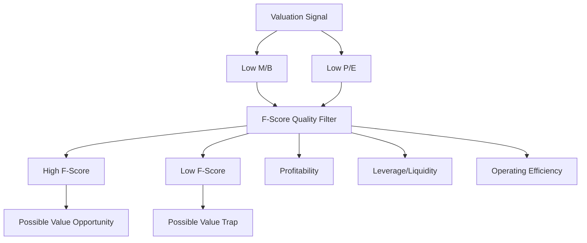

# Ubiquitous Language: Session 01-02 Excursus: Fundamental Analysis For The German Stock Market

Source note: `session-01-02-excursus-fundamental-analysis-german-stock-market.md`
Course: Finance and Investment Management
Definition sources: local topic note and raw material for term discovery; enriched with standard domain knowledge where the local note names a term without fully defining it.

This file is a standalone terminology and formula companion. It follows Matt Pocock style: canonical terms, aliases to avoid, relationships, example dialogue, and flagged ambiguities.

## Fundamental Analysis

| Term | Definition | Aliases to avoid |
|---|---|---|
| **Fundamental Analysis** | Valuing securities by analyzing accounting data, economics, business quality, and expected cash flows. | technical analysis |
| **Market-to-Book Ratio** | Market value of equity divided by book value of equity. Low M/B can indicate value, distress, obsolete assets, or weak expected profitability. | price only, proof of bargain |
| **P/E Ratio** | Market capitalization divided by net income; market price per euro of current earnings. Low P/E can indicate cheapness or expected earnings decline. | valuation proof |
| **Piotroski F-Score** | A 0-9 accounting-based financial-strength score using profitability, leverage/liquidity, and operating-efficiency signals. It is a quality filter, especially for low M/B value stocks. | credit score, valuation ratio |
| **Value Stock** | A stock trading at a low price relative to fundamentals such as book value or earnings; it still needs quality checks. | cheap stock always |
| **Value Trap** | A stock that appears cheap by ratios such as low M/B or low P/E but is cheap because fundamentals are deteriorating. | bargain |
| **Quality Filter** | A second-stage test that checks whether a valuation signal is supported by financial health. In this topic, F-Score is the key quality filter. | guarantee |
| **Accounting Signal** | A financial-statement indicator used to infer future performance or risk. | stock signal |

## Relationships

- **Market-to-Book Ratio** and **P/E Ratio** indicate valuation, while **Piotroski F-Score** indicates financial-health quality.
- A **Value Stock** becomes more credible when low valuation is paired with high **Piotroski F-Score**.
- A low **Market-to-Book Ratio** with low **Piotroski F-Score** points toward **Value Trap** risk.
- A strong answer defines the canonical term, applies the rule or formula, and states the managerial, legal, or analytical implication.

## Visual Memory Aid



## Example Dialogue

> **Student:** "A company has low **Market-to-Book Ratio**. Is it a good investment?"
>
> **Professor:** "Not yet. Low **Market-to-Book Ratio** says it is cheap relative to book equity. Now use **Piotroski F-Score** as a **Quality Filter** to ask whether the cheapness is supported by financial health or explained by distress."
>
> **Student:** "So F-Score is not a valuation ratio?"
>
> **Professor:** "Correct. It strengthens the interpretation of valuation ratios by checking profitability, leverage/liquidity, and efficiency."

## Flagged Ambiguities

- Do not use broad labels like "concept", "factor", or "thing" when a canonical term above fits.
- Do not use aliases listed in the tables unless you are explicitly explaining why they are misleading.
- If a formula symbol appears, define its unit, timing, and decision role before calculating.
- If a legal, theoretical, or framework term has a common everyday meaning, use the technical course meaning in exam answers.
- Do not treat **Piotroski F-Score** as proof that a stock will outperform. It is a financial-health signal, not a guarantee.
- Do not treat low **Market-to-Book Ratio** as automatically attractive; pair it with **Piotroski F-Score** and red-flag analysis.

## Exam Trap Corrections

| Trap | Correction |
|---|---|
| Naming a term without applying it. | Define it briefly, then apply it to the facts, formula, or decision. |
| Treating examples as definitions. | Use examples only after the canonical definition is clear. |
| Mixing related terms. | State the boundary between the terms before comparing them. |
| Copying a formula without variable meaning. | Define each variable and unit before substitution. |
| Saying "low M/B means buy." | Say "low M/B means cheap relative to book; F-Score and red flags decide whether it is a value opportunity or value trap." |
| Treating F-Score like market valuation. | F-Score measures financial strength; it does not price the stock. |

## Cheat-Sheet Language

```text
Valuation says cheap or expensive.
F-Score says financially healthy or weak.
Low M/B + high F-Score = possible value opportunity.
Low M/B + low F-Score = possible value trap.
F-Score strengthens valuation interpretation; it does not replace valuation.
```
