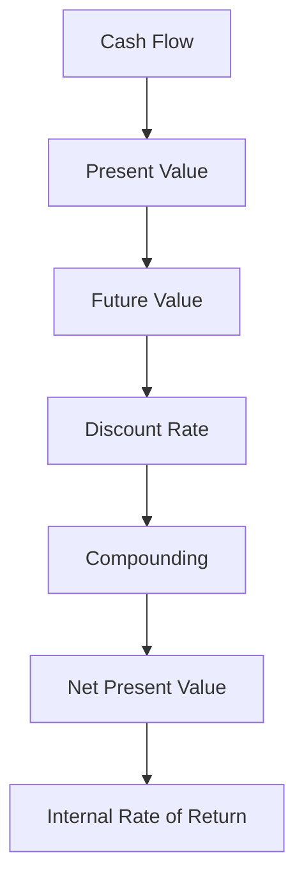

# Ubiquitous Language: Session 01-02 Excursus: Fundamental Analysis For The German Stock Market

Source note: `session-01-02-excursus-fundamental-analysis-german-stock-market.md`
Course: Finance and Investment Management
Definition sources: local topic note and raw material for term discovery; enriched with standard domain knowledge where the local note names a term without fully defining it.

This file is a standalone terminology and formula companion. It follows Matt Pocock style: canonical terms, aliases to avoid, relationships, example dialogue, and flagged ambiguities.

## Finance Language

| Term | Definition | Aliases to avoid |
|---|---|---|
| **Cash Flow** | A dated inflow or outflow of money used for valuation and investment decisions. | profit, accounting earnings |
| **Present Value** | The value today of a future cash flow discounted at an appropriate rate. | current price always |
| **Future Value** | The amount a current cash flow grows to after earning interest over time. | forecast value |
| **Discount Rate** | The rate used to convert future cash flows into present value, reflecting time value and risk. | interest rate always |
| **Compounding** | Interest earning interest over multiple periods. | simple interest |
| **Net Present Value** | The sum of discounted cash inflows and outflows; positive NPV means value creation under the chosen discount rate. | profit, payoff |
| **Internal Rate of Return** | The discount rate that sets NPV equal to zero for a cash-flow stream. | project return always |

## Exam Setup Language

| Term | Definition | Aliases to avoid |
|---|---|---|
| **Timeline** | A dated layout of cash flows and rates that prevents mixing values from different points in time. | list of numbers |
| **Nominal Rate** | A quoted annual rate before adjusting for compounding frequency. | effective rate |
| **Effective Rate** | The actual rate earned or paid over a period after compounding is considered. | nominal rate |

## Fundamental Analysis

| Term | Definition | Aliases to avoid |
|---|---|---|
| **Fundamental Analysis** | Valuing securities by analyzing accounting data, economics, business quality, and expected cash flows. | technical analysis |
| **Market-to-Book Ratio** | Market value of equity divided by book value of equity. | price only |
| **Piotroski F-Score** | A score using accounting signals to assess financial strength, especially for value stocks. | credit score |
| **Value Stock** | A stock trading at a low price relative to fundamentals such as book value or earnings. | cheap stock always |
| **Accounting Signal** | A financial-statement indicator used to infer future performance or risk. | stock signal |

## Relationships

- **Cash Flow** should be distinguished from **Present Value** when writing exam answers.
- **Present Value** should be distinguished from **Future Value** when writing exam answers.
- **Future Value** should be distinguished from **Discount Rate** when writing exam answers.
- **Discount Rate** should be distinguished from **Compounding** when writing exam answers.
- **Compounding** should be distinguished from **Net Present Value** when writing exam answers.
- **Net Present Value** should be distinguished from **Internal Rate of Return** when writing exam answers.
- A strong answer defines the canonical term, applies the rule or formula, and states the managerial, legal, or analytical implication.

## Visual Memory Aid



## Example Dialogue

> **Student:** "I see **Cash Flow** and **Present Value** in the note. Are they interchangeable?"
>
> **Professor:** "No. Use **Cash Flow** for its precise technical meaning, and use **Present Value** only when the facts match that definition."
>
> **Student:** "So in an exam answer I should name the exact term first?"
>
> **Professor:** "Yes. Name the canonical term, apply the decision rule or mechanism, then state the implication."

## Flagged Ambiguities

- Do not use broad labels like "concept", "factor", or "thing" when a canonical term above fits.
- Do not use aliases listed in the tables unless you are explicitly explaining why they are misleading.
- If a formula symbol appears, define its unit, timing, and decision role before calculating.
- If a legal, theoretical, or framework term has a common everyday meaning, use the technical course meaning in exam answers.

## Exam Trap Corrections

| Trap | Correction |
|---|---|
| Naming a term without applying it. | Define it briefly, then apply it to the facts, formula, or decision. |
| Treating examples as definitions. | Use examples only after the canonical definition is clear. |
| Mixing related terms. | State the boundary between the terms before comparing them. |
| Copying a formula without variable meaning. | Define each variable and unit before substitution. |

## Cheat-Sheet Language

```text
Draw the timeline, identify cash flows, choose the rate convention, compute at one date, then interpret the decision rule.
For every technical term: define it, identify when it applies, and state the common confusion to avoid.
```
