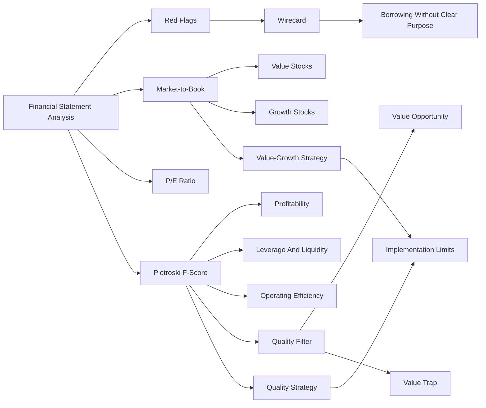

# Session 01-02 Excursus: Fundamental Analysis For The German Stock Market

Source file: `finance-and-investment-management/raw/IuF_0102_SS2026_Excursus_FundamentalAnalysisGermanStockMarket.pdf`  
Lecture folder: `finance-and-investment-management/`  
Date processed: 2026-05-16

## High-Yield 80/20 Summary

This excursus shows how financial statement analysis can become an investment strategy and a fraud/red-flag detection tool. The key exam value is not memorizing historical returns, but understanding why M/B and Piotroski F-Score are signals, how they are used, and why single-variable strategies have limitations.

## Wirecard Case

Wirecard was a German digital-payment FinTech listed in the DAX. It filed for insolvency on 2020-06-25 after auditors reported that EUR 1.9 billion, roughly a quarter of the balance sheet, was missing.

Financial statement analysis question: could red flags have been detected earlier?

Highlighted red flag:

- Borrowing for no clear purpose.
- Current interest-bearing assets increased strongly in 2015-2018: 46%, 25%, 35%, and 38%.

Interpretation: if a company reports high profitability or cash-like assets but still borrows heavily without a clear operational/investment reason, analysts should ask whether the reported assets/profits are economically real.

## Market-To-Book Strategy

```text
M/B Ratio = Market Value of Equity / Book Value of Equity
```

Interpretation:

- Low M/B = value stock.
- High M/B = growth stock.
- Successful firms often have M/B above 1, but very high values may reflect growth expectations rather than current book assets.

Strategy in the slides:

- Long the 10% German stocks with lowest M/B.
- Short the 10% with highest M/B.
- Reported annual returns: value 17.2%, growth 6.4%.

Exam interpretation: this is a factor-style strategy. It is not a guarantee; it says historical low M/B portfolios performed better in the sample.

## Piotroski F-Score

The F-Score is a financial strength signal based on 9 binary indicators covering:

- Profitability.
- Leverage/liquidity.
- Operating efficiency.

The score ranges from 0 to 9; 9 indicates healthier financial statements.

Strategy in the slides:

- Long stocks with F-Score >= 8.
- Short stocks with F-Score <= 3.
- Reported annual returns: high F-Score 14.4%, low F-Score 2.0%.

Exam interpretation: F-Score adds quality/health information to raw valuation. Low M/B can mean undervaluation, but it can also mean distress; F-Score helps separate value opportunities from value traps.

## How F-Score Strengthens Valuation Interpretation

F-Score should be wired into the analysis after valuation ratios such as M/B and P/E.

```text
P/E and M/B ask: "Is the market price cheap or expensive?"
F-Score asks: "Is the financial condition strong enough for cheapness to be believable?"
```

F-Score is especially useful when a stock looks cheap by low M/B. Low M/B only says the market value of equity is low relative to accounting book equity. It does not explain whether the market is wrong or whether the company is deteriorating.

| Valuation signal | F-Score signal | Interpretation |
|---|---:|---|
| Low M/B or low P/E | High F-Score | Possible value opportunity: cheapness plus healthier fundamentals. |
| Low M/B or low P/E | Low F-Score | Possible value trap: cheap because profitability, cash flow, leverage, or efficiency are weak. |
| High M/B or high P/E | High F-Score | Quality/growth candidate, but check whether price already reflects the quality. |
| High M/B or high P/E | Low F-Score | Expensive and weak; risky unless there is a strong turnaround explanation. |
| High ROE but low F-Score | Warning signal: ROE may be leverage-driven or temporarily distorted. |
| High ROIC and high F-Score | Stronger evidence of operating quality and financial health. |

Analogy: M/B or P/E is the price tag on a used car. F-Score is the inspection report. A low price can be attractive if the car is healthy, but dangerous if the engine is failing.

Decision-maker use:

- Investor: use F-Score to avoid buying cheap-looking value traps.
- CFO: use F-Score components as internal financial-health targets: profitability, cash flow, leverage/liquidity, and efficiency.
- Manager: use weak F-Score components to identify operational repair areas, such as margin deterioration or poor asset turnover.
- Lender: use F-Score-like signals as repayment-risk evidence, especially when leverage rises and operating cash flow weakens.

Exam-ready sentence: F-Score does not replace valuation ratios; it filters them. Low P/E or low M/B identifies possible cheapness, while F-Score helps decide whether that cheapness is supported by financial strength or explained by distress.

## Limitations

The slides list several limitations:

- Strategies work better for smaller stocks.
- Short-selling may not be possible for all stocks.
- Short-selling fees reduce returns.
- Frequent rebalancing creates transaction costs.
- Strategies became less successful over time in other markets.
- Higher returns may be risk compensation.
- Single-variable strategies are inefficient.

## Real-Life Example

A cheap-looking company with low M/B might be a bargain or a trap. If the firm has improving profitability, lower leverage, positive operating cash flow, and improving margins, it may be a healthier value candidate. If it has weak profitability, rising debt, suspicious receivables, and unclear borrowing, it may resemble a red-flag situation.

## Exam Traps

- Low M/B does not automatically mean good investment.
- High F-Score does not eliminate risk.
- Historical strategy returns do not imply future arbitrage.
- Financial statement analysis can flag suspicious patterns but does not prove fraud alone.
- Short strategies face implementation costs and constraints.

## Practice Questions

1. Why might low M/B stocks outperform high M/B stocks historically?
   - Answer: they may be underpriced relative to book assets, but this may also reflect risk or investor overreaction.
2. Why combine M/B with F-Score?
   - Answer: M/B captures valuation; F-Score captures financial health, helping avoid weak value traps.
3. What was the Wirecard-style warning signal discussed?
   - Answer: borrowing for no clear purpose while interest-bearing assets rose strongly.
4. Why do transaction costs matter for factor strategies?
   - Answer: frequent rebalancing and short-selling fees can erode gross returns.

## Mermaid Knowledge Map



## Subject Knowledge Graph

| Node | Meaning |
|---|---|
| Wirecard | Fraud/red-flag case |
| Borrowing for no clear purpose | Suspicious balance-sheet behavior |
| M/B ratio | Market valuation relative to book equity |
| P/E ratio | Market valuation relative to current earnings |
| Value stock | Low M/B stock |
| Growth stock | High M/B stock |
| Piotroski F-Score | Financial strength score from 0 to 9 |
| Value trap | Cheap-looking stock with weak fundamentals |
| Quality filter | Financial-health check applied after valuation screen |
| Transaction costs | Implementation friction |
| Short-selling constraints | Limits to long-short strategy execution |

| From | Relationship | To |
|---|---|---|
| Financial statement analysis | detects | red flags |
| Wirecard | illustrates | limits and importance of analysis |
| M/B ratio | classifies | value vs growth stocks |
| Piotroski F-Score | measures | financial health |
| F-Score | filters | low M/B and low P/E cheapness |
| Low M/B plus high F-Score | suggests | value opportunity |
| Low M/B plus low F-Score | suggests | value trap |
| Long-short strategy | depends on | short-selling feasibility |
| Rebalancing | creates | transaction costs |
| Single-variable strategy | can be improved by | multi-signal analysis |

## Links

- Related note: `finance-and-investment-management/wiki/session-01-02-financial-analysis/session-01-02-financial-analysis.md`
