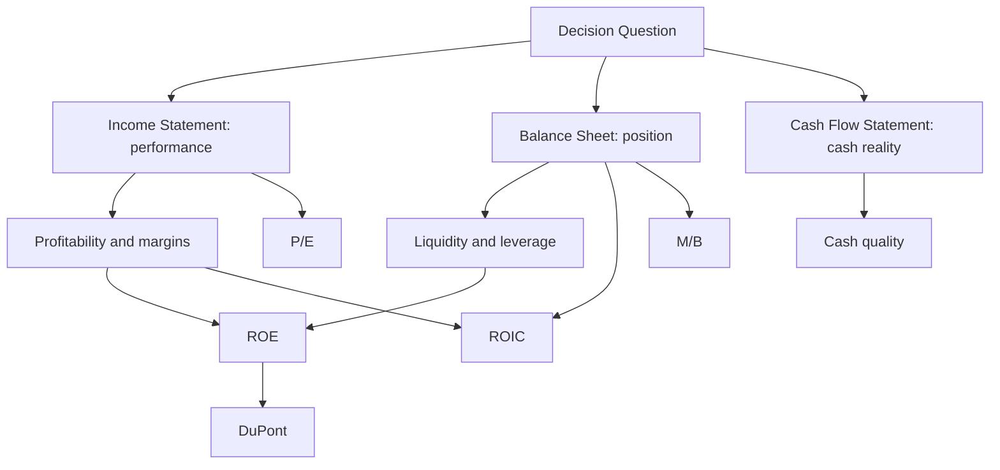

# Ubiquitous Language: Session 01-02: Financial Analysis

Source note: `session-01-02-financial-analysis.md`
Course: Finance and Investment Management
Definition sources: local topic note and raw material for term discovery; enriched with standard domain knowledge where the local note names a term without fully defining it.

This file is a standalone terminology and formula companion. It follows Matt Pocock style: canonical terms, aliases to avoid, relationships, example dialogue, and flagged ambiguities.

## Financial Statements

| Term | Definition | Aliases to avoid |
|---|---|---|
| **Balance Sheet** | Point-in-time statement of assets, liabilities, and equity. Use it for financial position, liquidity resources, debt burden, inventory, receivables, and capital structure. | income statement, performance report |
| **Income Statement** | Period statement of revenue, expenses, operating income, interest, taxes, and net income. Use it for profitability, cost structure, margins, and earnings power. | balance sheet, cash report |
| **Cash Flow Statement** | Period statement explaining actual cash movement from operating, investing, and financing activities. Use it to test whether accounting profit becomes cash. | profit statement |
| **Operating Cash Flow** | Cash generated or consumed by core operations; useful for testing earnings quality and liquidity pressure. | net income |
| **Current Assets** | Assets expected to become cash or be used within one year, such as cash, receivables, inventory, and prepaid items. | all assets |
| **Current Liabilities** | Obligations due within one year, such as payables, short-term debt, wages, and taxes payable. | all debt |
| **Net Working Capital** | Current assets minus current liabilities; a rough short-term operating liquidity cushion. | cash balance |

## Ratio Families And Decision Use

| Term | Definition | Aliases to avoid |
|---|---|---|
| **Profitability Ratio** | Ratio measuring how much profit remains after cost layers or relative to resources. It supports investor, CFO, and manager questions about business quality and cost control. | cash flow ratio |
| **Liquidity Ratio** | Ratio measuring ability to meet short-term obligations. It supports CFO, lender, supplier, and investor questions about near-term solvency. | profitability ratio |
| **Leverage Ratio** | Ratio measuring reliance on debt financing and financial risk. It supports capital-structure, lending, and shareholder-risk decisions. | liquidity ratio |
| **Interest Coverage** | EBIT or EBITDA divided by interest expense; shows how many times operating income can cover interest obligations. | investment coverage |
| **Asset Turnover** | Sales divided by total assets; shows how many euros of sales are generated per euro of assets. | profitability margin |
| **Valuation Ratio** | Market-price ratio that compares market value to earnings, book equity, sales, or operating income. It supports buy/sell and peer-comparison decisions. | operating ratio |

## Return And Valuation Terms

| Term | Definition | Aliases to avoid |
|---|---|---|
| **ROE** | Net income divided by book equity. It measures shareholder return on accounting equity, but can be boosted by leverage. | operating return always |
| **ROIC** | After-tax operating income divided by invested capital, usually `EBIT x (1 - tax rate) / (book equity + net debt)`. It measures operating return on capital supplied to the business. | shareholder return only |
| **Equity Multiplier** | Total assets divided by book equity; the leverage component in DuPont. A high value can amplify ROE and risk. | asset turnover |
| **DuPont Identity** | `ROE = net profit margin x asset turnover x equity multiplier`; decomposes shareholder return into profitability, efficiency, and leverage. | ROE formula only |
| **P/E Ratio** | Market capitalization divided by net income; market price per euro of current earnings. | cheapness proof |
| **Market-to-Book Ratio** | Market value of equity divided by book value of equity; market value relative to accounting equity. | book-to-market, price only |
| **Enterprise Value** | Market value of equity plus debt minus cash; value of the operating business available to debt and equity providers. | market cap |

## Relationships

- **Income Statement** shows performance, **Balance Sheet** shows position, and **Cash Flow Statement** checks cash reality.
- **Profitability Ratio** explains business economics, while **Liquidity Ratio** explains short-term survival.
- **ROIC** is the operating-quality lens; **ROE** is the shareholder-return lens.
- **DuPont Identity** explains whether **ROE** comes from margin, asset efficiency, or leverage.
- **P/E Ratio** values earnings; **Market-to-Book Ratio** values accounting equity.
- **Enterprise Value** is broader than market capitalization because it includes net debt.
- A strong answer defines the canonical term, applies the rule or formula, and states the managerial, legal, or analytical implication.

## Visual Memory Aid



## Example Dialogue

> **Student:** "The company has positive net income. Is it financially healthy?"
>
> **Professor:** "Not necessarily. **Income Statement** profit says the performance engine produced earnings. Now check the **Cash Flow Statement** to see whether profit became cash and the **Balance Sheet** to see whether receivables, inventory, or short-term debt create pressure."
>
> **Student:** "So ratios depend on the decision question?"
>
> **Professor:** "Exactly. Use **ROIC** for operating capital productivity, **ROE** for shareholder return, **P/E Ratio** for price relative to earnings, and **Market-to-Book Ratio** for price relative to book equity."

## Flagged Ambiguities

- Do not use broad labels like "concept", "factor", or "thing" when a canonical term above fits.
- Do not use aliases listed in the tables unless you are explicitly explaining why they are misleading.
- If a formula symbol appears, define its unit, timing, and decision role before calculating.
- If a legal, theoretical, or framework term has a common everyday meaning, use the technical course meaning in exam answers.
- Do not call a firm "good" only because **ROE** is high; first check **DuPont Identity** and leverage.
- Do not call a stock "cheap" only because **P/E Ratio** or **Market-to-Book Ratio** is low; first check profitability, cash quality, leverage, and financial-health signals.

## Exam Trap Corrections

| Trap | Correction |
|---|---|
| Naming a term without applying it. | Define it briefly, then apply it to the facts, formula, or decision. |
| Treating examples as definitions. | Use examples only after the canonical definition is clear. |
| Mixing related terms. | State the boundary between the terms before comparing them. |
| Copying a formula without variable meaning. | Define each variable and unit before substitution. |
| Calculating a ratio and stopping. | Add what it measures, whose decision it supports, and what evidence is still missing. |
| Confusing **ROE** and **ROIC**. | Use **ROE** for shareholder return on book equity; use **ROIC** for operating return on invested capital. |
| Confusing **P/E Ratio** and **Market-to-Book Ratio**. | **P/E Ratio** prices earnings; **Market-to-Book Ratio** prices accounting equity. |

## Cheat-Sheet Language

```text
Start from the decision question.
Profit or margin? Income statement.
Assets, debt, liquidity position? Balance sheet.
Cash quality or survival? Cash flow statement.
ROIC asks whether operations create value from invested capital.
ROE asks what shareholders earn on book equity, but leverage can inflate it.
P/E asks what the market pays for earnings.
M/B asks what the market pays relative to book equity.
For every ratio: what it measures -> who uses it -> what decision it supports -> what it cannot prove alone.
```
