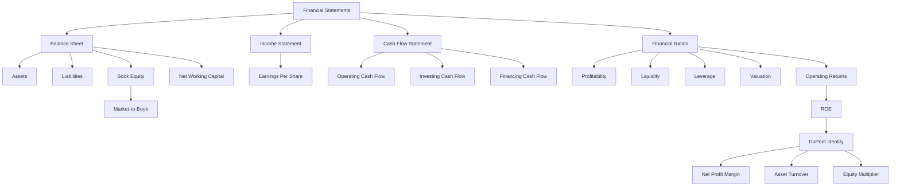

# Session 01-02: Financial Analysis

Source file: `finance-and-investment-management/raw/IuF_0102_SS2026_Introduction_Financial_Analysis.pdf`  
Lecture folder: `finance-and-investment-management/`  
Date processed: 2026-05-16

## High-Yield 80/20 Summary

Financial analysis turns accounting reports into economic signals about a firm's profitability, liquidity, leverage, valuation, and operating performance. The exam is likely to test whether you can identify which statement contains which information, calculate ratios, interpret them, and avoid confusing book values with market values.

The core logic is:

1. Balance sheet = financial position at one point in time.
2. Income statement = performance over a period.
3. Cash flow statement = sources and uses of cash over a period.
4. Ratios = standardized measures that make firms comparable over time and against peers.
5. DuPont identity = ROE decomposition into profit margin, asset turnover, and leverage.

## Core Statements

### Financial Statements

Financial statements are firm-issued accounting reports about past performance. They inform shareholders and stakeholders and are prepared under accounting rules such as GAAP or IFRS.

Main statements:

- Balance sheet / statement of financial position.
- Income statement.
- Statement of cash flows.
- Statement of changes in shareholders' equity.

### Balance Sheet

The balance sheet is a snapshot of assets, liabilities, and shareholders' equity at a specific date.

```text
Assets = Liabilities + Shareholders' Equity
```

Interpretation:

- Assets = what the company owns.
- Liabilities = what the company owes.
- Shareholders' equity = accounting residual claim.

Current assets are expected to become cash within one year. Examples: cash, marketable securities, accounts receivable, inventories, prepaid expenses.

Non-current assets support long-term operations. Examples: PPE, goodwill, intangible assets, other long-term assets.

Current liabilities are due within one year. Examples: accounts payable, short-term debt, current maturities of long-term debt, taxes payable, wages payable.

Non-current liabilities are due after one year. Examples: long-term debt, leases, deferred taxes.

```text
Net Working Capital = Current Assets - Current Liabilities
```

### Book Equity vs Market Equity

```text
Book Value of Equity = Book Value of Assets - Book Value of Liabilities
Market Value of Equity = Share Price x Shares Outstanding
Market-to-Book Ratio = Market Value of Equity / Book Value of Equity
```

Book equity can be negative; market equity cannot be negative. Market value usually differs from book value because accounting does not fully capture intangible assets, growth expectations, brand, technology, network effects, or future profitability.

Exam trap: do not use book equity when the question asks for market capitalization.

### Enterprise Value

Enterprise value measures the value of the operating business, independent of cash/debt financing mix.

```text
Enterprise Value = Market Value of Equity + Debt - Cash
Enterprise Value = Market Value of Equity + Net Debt
Net Debt = Total Debt - Cash and Short-Term Investments
```

Exam trap: equity value belongs to shareholders; enterprise value belongs to all capital providers and captures operating assets.

### Income Statement

The income statement records revenues, expenses, and profit over a period.

Typical structure:

```text
Revenue / Sales
- COGS
= Gross Profit
- SG&A
- Depreciation and Amortization
= Operating Income
+/- Other Income / Expenses
= EBIT
+/- Interest Income / Expense
= Pre-Tax Income
- Taxes
= Net Income
```

```text
EPS = Net Income / Shares Outstanding
```

Diluted EPS adjusts for possible future dilution from in-the-money stock options, convertible bonds, or warrants.

### Statement Of Cash Flows

The cash flow statement records sources and uses of cash over a period. It is derived from the income statement and balance-sheet changes.

Three sections:

- Operating activities.
- Investing activities.
- Financing activities.

Exam trap: profit is not cash. A profitable firm can have liquidity pressure if cash collection, inventory, capex, or debt maturity timing is unfavorable.

## Financial Ratios

### Profitability Ratios

```text
Gross Margin = Gross Profit / Sales
Operating Margin = Operating Income / Sales
EBIT Margin = EBIT / Sales
Net Profit Margin = Net Income / Sales
```

Use: measure how much of sales remains after different cost layers.

### Liquidity Ratios

```text
Current Ratio = Current Assets / Current Liabilities
Quick Ratio = (Cash + Short-Term Investments + Accounts Receivable) / Current Liabilities
Cash Ratio = Cash / Current Liabilities
```

Use: short-term solvency. Quick ratio excludes inventory because inventory may not convert into cash quickly or reliably.

### Interest Coverage

```text
EBIT Interest Coverage = EBIT / Interest Expense
EBITDA Interest Coverage = EBITDA / Interest Expense
```

Interpretation: higher coverage means more ability to meet interest obligations. The slides flag high-quality borrowers as above about 5x EBIT coverage and low-quality borrowers as below about 1.5x.

### Leverage / Gearing

```text
Debt-Equity Ratio = Total Debt / Total Equity
Debt-to-Capital Ratio = Total Debt / (Total Equity + Total Debt)
Debt-to-EV Ratio = Net Debt / (Market Value + Net Debt)
Equity Multiplier = Total Assets / Book Value of Equity
```

Exam trap: leverage can be measured using book or market values. Read the denominator carefully.

### Valuation Ratios

```text
P/E Ratio = Market Capitalization / Net Income = Share Price / EPS
EV/EBIT = (Market Value of Equity + Debt - Cash) / EBIT
EV/Sales = (Market Value of Equity + Debt - Cash) / Sales
```

Use: compare firm valuations within the same industry. Cross-industry comparison can mislead because margins, growth, asset intensity, and risk differ.

### Operating Return Ratios

```text
ROE = Net Income / Book Value of Equity
ROA = (Net Income + Interest Expense) / Total Assets
ROIC = EBIT x (1 - Tax Rate) / (Book Value of Equity + Net Debt)
Asset Turnover = Sales / Total Assets
```

ROIC is central because it evaluates returns on capital invested in operations, not only returns to equity holders.

## DuPont Identity

```text
ROE = (Net Income / Sales) x (Sales / Total Assets) x (Total Assets / Book Value of Equity)
ROE = Net Profit Margin x Asset Turnover x Equity Multiplier
```

Interpretation:

- Profitability: how much profit per euro of sales.
- Asset efficiency: how much sales per euro of assets.
- Leverage: how much assets are financed per euro of equity.

Example from slides:

| Firm | Net Profit Margin | Asset Turnover | Equity Multiplier | ROE |
|---|---:|---:|---:|---:|
| Yahoo! | 21.04% | 0.337 | 1.18 | 8.34% |
| Google | 25.69% | 0.522 | 1.25 | 16.75% |

Google's superior ROE came from all three components: higher profitability, higher asset efficiency, and slightly higher leverage.

## Netflix Case Logic

The Netflix case trains reading financial statements as evidence, not only formulas.

Likely tested interpretations:

- Revenue growth driver in 2024: increased enforcement of password-sharing rules converting shared users into paying members.
- Liquidity position: about USD 7.81 billion cash and equivalents indicates strong liquidity.
- Short-term debt: debt maturities due within one year, not necessarily financial distress.
- Share repurchase: reduces shares outstanding and tends to increase EPS, all else equal.

Exam trap: a ratio can be true but not answer the question. For example, ROE does not explain the operational cause of revenue growth.

## Real-Life Interpretation

Imagine comparing Netflix and a manufacturing company. Netflix may have huge intangible content and platform value that does not appear cleanly as book equity. A factory-heavy manufacturer may have more PPE on the balance sheet. A naive comparison of book values can miss the economic value driver. That is why market value, enterprise value, profitability, asset turnover, and cash flows must be interpreted together.

## Exam-Relevant Decision Rules

- If asked for short-term solvency, use liquidity ratios.
- If asked for debt burden, use leverage and interest coverage.
- If asked for shareholder return, use ROE.
- If asked for operating return independent of financing, use ROIC.
- If asked for valuation comparison, use P/E, EV/EBIT, EV/Sales, or M/B depending on the available data.
- If asked why ROE differs, decompose using DuPont.

## Common Mistakes

- Mixing book value and market value.
- Treating net income as cash flow.
- Using P/E across industries without adjustment.
- Forgetting that enterprise value subtracts cash.
- Interpreting high leverage as always bad; leverage increases risk but can also amplify ROE.
- Using inventory in quick ratio.
- Confusing short-term debt with total debt.

## Practice Questions

1. A company has 5 million shares at USD 22 per share and book equity of USD 50 million. Calculate market cap and M/B.
   - Answer: market cap = USD 110 million; M/B = 110/50 = 2.2.
2. A firm's current assets are 120, current liabilities 80, cash 20, receivables 30, inventory 70. Calculate current and quick ratios.
   - Answer: current ratio = 1.5; quick ratio = (20+30)/80 = 0.625.
3. Explain why two firms with the same ROE can still have different business quality.
   - Answer: ROE can come from margin, turnover, or leverage; high leverage-driven ROE is riskier than operation-driven ROE.
4. Why is EV/EBIT different from P/E?
   - Answer: EV/EBIT values the whole operating firm before interest; P/E values equity after interest and taxes.

## Mermaid Knowledge Map



## Subject Knowledge Graph

| Node | Meaning |
|---|---|
| Financial statements | Source reports for financial analysis |
| Balance sheet | Point-in-time position of assets, liabilities, equity |
| Income statement | Period performance from revenue to net income |
| Cash flow statement | Cash sources and uses |
| Ratio analysis | Standardized comparison tool |
| Enterprise value | Value of operating business |
| ROE | Return to book equity |
| DuPont identity | ROE decomposition |
| Liquidity | Short-term solvency |
| Leverage | Debt reliance and risk amplification |

| From | Relationship | To |
|---|---|---|
| Balance sheet | defines | Assets = Liabilities + Equity |
| Market value of equity | differs from | Book value of equity |
| Enterprise value | equals | Equity value plus net debt |
| Income statement | produces | Net income and EPS |
| Cash flow statement | explains | cash movement |
| Ratio analysis | compares | firms and periods |
| DuPont identity | decomposes | ROE |
| Leverage | amplifies | ROE and risk |
| Liquidity ratios | measure | short-term solvency |
| Valuation ratios | support | market comparison |

## Links

- Related logistics: `finance-and-investment-management/wiki/_course-logistics.md`
- Related excursus: `finance-and-investment-management/wiki/session-01-02-excursus-fundamental-analysis-german-stock-market/session-01-02-excursus-fundamental-analysis-german-stock-market.md`
