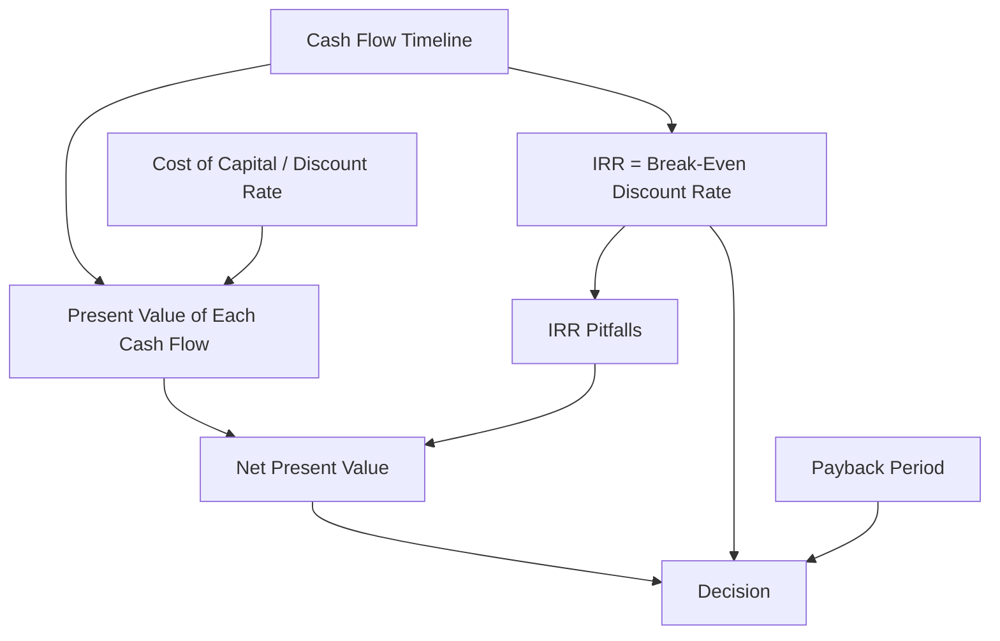

# Ubiquitous Language: Session 03-04: Investment Analysis

Source note: `session-03-04-investment-analysis.md`
Course: Finance and Investment Management
Definition sources: local topic note and raw material for term discovery; enriched with standard domain knowledge where the local note names a term without fully defining it.

This file is a standalone terminology and formula companion. It follows Matt Pocock style: canonical terms, aliases to avoid, relationships, example dialogue, and flagged ambiguities.

## Finance Language

| Term | Definition | Aliases to avoid |
|---|---|---|
| **Cash Flow** | A dated inflow or outflow of money used for valuation and investment decisions. | profit, accounting earnings |
| **Present Value** | The value today of a future cash flow discounted at an appropriate rate. | current price always |
| **Future Value** | The amount a current cash flow grows to after earning interest over time. | forecast value |
| **Discount Rate** | The rate used to convert future cash flows into present value, reflecting time value and risk. | interest rate always |
| **Cost of Capital** | The required return demanded by capital providers for a project with a given risk; usually used as the discount rate in NPV. | cost of the investment, initial outlay |
| **Required Return** | The minimum return a project must earn to compensate investors for time, risk, and opportunity cost. | desired profit |
| **Compounding** | Interest earning interest over multiple periods. | simple interest |
| **Net Present Value** | The sum of discounted cash inflows and outflows; positive NPV means value creation under the chosen discount rate. | profit, payoff |
| **Internal Rate of Return** | The discount rate that sets NPV equal to zero for a cash-flow stream. | project return always |
| **Break-Even Discount Rate** | Another precise way to describe IRR: the rate at which the project creates exactly zero value. | chosen hurdle rate |

## Exam Setup Language

| Term | Definition | Aliases to avoid |
|---|---|---|
| **Timeline** | A dated layout of cash flows and rates that prevents mixing values from different points in time. | list of numbers |
| **Nominal Rate** | A quoted annual rate before adjusting for compounding frequency. | effective rate |
| **Effective Rate** | The actual rate earned or paid over a period after compounding is considered. | nominal rate |

## Capital Budgeting

| Term | Definition | Aliases to avoid |
|---|---|---|
| **NPV Rule** | Accept projects with positive net present value because they add value under the chosen discount rate. | highest IRR rule |
| **IRR Rule** | A decision rule comparing the internal rate of return with the required return, reliable only under standard cash-flow patterns. | NPV rule |
| **Normal Cash Flows** | A project pattern with one initial outflow followed by later inflows, usually producing one meaningful IRR. | safe cash flows |
| **Non-Normal Cash Flows** | A cash-flow pattern with more than one sign change, which can create multiple IRRs or no IRR. | unusual but harmless cash flows |
| **Payback Period** | Time needed for cumulative cash flows to recover the initial investment. | profitability |
| **Discounted Payback** | Payback calculated using discounted cash flows; it fixes the time-value issue but still ignores later cash flows and cutoff arbitrariness. | NPV |
| **Profitability Index** | Present value of future cash inflows divided by initial investment, useful under capital rationing. | profit margin |
| **Mutually Exclusive Projects** | Projects where accepting one prevents accepting another. | independent projects |
| **Delayed Investment** | An investment pattern where major outflows occur after early inflows, reversing ordinary IRR intuition. | late payment |
| **Multiple IRRs** | A situation where the NPV equation has more than one discount rate that makes NPV equal zero. | better IRR, alternative return |
| **Nonexistent IRR** | A situation where the cash-flow stream never produces an NPV of zero, so no IRR can be solved. | very bad IRR |
| **Arbitrary Payback Cutoff** | A management threshold such as "payback under two years" that is not derived from value creation. | risk-adjusted decision rule |

## Annuity Bridge Language

| Term | Definition | Aliases to avoid |
|---|---|---|
| **Annuity Calculation** | A mathematical-basics tool for valuing a repeated cash-flow stream at one date. | investment decision |
| **Investment Analysis Decision** | A project or firm decision that compares the PV of benefits with the investment cost and risk, usually through NPV. | annuity calculation |
| **Annuity-Immediate** | Repeated payments at the end of each period, such as `t=1` through `t=5` for five annual payments. | annuity-due |
| **Annuity-Due** | Repeated payments at the beginning of each period, such as `t=0` through `t=4` for five annual payments. | extra payment |
| **Constant Annuity** | A finite repeated cash-flow stream with the same payment each period. | perpetuity |
| **Growing Annuity** | A finite repeated cash-flow stream that grows by a percentage each period. | arithmetic annuity |
| **Arithmetic Annuity** | A finite repeated cash-flow stream that changes by a fixed euro amount each period. | growing annuity |
| **Perpetuity** | A constant cash-flow stream with no finite end date. | very long annuity always |
| **Growing Perpetuity** | A cash-flow stream that grows forever at a constant rate, valid only when the growth rate is below the discount rate. | guaranteed growth value |
| **Present Value Direction** | Discounting cash flows back to today, used when the question asks what a stream is worth now or whether to accept a project today. | future value |
| **Future Value Direction** | Compounding cash flows forward to a target date, used when the question asks how much will accumulate later. | present value |
| **Sinking Fund Problem** | A funding problem where equal deposits accumulate to a required future amount. | NPV problem |

## Relationships

- **Cash Flow** is first placed on a **Timeline**, then converted into **Present Value** through a **Discount Rate**.
- **Cost of Capital** is usually the **Discount Rate** in an NPV calculation because it is the project's required return.
- **Net Present Value** is a money amount; **Internal Rate of Return** is a percentage.
- **Internal Rate of Return** is the **Break-Even Discount Rate** implied by the project cash flows, not a rate chosen by the manager.
- **Normal Cash Flows** make the **IRR Rule** more reliable; **Non-Normal Cash Flows** trigger **Multiple IRRs** or **Nonexistent IRR** risk.
- **Payback Period** measures liquidity recovery speed, not value creation.
- **Annuity Calculation** values repeated cash flows; **Investment Analysis Decision** uses that value to accept, reject, or compare projects.
- **Annuity-Due** has the same number of payments as **Annuity-Immediate**, but each payment arrives one period earlier, which increases PV and can increase NPV.
- **Growing Annuity**, **Arithmetic Annuity**, **Perpetuity**, and **Growing Perpetuity** describe cash-flow patterns; none is automatically a better investment until NPV compares PV against cost and risk.
- **Present Value Direction** and **Future Value Direction** use the same timing distinction: end-of-period means annuity-immediate, beginning-of-period means annuity-due.
- **Sinking Fund Problem** uses **Future Value Direction** because the target amount is in the future; if deposits are end-of-period, it is FV of annuity-immediate, and if deposits are beginning-of-period, it is FV of annuity-due.
- A strong answer defines the canonical term, applies the rule or formula, and states the managerial, legal, or analytical implication.

## Visual Memory Aid



## Formula And Decision Intuition

| Formula Or Rule | Intuition | Unit / Timing |
|---|---|---|
| `NPV = sum CF_t / (1+r)^t` | Bring every dated cash flow to today and add them up. | Money today, e.g. EUR at `t=0`. |
| `0 = sum CF_t / (1+IRR)^t` | Find the rate that makes the project exactly break even. | Percent per period. |
| `PV = FV / (1+r)^t` | Future money is worth less today when time and risk matter. | Future cash flow converted to today's value. |
| `Payback = time to recover initial investment` | Measures how quickly cash returns, not whether value is created. | Years or periods. |

Managerial decision language:

| Situation | Correct Interpretation |
|---|---|
| `NPV > 0` | The project creates value after compensating capital providers. |
| `NPV < 0` | The project fails to earn the required return. |
| `IRR > cost of capital` with normal cash flows | Supportive accept signal, but still check NPV. |
| NPV and IRR conflict | Trust NPV because it measures value in money today. |
| Payback is short | Liquidity recovery is fast; value creation still needs NPV. |

## Worked Calculation Language

Worked route for numeric answers:

```text
Project question -> cash-flow timeline -> discount rate -> PV of each cash flow -> NPV/IRR/payback result -> decision -> limitation
```

Mini anchor:

```text
Project A: C_0 = -100, C_1 = 140, r = 10%.
NPV_A = -100 + 140/1.10
NPV_A = -100 + 127.27
NPV_A = 27.27
```

Interpretation: the project creates EUR 27.27 of value today per EUR 100 invested after meeting the 10% required return. Analogy: NPV is the surplus left after paying the investor's required toll. Trap: accepting the highest IRR when a larger mutually exclusive project creates more euro value.

## Example Dialogue

> **Student:** "I see **Cash Flow**, **Discount Rate**, and **Cost of Capital**. Are they the same kind of thing?"
>
> **Professor:** "No. **Cash Flow** is a dated euro amount. **Cost of Capital** is the required return percentage. The **Discount Rate** is the rate used to convert those cash flows into present value."
>
> **Student:** "Then where does **IRR** come from?"
>
> **Professor:** "**IRR** is solved from the project cash flows. It is the **Break-Even Discount Rate** where **NPV** equals zero."
>
> **Student:** "So if IRR and NPV disagree?"
>
> **Professor:** "Trust **NPV**. It tells you how much value the project creates today."

## Flagged Ambiguities

- Do not use broad labels like "concept", "factor", or "thing" when a canonical term above fits.
- Do not use aliases listed in the tables unless you are explicitly explaining why they are misleading.
- If a formula symbol appears, define its unit, timing, and decision role before calculating.
- If a legal, theoretical, or framework term has a common everyday meaning, use the technical course meaning in exam answers.

## Exam Trap Corrections

| Trap | Correction |
|---|---|
| Naming a term without applying it. | Define it briefly, then apply it to the facts, formula, or decision. |
| Treating examples as definitions. | Use examples only after the canonical definition is clear. |
| Mixing related terms. | State the boundary between the terms before comparing them. |
| Copying a formula without variable meaning. | Define each variable and unit before substitution. |
| Treating cost of capital as the initial investment cost. | Cost of capital is a percentage required return; initial investment is a cash outflow. |
| Saying IRR is chosen by management. | IRR is solved from project cash flows; management chooses or estimates the discount rate/cost of capital. |
| Trusting IRR under non-normal cash flows. | Multiple sign changes can create multiple or nonexistent IRRs; use NPV. |
| Treating payback as a value rule. | Payback is a liquidity/recovery-time rule; it ignores time value, later cash flows, and cutoff logic. |
| Treating IRR as an input into NPV. | NPV needs cash flows, timing, and cost of capital; IRR is a separate rate solved from the same cash flows. |
| Saying annuity-due gives an extra payment. | Annuity-due gives the same number of payments one period earlier, so PV is higher. |
| Treating the annuity result as the final answer in an investment problem. | The annuity result is an input into NPV; the final answer is the accept/reject or comparison decision. |
| Saying NPV when the task asks how much will accumulate in the future. | Use FV language for accumulation/funding targets; use PV/NPV language for today's value or accept/reject decisions. |

## Cheat-Sheet Language

```text
Draw the timeline, identify cash flows, choose the rate convention, compute at one date, then interpret the decision rule.
For every technical term: define it, identify when it applies, and state the common confusion to avoid.
NPV tells me how much value the investment creates today.
IRR tells me the break-even return rate implied by the project cash flows.
If NPV and IRR conflict, I trust NPV.
```
