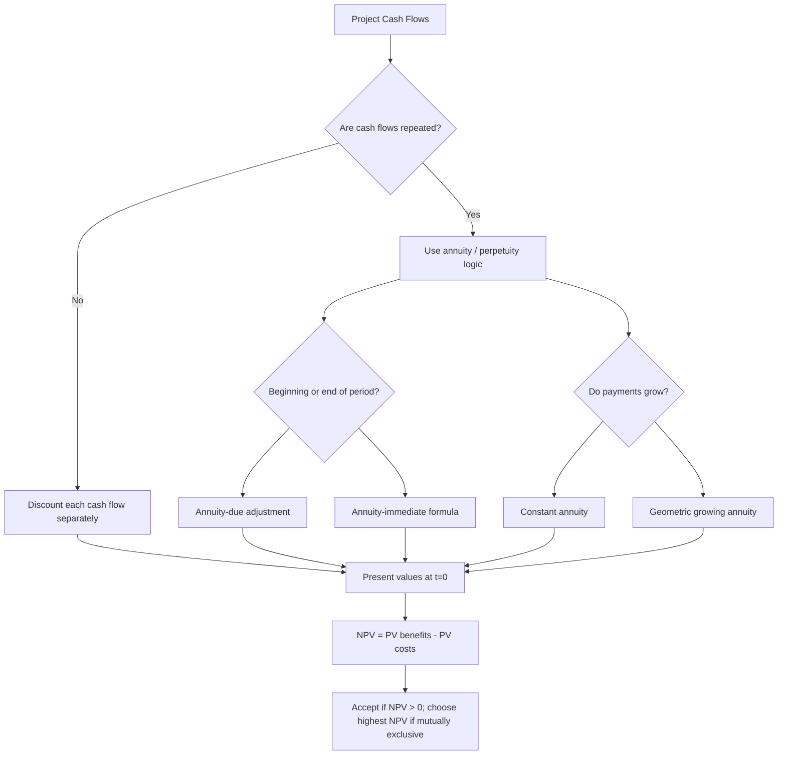

# Bridge: Annuities To Investment Analysis

Source notes:

- `session-03-04-investment-analysis.md`
- `../exercise-03-04-annuities/exercise-03-04-annuities.md`
- `_course-logistics.md`

Date prepared: 2026-05-31
Course: Finance and Investment Management

## Why This Bridge Exists

Finance uses two numbering systems:

| Track | Local file | Topic | Exam role |
|---|---|---|---|
| Corporate-finance lecture | `session-03-04-investment-analysis.md` | Investment Analysis | Decide whether projects create value using NPV, IRR, payback, and profitability index. |
| Mathematical-basics exercise | `exercise-03-04-annuities.md` | Annuities | Value repeated cash-flow streams using PV/FV annuity formulas. |

The lecture deck for Session 03-04 does not teach annuities as its main topic. It teaches investment analysis. Annuities are a supporting calculation tool from the exercise track. They become relevant inside investment analysis whenever project cash flows repeat, grow, or continue for a long time.

Use this bridge to avoid the naming trap:

```text
Exercise 03-04 = annuity calculation technique
Lecture Session 03-04 = project decision framework
```

## Core Interpretation

Investment analysis asks:

```text
Should we accept this project?
```

Annuity calculation asks:

```text
What is this repeated cash-flow stream worth at one date?
```

The two connect because NPV needs all cash flows expressed at the same date. If the project creates repeated payments, the annuity formula is just a shortcut for the PV or FV of those repeated payments.

## Mapping Table

| If the investment-analysis problem says... | Translate it as... | Use from annuities | Then decide with... |
|---|---|---|---|
| "The project pays EUR 450 every year for 3 years." | Constant finite annuity | PV of annuity-immediate, unless payments are at the beginning | NPV rule |
| "The project generates EUR 35 million forever." | Perpetuity | `PV = C / r` | NPV rule |
| "Cash flows grow by 3% per year." | Geometric growing annuity or growing perpetuity | Growth formula; check `growth < discount rate` for perpetuity | NPV rule |
| "Payments occur at the beginning of each year." | Annuity-due | Multiply the comparable immediate value by `q = 1 + r` where appropriate | NPV rule |
| "Recover the investment as fast as possible." | Liquidity concern, not valuation by itself | Possibly cumulative cash-flow timeline | Payback, then state limitations |

## Decision Flow



## Worked Bridge Example

Use the full route: project question, annuity pattern, formula choice, substitution, arithmetic, NPV decision, and exam trap.

Project:

- Initial investment today: EUR 1,000
- Cash inflow: EUR 450 at the end of each of the next 3 years
- Cost of capital: 10%

Investment-analysis setup:

```text
NPV = -1,000 + PV(repeated EUR 450 payments)
```

Annuity interpretation:

```text
The EUR 450 payments are a 3-year annuity-immediate.
```

Expanded NPV:

```text
NPV = -1,000 + 450/1.10 + 450/1.10^2 + 450/1.10^3
NPV = -1,000 + 409.09 + 371.90 + 338.09
NPV = 119.08
```

Decision:

```text
Accept. The project creates EUR 119.08 of value today after compensating capital providers at 10%.
```

The annuity formula can compute the same PV faster, but the interpretation remains investment analysis: accept or reject based on value creation.

## Common Exam Traps

| Trap | Correction |
|---|---|
| Thinking annuities and Investment Analysis are the same topic because both use cash flows. | Annuities value repeated cash flows; Investment Analysis decides whether a project creates value. |
| Using an annuity formula before identifying timing. | First ask: beginning or end of period? finite or perpetual? constant or growing? |
| Treating the annuity result as the answer. | The annuity result is an input into NPV; the final answer is the project decision and interpretation. |
| Forgetting the initial investment. | NPV must include `CF_0`, usually a negative cash outflow. |
| Using IRR or payback before NPV. | Use NPV as the master rule; IRR and payback are secondary and can mislead. |

## Real Use Cases With Calculation

### Stable Machine Savings: Constant Annuity

A machine costs EUR 80,000 and saves EUR 20,000 at the end of each year for 5 years. Cost of capital is 10%.

```text
PV = 20,000 x [1 - 1/1.10^5] / 0.10
PV = 75,815.74

NPV = -80,000 + 75,815.74
NPV = -4,184.26
```

Investment interpretation: reject. The stable savings are useful, but not enough to cover the investment cost at a 10% required return.

### Same Machine With Beginning Payments: Annuity-Due

Same cost, same number of payments, but savings occur at the beginning of each year.

```text
PV_due = 75,815.74 x 1.10
PV_due = 83,397.31

NPV = -80,000 + 83,397.31
NPV = 3,397.31
```

Investment interpretation: accept. The number of payments did not change; the payments arrive one period earlier, so PV and NPV increase.

### Growing SaaS Revenue: Growing Annuity

A software feature costs EUR 120,000. It generates EUR 30,000 in year 1, growing by 5% per year for 6 years. Discount rate is 12%.

```text
PV = 30,000 x [1 - (1.05/1.12)^6] / (0.12 - 0.05)
PV = 137,599.65

NPV = -120,000 + 137,599.65
NPV = 17,599.65
```

Investment interpretation: accept if the 5% growth assumption is credible. Growth is valuable only after discounting for risk and timing.

### Stable Long-Term License: Perpetuity

A license generates EUR 15,000 every year forever. Required return is 10%. Purchase price is EUR 130,000.

```text
PV = C / r
PV = 15,000 / 0.10
PV = 150,000

NPV = -130,000 + 150,000
NPV = 20,000
```

Investment interpretation: accept. The permanent cash stream is worth more than the price.

### Mature Firm Valuation: Growing Perpetuity

A mature firm is expected to generate EUR 10,000 next year, growing forever at 3%. Required return is 9%. Price is EUR 140,000.

```text
PV = C_1 / (r - g)
PV = 10,000 / (0.09 - 0.03)
PV = 166,666.67

NPV = -140,000 + 166,666.67
NPV = 26,666.67
```

Investment interpretation: attractive, but sensitive. If growth is overestimated or risk is underestimated, the valuation can change sharply.

### Gradual Efficiency Improvement: Arithmetic Annuity

A process improvement costs EUR 35,000. It saves EUR 10,000 in year 1, then savings rise by EUR 2,000 each year for 4 years. Discount rate is 10%.

```text
PV = 10,000/1.10
   + 12,000/1.10^2
   + 14,000/1.10^3
   + 16,000/1.10^4

PV = 40,454.89

NPV = -35,000 + 40,454.89
NPV = 5,454.89
```

Investment interpretation: accept. Operational learning creates rising savings, and the discounted benefits exceed the cost.

## Comparative Mixed-Flow Cases

### Case 1: Same Payments, Immediate Vs Due

Project cost: EUR 80,000. Payment: EUR 20,000 per year for 5 years. Discount rate: 10%.

| Project | Timing | PV of inflows | NPV |
|---|---|---:|---:|
| A | End of each year, annuity-immediate | 75,815.74 | -4,184.26 |
| B | Beginning of each year, annuity-due | 83,397.31 | 3,397.31 |

Interpretation: Project B wins because the same five payments arrive one period earlier.

### Case 2: Stable Due Payments Vs Growing Immediate Payments

Both projects cost EUR 100,000. Discount rate is 10%.

| Project | Cash-flow pattern | PV | NPV |
|---|---|---:|---:|
| A | EUR 24,000 at beginning of each year for 5 years | 100,076.77 | 76.77 |
| B | EUR 20,000 at end of year 1, growing 6% for 5 years | 84,533.60 | -15,466.40 |

Interpretation: Project B sounds attractive because it grows, but Project A wins because higher and earlier cash flows dominate. Growth alone does not guarantee value.

### Case 3: Lower Beginning Payments Vs Higher End Payments

Both projects cost EUR 55,000. Discount rate is 8%.

| Project | Cash-flow pattern | PV | NPV |
|---|---|---:|---:|
| A | EUR 15,000 at beginning of each year for 4 years + EUR 10,000 terminal value at year 4 | 61,006.75 | 6,006.75 |
| B | EUR 18,000 at end of each year for 4 years + EUR 10,000 terminal value at year 4 | 66,968.58 | 11,968.58 |

Interpretation: Project B wins even though its payments arrive later, because the annual payment is materially higher. Earlier timing helps, but it does not always beat larger cash flows.

### Case 4: Finite Cash Flows Plus Perpetuity

Project A costs EUR 180,000. It pays EUR 20,000 at the end of years 1-3, then EUR 12,000 per year forever from year 4 onward. Discount rate is 10%.

```text
PV first 3 years = 20,000/1.10 + 20,000/1.10^2 + 20,000/1.10^3

Perpetuity value at t=3 = 12,000 / 0.10 = 120,000
PV of perpetuity today = 120,000 / 1.10^3

Total PV = 139,894.82
NPV = -180,000 + 139,894.82
NPV = -40,105.18
```

Interpretation: even a perpetual cash flow can be a bad investment if the price is too high.

## Mixed-Flow Comparison Rule

| Pattern | Calculation interpretation | Investment interpretation |
|---|---|---|
| Immediate annuity | Payments start later, lower PV all else equal | Less attractive if payment amount, risk, and count are identical. |
| Due annuity | Payments start earlier, higher PV all else equal | Better liquidity and higher NPV when cost is unchanged. |
| Growing annuity | Payments rise over time | Attractive only if growth beats timing and risk effects. |
| Perpetuity | Infinite stream capitalized by `C/r` | Valuable, but sensitive to discount rate and purchase price. |
| Mixed flows | Break into pieces and value each separately | Choose the highest NPV, not the nicest-looking pattern. |

## Future Value Bridge

Most Investment Analysis tasks use present value because NPV brings cash flows back to `t=0`. Future value appears when the question asks about accumulation, funding, or a target date.

```text
Present value asks: What is this future cash-flow stream worth today?
Future value asks: What will this cash-flow stream grow to at a future date?
```

### FV Of Annuity-Immediate

You save EUR 10,000 at the end of each year for 5 years at 8%.

```text
FV = C x [(1+r)^N - 1] / r
FV = 10,000 x [(1.08)^5 - 1] / 0.08
FV = 58,666.01
```

Timeline:

```text
t=0   t=1     t=2     t=3     t=4     t=5
 |-----|-------|-------|-------|-------|
       10k     10k     10k     10k     10k
```

The last payment at `t=5` earns no extra interest because it arrives at the target date.

### FV Of Annuity-Due

Same EUR 10,000, but paid at the beginning of each year.

```text
FV_due = FV_immediate x (1+r)
FV_due = 58,666.01 x 1.08
FV_due = 63,359.29
```

Timeline:

```text
t=0     t=1     t=2     t=3     t=4     t=5
10k-----10k-----10k-----10k-----10k-----|
```

Interpretation: the same five payments create a larger future fund because each payment compounds for one extra period compared with annuity-immediate.

### Sinking Fund: End-Year Deposits

A company must repay EUR 100,000 in 5 years. It deposits equal amounts at the end of each year into an account earning 5%.

Formula type:

```text
FV of annuity-immediate
```

Setup:

```text
100,000 = C x [(1.05)^5 - 1] / 0.05
```

Interpretation: solve for `C`, the yearly deposit. It is FV, not PV, because the company is accumulating a future amount.

### Sinking Fund: Beginning-Year Deposits

Same repayment target, but deposits happen at the beginning of each year.

Formula type:

```text
FV of annuity-due
```

Setup:

```text
100,000 = C x [(1.05)^5 - 1] / 0.05 x 1.05
```

Interpretation: the required deposit `C` is lower than in the immediate version because each deposit compounds for one extra period.

### PV/FV Selection Table

| Question asks | Direction | Timing phrase | Type |
|---|---|---|---|
| What is this stream worth today? | Discount back | End of period | PV annuity-immediate |
| What is this stream worth today? | Discount back | Beginning of period | PV annuity-due |
| How much will we have in the future? | Compound forward | End of period | FV annuity-immediate |
| How much will we have in the future? | Compound forward | Beginning of period | FV annuity-due |
| Should we accept this project today? | Discount back and compare with cost | Depends on cash-flow timing | NPV using PV inputs |

## Cheat-Sheet Language

```text
Annuity = repeated cash-flow valuation shortcut.
Investment Analysis = project decision using NPV, IRR, payback, and PI.
If a project has repeated cash flows, use annuity logic to get PV, then put that PV into NPV.
The annuity formula answers "what is the stream worth"; NPV answers "should we accept the project."
For mixed flows: split by pattern, value each part at t=0, add PVs, subtract cost, then compare NPV.
Use PV/NPV for today's value or accept/reject decisions.
Use FV for accumulation, savings plans, sinking funds, and future target amounts.
```

## Recall Prompts

1. Why is annuity calculation not the same as Investment Analysis?
   - Short answer: annuity calculation values a repeated stream; Investment Analysis uses that value to decide whether a project creates value.
2. A project pays EUR 100 forever and costs EUR 800 today. Cost of capital is 10%. What tool appears first, and what is the final decision rule?
   - Short answer: use perpetuity PV `100 / 0.10 = 1,000`, then NPV `= -800 + 1,000 = 200`; accept.
3. A project pays EUR 100 at the beginning of each year for 5 years. What timing issue matters?
   - Short answer: it is an annuity-due; payments are one period earlier than annuity-immediate payments.
4. If IRR and NPV disagree for mutually exclusive projects, which rule wins?
   - Short answer: NPV, because it measures value creation in money today.
