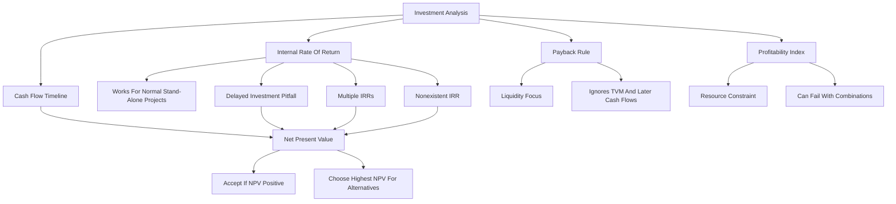

# Session 03-04: Investment Analysis

Source file: `finance-and-investment-management/raw/IuF_0304_SS2026_Investment_Analysis_Update NEU.pdf`
Lecture folder: `finance-and-investment-management/`
Date processed: 2026-05-16

## High-Yield 80/20 Summary

Investment analysis asks whether a project creates value. The central rule is NPV. IRR, payback, and profitability index can be useful, but each can mislead under specific conditions. If rules conflict, the NPV rule wins because it measures value created in money today.

Core exam logic:

1. Draw the cash-flow timeline.
2. Discount every cash flow to the same date.
3. Compute NPV.
4. Accept positive NPV stand-alone projects.
5. For mutually exclusive projects, choose the highest NPV.
6. Use IRR carefully only for normal stand-alone projects.

## Cash Flow Timeline

A cash-flow timeline prevents timing mistakes. Cash flows at different dates cannot be directly compared; they must be discounted or compounded to the same point in time.

This connects directly to the exercise track on interest calculation and annuities.

Investment analysis is the continuation of the cash-flow calculation logic:

```text
single cash flow PV/FV -> repeated cash flows -> project cash-flow timeline -> NPV / IRR / payback / PI
```

The new question is not only "what is this cash flow worth today?" but "does the whole project create enough value to accept it?"

For the specific naming trap between lecture sessions and exercises, see the bridge note: `annuity-bridge-to-investment-analysis.md`. The short rule is: Exercise 03-04 teaches annuity calculation as a mathematical-basics tool; Lecture Session 03-04 teaches Investment Analysis as a project decision framework. Annuity formulas feed NPV when project cash flows repeat, grow, or continue indefinitely.

## Net Present Value

Definition:

```text
NPV = PV(Benefits) - PV(Costs) = PV(All Project Cash Flows)
NPV = sum from t=0 to T of CF_t / (1+r)^t
```

Variables:

- `CF_t` = cash flow in period `t`.
- `r` = appropriate discount rate / cost of capital.
- `T` = project horizon.

Decision rule:

- Accept stand-alone projects with `NPV > 0`.
- Reject stand-alone projects with `NPV < 0`.
- For alternatives, select the project with the highest NPV.

Interpretation: accepting a project with NPV = EUR 100 is equivalent to receiving EUR 100 today.

Example from slides:

A project costs USD 250 million and generates USD 35 million per year forever.

```text
NPV = -250 + 35/r
```

At `r = 10%`, `NPV = -250 + 350 = 100`, so accept.

## Clarification: NPV, IRR, Cost Of Capital, And Discount Rate

### Comparison Frame

| Metric | What it means | Unit | Who chooses it? | Decision use |
|---|---|---:|---|---|
| NPV | Value created today after all cash flows are discounted at the required return. | Money, e.g. EUR | Calculated from cash flows and discount rate | Accept if positive; choose highest NPV among mutually exclusive projects. |
| IRR | Break-even return rate implied by the project cash flows; the discount rate that makes NPV zero. | Percent | Solved from the project cash flows | Useful support rule for normal stand-alone projects. |
| Cost of capital | Required return investors/lenders demand for financing a project with this risk. | Percent per period | Estimated externally from financing cost, opportunity cost, and risk | Usually used as the discount rate in NPV. |
| Discount rate | Rate used to translate future cash flows into today's money. | Percent per period | Chosen for the risk and time period of the cash flows | Converts future cash flows into present values. |

NPV answers: "How many euros of value does this project add today, after compensating for time and risk?"

IRR answers: "What return rate would make me exactly indifferent, with NPV equal to zero?"

Cost of capital is not the initial investment amount. The initial investment is a euro cash outflow, such as `CF_0 = -1,000`. The cost of capital is a percentage hurdle rate, such as `10%`, because it measures the return required by capital providers.

Real-life cost-of-capital example:

```text
60% bank loan at 6%
40% equity investors requiring 16%

Weighted required return = 0.60 x 6% + 0.40 x 16% = 10%
```

If a project with this risk earns less than 10%, capital providers are not compensated enough. Therefore 10% becomes the discount rate for the NPV calculation.

### Where IRR Comes From

IRR is not chosen by the manager. It is solved from the cash-flow timeline.

For a one-year project:

```text
CF_0 = -100
CF_1 = +112

0 = -100 + 112 / (1+IRR)
100 = 112 / (1+IRR)
1+IRR = 112/100 = 1.12
IRR = 12%
```

At a 12% discount rate, the project has exactly zero NPV. If the cost of capital is 10%, the NPV is positive. If the cost of capital is 15%, the NPV is negative.

High-yield wording:

```text
NPV tells me how much value the investment creates today.
IRR tells me the break-even return rate implied by the project cash flows.
If they conflict, I trust NPV.
```

## Internal Rate Of Return

Definition:

```text
IRR is the discount rate that makes NPV = 0.
0 = sum from t=0 to N of CF_t / (1+IRR)^t
```

Basic IRR rule:

- Accept if `IRR > cost of capital`.
- Reject if `IRR < cost of capital`.

This works reliably for normal stand-alone projects: one initial negative cash flow followed by positive cash flows.

## IRR Pitfalls

### Pitfall 1: Delayed Investments

If benefits arrive before costs, NPV can increase with the discount rate. The IRR rule can reverse the decision.

Normal project intuition is: invest now, receive cash later. A higher discount rate makes later benefits less valuable, so NPV usually falls.

Delayed investment reverses the timing: receive cash now, pay costs later. A higher discount rate makes later costs less painful, so NPV can rise when the discount rate rises. This breaks the simple "accept if IRR > cost of capital" intuition.

Book-deal example:

- Receive USD 1,000,000 now.
- Give up USD 500,000 per year for three years.
- Opportunity cost = 10%.

NPV:

```text
NPV = 1,000,000 - 500,000/1.1 - 500,000/1.1^2 - 500,000/1.1^3 = -243,426
```

NPV says reject, even if IRR may appear attractive.

### Pitfall 2: Multiple IRRs

If cash-flow signs change more than once, there can be multiple IRRs.

Example structure:

```text
+550,000, -500,000, -500,000, -500,000, +1,000,000
```

The slides report two IRRs: 7.164% and 33.673%. Because more than one IRR exists, the IRR rule cannot be applied cleanly.

Exam rule: more than one sign change means more than one NPV crossing may exist. Do not force one IRR into the decision. Use NPV at the relevant cost of capital.

### Pitfall 3: Nonexistent IRR

Some cash-flow patterns never cross zero NPV. Then no IRR exists.

Exam rule: if IRR is ambiguous, multiple, nonexistent, or conflicts with NPV, follow NPV.

## Mutually Exclusive Projects

When only one project can be chosen, projects are mutually exclusive.

- NPV rule: choose highest NPV.
- IRR rule: choosing highest IRR may be wrong.

Reasons IRR may mislead:

- Different project scale: a small project can have high percentage return but low euro value creation.
- Different timing: earlier/later cash flows change IRR differently than NPV.
- Different risk: a high IRR may still be unattractive if the cost of capital is also high.

Example from slides:

| Project | Initial Investment | Year 1 Cash Flow | Growth | Cost of Capital | IRR | NPV |
|---|---:|---:|---:|---:|---:|---:|
| Bookstore | 300,000 | 63,000 | 3% | 8% | 24% | 960,000 |
| Coffee shop | 400,000 | 80,000 | 3% | 8% | 23% | 1,200,000 |

IRR favors the bookstore; NPV favors the coffee shop. If the goal is value creation, choose the coffee shop.

## Payback Rule

Definition:

```text
Payback Period = time required to recover initial investment
```

Rule: accept if payback period is below a chosen threshold.

Example:

| Project | Cost | Annual Cash Flow | Payback |
|---|---:|---:|---:|
| A | 80 | 25 | 3.2 years |
| B | 120 | 30 | 4.0 years |
| C | 150 | 35 | 4.29 years |

Shortcomings:

- Ignores time value of money.
- Ignores cash flows after payback.
- Uses arbitrary cutoff.

Managerial interpretation: firms may use payback because liquidity risk matters, but it is not a value-maximization rule.

### What The Payback Criticisms Mean

**Ignores time value of money** means simple payback treats EUR 100 in year 1 and EUR 100 in year 3 as equally useful for recovering the investment. In NPV logic, the year-3 cash flow is worth less today because it arrives later and is riskier.

**Ignores cash flows after payback** means a project can look good because it recovers the initial investment quickly, even if it destroys value later or misses much larger later benefits.

Example:

| Project | Cash Flows | Simple Payback | Problem |
|---|---|---:|---|
| A | `-100, +100, +0, +0` | 1 year | Fast recovery, but no later value. |
| B | `-100, +40, +40, +140` | Between years 2 and 3 | Slower recovery, but much larger total value. |

**Arbitrary cutoff** means the accept/reject threshold is chosen without valuation logic. If management says "accept only if payback is under 2 years", a project paying back in 2.1 years may be rejected even when its NPV is strongly positive.

## Profitability Index

Definition:

```text
Profitability Index = Value Created / Resource Consumed = NPV / Resource Consumed
```

Use: ranking projects when there is one binding resource constraint, such as limited engineers or capital.

Rule: choose projects with highest PI subject to the resource constraint.

Limitations:

- Can leave unused resources even if a low-PI project would still add NPV.
- Requires checking combinations to maximize total NPV.
- Breaks down under multiple resource constraints.

## Real-Life Example

A company with 10 engineers can build either a small software feature with 80% IRR and EUR 100k NPV or a larger platform product with 35% IRR and EUR 2m NPV. IRR sounds better for the small feature, but if the company wants to maximize value and has enough resources, NPV points to the platform.

## Worked Clarification Examples

### Example 1: Normal Stand-Alone Project

Project: buy a machine for EUR 1,000 and receive EUR 450 at the end of each of the next three years. Cost of capital = 10%.

```text
NPV = -1,000 + 450/1.10 + 450/1.10^2 + 450/1.10^3
NPV = -1,000 + 409.09 + 371.90 + 338.09
NPV = 119.08
```

Interpretation: after paying investors their required 10% return, the project still creates EUR 119.08 today. Accept.

The IRR is about 16.7%. Interpretation: the project can tolerate a discount rate up to about 16.7% before NPV becomes zero. Since `16.7% > 10%`, IRR also says accept.

### Example 2: One-Year IRR Calculation

```text
CF_0 = -100
CF_1 = +112
Cost of capital = 10%

NPV = -100 + 112/1.10 = 1.82
IRR = 112/100 - 1 = 12%
```

Interpretation: positive NPV means value creation. IRR means the project breaks even at 12%. Because the required return is only 10%, the project clears the hurdle.

### Example 3: Mutually Exclusive Scale Conflict

| Project | Cash Flows | IRR | NPV at 10% |
|---|---|---:|---:|
| A | `-100, +140` | 40% | 27.27 |
| B | `-1,000, +1,250` | 25% | 136.36 |

IRR favors A because A has the higher percentage return. NPV favors B because B creates more euros of value. If only one can be chosen and the firm can finance either project, choose B.

## Exam Decision Tree

1. Is the project stand-alone?
   - If yes, calculate NPV and accept if positive.
2. Are projects mutually exclusive?
   - Choose highest NPV.
3. Is IRR requested?
   - Check whether cash flows are normal.
4. Are there sign changes more than once?
   - Multiple/nonexistent IRR possible; use NPV.
5. Is there a resource constraint?
   - PI can help rank, but verify total NPV combination.
6. Is liquidity/payback requested?
   - Calculate payback but state its limitations.

## Common Mistakes

- Treating IRR as always superior because it is a percentage.
- Comparing projects of different scale using IRR.
- Forgetting `CF_0` in the NPV formula.
- Using the wrong discount rate for risk level.
- Ignoring cash flows after payback.
- Treating PI as exact under multiple constraints.

## Practice Questions

1. A project costs 1,000 and pays 450 for 3 years. At 10%, should you accept?
   - Answer guide: NPV = -1000 + 450/1.1 + 450/1.1^2 + 450/1.1^3. Accept if positive.
2. Why can IRR fail with non-normal cash flows?
   - Answer: multiple sign changes can create multiple or nonexistent roots.
3. A small project has IRR 40% and NPV 20; a large project has IRR 15% and NPV 500. Which creates more value?
   - Answer: the large project, if mutually exclusive and feasible, because NPV is higher.
4. When is profitability index useful?
   - Answer: ranking projects under a binding resource constraint, but combinations must be checked.

## Mermaid Knowledge Map



## Subject Knowledge Graph

| Node | Meaning |
|---|---|
| Cash-flow timeline | Timing structure of project cash flows |
| NPV | Present value of all project cash flows |
| Cost of capital | Risk-adjusted discount rate |
| IRR | Discount rate that sets NPV to zero |
| Normal cash flows | Negative initial cash flow followed by positives |
| Mutually exclusive projects | Only one project can be chosen |
| Payback period | Time to recover initial investment |
| Profitability index | NPV per constrained resource |

| From | Relationship | To |
|---|---|---|
| Cash-flow timeline | prevents | timing errors |
| NPV | measures | value created today |
| Positive NPV | leads to | accept project |
| IRR | equals | break-even discount rate |
| Non-normal cash flows | cause | IRR pitfalls |
| Mutually exclusive projects | require | highest NPV rule |
| Payback | emphasizes | liquidity recovery |
| Payback | ignores | time value of money |
| Profitability index | ranks | projects under constraint |
| Multiple constraints | weaken | profitability index |

## Links

- Related exercise note: `finance-and-investment-management/wiki/exercise-01-02-interest-calculation/exercise-01-02-interest-calculation.md`
- Bridge note: `finance-and-investment-management/wiki/session-03-04-investment-analysis/annuity-bridge-to-investment-analysis.md`
- Related exercise note: `finance-and-investment-management/wiki/exercise-03-04-annuities/exercise-03-04-annuities.md`
- Related logistics: `finance-and-investment-management/wiki/_course-logistics.md`
