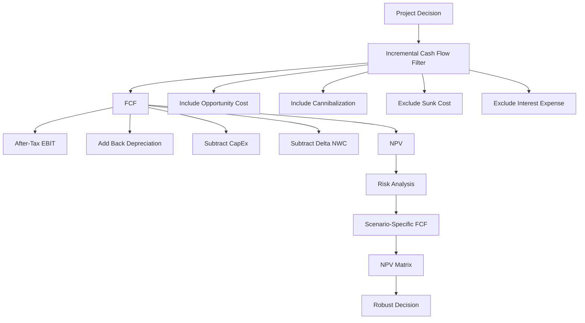

# Ubiquitous Language: Session 05-06 Capital Budgeting

Source note: `session-05-06-capital-budgeting.md`
Course: Finance and Investment Management
Definition sources: local lecture deck and generated topic note; enriched with standard corporate-finance usage for standalone exam language.

This file is the terminology and formula companion for capital budgeting. It picks canonical terms, flags aliases that cause exam mistakes, and gives compact decision language.

## Project Cash-Flow Language

| Term | Definition | Aliases to avoid |
|---|---|---|
| **Capital Budgeting** | The process of forecasting project cash flows and deciding whether an investment creates value. | budgeting only, cost planning only |
| **Capital Budget** | The list of investments a company plans to undertake. | capital budgeting process |
| **Free Cash Flow** | Incremental cash from the project available to capital providers after taxes, operating needs, CapEx, and working-capital changes. | accounting profit, EBIT |
| **FCF To The Firm** | Cash flow available to all providers of capital: equity, debt, and preferred stock. | FCFE |
| **FCF To Equity** | Cash flow available only to common equity holders after debt-related effects. | project FCF |
| **Incremental Cash Flow** | Cash flow that changes because the project is accepted. | all related-looking costs |
| **Project Timeline** | The dated sequence of outflows and inflows used for discounting. | list of numbers |
| **Business Assumption** | An operating estimate such as volume, price, unit cost, useful life, or collection period that drives the project forecast. | cash flow itself |
| **Forecast Input** | A quantified business or investment assumption used to construct FCF. | final valuation |
| **Base-Case FCF** | The project's most likely incremental cash flow after all known adjustments are included. | guaranteed cash flow |

## FCF Formula Language

| Term | Definition | Aliases to avoid |
|---|---|---|
| **Revenue** | Cash inflow from project sales before costs and taxes. | profit |
| **Operating Cost** | Cost caused by producing or selling the project output, before financing costs. | interest expense |
| **EBIT** | Earnings before interest and taxes; accounting operating profit before financing. | free cash flow |
| **Corporate Tax Rate** | The marginal tax rate applied to incremental taxable operating income. | average total tax burden |
| **Depreciation** | Non-cash allocation of an asset's cost over its accounting life. | cash expense |
| **Depreciation Tax Shield** | Tax saving created because depreciation reduces taxable income; formula: `tax rate x depreciation`. | depreciation cash inflow |
| **CapEx** | Cash outflow for long-term assets such as equipment, buildings, or systems. | depreciation |
| **Net Working Capital** | Operating current assets minus operating current liabilities. | total capital |
| **Delta NWC** | Change in net working capital from one period to the next; this is what enters FCF. | NWC level |
| **Working-Capital Investment** | Cash tied up because the project needs more inventory or receivables net of supplier financing. | accounting profit |

Cheat-sheet formula:

```text
FCF = (Revenue - Cost - Depreciation) x (1 - tau_c)
      + Depreciation - CapEx - Delta NWC
```

Equivalent intuition:

```text
Start with after-tax operating profit,
add back non-cash depreciation,
subtract real investment cash outflows,
subtract cash tied up in working capital.
```

Decision chain:

```text
Business assumptions -> incremental filter -> FCF -> NPV -> risk analysis
```

FCF is the cash result of the forecast. It is not identical to the complete forecasting process, and it is not calculated after NPV.

Incremental identity:

```text
Project incremental FCF = company FCF with project - company FCF without project
```

## Inclusion And Exclusion Language

| Term | Definition | Aliases to avoid |
|---|---|---|
| **Sunk Cost** | Cost already paid or unavoidable regardless of the current accept/reject decision. | investment cost |
| **Opportunity Cost** | Value lost by using a resource in the project instead of its best alternative use. | free resource |
| **Project Externality** | Indirect project effect on another activity of the firm. | unrelated side effect |
| **Cannibalization** | Negative externality where a new product reduces sales of an existing product. | market growth |
| **Overhead** | Shared fixed cost; include only if the project changes it. | always incremental |
| **Interest Expense** | Financing cost of debt; normally excluded from project FCF when discounting with WACC. | operating cost |

Canonical rule:

```text
Include only incremental operating cash flows.
Exclude sunk costs and financing cash flows.
Include opportunity costs and externalities.
```

## Risk-Analysis Language

| Term | Definition | Aliases to avoid |
|---|---|---|
| **Break-Even Analysis** | Finds the input value that makes project NPV equal zero. | worst-case analysis |
| **Sensitivity Analysis** | Changes one assumption at a time while holding others constant. | scenario analysis |
| **Scenario Analysis** | Changes multiple assumptions together in a coherent case. | sensitivity analysis |
| **Base Case** | Most likely forecast case used as the central valuation. | guaranteed outcome |
| **Worst Case** | Coherent downside set of assumptions. | one bad variable only |
| **Best Case** | Coherent upside set of assumptions. | one optimistic variable only |
| **Known Adjustment** | A cash-flow item that must be included to make the valuation complete, such as required NWC, after-tax salvage value, or cannibalization. | optional downside assumption |
| **Uncertain Assumption** | A forecast driver whose future value is not known, such as volume, price, cost, useful life, or salvage value. | known adjustment |
| **Scenario-Specific FCF** | The incremental FCF rebuilt from one coherent set of assumptions. | arbitrary percentage change |
| **NPV Matrix** | A comparison of alternative NPVs across downside, base, and upside scenarios. | one final correct NPV |
| **Ranking Stability** | Whether the same alternative remains preferred across reasonable assumptions. | guaranteed success |
| **Robust Decision** | A decision that considers value creation, downside exposure, and the credibility of the assumptions producing each NPV. | highest untested NPV |
| **Cost-Only NPV Comparison** | Comparison where all alternative cash-flow streams are costs; the preferable alternative has the less negative NPV. | always choose the most negative number |

## Alternative-Choice Language

| Term | Definition | Aliases to avoid |
|---|---|---|
| **Independent Projects** | Projects that can be accepted together; accept each positive-NPV project if constraints permit. | mutually exclusive projects |
| **Mutually Exclusive Alternatives** | Alternatives where choosing one prevents choosing another; normally choose the highest credible NPV. | independent projects |
| **Incremental NPV Between Alternatives** | NPV of the cash-flow differences created by choosing one alternative over another. | total NPV of the company |
| **Capital Rationing** | A binding investment-budget constraint requiring selection of the feasible project combination with the highest total NPV. | choose the highest individual NPV |

## HomeNet Worked-Case Anchors

| Case | Canonical result | Decision meaning |
|---|---|---|
| Completed feasibility study | Exclude USD 300,000 | Sunk cost does not change with today's decision |
| Lab opportunity cost | USD 200,000 pre-tax; USD 120,000 after tax per year | Owned space is not economically free |
| Cannibalization | 25,000 old-router sales displaced; USD 1.0m annual lost contribution | Include firm-wide cash effects caused by HomeNet |
| Adjusted HomeNet FCF | `-16,500; 5,100; 7,200; 7,200; 7,200; 2,700` | Complete earnings-to-cash translation |
| Adjusted HomeNet value | NPV approximately USD 5.027m at 12%; IRR 24.1% | Positive base-case value |
| Separate slide-32 drill | NPV USD 7.627m; IRR 27.9% | Do not combine this cash-flow stream with HomeNet |
| Outsource vs in-house | Cost NPVs `-19.510m` vs `-20.107m` | Outsourcing is cheaper because its NPV is less negative |
| Accelerated depreciation | HomeNet NPV approximately USD 5.34m | Earlier tax shields have higher PV |
| Pricing scenario | Current strategy NPV USD 5.027m is highest | Price and volume must be changed together |

## Worked Calculation Language

Every capital-budgeting calculation should show:

```text
Business story -> incremental filter -> FCF formula -> yearly arithmetic -> NPV -> managerial decision -> trap
```

Mini anchor:

```text
Revenue = 500,000
Operating cost = 300,000
Depreciation = 50,000
Tax rate = 30%
CapEx = 0 in this year
Delta NWC = +20,000

EBIT = 500,000 - 300,000 - 50,000 = 150,000
After-tax EBIT = 150,000 x (1 - 0.30) = 105,000
FCF = 105,000 + 50,000 - 0 - 20,000
FCF = EUR 135,000
```

Interpretation: the project produced EUR 135,000 of operating FCF for valuation before financing payments. Analogy: separate the factory engine from the loan contract that financed the factory. Trap: subtracting interest in FCF and also using WACC.

## Relationships

- **Capital Budgeting** uses **Free Cash Flow** as the input to **NPV**.
- **Business Assumptions** become **Forecast Inputs**, which are filtered into **Incremental Cash Flow** and translated into **Base-Case FCF**.
- **Free Cash Flow** is filtered by **Incremental Cash Flow** logic.
- **Depreciation** affects **Free Cash Flow** through the **Depreciation Tax Shield**.
- **CapEx** and **Delta NWC** are cash-flow adjustments, not accounting-profit adjustments.
- **Sunk Cost** is excluded, while **Opportunity Cost** is included.
- **Sensitivity Analysis** and **Scenario Analysis** both stress-test NPV, but the first isolates one variable and the second bundles assumptions.
- **Known Adjustments** complete the FCF model before **Uncertain Assumptions** are varied in risk analysis.
- An **NPV Matrix** shows **Ranking Stability**; it does not replace the NPV rule.
- **Mutually Exclusive Alternatives** are compared by highest credible NPV or by **Incremental NPV Between Alternatives**.
- A **Cost-Only NPV Comparison** reverses the visual intuition about negative numbers: the less negative cost NPV destroys less value.

## Redemptions Boundary

| Term | Definition | Aliases to avoid |
|---|---|---|
| **Operating Project FCF** | Incremental cash flow generated by the project's operations before financing. | loan repayment stream |
| **Financing Cash Flow** | Borrowing, interest, principal repayment, or distributions between the firm and capital providers. | operating cost |
| **Redemption Schedule** | Period-by-period split of loan debt service into interest and principal repayment. | project FCF forecast |
| **Financing Feasibility** | Ability to meet debt service when due after a project and financing mix are selected. | project value creation |
| **Weighted Average Cost Of Capital, WACC** | Weighted required return of debt and equity capital providers, normally used to discount operating project FCF of comparable risk. | loan interest rate, initial investment cost |
| **Cost Of Debt `r_D`** | Required return demanded by lenders; one component of WACC and the basis of contractual loan interest. | WACC |
| **Cost Of Equity `r_E`** | Expected return required by shareholders for bearing equity risk; an opportunity cost even without a contractual payment. | dividend rate only |
| **Financing Mix** | Proposed combination of debt, equity, and other capital used to fund an accepted or provisionally approved project. | redemption schedule |

Canonical bridge:

```text
Capital Budgeting values operating project FCF at WACC.
Redemptions schedules financing cash flows after borrowing.
```

Interest and principal repayments are excluded from project FCF under WACC valuation. A redemption schedule can still reveal liquidity risk after a positive-NPV project is selected.

```text
WACC = E/(D+E) x r_E + D/(D+E) x r_D x (1-tax rate)
```

WACC evaluates the combined required return of capital providers. A **Redemption Schedule** begins only after a specific debt amount, rate, maturity, and repayment pattern are proposed.

PV/NPV boundary in this bridge:

```text
PV  = value today of one future cash-flow stream.
NPV = PV of project benefits minus required investment/outflows.
```

Annuity-due or annuity-immediate changes the PV of a loan-payment stream inside **Redemptions**. It changes project NPV only if the project operating FCF timing itself changes; under WACC valuation, loan annuity payments remain outside operating project FCF.

## Positive Delta NWC: Asset Versus Cash

```text
Inventory   = EUR 20,000
Receivables = EUR 10,000
Payables    = EUR  5,000
NWC         = EUR 25,000
```

If opening NWC was zero, `Delta NWC = +EUR 25,000`. The balance sheet gained operating current assets, but EUR 25,000 of cash became tied up in unsold inventory and uncollected receivables net of supplier credit. Therefore FCF includes `-Delta NWC = -EUR 25,000`.

Canonical correction:

> A positive `Delta NWC` is not automatically bad accounting performance. It is an additional operating investment that consumes available cash now.

If the EUR 25,000 is recovered at project end, final-period `Delta NWC = -EUR 25,000`, which increases final FCF. Recovery later does not fully cancel the present-value cost of funding it earlier.

## Visual Memory Aid



## Example Dialogue

> **Student:** "The company already spent EUR 300,000 on research. Should I put it into the project NPV?"
>
> **Professor:** "No. That is a **Sunk Cost** if it is already paid and cannot be changed. The project decision must use **Incremental Cash Flow**."
>
> **Student:** "But if the project uses empty warehouse space, is that free?"
>
> **Professor:** "Not if it could be rented or used elsewhere. That is an **Opportunity Cost**, so it belongs in FCF."
>
> **Student:** "And interest expense?"
>
> **Professor:** "Do not subtract it inside project FCF when WACC is the discount rate. Financing cost is handled by the discount rate."

> **Student:** "If NWC rises, did the project not gain more assets?"
>
> **Professor:** "It gained inventory or receivables, but cash was converted into those operating assets. The positive **Delta NWC** is therefore subtracted from current FCF."
>
> **Student:** "Should I run scenarios first and add missing adjustments inside each scenario?"
>
> **Professor:** "First apply every **Known Adjustment** and build a complete base case. Then vary **Uncertain Assumptions**, rebuild scenario FCF, and compare the resulting **NPV Matrix**."

## Flagged Ambiguities

| Ambiguity | Canonical recommendation |
|---|---|
| "Cost" | Say **Operating Cost**, **CapEx**, **Sunk Cost**, or **Opportunity Cost** depending on the fact pattern. |
| "Profit" | Use **EBIT** for accounting operating profit and **Free Cash Flow** for valuation cash flow. |
| "Working capital" | Use **Delta NWC** in FCF; use **NWC** only for the level at a date. |
| "Risk analysis" | Name the method: **Break-Even**, **Sensitivity**, or **Scenario**. |
| "Tax effect" | Specify **tax on EBIT**, **depreciation tax shield**, or **interest tax shield**. |
| "Forecast" | Separate **Business Assumptions**, resulting **FCF**, and the final **NPV**. |
| "Higher assets mean higher cash" | Inventory and receivables can raise NWC while reducing available cash. |
| "Best alternative" | Specify independent, mutually exclusive, or capital-rationed choice before applying an NPV rule. |

## Exam Trap Corrections

| Trap | Correction |
|---|---|
| Including sunk R&D in the new project. | Past spending is irrelevant unless it changes because of the decision. |
| Ignoring opportunity cost because no invoice is paid. | Resource use has value even without a new cash payment. |
| Treating depreciation as cash. | Depreciation is non-cash; the cash benefit is the tax shield. |
| Subtracting interest expense in FCF and using WACC. | This double counts financing cost. |
| Using NWC instead of `Delta NWC`. | FCF uses the period-to-period change in operating working capital. |
| Calling sensitivity analysis a scenario. | Sensitivity = one variable; scenario = multiple assumptions together. |
| Treating FCF as a test performed after NPV. | Forecast incremental FCF first; NPV is calculated from those FCFs. |
| Treating positive `Delta NWC` as an FCF inflow because assets increased. | Additional inventory and receivables tie up cash; subtract positive `Delta NWC`. |
| Building scenarios before completing the base-case model. | Apply known adjustments first, then vary uncertain assumptions consistently. |
| Choosing the highest individual NPV under a binding budget. | Compare feasible project combinations and maximize total NPV. |
| Double-counting risk in both cash flows and the discount rate. | Explain whether risk is modeled through expected/scenario cash flows, the discount rate, or both for distinct risk components. |
| Choosing the more negative NPV in a cost-only comparison. | For two unavoidable cost alternatives, choose the less negative NPV. |
| Treating Exercise 05 Redemptions as the Capital Budgeting exercise. | They are independent tracks; use Redemptions only as a timeline, PV, and financing-feasibility bridge. |
| Subtracting loan interest or principal in project FCF under WACC. | Keep financing cash flows in the redemption schedule; WACC captures financing cost. |
| Treating WACC as the bank-loan rate. | The loan rate is the cost of debt; WACC combines debt and equity required returns. |
| Saying redemption chooses the financing source. | First choose the financing mix; redemption then models repayment of the proposed debt. |
| Assuming financing work can start only after an irreversible project decision. | Financing feasibility may be tested alongside final approval, while project value and debt service remain separate analyses. |

## Cheat-Sheet Language

```text
Capital budgeting is the project-cash-flow construction behind NPV.
FCF is not profit.
The exam filter is incremental: include what changes, exclude what does not.
WACC handles financing cost; FCF handles operating value creation.
Known adjustments complete the model; scenarios vary uncertainty.
A positive Delta NWC consumes cash now; a negative Delta NWC releases cash.
For mutually exclusive alternatives, choose the highest credible NPV.
For cost-only alternatives, the less negative NPV is cheaper.
Capital Budgeting values the project; Redemptions schedules the loan.
WACC is the weighted hurdle rate; the loan rate is only the debt component.
A positive NPV does not guarantee a feasible redemption schedule.
```
