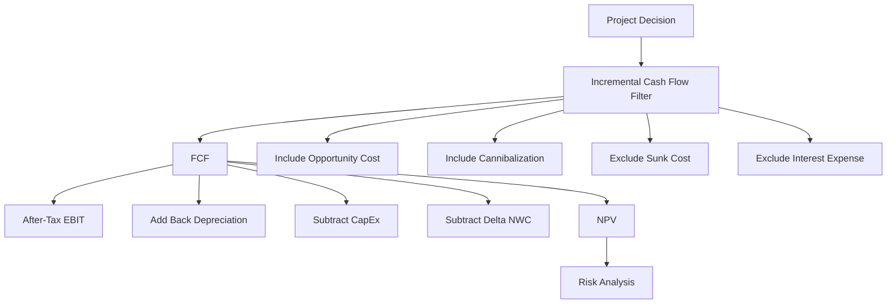

# Ubiquitous Language: Session 05-06 Capital Budgeting

Source note: `session-05-06-capital-budgeting.md`
Course: Finance and Investment Management
Definition sources: local lecture deck and generated topic note; enriched with standard corporate-finance usage for standalone exam language.

This file is the terminology and formula companion for capital budgeting. It picks canonical terms, flags aliases that cause exam mistakes, and gives compact decision language.

## Project Cash-Flow Language

| Term | Definition | Aliases to avoid |
|---|---|---|
| **Capital Budgeting** | The process of forecasting project cash flows and deciding whether an investment creates value. | budgeting only, cost planning only |
| **Capital Budget** | The list of investments a company plans to undertake. | capital budgeting process |
| **Free Cash Flow** | Incremental cash from the project available to capital providers after taxes, operating needs, CapEx, and working-capital changes. | accounting profit, EBIT |
| **FCF To The Firm** | Cash flow available to all providers of capital: equity, debt, and preferred stock. | FCFE |
| **FCF To Equity** | Cash flow available only to common equity holders after debt-related effects. | project FCF |
| **Incremental Cash Flow** | Cash flow that changes because the project is accepted. | all related-looking costs |
| **Project Timeline** | The dated sequence of outflows and inflows used for discounting. | list of numbers |

## FCF Formula Language

| Term | Definition | Aliases to avoid |
|---|---|---|
| **Revenue** | Cash inflow from project sales before costs and taxes. | profit |
| **Operating Cost** | Cost caused by producing or selling the project output, before financing costs. | interest expense |
| **EBIT** | Earnings before interest and taxes; accounting operating profit before financing. | free cash flow |
| **Corporate Tax Rate** | The marginal tax rate applied to incremental taxable operating income. | average total tax burden |
| **Depreciation** | Non-cash allocation of an asset's cost over its accounting life. | cash expense |
| **Depreciation Tax Shield** | Tax saving created because depreciation reduces taxable income; formula: `tax rate x depreciation`. | depreciation cash inflow |
| **CapEx** | Cash outflow for long-term assets such as equipment, buildings, or systems. | depreciation |
| **Net Working Capital** | Operating current assets minus operating current liabilities. | total capital |
| **Delta NWC** | Change in net working capital from one period to the next; this is what enters FCF. | NWC level |

Cheat-sheet formula:

```text
FCF = (Revenue - Cost - Depreciation) x (1 - tau_c)
      + Depreciation - CapEx - Delta NWC
```

Equivalent intuition:

```text
Start with after-tax operating profit,
add back non-cash depreciation,
subtract real investment cash outflows,
subtract cash tied up in working capital.
```

## Inclusion And Exclusion Language

| Term | Definition | Aliases to avoid |
|---|---|---|
| **Sunk Cost** | Cost already paid or unavoidable regardless of the current accept/reject decision. | investment cost |
| **Opportunity Cost** | Value lost by using a resource in the project instead of its best alternative use. | free resource |
| **Project Externality** | Indirect project effect on another activity of the firm. | unrelated side effect |
| **Cannibalization** | Negative externality where a new product reduces sales of an existing product. | market growth |
| **Overhead** | Shared fixed cost; include only if the project changes it. | always incremental |
| **Interest Expense** | Financing cost of debt; normally excluded from project FCF when discounting with WACC. | operating cost |

Canonical rule:

```text
Include only incremental operating cash flows.
Exclude sunk costs and financing cash flows.
Include opportunity costs and externalities.
```

## Risk-Analysis Language

| Term | Definition | Aliases to avoid |
|---|---|---|
| **Break-Even Analysis** | Finds the input value that makes project NPV equal zero. | worst-case analysis |
| **Sensitivity Analysis** | Changes one assumption at a time while holding others constant. | scenario analysis |
| **Scenario Analysis** | Changes multiple assumptions together in a coherent case. | sensitivity analysis |
| **Base Case** | Most likely forecast case used as the central valuation. | guaranteed outcome |
| **Worst Case** | Coherent downside set of assumptions. | one bad variable only |
| **Best Case** | Coherent upside set of assumptions. | one optimistic variable only |

## Relationships

- **Capital Budgeting** uses **Free Cash Flow** as the input to **NPV**.
- **Free Cash Flow** is filtered by **Incremental Cash Flow** logic.
- **Depreciation** affects **Free Cash Flow** through the **Depreciation Tax Shield**.
- **CapEx** and **Delta NWC** are cash-flow adjustments, not accounting-profit adjustments.
- **Sunk Cost** is excluded, while **Opportunity Cost** is included.
- **Sensitivity Analysis** and **Scenario Analysis** both stress-test NPV, but the first isolates one variable and the second bundles assumptions.

## Visual Memory Aid



## Example Dialogue

> **Student:** "The company already spent EUR 300,000 on research. Should I put it into the project NPV?"
>
> **Professor:** "No. That is a **Sunk Cost** if it is already paid and cannot be changed. The project decision must use **Incremental Cash Flow**."
>
> **Student:** "But if the project uses empty warehouse space, is that free?"
>
> **Professor:** "Not if it could be rented or used elsewhere. That is an **Opportunity Cost**, so it belongs in FCF."
>
> **Student:** "And interest expense?"
>
> **Professor:** "Do not subtract it inside project FCF when WACC is the discount rate. Financing cost is handled by the discount rate."

## Flagged Ambiguities

| Ambiguity | Canonical recommendation |
|---|---|
| "Cost" | Say **Operating Cost**, **CapEx**, **Sunk Cost**, or **Opportunity Cost** depending on the fact pattern. |
| "Profit" | Use **EBIT** for accounting operating profit and **Free Cash Flow** for valuation cash flow. |
| "Working capital" | Use **Delta NWC** in FCF; use **NWC** only for the level at a date. |
| "Risk analysis" | Name the method: **Break-Even**, **Sensitivity**, or **Scenario**. |
| "Tax effect" | Specify **tax on EBIT**, **depreciation tax shield**, or **interest tax shield**. |

## Exam Trap Corrections

| Trap | Correction |
|---|---|
| Including sunk R&D in the new project. | Past spending is irrelevant unless it changes because of the decision. |
| Ignoring opportunity cost because no invoice is paid. | Resource use has value even without a new cash payment. |
| Treating depreciation as cash. | Depreciation is non-cash; the cash benefit is the tax shield. |
| Subtracting interest expense in FCF and using WACC. | This double counts financing cost. |
| Using NWC instead of `Delta NWC`. | FCF uses the period-to-period change in operating working capital. |
| Calling sensitivity analysis a scenario. | Sensitivity = one variable; scenario = multiple assumptions together. |

## Cheat-Sheet Language

```text
Capital budgeting is the project-cash-flow construction behind NPV.
FCF is not profit.
The exam filter is incremental: include what changes, exclude what does not.
WACC handles financing cost; FCF handles operating value creation.
```
