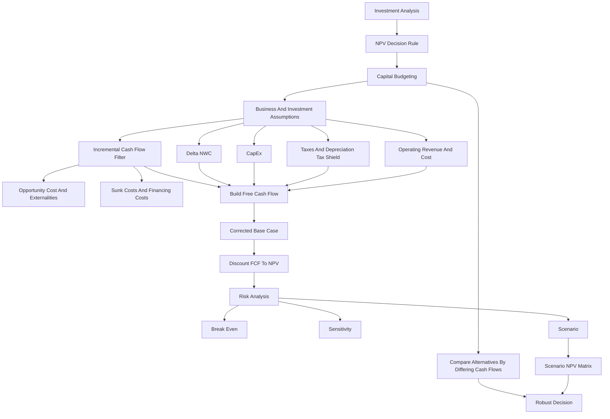

# Session 05-06: Capital Budgeting

Source file: `finance-and-investment-management/raw/moodle-export-investment-and-financial-management-950881761-s26-20260604/Investment and  950881761 (S26)_2026064_1514/CW 22  26.05. _ 27.05./Lecture 0506 Capital Budgeting.pdf`
Lecture folder: `finance-and-investment-management/`
Date processed: 2026-06-06
Course position: Corporate Finance lecture, sessions 05+06, following Investment Analysis.

## High-Yield 80/20 Summary

Capital budgeting turns the NPV rule into a full project-evaluation workflow. Investment Analysis said "accept positive NPV"; this lecture asks "which cash flows belong in the NPV calculation?"

Core exam logic:

1. Forecast only incremental project cash flows.
2. Build free cash flow, not accounting profit.
3. Exclude financing cash flows such as interest expense when WACC already captures financing cost.
4. Include opportunity costs, project externalities, CapEx, depreciation tax shields, changes in net working capital, and after-tax terminal values.
5. Compare mutually exclusive alternatives by the cash flows that differ.
6. Test risk with break-even, sensitivity, and scenario analysis.

The high-yield mental model:

```text
Investment Analysis = decision rule
Capital Budgeting = cash-flow construction behind the decision rule
```

Clarification bridge:

```text
Business assumptions
-> incremental cash-flow filter
-> project FCF by period
-> discount at the project-appropriate rate
-> base-case NPV
-> sensitivity, break-even, and scenario NPVs
-> robust investment decision
```

NPV is therefore not calculated first and then supported by an unrelated cash-flow forecast. The forecasted incremental FCF is the input from which NPV is calculated. Risk analysis then asks whether the preferred NPV remains credible when uncertain assumptions change.

## Free Cash Flow

Free cash flow is the incremental cash generated by a project that is available to all capital providers. The lecture distinguishes:

| Cash-flow concept | Meaning | Decision use |
|---|---|---|
| Free cash flow to the firm, FCF | Cash available to debt, equity, and preferred stockholders | Used for project valuation with WACC or unlevered cost of capital |
| Free cash flow to equity, FCFE | Cash available only to common equity holders | Used for equity-specific valuation |

For project capital budgeting in this lecture, the main object is FCF to the firm.

Direct formula:

```text
FCF = (Revenue - Cost - Depreciation) x (1 - tau_c)
      + Depreciation - CapEx - Delta NWC

Equivalent:

FCF = (Revenue - Cost) x (1 - tau_c)
      - CapEx - Delta NWC + tau_c x Depreciation
```

Variables:

- `tau_c` = corporate tax rate.
- `CapEx` = capital expenditures, actual cash outflows for long-term assets.
- `Delta NWC` = change in net working capital.
- `tau_c x Depreciation` = depreciation tax shield.

Interpretation: depreciation is not a cash outflow, but it reduces taxable income, so it creates a cash benefit through lower taxes.

### Where FCF Sits In The Forecast

The forecast begins as an operating story and ends as a dated cash-flow series:

| Forecast layer | Example question | Output |
|---|---|---|
| Business assumptions | How many units will be sold, at what price, and with what operating cost? | Revenue and cost forecast |
| Investment assumptions | What equipment, inventory, receivables, and supplier credit are needed? | CapEx and `Delta NWC` forecast |
| Tax and accounting translation | What is EBIT, tax, depreciation, and the depreciation tax shield? | After-tax operating effects |
| Project cash result | How much cash does the decision create or consume in each period? | Incremental project FCF |
| Valuation | What are those FCFs worth today at the appropriate required return? | NPV |

FCF is therefore the cash result of the forecast, not the complete forecasting process. NPV discounts the resulting FCFs; it does not directly discount revenue, accounting profit, or balance-sheet assets.

## FCF From Earnings

The slide route from earnings is:

```text
EBIT
- adjusted tax expense
+ depreciation
+/- change in net operating working capital
= cash flow from operations
+ cash flow from investments, usually negative CapEx
= free project cash flow
```

Exam trap: accounting earnings and free cash flow are not the same. Earnings include non-cash expenses and exclude some cash investments. FCF corrects those timing and cash/non-cash differences.

## Incremental Cash Flow Rules

The word incremental is the gatekeeper. A cash flow belongs in the project only if it changes because the project is accepted.

Canonical comparison:

```text
Incremental project cash flow
= company cash flow with the project
- company cash flow without the project
```

Example: if company FCF would be EUR 1,000,000 without a project and EUR 1,150,000 with it, the project's incremental FCF is EUR 150,000. The NPV calculation uses the EUR 150,000 difference, not the company's total EUR 1,150,000.

The added value of the incremental filter is causal accuracy: it isolates the financial consequence of saying yes to the project. It prevents existing company cash flows, past spending, and unchanged overhead from contaminating the decision while still capturing opportunity costs and cannibalization.

| Include? | Item | Reason |
|---|---|---|
| Include | Revenue and operating costs caused by the project | They are incremental operating effects |
| Include | Opportunity cost | A resource used by the project could have earned value elsewhere |
| Include | Cannibalization / project externalities | The project can reduce profits of existing products |
| Include | CapEx | Actual cash spent to buy long-term assets |
| Include | Delta NWC | Project may tie up or release cash through inventory, receivables, payables |
| Include | Tax effects of depreciation | Depreciation reduces taxes even though it is non-cash |
| Exclude | Sunk costs | Already paid or unavoidable regardless of the project |
| Exclude | Interest expense | Financing cost is captured in the discount rate; including it in FCF double counts |
| Usually exclude | Fixed overhead not changed by the project | Not incremental |

### Interest Expense Double Counting

Interest expense is normally not subtracted inside project FCF when the project is valued using WACC.

Reason:

```text
WACC already includes the cost of debt and equity financing.
Subtracting interest in FCF and discounting by WACC counts financing cost twice.
```

Correct exam wording: judge the project on operating cash flows first; capture financing cost in the discount rate.

### What WACC Actually Means

**WACC** means **Weighted Average Cost of Capital**. It is the weighted required return demanded by the providers of debt and equity used to finance assets with comparable risk.

```text
WACC = E/(D+E) x r_E
       + D/(D+E) x r_D x (1 - tax rate)
```

Where:

- `E` = market value of equity financing
- `D` = market value of debt financing
- `r_E` = shareholders' required return
- `r_D` = lenders' required return before tax
- `(1 - tax rate)` = adjustment for the tax deductibility of interest under the standard formula

Example:

```text
60% debt costing 6%
40% equity requiring 16%

Pre-tax illustration:
WACC = 0.60 x 6% + 0.40 x 16%
     = 3.6% + 6.4%
     = 10.0%
```

If the same example includes a 25% corporate tax rate, the debt component is after-tax:

```text
After-tax debt cost = 6% x (1 - 25%)
                    = 4.5%

After-tax WACC = 0.60 x 4.5% + 0.40 x 16%
               = 2.7% + 6.4%
               = 9.1%
```

WACC is not the initial project cost and it is not a forecasted cash flow. It is the percentage hurdle used to translate project FCF into present value:

```text
Operating assumptions -> incremental FCF -> discount at WACC -> NPV
```

The decision meaning is:

> Does the project generate enough operating cash value to compensate debt and equity providers for time and risk?

A higher risk-appropriate WACC reduces the present value of the same FCF stream. The firm's general WACC should be used only when the project has risk comparable to the assets underlying that WACC; otherwise use a project-specific required return.

#### WACC Versus The Loan Interest Rate

| Rate | Whose requirement? | Main use |
|---|---|---|
| Loan interest rate | Lender only | Calculate interest and the redemption schedule |
| Cost of equity | Shareholders only | Required return on equity risk |
| WACC | Debt and equity providers together | Discount operating FCF to project NPV |

The loan rate is therefore one input into WACC, not a substitute for WACC when the project is funded by both debt and equity.

### Tax Losses

If the project has a loss, the tax treatment depends on the firm:

- A profitable firm can often offset the project loss against other taxable income, creating a tax credit.
- A non-profitable firm may need a tax carryforward or carryback.

Example logic from the slides: if a EUR 20 million project loss reduces taxable income and the tax rate is 25%, the tax saving is EUR 5 million.

## Net Working Capital

Net working capital measures short-term operating cash tied up in the project.

```text
NWC = current assets - current liabilities
NWC = cash + inventory + receivables - payables
Delta NWC_t = NWC_t - NWC_(t-1)
```

Project implication:

- More inventory or receivables ties up cash: `Delta NWC > 0`, reducing FCF.
- More payables can temporarily finance operations: `Delta NWC < 0`, increasing FCF.
- Working capital is often recovered near the end of the project, increasing final-period FCF.

### Why Positive Delta NWC Reduces FCF

A higher operating NWC level can mean that the project owns more current assets, but those assets are not the same as available cash. Inventory is cash converted into unsold goods, and receivables are sales not yet collected. Payables preserve cash because suppliers are temporarily financing the operation.

Example:

```text
Inventory   = EUR 20,000
Receivables = EUR 10,000
Payables    = EUR  5,000

NWC = 20,000 + 10,000 - 5,000 = EUR 25,000
```

If the project started from zero NWC, `Delta NWC = +EUR 25,000`. The project has tied EUR 25,000 up in operations, so current FCF falls by EUR 25,000. If all inventory and receivables are converted to cash and suppliers are settled when the project ends, `Delta NWC = -EUR 25,000` in the final period and FCF rises by EUR 25,000.

| Change | Cash interpretation | FCF effect |
|---|---|---:|
| Inventory increases | Cash is tied up in unsold goods | Negative |
| Receivables increase | Revenue is booked but cash is not collected | Negative |
| Payables increase | Suppliers provide temporary operating finance | Positive |
| Inventory or receivables decrease | Operating assets are converted back to cash | Positive |
| Payables decrease | Suppliers are paid | Negative |

Even when working capital is recovered later, paying cash today and recovering it later reduces NPV because of the time value of money.

Exam trap: do not use the level of NWC directly unless the question asks for it. FCF uses the change in NWC.

## Choosing Among Alternatives

For mutually exclusive investment opportunities, choose the alternative with the highest NPV.

For operational alternatives such as outsourcing versus in-house production:

```text
Only include cash-flow components that differ between the alternatives.
```

The HomeNet manufacturing example compares:

- lower unit cost from in-house production,
- extra upfront facility change,
- different inventory/payables effects,
- and the resulting NPV difference.

The slides conclude that outsourcing is less expensive in that setup.

### Alternative-Choice Router

| Decision structure | Rule | Example |
|---|---|---|
| Independent projects | Accept every project with positive NPV if financing and operating capacity permit | A warehouse system and an unrelated product launch can both be undertaken |
| Mutually exclusive alternatives | Choose the highest credible NPV | The factory needs either Machine A or Machine B, not both |
| Capital rationing | Choose the feasible project combination with the highest total NPV | A fixed EUR 100,000 budget can fund A alone or B plus C |

### Machine A Versus Machine B

Assume the factory needs exactly one machine and the first complete base-case forecast gives:

|  | Machine A | Machine B |
|---|---:|---:|
| Initial investment | EUR 100,000 | EUR 70,000 |
| Annual FCF for three years | EUR 45,000 | EUR 32,000 |
| NPV at 10% | EUR 11,908 | EUR 9,579 |

Calculation route:

```text
NPV_A = -100,000 + 45,000/1.10 + 45,000/1.10^2 + 45,000/1.10^3
NPV_A = -100,000 + 40,909 + 37,190 + 33,809
NPV_A = EUR 11,908

NPV_B = -70,000 + 32,000/1.10 + 32,000/1.10^2 + 32,000/1.10^3
NPV_B = -70,000 + 29,091 + 26,446 + 24,042
NPV_B = EUR 9,579
```

The base-case rule selects Machine A because it creates EUR 2,329 more value today. The same conclusion can be expressed through incremental comparison:

```text
Choose A instead of B:
additional initial outflow = -EUR 30,000
additional annual FCF      = +EUR 13,000 for three years
incremental NPV            = +EUR 2,329
```

The positive incremental NPV means that upgrading from B to A creates additional value. However, this ranking is only credible if both alternatives use complete incremental FCF forecasts and risk-appropriate discount rates.

When alternatives have identical revenue, include revenue in the full model if useful, but it cancels from the incremental comparison. Focus the comparison on cash flows that differ, such as equipment cost, operating cost, inventory, maintenance, tax effects, and salvage value.

## Further Adjustments To FCF

Additional items that can matter:

| Adjustment | Treatment |
|---|---|
| Amortization | Add back if it is non-cash and already reduced earnings |
| Timing inside year | Discount cash flows according to actual timing if required |
| Accelerated depreciation | Changes the timing of tax shields; earlier shields are more valuable |
| Liquidation / salvage value | Include after-tax proceeds when assets are sold |
| Terminal / continuation value | Include market value of future FCF beyond explicit forecast horizon |
| Tax loss carryforwards / carrybacks | Include when losses can offset taxable income in nearby periods |

### Known Adjustments Before Risk Analysis

Further adjustments and risk analysis have different jobs:

```text
Known adjustment = complete or correct the FCF model
Risk analysis    = vary uncertain assumptions inside that complete model
```

For example, suppose Machine A requires EUR 10,000 of additional inventory at `t=0`, recovered at the end of year 3:

```text
NPV effect of NWC = -10,000 + 10,000 / 1.10^3
                  = -EUR 2,487

Corrected Machine A NPV = 11,908 - 2,487
                        = EUR 9,421
```

Machine B's NPV of EUR 9,579 is now slightly higher. The working-capital adjustment changed the decision because the original FCF forecast was incomplete.

## Risk Analysis

Capital budgeting forecasts are uncertain. The lecture uses three risk checks:

| Method | What changes? | Question answered |
|---|---|---|
| Break-even analysis | Find the parameter value that makes NPV zero | "How bad can this assumption get before value disappears?" |
| Sensitivity analysis | Change one assumption at a time | "Which single input drives NPV most?" |
| Scenario analysis | Change several assumptions together | "What happens in a coherent best/base/worst case?" |

Exam trap: sensitivity analysis is not the same as scenario analysis. Sensitivity isolates one variable; scenario analysis bundles a set of consistent assumptions.

### From Corrected FCF To An NPV Matrix

Use this evaluation order:

```text
1. Apply all known adjustments to every alternative.
2. Build the complete base-case FCF for each period.
3. Calculate the corrected base-case NPV.
4. Identify genuinely uncertain assumptions.
5. Rebuild FCF under sensitivity or coherent scenarios.
6. Calculate scenario-specific NPVs.
7. Compare value, downside, and ranking stability.
```

Illustrative matrix after applying CapEx, tax, `Delta NWC`, opportunity-cost, cannibalization, and salvage-value logic consistently:

|  | Downside NPV | Base NPV | Upside NPV |
|---|---:|---:|---:|
| Machine A | -EUR 6,000 | EUR 9,421 | EUR 30,000 |
| Machine B | EUR 3,000 | EUR 9,579 | EUR 16,000 |

Interpretation:

- Machine A has greater upside but also value-destroying downside.
- Machine B has a slightly higher corrected base NPV and is more resilient.
- The ranking reverses across assumptions, so the decision is fragile and requires probability, strategic-fit, financing-capacity, and risk-tolerance judgment.
- Risk analysis does not replace NPV. It produces several NPVs from several defensible cash-flow forecasts.

The discount rate can also be stress-tested when project risk or the appropriate comparable beta is uncertain. Do not mechanically raise both pessimistic cash-flow assumptions and the discount rate for the same risk without explaining the treatment, because that can double-count risk.

## Worked Slide Cases And Answer Guides

The lecture does not have a separate exercise sheet for Capital Budgeting. Its calculation practice is embedded in the 52-slide lecture, mainly through the HomeNet case. Unless stated otherwise, the tables below use USD thousands, so `23,500` means USD 23.5 million.

The cases follow the expanded calculation standard: business story -> incremental-cash-flow decision -> formula/input mapping -> arithmetic -> FCF/NPV result -> managerial interpretation -> exam trap.

### Case 1: HomeNet From Operating Forecast To Incremental Earnings

#### Operating Story

Linksys is considering HomeNet, a new networking product with a four-year selling life. Management must convert a product story into incremental earnings before it can construct FCF.

Initial assumptions from slides 9-11:

- completed feasibility study: USD 300,000
- new R&D if the project proceeds: USD 15 million at `t=0`
- new equipment: USD 7.5 million, depreciated straight-line over five years
- annual sales: 100,000 units at USD 260
- unit manufacturing cost: USD 110
- annual overhead: USD 2.8 million
- corporate tax rate: 40%

#### Asset And Decision Dictionary

| Item | Economic meaning | Capital-budgeting treatment |
|---|---|---|
| Feasibility study | Information already purchased before the decision | Exclude as a sunk cost |
| New R&D | Future project spending avoided if HomeNet is rejected | Include as incremental spending |
| Equipment | Productive asset purchased for the project | Subtract as CapEx; use depreciation only for tax calculation |
| Existing lab | Space already owned but potentially rentable | Include its forgone rent as opportunity cost |
| Product sales and costs | Operating consequences of launching HomeNet | Forecast by year |

#### Base Earnings Calculation

For years 1-4:

```text
Sales = 100,000 x USD 260
      = USD 26.0 million

COGS = 100,000 x USD 110
     = USD 11.0 million

Annual depreciation = USD 7.5 million / 5
                    = USD 1.5 million

EBIT = 26.0 - 11.0 - 2.8 - 1.5
     = USD 10.7 million

Tax = 10.7 x 40%
    = USD 4.28 million

Unlevered net income = 10.7 - 4.28
                     = USD 6.42 million
```

At `t=0`, the USD 15 million R&D expense creates a USD 6 million tax benefit if the company can offset the loss against other taxable income:

```text
After-tax R&D outflow = -15.0 + 15.0 x 40%
                      = -USD 9.0 million
```

#### Analogy

The earnings forecast is the project's draft income statement. It is like estimating the sales and ingredient margin of a new bakery product. It still does not tell the owner how much cash is available because equipment purchases, unpaid customer invoices, supplier credit, and non-cash depreciation remain to be translated into FCF.

#### Exam Trap

Do not include the completed USD 300,000 feasibility study merely because it concerns HomeNet. Relevance is determined by whether the cash flow changes with today's decision, not by whether its label contains the project name.

### Case 2: Opportunity Cost And Cannibalization

#### Opportunity Cost Of Lab Space

Slides 18-19 assume that the existing lab could instead be rented for USD 200,000 per year during years 1-4.

```text
Pre-tax opportunity cost = USD 200,000 per year
After-tax lost rental benefit = 200,000 x (1 - 40%)
                              = USD 120,000 per year
```

The lab is physically owned, but it is not economically free. Using it for HomeNet sacrifices the rental alternative.

#### Cannibalization Of The Existing Router

Slides 20-21 assume that 25% of HomeNet buyers would otherwise purchase an existing router priced at USD 100 with COGS of USD 60.

```text
Cannibalized units = 100,000 x 25%
                   = 25,000 units

Lost contribution per old router = 100 - 60
                                 = USD 40

Annual cannibalization cost = 25,000 x 40
                            = USD 1.0 million before tax
```

The adjusted forecast is:

| Year | 0 | 1 | 2 | 3 | 4 | 5 |
|---|---:|---:|---:|---:|---:|---:|
| Incremental sales | - | 23,500 | 23,500 | 23,500 | 23,500 | - |
| Incremental COGS | - | (9,500) | (9,500) | (9,500) | (9,500) | - |
| SG&A including lab opportunity cost | - | (3,000) | (3,000) | (3,000) | (3,000) | - |
| R&D | (15,000) | - | - | - | - | - |
| Depreciation | - | (1,500) | (1,500) | (1,500) | (1,500) | (1,500) |
| EBIT | (15,000) | 9,500 | 9,500 | 9,500 | 9,500 | (1,500) |
| Tax at 40% | 6,000 | (3,800) | (3,800) | (3,800) | (3,800) | 600 |
| Unlevered net income | (9,000) | 5,700 | 5,700 | 5,700 | 5,700 | (900) |

#### Managerial Interpretation

HomeNet is not evaluated as if the rest of Linksys disappears. Capital budgeting asks what the whole firm gains or loses because HomeNet exists. Lost rent and lost old-product contribution therefore belong to the project even though neither appears on a HomeNet supplier invoice.

#### Exam Trap

Cannibalization is incremental only when the old sales are lost because this project is launched. If competitors would destroy those old sales regardless of the decision, the unavoidable loss is not caused by HomeNet and should not be charged to it.

### Case 3: Convert Earnings Into HomeNet FCF And NPV

#### Full Cash-Flow Workflow

The adjusted earnings from Case 2 are converted to FCF by adding back depreciation, subtracting CapEx, and subtracting increases in NWC.

| Year | 0 | 1 | 2 | 3 | 4 | 5 |
|---|---:|---:|---:|---:|---:|---:|
| Unlevered net income | (9,000) | 5,700 | 5,700 | 5,700 | 5,700 | (900) |
| Add depreciation | - | 1,500 | 1,500 | 1,500 | 1,500 | 1,500 |
| Subtract CapEx | (7,500) | - | - | - | - | - |
| Subtract `Delta NWC` | - | (2,100) | - | - | - | 2,100 |
| **FCF** | **(16,500)** | **5,100** | **7,200** | **7,200** | **7,200** | **2,700** |

Year 1 illustrates the complete translation:

```text
FCF_1 = 5,700 + 1,500 - 2,100
      = USD 5.1 million
```

Year 5 has no product sales, but it contains the last depreciation tax effect and the release of working capital:

```text
FCF_5 = -900 + 1,500 + 2,100
      = USD 2.7 million
```

At a 12% project cost of capital:

```text
NPV = -16,500
      + 5,100/1.12
      + 7,200/1.12^2
      + 7,200/1.12^3
      + 7,200/1.12^4
      + 2,700/1.12^5

NPV approximately USD 5.027 million
IRR approximately 24.1%
```

#### Cash-Drawer Analogy

Accounting earnings are the scoreboard; FCF is the cash drawer. Depreciation lowered the scoreboard but did not remove cash, so it is added back. Equipment and working capital consumed real cash even when they did not immediately reduce accounting profit, so they are subtracted.

#### Decision

HomeNet creates approximately USD 5.0 million of value under the adjusted base-case assumptions because its NPV is positive.

#### Exam Trap

Do not discount EBIT or unlevered net income directly when the task asks for project NPV. Complete the FCF translation first.

### Case 4: Standalone NPV Arithmetic Drill From Slide 32

Slide 32 uses a separate cash-flow stream to demonstrate discounting mechanics:

```text
FCF = -19,500; 7,000; 9,100; 9,100; 9,100; 2,400
WACC = 12%
```

| Year | FCF | Discount factor | PV of FCF |
|---:|---:|---:|---:|
| 0 | (19,500) | 1.000 | (19,500) |
| 1 | 7,000 | 0.893 | 6,250 |
| 2 | 9,100 | 0.797 | 7,254 |
| 3 | 9,100 | 0.712 | 6,477 |
| 4 | 9,100 | 0.636 | 5,783 |
| 5 | 2,400 | 0.567 | 1,362 |
| **NPV** |  |  | **7,627** |

The slide reports `IRR = 27.9%`.

This is not the same cash-flow stream as the adjusted HomeNet base case above. Keep the examples separate rather than combining HomeNet's `-16,500` with slide 32's later cash flows.

### Case 5: Changing Sales And The `Delta NWC` Chain

#### Operating Story

Slides 25-31 make HomeNet more realistic:

- 100,000 units in year 1
- 125,000 units in years 2 and 3
- 50,000 units in year 4
- HomeNet and old-router prices and unit costs decline by 10% annually
- SG&A rises by 4% annually
- receivables equal 15% of sales
- payables equal 15% of COGS

The resulting incremental operating forecast is:

| Year | 1 | 2 | 3 | 4 |
|---|---:|---:|---:|---:|
| Sales | 23,500 | 26,438 | 23,794 | 8,566 |
| COGS | (9,500) | (10,688) | (9,619) | (3,463) |
| SG&A | (3,000) | (3,120) | (3,245) | (3,375) |
| EBIT after depreciation | 9,500 | 11,130 | 9,430 | 228 |
| Unlevered net income | 5,700 | 6,678 | 5,658 | 137 |

The corresponding working-capital schedule is:

| Year | 0 | 1 | 2 | 3 | 4 | 5 |
|---|---:|---:|---:|---:|---:|---:|
| Receivables | - | 3,525 | 3,966 | 3,569 | 1,285 | - |
| Payables | - | (1,425) | (1,603) | (1,443) | (519) | - |
| NWC | - | 2,100 | 2,363 | 2,126 | 765 | - |
| `Delta NWC` | - | 2,100 | 263 | (237) | (1,361) | (765) |

#### Step-By-Step Interpretation

```text
Year 1: NWC rises from 0 to 2,100
        -> subtract 2,100 from FCF

Year 2: NWC rises from 2,100 to 2,363
        -> subtract another 263 from FCF

Year 3: NWC falls from 2,363 to 2,126
        -> Delta NWC = -237
        -> subtracting a negative adds 237 to FCF

Years 4-5: sales wind down and working capital is released
           -> FCF receives the recovered cash
```

#### Warehouse Analogy

As HomeNet grows, more products and unpaid customer invoices occupy the operating warehouse. When sales shrink, customers pay and less stock is required, so cash comes back out of the warehouse.

#### Exam Trap

Never infer the FCF sign from the NWC level alone. Calculate `Delta NWC = NWC_t - NWC_(t-1)` and then apply `-Delta NWC` in FCF.

### Case 6: Tax Loss In A Profitable Company

Slides 15-16 ask how a USD 20 million project operating loss affects Kellogg's taxes when the rest of the company earns USD 460 million and the tax rate is 25%.

```text
Tax without project = 460 x 25%
                    = USD 115 million

Tax with project = (460 - 20) x 25%
                 = USD 110 million

Project tax saving = 115 - 110
                   = USD 5 million
                   = 20 x 25%
```

The project loss creates a current tax benefit because the profitable firm can offset it against other taxable income. If the firm has no taxable income, immediate use of the loss cannot simply be assumed; carryforward or carryback rules become relevant.

### Case 7: Outsource Or Manufacture In-House

#### Operating Story

HomeNet can be outsourced for USD 110 per unit or manufactured internally for USD 95 per unit. Internal production requires USD 5 million upfront to modify the facility and one month of production cost in inventory. Both alternatives receive supplier credit through payables equal to 15% of COGS.

| Input | Outsource | In-house |
|---|---:|---:|
| Units per year | 100,000 | 100,000 |
| Unit cost | USD 110 | USD 95 |
| Upfront facility cost | - | USD 5.0m |
| Payables | 15% of COGS | 15% of COGS |
| Additional inventory | - | One month of COGS |

#### Working-Capital Calculation

Outsource:

```text
COGS = 100,000 x 110 = USD 11.0m
Payables = 11.0 x 15% = USD 1.65m
Delta NWC in year 1 = -USD 1.65m
```

In-house:

```text
COGS = 100,000 x 95 = USD 9.5m
Payables = 9.5 x 15% = USD 1.425m
Inventory = 9.5 / 12 = USD 0.792m

Delta NWC in year 1 = 0.792 - 1.425
                    = -USD 0.633m
```

Supplier credit makes NWC negative in both alternatives. Outsourcing receives more supplier financing because its annual purchases are higher.

#### FCF And NPV Comparison

| Year | 0 | 1 | 2 | 3 | 4 | 5 | NPV at 12% |
|---|---:|---:|---:|---:|---:|---:|---:|
| Outsource FCF | - | (4,950) | (6,600) | (6,600) | (6,600) | (1,650) | **(19,510)** |
| In-house FCF | (3,000) | (5,067) | (5,700) | (5,700) | (5,700) | (633) | **(20,107)** |

These are cost-only cash-flow streams, so both NPVs are negative. The better alternative is the one with the **less negative** cost NPV.

```text
Outsource cost NPV = -USD 19.510m
In-house cost NPV  = -USD 20.107m

Outsourcing is cheaper by approximately USD 0.597m in present value.
```

#### Decision Analogy

This is like comparing renting a commercial kitchen with building one. Internal cooking has a lower unit cost, but the upfront conversion and inventory commitment can consume more value than the unit savings create.

#### Exam Trap

Do not choose in-house merely because USD 95 is below USD 110. Compare all differing after-tax FCFs, including facility spending, inventory, payables, and terminal working-capital reversal.

### Case 8: Accelerated Depreciation

Slides 40-41 apply five-year MACRS rates to the USD 7.5 million equipment cost:

| Year | 0 | 1 | 2 | 3 | 4 | 5 |
|---|---:|---:|---:|---:|---:|---:|
| MACRS rate | 20.00% | 32.00% | 19.20% | 11.52% | 11.52% | 5.76% |
| Depreciation | 1,500 | 2,400 | 1,440 | 864 | 864 | 432 |

The total depreciation remains USD 7.5 million. What changes is timing: more tax deductions arrive early.

#### Tax-Coupon Analogy

Imagine receiving the same total set of tax-reduction coupons. Accelerated depreciation lets the firm use more coupons sooner. Earlier tax savings have a higher present value, so the project NPV rises.

The slide reports that using MACRS increases HomeNet's NPV to approximately USD 5.34 million.

#### Exam Trap

Accelerated depreciation does not create extra total depreciation. Its value comes from moving tax shields earlier.

### Case 9: Break-Even, Sensitivity, And Scenario Analysis

#### Break-Even Results

Starting from HomeNet's adjusted base case:

```text
NPV at 12% = USD 5.027m
IRR = 24.1%
```

Slide 45 reports the parameter levels at which NPV becomes zero:

| Parameter | Base assumption | Break-even level | Interpretation |
|---|---:|---:|---|
| Annual units sold | 100,000 | 79,759 | The project can lose about 20,241 annual units before NPV reaches zero |
| Wholesale price | USD 260 | USD 232 | Price can fall to USD 232 before value disappears |
| COGS per unit | USD 110 | USD 138 | Unit cost can rise to USD 138 before NPV reaches zero |
| Cost of capital | 12% | 24.1% | This equals the project IRR |

Break-even analysis converts an abstract NPV into an operating tolerance: how wrong can one driver be before the project stops creating value?

#### Sensitivity Inputs

Slides 46-47 vary one input at a time while holding the others at their base values:

| Parameter | Worst case | Base | Best case |
|---|---:|---:|---:|
| Units sold, thousands | 70 | 100 | 130 |
| Sale price per unit | USD 240 | USD 260 | USD 280 |
| COGS per unit | USD 120 | USD 110 | USD 100 |
| NWC | USD 3.0m | USD 2.1m | USD 1.6m |
| Cannibalization | 40% | 25% | 10% |
| Cost of capital | 15% | 12% | 10% |

The output is a set of one-driver NPV ranges. A wider range means that the driver deserves more forecasting attention and managerial control.

#### Scenario Analysis Of Pricing Strategies

Slide 48 changes price and volume together because customers respond to price:

| Strategy | Price | Expected annual units | NPV |
|---|---:|---:|---:|
| Current strategy | USD 260 | 100,000 | USD 5.027m |
| Price reduction | USD 245 | 110,000 | USD 4.582m |
| Price increase | USD 275 | 90,000 | USD 4.937m |

The current strategy has the highest NPV. Neither higher volume nor higher price is sufficient alone; the value depends on their combined cash-flow consequence.

#### Load-Test Analogy

The base NPV is the bridge design under expected traffic. Break-even finds the load that causes failure. Sensitivity changes one load source at a time. Scenario analysis sends a coherent traffic pattern across the bridge. The purpose is not to abandon the design calculation, but to test how stable it is.

#### Exam Trap

Sensitivity is not a best/base/worst bundle. It changes one assumption at a time. Scenario analysis changes connected assumptions together, such as price and demand volume.

### Worked-Case Router

| If the exam asks... | Start with... | Then... |
|---|---|---|
| Build project FCF | Incremental earnings | Add depreciation, subtract CapEx and `Delta NWC` |
| Explain positive `Delta NWC` | NWC level by year | Calculate the change and apply the opposite sign in FCF |
| Compare operating alternatives | Cash flows that differ | Choose the highest NPV or least-negative cost NPV |
| Include a resource already owned | Best alternative use | Record its opportunity cost |
| Handle lost existing sales | Causal cannibalization test | Include only losses caused by the project |
| Handle project losses | Firm-level taxable income | Use current tax benefit only if losses can offset other income |
| Evaluate accelerated depreciation | Tax-shield timing | Discount earlier tax savings |
| Test forecast risk | Corrected base-case FCF and NPV | Run break-even, sensitivity, or scenario analysis |

## Bridge To Exercise 05 Redemptions

Capital Budgeting and Redemptions share timelines, discounting, annuity mathematics, and alternative comparison, but they answer different questions:

```text
Capital Budgeting: Should the operating project be undertaken?
Redemptions:       How is a loan repaid after financing is raised?
```

Project FCF is normally built before financing and discounted using WACC. Therefore, loan interest and principal repayments from a redemption schedule are not inserted into project FCF when WACC already captures financing cost.

The practical sequence is:

```text
1. Forecast incremental operating project FCF.
2. Calculate NPV using the risk-appropriate WACC.
3. Accept, reject, or redesign the project based on operating value.
4. Choose a feasible financing mix: debt, equity, or both.
5. If debt is proposed, build its redemption schedule.
6. Compare annual debt service with forecast cash availability.
7. If timing is unsafe, change maturity, grace period, or debt share.
```

Redemption does not itself select the financing source. It models how a proposed loan will be maintained and repaid after the debt amount, rate, maturity, and repayment structure are specified.

Financing analysis is often performed alongside final approval rather than literally waiting until the project is irrevocably accepted. The conceptual order still matters:

```text
positive NPV = project creates operating value
affordable redemption schedule = proposed debt structure is feasible
```

One result does not prove the other. A positive-NPV project may need redesigned financing, while an affordable loan does not rescue a negative-NPV project.

See:

- [Exercise 05: Redemptions](../exercise-05-redemptions/exercise-05-redemptions.md)
- [Redemptions To Capital Budgeting Bridge](../exercise-05-redemptions/redemptions-to-capital-budgeting-bridge.md)

## German Tax Excursus

The deck includes a compact German-tax comparison. The examinable finance takeaway is that taxes affect free cash flow and capital budgeting, but the lecture-level note keeps the administrative tax details separate from the core project workflow.

High-yield numbers shown:

- Corporate marginal tax rate example: about 29.83%.
- Full profit distribution example for corporations: overall marginal rate about 48.34%.
- Partnership examples differ depending on retained profits and later distribution.

For exam use, treat this as an illustration that tax rates change project cash flows and after-tax value. Do not turn it into a legal-tax memorization topic unless the exam explicitly asks for the German tax calculation.

## Exam Calculation Template

Use this setup before calculating:

```text
1. Identify project timeline.
2. Forecast revenue and operating cost.
3. Remove sunk costs and financing costs.
4. Add opportunity costs and externalities.
5. Compute EBIT.
6. Subtract taxes on EBIT.
7. Add back depreciation.
8. Subtract CapEx.
9. Subtract Delta NWC.
10. Add after-tax salvage or terminal value if relevant.
11. Discount FCF at the appropriate project cost of capital.
12. Calculate the corrected base-case NPV.
13. Stress-test uncertain cash-flow and discount-rate assumptions.
14. Accept if NPV > 0; for alternatives, choose the highest credible NPV or feasible NPV-maximizing combination.
```

## Real Business Examples

- A robotics manufacturer buying a new automation line must include the purchase price, tax shield from depreciation, inventory changes, and maintenance savings.
- A software firm launching a new product should ignore past R&D that is already spent, but include lost revenue from an older product if the new product cannibalizes it.
- A retailer deciding between outsourcing logistics and building an in-house warehouse should compare only costs and working-capital effects that differ between the two alternatives.

## Exam Relevance

Likely prompts:

- "Compute FCF from revenue, costs, depreciation, CapEx, and NWC."
- "Explain why interest expense is excluded from project FCF."
- "Classify sunk cost, opportunity cost, cannibalization, and overhead."
- "Choose between mutually exclusive manufacturing alternatives."
- "Distinguish break-even, sensitivity, and scenario analysis."

Common traps:

- Treating depreciation as a cash outflow.
- Forgetting the depreciation tax shield.
- Including sunk R&D.
- Excluding opportunity cost because "no cash is paid today."
- Subtracting interest expense and then also discounting by WACC.
- Using NWC level instead of `Delta NWC`.

## Visual Knowledge Map



## Subject Knowledge Graph

| Node | Meaning | Exam Relevance |
|---|---|---|
| Capital budgeting | Process of evaluating project investments using forecasted cash flows | Connects cash-flow construction to NPV |
| Free cash flow | Incremental cash generated by the project for capital providers | Main input to project valuation |
| Incremental cash flow | Cash flow that changes because the project is accepted | Inclusion/exclusion gate |
| Depreciation tax shield | Tax saving from non-cash depreciation expense | Common FCF adjustment |
| CapEx | Cash spent on long-term assets | Must be subtracted from FCF |
| Net working capital | Operating cash tied in current assets minus current liabilities | Use `Delta NWC` in FCF |
| Sunk cost | Cost paid or unavoidable regardless of decision | Exclude from project analysis |
| Opportunity cost | Value of best alternative use of a resource | Include as project cost |
| Cannibalization | Project reduces sales/profits of existing products | Include as externality |
| Break-even analysis | Parameter value where NPV equals zero | Risk threshold tool |
| Sensitivity analysis | One-input-at-a-time NPV test | Identifies key drivers |
| Scenario analysis | Multi-input NPV test under coherent cases | Tests combined uncertainty |
| NPV matrix | Alternative NPVs across downside, base, and upside assumptions | Reveals ranking stability and downside exposure |
| Mutually exclusive alternatives | Projects where accepting one prevents accepting another | Choose the highest credible NPV |

| From | Relationship | To | Why It Matters |
|---|---|---|---|
| Capital budgeting | builds | free cash flow | NPV depends on correct cash-flow inputs |
| Free cash flow | excludes | financing cash flows | Avoids double counting with WACC |
| Depreciation | creates | depreciation tax shield | Non-cash expense still affects taxes |
| CapEx | reduces | free cash flow | Asset purchase is real cash outflow |
| Delta NWC | adjusts | free cash flow | Working capital ties up or releases cash |
| Sunk cost | is excluded from | incremental cash flow | Past costs do not change the decision |
| Opportunity cost | is included in | incremental cash flow | Resource use has alternative value |
| Cannibalization | reduces | incremental cash flow | New project can harm existing products |
| Risk analysis | stress-tests | NPV | Forecast assumptions may be wrong |
| Scenario analysis | rebuilds | free cash flow | Coherent assumptions create scenario-specific FCF |
| Scenario-specific FCF | produces | NPV matrix | Each scenario and alternative receives its own NPV |
| NPV matrix | supports | robust decision | Shows value, downside, and whether the preferred ranking changes |

## Retrieval Prompts

Closed-book questions:

1. Write the direct FCF formula and define every variable.
2. Why is depreciation added back after taxes?
3. Why is interest expense excluded from project FCF?
4. What is the difference between sunk cost and opportunity cost?
5. Why does FCF use `Delta NWC` rather than NWC?
6. Where does FCF sit between the business forecast and NPV?
7. Why can a positive `Delta NWC` reduce FCF even though current assets increased?

Application prompts:

1. A firm spent EUR 300,000 on a feasibility study last year. Should it enter the FCF forecast?
2. A project uses warehouse space that could be rented for EUR 50,000 per year. Should it enter the project analysis?
3. A new product takes 20% of customers from an old product. How does that affect FCF?
4. If WACC is 12%, FCFs are `-19,500`, `7,000`, `9,100`, `9,100`, `9,100`, and `2,400`, what is the NPV setup?
5. How would you explain the difference between sensitivity and scenario analysis in one sentence?
6. Machine A has the higher base-case NPV but becomes negative in a plausible downside case. What must management investigate before choosing it?
7. Why must known FCF adjustments be applied before constructing a scenario NPV matrix?

## Practice Tasks

1. Build an FCF table from: revenue, operating cost, depreciation, tax rate, CapEx, and `Delta NWC`.
2. Classify each item as include/exclude: past R&D, annual interest, rent opportunity cost, extra inventory, cannibalized margin, old fixed overhead.
3. Compare outsourcing and in-house production using only differing cash flows.
4. Create a three-line risk analysis: break-even price, sensitivity to volume, and worst-case scenario.
5. Rebuild HomeNet year-1 FCF from unlevered net income, depreciation, and `Delta NWC`, then explain each sign.
6. Reproduce the outsource-versus-in-house NPV decision and explain why the less negative cost NPV wins.
7. Take one accepted project and explain which cash flows belong in Capital Budgeting versus its loan redemption schedule.

## Connections

Previous notes from this lecture:

- `finance-and-investment-management/wiki/session-03-04-investment-analysis/session-03-04-investment-analysis.md`
- `finance-and-investment-management/wiki/exercise-01-02-interest-calculation/exercise-01-02-interest-calculation.md`
- `finance-and-investment-management/wiki/exercise-03-04-annuities/exercise-03-04-annuities.md`
- `finance-and-investment-management/wiki/exercise-05-redemptions/exercise-05-redemptions.md`
- `finance-and-investment-management/wiki/exercise-05-redemptions/redemptions-to-capital-budgeting-bridge.md`

Future notes:

- `finance-and-investment-management/wiki/session-07-08-cost-of-capital/session-07-08-cost-of-capital.md`

Cross-course links:

- SCM forecasting: both use uncertain projections, but finance translates the forecast into cash-flow value.
- SCM capacity/process cases: operational choices become finance inputs through costs, volumes, CapEx, and NWC.

## Weakness Flags

- Clarification completed 2026-06-13: the user repaired the chain from forecast assumptions to incremental FCF, NPV, further adjustments, and scenario analysis.
- First active recall remains pending; no `First Pass` date is created by clarification alone.
- Next retrieval should test the sequence without prompts, especially positive `Delta NWC`, mutually exclusive alternatives, known adjustments versus uncertain scenarios, and interpretation of an NPV matrix.
