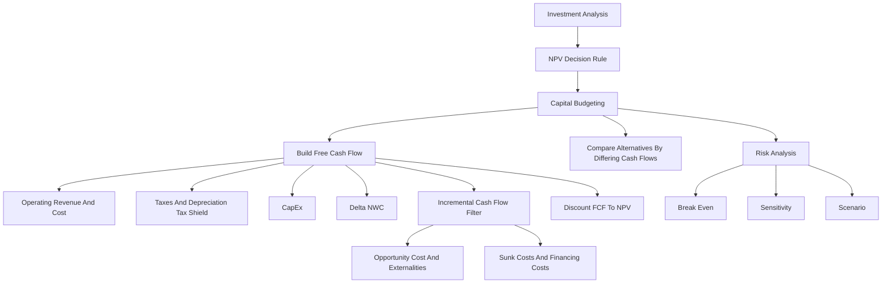

# Session 05-06: Capital Budgeting

Source file: `finance-and-investment-management/raw/moodle-export-investment-and-financial-management-950881761-s26-20260604/Investment and  950881761 (S26)_2026064_1514/CW 22  26.05. _ 27.05./Lecture 0506 Capital Budgeting.pdf`
Lecture folder: `finance-and-investment-management/`
Date processed: 2026-06-06
Course position: Corporate Finance lecture, sessions 05+06, following Investment Analysis.

## High-Yield 80/20 Summary

Capital budgeting turns the NPV rule into a full project-evaluation workflow. Investment Analysis said "accept positive NPV"; this lecture asks "which cash flows belong in the NPV calculation?"

Core exam logic:

1. Forecast only incremental project cash flows.
2. Build free cash flow, not accounting profit.
3. Exclude financing cash flows such as interest expense when WACC already captures financing cost.
4. Include opportunity costs, project externalities, CapEx, depreciation tax shields, changes in net working capital, and after-tax terminal values.
5. Compare mutually exclusive alternatives by the cash flows that differ.
6. Test risk with break-even, sensitivity, and scenario analysis.

The high-yield mental model:

```text
Investment Analysis = decision rule
Capital Budgeting = cash-flow construction behind the decision rule
```

## Free Cash Flow

Free cash flow is the incremental cash generated by a project that is available to all capital providers. The lecture distinguishes:

| Cash-flow concept | Meaning | Decision use |
|---|---|---|
| Free cash flow to the firm, FCF | Cash available to debt, equity, and preferred stockholders | Used for project valuation with WACC or unlevered cost of capital |
| Free cash flow to equity, FCFE | Cash available only to common equity holders | Used for equity-specific valuation |

For project capital budgeting in this lecture, the main object is FCF to the firm.

Direct formula:

```text
FCF = (Revenue - Cost - Depreciation) x (1 - tau_c)
      + Depreciation - CapEx - Delta NWC

Equivalent:

FCF = (Revenue - Cost) x (1 - tau_c)
      - CapEx - Delta NWC + tau_c x Depreciation
```

Variables:

- `tau_c` = corporate tax rate.
- `CapEx` = capital expenditures, actual cash outflows for long-term assets.
- `Delta NWC` = change in net working capital.
- `tau_c x Depreciation` = depreciation tax shield.

Interpretation: depreciation is not a cash outflow, but it reduces taxable income, so it creates a cash benefit through lower taxes.

## FCF From Earnings

The slide route from earnings is:

```text
EBIT
- adjusted tax expense
+ depreciation
+/- change in net operating working capital
= cash flow from operations
+ cash flow from investments, usually negative CapEx
= free project cash flow
```

Exam trap: accounting earnings and free cash flow are not the same. Earnings include non-cash expenses and exclude some cash investments. FCF corrects those timing and cash/non-cash differences.

## Incremental Cash Flow Rules

The word incremental is the gatekeeper. A cash flow belongs in the project only if it changes because the project is accepted.

| Include? | Item | Reason |
|---|---|---|
| Include | Revenue and operating costs caused by the project | They are incremental operating effects |
| Include | Opportunity cost | A resource used by the project could have earned value elsewhere |
| Include | Cannibalization / project externalities | The project can reduce profits of existing products |
| Include | CapEx | Actual cash spent to buy long-term assets |
| Include | Delta NWC | Project may tie up or release cash through inventory, receivables, payables |
| Include | Tax effects of depreciation | Depreciation reduces taxes even though it is non-cash |
| Exclude | Sunk costs | Already paid or unavoidable regardless of the project |
| Exclude | Interest expense | Financing cost is captured in the discount rate; including it in FCF double counts |
| Usually exclude | Fixed overhead not changed by the project | Not incremental |

### Interest Expense Double Counting

Interest expense is normally not subtracted inside project FCF when the project is valued using WACC.

Reason:

```text
WACC already includes the cost of debt and equity financing.
Subtracting interest in FCF and discounting by WACC counts financing cost twice.
```

Correct exam wording: judge the project on operating cash flows first; capture financing cost in the discount rate.

### Tax Losses

If the project has a loss, the tax treatment depends on the firm:

- A profitable firm can often offset the project loss against other taxable income, creating a tax credit.
- A non-profitable firm may need a tax carryforward or carryback.

Example logic from the slides: if a EUR 20 million project loss reduces taxable income and the tax rate is 25%, the tax saving is EUR 5 million.

## Net Working Capital

Net working capital measures short-term operating cash tied up in the project.

```text
NWC = current assets - current liabilities
NWC = cash + inventory + receivables - payables
Delta NWC_t = NWC_t - NWC_(t-1)
```

Project implication:

- More inventory or receivables ties up cash: `Delta NWC > 0`, reducing FCF.
- More payables can temporarily finance operations: `Delta NWC < 0`, increasing FCF.
- Working capital is often recovered near the end of the project, increasing final-period FCF.

Exam trap: do not use the level of NWC directly unless the question asks for it. FCF uses the change in NWC.

## Choosing Among Alternatives

For mutually exclusive investment opportunities, choose the alternative with the highest NPV.

For operational alternatives such as outsourcing versus in-house production:

```text
Only include cash-flow components that differ between the alternatives.
```

The HomeNet manufacturing example compares:

- lower unit cost from in-house production,
- extra upfront facility change,
- different inventory/payables effects,
- and the resulting NPV difference.

The slides conclude that outsourcing is less expensive in that setup.

## Further Adjustments To FCF

Additional items that can matter:

| Adjustment | Treatment |
|---|---|
| Amortization | Add back if it is non-cash and already reduced earnings |
| Timing inside year | Discount cash flows according to actual timing if required |
| Accelerated depreciation | Changes the timing of tax shields; earlier shields are more valuable |
| Liquidation / salvage value | Include after-tax proceeds when assets are sold |
| Terminal / continuation value | Include market value of future FCF beyond explicit forecast horizon |
| Tax loss carryforwards / carrybacks | Include when losses can offset taxable income in nearby periods |

## Risk Analysis

Capital budgeting forecasts are uncertain. The lecture uses three risk checks:

| Method | What changes? | Question answered |
|---|---|---|
| Break-even analysis | Find the parameter value that makes NPV zero | "How bad can this assumption get before value disappears?" |
| Sensitivity analysis | Change one assumption at a time | "Which single input drives NPV most?" |
| Scenario analysis | Change several assumptions together | "What happens in a coherent best/base/worst case?" |

Exam trap: sensitivity analysis is not the same as scenario analysis. Sensitivity isolates one variable; scenario analysis bundles a set of consistent assumptions.

## German Tax Excursus

The deck includes a compact German-tax comparison. The examinable finance takeaway is that taxes affect free cash flow and capital budgeting, but the lecture-level note keeps the administrative tax details separate from the core project workflow.

High-yield numbers shown:

- Corporate marginal tax rate example: about 29.83%.
- Full profit distribution example for corporations: overall marginal rate about 48.34%.
- Partnership examples differ depending on retained profits and later distribution.

For exam use, treat this as an illustration that tax rates change project cash flows and after-tax value. Do not turn it into a legal-tax memorization topic unless the exam explicitly asks for the German tax calculation.

## Exam Calculation Template

Use this setup before calculating:

```text
1. Identify project timeline.
2. Forecast revenue and operating cost.
3. Remove sunk costs and financing costs.
4. Add opportunity costs and externalities.
5. Compute EBIT.
6. Subtract taxes on EBIT.
7. Add back depreciation.
8. Subtract CapEx.
9. Subtract Delta NWC.
10. Add after-tax salvage or terminal value if relevant.
11. Discount FCF at the appropriate project cost of capital.
12. Accept if NPV > 0; for alternatives, choose highest incremental NPV.
```

## Real Business Examples

- A robotics manufacturer buying a new automation line must include the purchase price, tax shield from depreciation, inventory changes, and maintenance savings.
- A software firm launching a new product should ignore past R&D that is already spent, but include lost revenue from an older product if the new product cannibalizes it.
- A retailer deciding between outsourcing logistics and building an in-house warehouse should compare only costs and working-capital effects that differ between the two alternatives.

## Exam Relevance

Likely prompts:

- "Compute FCF from revenue, costs, depreciation, CapEx, and NWC."
- "Explain why interest expense is excluded from project FCF."
- "Classify sunk cost, opportunity cost, cannibalization, and overhead."
- "Choose between mutually exclusive manufacturing alternatives."
- "Distinguish break-even, sensitivity, and scenario analysis."

Common traps:

- Treating depreciation as a cash outflow.
- Forgetting the depreciation tax shield.
- Including sunk R&D.
- Excluding opportunity cost because "no cash is paid today."
- Subtracting interest expense and then also discounting by WACC.
- Using NWC level instead of `Delta NWC`.

## Visual Knowledge Map



## Subject Knowledge Graph

| Node | Meaning | Exam Relevance |
|---|---|---|
| Capital budgeting | Process of evaluating project investments using forecasted cash flows | Connects cash-flow construction to NPV |
| Free cash flow | Incremental cash generated by the project for capital providers | Main input to project valuation |
| Incremental cash flow | Cash flow that changes because the project is accepted | Inclusion/exclusion gate |
| Depreciation tax shield | Tax saving from non-cash depreciation expense | Common FCF adjustment |
| CapEx | Cash spent on long-term assets | Must be subtracted from FCF |
| Net working capital | Operating cash tied in current assets minus current liabilities | Use `Delta NWC` in FCF |
| Sunk cost | Cost paid or unavoidable regardless of decision | Exclude from project analysis |
| Opportunity cost | Value of best alternative use of a resource | Include as project cost |
| Cannibalization | Project reduces sales/profits of existing products | Include as externality |
| Break-even analysis | Parameter value where NPV equals zero | Risk threshold tool |
| Sensitivity analysis | One-input-at-a-time NPV test | Identifies key drivers |
| Scenario analysis | Multi-input NPV test under coherent cases | Tests combined uncertainty |

| From | Relationship | To | Why It Matters |
|---|---|---|---|
| Capital budgeting | builds | free cash flow | NPV depends on correct cash-flow inputs |
| Free cash flow | excludes | financing cash flows | Avoids double counting with WACC |
| Depreciation | creates | depreciation tax shield | Non-cash expense still affects taxes |
| CapEx | reduces | free cash flow | Asset purchase is real cash outflow |
| Delta NWC | adjusts | free cash flow | Working capital ties up or releases cash |
| Sunk cost | is excluded from | incremental cash flow | Past costs do not change the decision |
| Opportunity cost | is included in | incremental cash flow | Resource use has alternative value |
| Cannibalization | reduces | incremental cash flow | New project can harm existing products |
| Risk analysis | stress-tests | NPV | Forecast assumptions may be wrong |

## Retrieval Prompts

Closed-book questions:

1. Write the direct FCF formula and define every variable.
2. Why is depreciation added back after taxes?
3. Why is interest expense excluded from project FCF?
4. What is the difference between sunk cost and opportunity cost?
5. Why does FCF use `Delta NWC` rather than NWC?

Application prompts:

1. A firm spent EUR 300,000 on a feasibility study last year. Should it enter the FCF forecast?
2. A project uses warehouse space that could be rented for EUR 50,000 per year. Should it enter the project analysis?
3. A new product takes 20% of customers from an old product. How does that affect FCF?
4. If WACC is 12%, FCFs are `-19,500`, `7,000`, `9,100`, `9,100`, `9,100`, and `2,400`, what is the NPV setup?
5. How would you explain the difference between sensitivity and scenario analysis in one sentence?

## Practice Tasks

1. Build an FCF table from: revenue, operating cost, depreciation, tax rate, CapEx, and `Delta NWC`.
2. Classify each item as include/exclude: past R&D, annual interest, rent opportunity cost, extra inventory, cannibalized margin, old fixed overhead.
3. Compare outsourcing and in-house production using only differing cash flows.
4. Create a three-line risk analysis: break-even price, sensitivity to volume, and worst-case scenario.

## Connections

Previous notes from this lecture:

- `finance-and-investment-management/wiki/session-03-04-investment-analysis/session-03-04-investment-analysis.md`
- `finance-and-investment-management/wiki/exercise-01-02-interest-calculation/exercise-01-02-interest-calculation.md`
- `finance-and-investment-management/wiki/exercise-03-04-annuities/exercise-03-04-annuities.md`

Future notes:

- `finance-and-investment-management/wiki/session-07-08-cost-of-capital/session-07-08-cost-of-capital.md`

Cross-course links:

- SCM forecasting: both use uncertain projections, but finance translates the forecast into cash-flow value.
- SCM capacity/process cases: operational choices become finance inputs through costs, volumes, CapEx, and NWC.

## Weakness Flags

- First active recall pending.
- Check whether the user separates NPV decision rule from FCF construction.
- Drill `Delta NWC`, depreciation tax shield, and interest-expense double counting.
