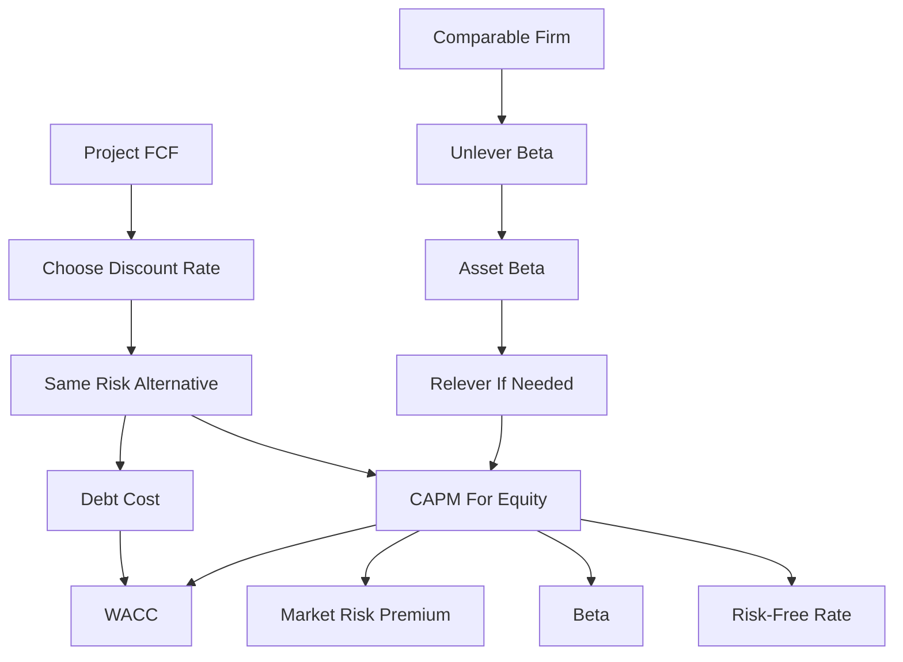

# Ubiquitous Language: Session 07-08 Cost Of Capital

Source note: `session-07-08-cost-of-capital.md`
Course: Finance and Investment Management
Definition sources: local lecture deck and generated topic note; enriched with standard corporate-finance usage for standalone exam language.

## Required-Return Language

| Term | Definition | Aliases to avoid |
|---|---|---|
| **Cost Of Capital** | The expected return investors require for an investment with the same risk. | initial investment, cash cost |
| **Discount Rate** | The rate used to convert risky future FCFs into present value. | interest rate always |
| **Required Return** | Minimum expected return needed to compensate investors for time and risk. | guaranteed return |
| **Opportunity Cost Of Capital** | Return available from a comparable-risk alternative investment. | accounting expense |
| **Project Cost Of Capital** | Required return for the project's own cash-flow risk. | firm WACC always |

## CAPM Language

| Term | Definition | Aliases to avoid |
|---|---|---|
| **CAPM** | Model estimating required return as risk-free rate plus beta times market risk premium. | general risk model |
| **Risk-Free Rate** | Return on a default-free investment over the relevant horizon. | average market return |
| **Market Risk Premium** | Expected market return minus risk-free rate. | stock return |
| **Equity Risk Premium** | Same practical input as market risk premium in this deck. | beta |
| **Beta** | Sensitivity of a security or project return to market returns; priced systematic risk. | volatility |
| **Volatility** | Total return variability, including diversifiable and systematic risk. | beta |
| **Systematic Risk** | Market-wide risk that cannot be diversified away. | total risk |
| **Unsystematic Risk** | Firm-specific risk that diversified investors can largely eliminate. | priced CAPM risk |
| **Security Market Line** | CAPM relation between beta and expected return. | yield curve |

CAPM cheat sheet:

```text
r_i = r_f + beta_i x (E[r_Mkt] - r_f)
```

Interpretation:

```text
Required return = time value baseline + compensation for systematic market risk.
```

## Debt And WACC Language

| Term | Definition | Aliases to avoid |
|---|---|---|
| **Debt Cost Of Capital** | Expected return required by debt investors for the firm's debt risk. | coupon rate automatically |
| **Yield To Maturity** | IRR from promised bond payments if held to maturity. | expected return always |
| **Default Risk** | Risk that promised debt payments are not fully made. | volatility only |
| **Loss Rate** | Fraction of debt value lost if default occurs. | probability of default |
| **Debt Rating Approach** | Estimate debt cost from similarly rated debt with similar maturity. | equity beta approach |
| **Debt Beta** | Market-risk sensitivity of debt returns. | credit rating |
| **WACC** | Weighted average cost of equity and after-tax debt, using market-value weights. | average accounting cost |
| **After-Tax Debt Cost** | Debt cost multiplied by `(1 - corporate tax rate)` because interest is tax deductible. | pre-tax debt cost |
| **Contractual Loan Rate** | Interest rate specified for a particular loan and used to calculate that loan's interest and redemption payments. | WACC |
| **Redemption Schedule** | Contractual timing of loan interest and principal repayments used to test debt-service feasibility. | project FCF forecast |

WACC formula:

```text
r_WACC = r_E x E/(E + D) + r_D x D/(E + D) x (1 - tau_c)
```

## Beta Adjustment Language

| Term | Definition | Aliases to avoid |
|---|---|---|
| **Equity Beta** | Beta of a firm's equity; includes business risk and financial leverage. | asset beta |
| **Asset Beta** | Beta of the firm's operating assets as if unlevered. | equity beta |
| **Unlevering Beta** | Removing financial leverage from comparable equity beta to estimate business risk. | lowering risk arbitrarily |
| **Relevering Beta** | Adding target financial leverage to asset beta to estimate project equity beta. | using old beta unchanged |
| **Comparable Company** | Public firm with similar business risk used as a proxy for project beta. | any company |
| **Net Debt** | Debt minus excess cash and short-term investments. | gross debt |
| **Enterprise Value** | Equity value plus net debt; value of operating business assets. | market capitalization only |
| **Operating Leverage** | Fixed-cost intensity; higher fixed costs make cash flows more sensitive to demand shocks. | financial leverage |

## Relationships

- **Cost Of Capital** is the correct **Discount Rate** only when it matches the cash-flow risk.
- **CAPM** uses **Beta**, not **Volatility**, because diversified investors are compensated for **Systematic Risk**.
- **Yield To Maturity** equals expected return only when promised payments are close to expected payments.
- **WACC** combines **Equity Cost Of Capital** and **Debt Cost Of Capital** with market-value weights.
- **Capital Budgeting** supplies incremental operating FCF, **WACC** discounts it when appropriate, and a **Redemption Schedule** separately models contractual debt service.
- A **Contractual Loan Rate** is one financing input; it is not the same as **WACC**, which blends debt and equity required returns.
- **Equity Beta** must be **Unlevered** to estimate **Asset Beta** for business risk.
- **Operating Leverage** raises **Project Cost Of Capital** when fixed costs make project cash flows more market-sensitive.

## Visual Memory Aid



## Example Dialogue

> **Student:** "The project costs EUR 10 million. Is 10 million the cost of capital?"
>
> **Professor:** "No. **Cost Of Capital** is a percentage required return, not the cash investment. The EUR 10 million is a cash outflow in FCF."
>
> **Student:** "Can I use the firm's WACC for every project?"
>
> **Professor:** "Only if the project has similar risk and financing. Otherwise estimate a **Project Cost Of Capital** from comparable business risk."
>
> **Student:** "Domino has higher volatility than Disney, so higher CAPM return?"
>
> **Professor:** "Not necessarily. CAPM prices **Beta**, not total volatility."

## Flagged Ambiguities

| Ambiguity | Canonical recommendation |
|---|---|
| "Risk" | Specify **Systematic Risk**, **Unsystematic Risk**, **Default Risk**, or **Operating Leverage**. |
| "Return" | Use **Required Return**, **Expected Return**, or **Yield To Maturity** precisely. |
| "Beta" | Specify **Equity Beta** or **Asset Beta**. |
| "Debt" | Specify **Gross Debt**, **Net Debt**, or **Debt Cost Of Capital**. |
| "Discount rate" | State why the rate matches the project cash-flow risk. |

## Exam Trap Corrections

| Trap | Correction |
|---|---|
| Calling cost of capital the upfront investment. | Cost of capital is a rate; investment is a cash flow. |
| Using volatility in CAPM. | CAPM uses beta because only systematic risk is priced. |
| Treating YTM as expected return for risky debt. | Adjust conceptually for default probability and loss. |
| Using book-value weights in WACC without instruction. | Use market-value weights when available. |
| Forgetting `(1 - tau_c)` on debt in WACC. | Interest tax deductibility makes debt cost after-tax. |
| Applying firm WACC to a different-risk project. | Use comparable asset beta or project-specific required return. |

## Cheat-Sheet Language

```text
The discount rate must match the risk of the cash flows.
CAPM: required equity return = risk-free rate + beta x market risk premium.
Beta measures systematic risk; volatility measures total risk.
WACC is valid only when project risk and financing match the WACC assumptions.
```
