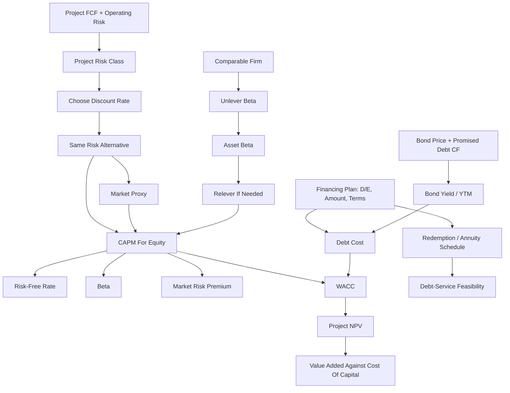

# Ubiquitous Language: Session 07-08 Cost Of Capital

Source note: `session-07-08-cost-of-capital.md`
Course: Finance and Investment Management
Definition sources: local lecture deck and generated topic note; enriched with standard corporate-finance usage for standalone exam language.

## Required-Return Language

| Term | Definition | Aliases to avoid |
|---|---|---|
| **Cost Of Capital** | The expected return investors require for an investment with the same risk. | initial investment, cash cost |
| **Discount Rate** | The rate used to convert risky future FCFs into present value. | interest rate always |
| **Required Return** | Minimum expected return needed to compensate investors for time and risk. | guaranteed return |
| **Opportunity Cost Of Capital** | Return available from a comparable-risk alternative investment. | accounting expense |
| **Project Cost Of Capital** | Required return for the project's own cash-flow risk. | firm WACC always |
| **Equity Cost Of Capital** | Required return shareholders demand for bearing equity risk; commonly estimated with CAPM. | dividend rate, stock-price growth only |

## CAPM Language

| Term | Definition | Aliases to avoid |
|---|---|---|
| **CAPM** | Model estimating required return as risk-free rate plus beta times market risk premium. | general risk model |
| **Market Portfolio** | The theoretical portfolio of all risky assets used in CAPM logic; not directly observable in practice. | stock index exactly |
| **Market Proxy** | Observable broad market index used to approximate the market portfolio when estimating beta or market risk premium. | project investment, financing source |
| **Comparable Market Risk** | Risk reference from traded assets or comparable firms used to estimate what investors require for similar systematic risk. | identical project copy |
| **Risk-Free Rate** | Return on a default-free investment over the relevant horizon. | average market return |
| **Market Risk Premium** | Expected market return minus risk-free rate. | stock return |
| **Equity Risk Premium** | Same practical input as market risk premium in this deck. | beta |
| **Beta** | Sensitivity of a security or project return to market returns; priced systematic risk. | volatility |
| **Volatility** | Total return variability, including diversifiable and systematic risk. | beta |
| **Systematic Risk** | Market-wide risk that cannot be diversified away. | total risk |
| **Unsystematic Risk** | Firm-specific risk that diversified investors can largely eliminate. | priced CAPM risk |
| **Security Market Line** | CAPM relation between beta and expected return. | yield curve |

CAPM cheat sheet:

```text
r_i = r_f + beta_i x (E[r_Mkt] - r_f)
```

Interpretation:

```text
Required return = time value baseline + compensation for systematic market risk.
```

## Debt And WACC Language

| Term | Definition | Aliases to avoid |
|---|---|---|
| **Debt Cost Of Capital** | Expected return required by debt investors for the firm's debt risk. | coupon rate automatically |
| **Bond Yield Evidence** | Market yield or YTM from the firm's own bonds or comparable bonds used to estimate the pre-tax debt cost for similar debt risk. | project return, equity return |
| **Yield To Maturity** | IRR from promised bond payments if held to maturity. | expected return always |
| **Coupon Rate** | Contractual coupon payment as a percentage of face value; it sets promised bond cash flow, not the market-required return by itself. | debt cost automatically |
| **Bond Price** | Present value of promised bond cash flows discounted at the market-required yield. | face value, project value |
| **Face Value** | Principal amount repaid at bond maturity. | bond price, PV of face value |
| **PV Of Face Value** | Today's discounted value of the future face-value repayment; used in bond pricing, not the amount repaid at maturity. | maturity repayment |
| **Coupon Annuity** | Repeated coupon cash flows valued separately from the final face-value repayment. | whole bond value |
| **Default Risk** | Risk that promised debt payments are not fully made. | volatility only |
| **Loss Rate** | Fraction of debt value lost if default occurs. | probability of default |
| **Debt Rating Approach** | Estimate debt cost from similarly rated debt with similar maturity. | equity beta approach |
| **Debt Beta** | Market-risk sensitivity of debt returns. | credit rating |
| **WACC** | Weighted average cost of equity and after-tax debt, using market-value weights. | average accounting cost |
| **After-Tax Debt Cost** | Debt cost multiplied by `(1 - corporate tax rate)` because interest is tax deductible. | pre-tax debt cost |
| **Contractual Loan Rate** | Interest rate specified for a particular loan and used to calculate that loan's interest and redemption payments. | WACC |
| **Financing Plan** | Proposed debt/equity mix, debt amount, maturity, seniority, and repayment pattern used to implement project funding. | project value calculation |
| **Redemption Schedule** | Contractual timing of loan interest and principal repayments used to test debt-service feasibility. | project FCF forecast |
| **Debt-Service Feasibility** | Ability of forecast cash flows and liquidity to cover scheduled interest and principal payments under the chosen financing plan. | positive NPV automatically |
| **Value Added Against Cost Of Capital** | Positive NPV after project FCF has been discounted at the required return. It is the surplus after compensating capital providers. | positive revenue, accounting profit |

WACC formula:

```text
r_WACC = r_E x E/(E + D) + r_D x D/(E + D) x (1 - tau_c)
```

## Clarification Bridge Language

Use these boundaries when linking Capital Budgeting, CAPM, WACC, and Redemptions:

| Boundary | Canonical wording | Trap to avoid |
|---|---|---|
| **Capital Budgeting vs CAPM** | Capital Budgeting forecasts project operating FCF; CAPM estimates the equity required return for comparable systematic risk. | Saying CAPM forecasts project cash flows. |
| **Market Proxy vs Financing Source** | The market proxy is a reference for estimating required return; the project is not investing in the index. | Saying the project invests in stocks/bonds to get WACC. |
| **CAPM vs WACC** | CAPM estimates `r_E`; WACC blends `r_E` with after-tax `r_D`. | Treating CAPM as the full project discount rate when debt also finances the project. |
| **Bonds vs Cost Of Capital** | Bond prices and YTM can estimate the debt required return `r_D`; WACC then uses after-tax `r_D` with `r_E` to discount operating FCF. | Treating bond valuation as the project valuation itself. |
| **Coupon Rate vs Debt Cost** | Coupon rate sets the promised coupon cash flow; market yield/YTM or comparable debt yield estimates `r_D`. | Using coupon rate automatically as WACC's debt input. |
| **Face Value vs PV Of Face Value** | Face value is repaid at maturity; PV of face value is today's discounted value used in the bond price equation. | Calling a discounted PV amount the maturity repayment. |
| **Bond Investor Value vs Project NPV** | Bond investor value is `PV(promised bond cash flows) - market price`; project value is `PV(operating FCF at WACC) - investment`. | Calling every DCF result "project NPV." |
| **Debt Cost Of Capital vs Redemption Schedule** | Debt cost is the return lenders require; redemptions calculate contractual interest and principal payments. | Treating the loan annuity payment as the WACC debt term. |
| **Project Cost Of Capital vs Debt Cost Of Capital** | Project cost prices operating cash-flow risk; debt cost prices lenders' claim risk. | Using the loan rate as the project cost of capital by default. |
| **Financing Plan vs Project Value** | The financing plan sets debt amount, terms, and target leverage; project value still comes from operating FCF discounted at a risk-matched rate. | Letting a feasible loan schedule replace the NPV test. |
| **Operational Risk vs WACC Add-On** | Project operating risk should be embedded in beta, `r_E`, `r_D`, and weights; it is not normally added as a separate extra WACC component. | Double-counting risk by adding an extra operational-risk premium. |

Compact route:

```text
Project operating FCF + operating risk
-> project beta / risk class
-> CAPM for equity cost when needed
-> debt financing plan and market debt cost
-> WACC if debt and equity finance the project
-> NPV for project value
-> redemption or annuity schedule for debt-service feasibility
```

Bonds route:

```text
Bond cash flows + market price
-> YTM / comparable bond yield
-> debt cost of capital r_D
-> after-tax r_D inside WACC
-> NPV surplus if project FCF beats the hurdle
```

Bond cash-flow split:

```text
Face value = amount repaid at maturity.
PV of face value = today's discounted value of that maturity repayment.
Coupon annuity = repeated coupon payments.
Bond price = PV(coupon annuity) + PV(face value).
```

Best exam sentence:

```text
CAPM uses market data to estimate the opportunity cost of equity for comparable systematic risk; WACC uses that required return with after-tax debt cost to value operating FCF; redemptions separately test whether the chosen debt terms can be serviced.
```

## Beta Adjustment Language

| Term | Definition | Aliases to avoid |
|---|---|---|
| **Equity Beta** | Beta of a firm's equity; includes business risk and financial leverage. | asset beta |
| **Asset Beta** | Beta of the firm's operating assets as if unlevered. | equity beta |
| **Unlevering Beta** | Removing financial leverage from comparable equity beta to estimate business risk. | lowering risk arbitrarily |
| **Relevering Beta** | Adding target financial leverage to asset beta to estimate project equity beta. | using old beta unchanged |
| **Comparable Company** | Public firm with similar business risk used as a proxy for project beta. | any company |
| **Net Debt** | Debt minus excess cash and short-term investments. | gross debt |
| **Enterprise Value** | Equity value plus net debt; value of operating business assets. | market capitalization only |
| **Operating Leverage** | Fixed-cost intensity; higher fixed costs make cash flows more sensitive to demand shocks. | financial leverage |

## Worked Calculation Language

Every cost-of-capital calculation should show:

```text
Cash-flow risk -> required-return model -> inputs -> substitution -> rate -> valuation consequence -> trap
```

Mini anchors:

```text
CAPM: r_f = 3%, beta = 1.29, market risk premium = 5%.
r_E = 3% + 1.29 x 5%
r_E = 3% + 6.45%
r_E = 9.45%
```

```text
WACC: E = 60, D = 40, r_E = 12%, r_D = 5%, tax rate = 30%.
E/(D+E) = 60/100 = 0.60
D/(D+E) = 40/100 = 0.40
r_WACC = 12% x 0.60 + 5% x 0.40 x (1 - 0.30)
r_WACC = 7.20% + 1.40%
r_WACC = 8.60%
```

Interpretation: CAPM prices systematic equity risk; WACC blends equity and after-tax debt required returns for operating FCF of matching risk. Analogy: WACC is the blended hurdle for all capital providers, not the bank's loan invoice. Trap: using the contractual loan rate as the project discount rate.

```text
Bonds-to-WACC: observed or solved comparable bond yield r_D = 7%.
E = 60, D = 40, r_E = 12%, tax rate = 30%.
r_WACC = 12% x 0.60 + 7% x 0.40 x (1 - 0.30)
r_WACC = 7.20% + 1.96%
r_WACC = 9.16%

Project: CF_0 = -100,000; FCF_1-4 = 35,000.
PV inflows = 35,000 x [1 - 1/1.0916^4] / 0.0916
PV inflows = 112,993.12
NPV = 12,993.12
```

Interpretation: the bond yield supplied the debt-return input, WACC became the hurdle rate, and NPV measured value added after the project paid that hurdle. Trap: saying "the project creates value because cash inflows are positive" without discounting at the cost of capital.

## Relationships

- **Cost Of Capital** is the correct **Discount Rate** only when it matches the cash-flow risk.
- **CAPM** uses **Beta**, not **Volatility**, because diversified investors are compensated for **Systematic Risk**.
- **Market Proxy** makes **CAPM** estimable, but it is a required-return reference, not the project's investment asset.
- **Bond Yield Evidence** helps estimate **Debt Cost Of Capital**, but **Bond Price** is not the same as project value.
- **Coupon Rate** creates promised bond cash flow; **Yield To Maturity** or comparable market yield estimates required return.
- **Yield To Maturity** equals expected return only when promised payments are close to expected payments.
- **WACC** combines **Equity Cost Of Capital** and **Debt Cost Of Capital** with market-value weights.
- **Value Added Against Cost Of Capital** is measured by **NPV**, not by positive revenue or positive operating cash flow alone.
- **Capital Budgeting** supplies incremental operating FCF, **WACC** discounts it when appropriate, and a **Redemption Schedule** separately models contractual debt service.
- A **Contractual Loan Rate** is one financing input; it is not the same as **WACC**, which blends debt and equity required returns.
- A **Financing Plan** determines how much debt and equity will fund the project; it supports WACC weights and the **Redemption Schedule**, but it does not replace project valuation.
- **Debt Cost Of Capital** enters WACC; **Redemption Schedule** tests actual debt-service timing.
- **Project Cost Of Capital** prices operating risk; **Debt Cost Of Capital** prices lender claim risk.
- **Equity Beta** must be **Unlevered** to estimate **Asset Beta** for business risk.
- **Operating Leverage** raises **Project Cost Of Capital** when fixed costs make project cash flows more market-sensitive.
- Project operating risk is normally captured through **Asset Beta**, **Equity Cost Of Capital**, **Debt Cost Of Capital**, and target weights; do not add it again as a separate WACC surcharge unless instructed.

## Visual Memory Aid



## Example Dialogue

> **Student:** "The project costs EUR 10 million. Is 10 million the cost of capital?"
>
> **Professor:** "No. **Cost Of Capital** is a percentage required return, not the cash investment. The EUR 10 million is a cash outflow in FCF."
>
> **Student:** "Can I use the firm's WACC for every project?"
>
> **Professor:** "Only if the project has similar risk and financing. Otherwise estimate a **Project Cost Of Capital** from comparable business risk."
>
> **Student:** "Domino has higher volatility than Disney, so higher CAPM return?"
>
> **Professor:** "Not necessarily. CAPM prices **Beta**, not total volatility."
>
> **Student:** "Why do we look at the market if the project is a machine, product, or factory?"
>
> **Professor:** "The market is a **Market Proxy** for comparable systematic risk. It helps estimate what equity investors require elsewhere. The project does not buy the market index."
>
> **Student:** "Does Redemptions calculate the debt part of WACC?"
>
> **Professor:** "No. **Debt Cost Of Capital** enters WACC as lenders' required return. **Redemption Schedule** uses the loan contract to calculate actual interest and principal payments."
>
> **Student:** "Where do bonds enter Cost of Capital?"
>
> **Professor:** "A comparable **Bond Yield** can estimate **Debt Cost Of Capital**. That `r_D` goes into **WACC** after tax. Then **NPV** tells whether the operating project creates **Value Added Against Cost Of Capital**."
>
> **Student:** "So if the bond coupon is 6%, debt cost is 6%?"
>
> **Professor:** "Not automatically. The **Coupon Rate** sets promised payments. The market yield or **YTM** reflects the return debt investors currently require."
>
> **Student:** "So is WACC equity cost plus debt cost plus the project's own operational risk?"
>
> **Professor:** "No. **WACC** blends required returns from equity and debt. The project's operating risk should already be reflected in the project beta, equity cost, debt risk, and target weights. Do not add it a second time unless the task explicitly gives an extra adjustment."

## Flagged Ambiguities

| Ambiguity | Canonical recommendation |
|---|---|
| "Risk" | Specify **Systematic Risk**, **Unsystematic Risk**, **Default Risk**, or **Operating Leverage**. |
| "Return" | Use **Required Return**, **Expected Return**, or **Yield To Maturity** precisely. |
| "Beta" | Specify **Equity Beta** or **Asset Beta**. |
| "Debt" | Specify **Gross Debt**, **Net Debt**, or **Debt Cost Of Capital**. |
| "Bond yield" | Specify whether it is promised **Yield To Maturity**, expected debt return, or comparable-market debt-cost evidence. |
| "Coupon" | Say **Coupon Rate** for promised cash-flow size; do not use it as **Debt Cost Of Capital** without market-price evidence. |
| "Face value" | Say **Face Value** for maturity repayment and **PV Of Face Value** for today's discounted value. |
| "Discount rate" | State why the rate matches the project cash-flow risk. |
| "Value added" | Say **NPV after discounting at the cost of capital**, not just positive operating cash flow. |
| "Market" | Say **Market Proxy** or **Market Portfolio**; do not imply the project invests in that market. |
| "Cost of debt" | Say **Debt Cost Of Capital** for WACC and **Contractual Loan Rate** for repayment calculations. |
| "Project cost" | Say upfront investment for cash outlay, **Project Cost Of Capital** for the required return, or **Debt Cost Of Capital** for lender return. |
| "Operational risk in WACC" | Say operating risk is embedded in the project beta/risk class and therefore in `r_E`, `r_D`, and WACC weights; do not add it separately by default. |

## Exam Trap Corrections

| Trap | Correction |
|---|---|
| Calling cost of capital the upfront investment. | Cost of capital is a rate; investment is a cash flow. |
| Using volatility in CAPM. | CAPM uses beta because only systematic risk is priced. |
| Treating the market proxy as the project's investment asset. | The proxy estimates comparable systematic risk and required return; it is not the project itself. |
| Treating coupon rate as debt cost of capital. | Coupon rate sets promised bond cash flow; YTM/comparable bond yield estimates market-required debt return. |
| Treating bond YTM as the whole project discount rate. | YTM can estimate `r_D`; WACC blends after-tax `r_D` with `r_E` for project FCF. |
| Confusing face value with PV of face value. | Face value is the maturity repayment; PV of face value is today's discounted value inside the bond price. |
| Treating YTM as expected return for risky debt. | Adjust conceptually for default probability and loss. |
| Calling positive cash inflows value added. | Value added requires positive NPV after discounting at the cost of capital. |
| Using book-value weights in WACC without instruction. | Use market-value weights when available. |
| Forgetting `(1 - tau_c)` on debt in WACC. | Interest tax deductibility makes debt cost after-tax. |
| Applying firm WACC to a different-risk project. | Use comparable asset beta or project-specific required return. |
| Treating debt cost and redemptions as identical. | Debt cost is a WACC input; redemptions are a contractual cash-flow schedule. |
| Treating debt cost and project cost of capital as identical. | Debt cost prices lender risk; project cost prices operating FCF risk. |
| Adding operational risk on top of WACC after already using project beta. | This double counts risk; embed project risk in the chosen beta and required returns. |

## Cheat-Sheet Language

```text
The discount rate must match the risk of the cash flows.
CAPM: required equity return = risk-free rate + beta x market risk premium.
Beta measures systematic risk; volatility measures total risk.
WACC is valid only when project risk and financing match the WACC assumptions.
Market proxy = reference for comparable systematic risk, not the project investment.
Bond yield/YTM = possible evidence for r_D, not the whole project return.
Debt cost enters WACC; redemption payments test financing feasibility.
Project cost of capital prices operating FCF risk; debt cost prices lender claim risk.
Financing plan sets debt/equity amounts and terms; WACC values operating FCF; redemptions test debt-service timing.
Value added against cost of capital = positive NPV after discounting project FCF at the required return.
Operational risk belongs inside beta/project cost of capital, not as a separate WACC add-on by default.
```
