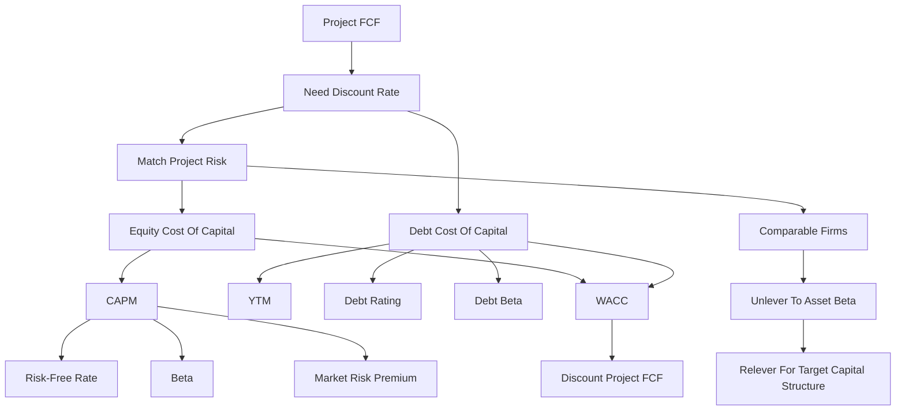

# Session 07-08: Cost Of Capital

Source file: `finance-and-investment-management/raw/moodle-export-investment-and-financial-management-950881761-s26-20260604/Investment and  950881761 (S26)_2026064_1514/CW 23  02.06. _ 03.06./Lecture 78 Cost of Capital.pdf`
Lecture folder: `finance-and-investment-management/`
Date processed: 2026-06-06
Course position: Corporate Finance lecture, sessions 07+08, after Capital Budgeting.

## High-Yield 80/20 Summary

Cost of capital is the required return for an investment with the same risk. It is the discount rate used to turn risky future FCFs into present value.

Core exam logic:

1. Match the discount rate to the risk of the cash flows.
2. Estimate the equity cost of capital with CAPM: `r_i = r_f + beta_i x (E[r_Mkt] - r_f)`.
3. Estimate debt cost from YTM, debt ratings, or debt beta.
4. Use comparable companies to estimate project risk when the project is not publicly traded.
5. Unlever comparable equity beta to asset beta, then relever if needed.
6. Use WACC only when the project has similar risk and financing to the firm or target financing.

High-yield interpretation:

```text
Cost of capital is not "the amount invested."
It is the required percentage return for bearing the project's risk.
```

## The Equity Cost Of Capital

The cost of capital of any investment opportunity equals the expected return of available investments with the same risk.

The lecture lists three estimation methods:

- Capital Asset Pricing Model, CAPM.
- Dividend discount model.
- Bond yield plus risk premium.

The deck focuses mainly on CAPM.

## CAPM

CAPM estimates the expected return required for bearing systematic market risk.

```text
r_i = r_f + beta_i x (E[r_Mkt] - r_f)
```

Variables:

- `r_i` = equity cost of capital for security or project `i`.
- `r_f` = risk-free rate.
- `beta_i` = sensitivity of the security's return to market return.
- `E[r_Mkt]` = expected market return.
- `E[r_Mkt] - r_f` = expected market risk premium, also called equity risk premium.

Interpretation:

- Investors like high returns and dislike risk.
- Diversification can remove unsystematic risk.
- Systematic risk remains and is priced.
- Beta measures exposure to systematic market risk.

Exam trap: volatility measures total risk; beta measures market risk. CAPM prices beta, not total volatility.

### Clarification: Why The Market Appears In CAPM

CAPM uses the market as a reference point for the return investors require on comparable systematic risk. The project is not investing in stocks, bonds, or commodities. Instead, market data tells the analyst what investors could earn elsewhere for bearing a similar kind of non-diversifiable risk.

Clean grounding:

```text
Comparable market risk
-> required return estimate
-> WACC / project discount rate
-> NPV test
```

The theoretical CAPM market portfolio contains all risky assets, but it is not directly observable. In practice and in exam settings, the market is usually proxied by a broad equity index, such as a value-weighted stock-market index. The important point is not the exact index name unless the task gives one; the important point is that beta measures sensitivity to broad market movements, not standalone volatility.

Decision meaning:

```text
If investors can earn 9% from assets with similar systematic risk,
then this project must beat that 9% hurdle before it creates value.
```

CAPM does not forecast project sales, costs, or FCF. Capital Budgeting does that. CAPM estimates the opportunity cost of equity: the return shareholders require because they could put their capital into comparable market-risk alternatives.

Exam sentence:

> CAPM uses market data to estimate the opportunity cost of equity for comparable systematic risk; WACC then uses that required return to test whether project operating FCF creates value after compensating capital providers.

### Disney And Domino Example

The slides compare:

- Disney: volatility 20%, beta 1.29.
- Domino's: volatility 30%, beta 0.62.
- Risk-free rate 3%, expected market return 8%, market risk premium 5%.

Calculations:

```text
r_DIS = 3% + 1.29 x (8% - 3%) = 9.45%
r_DPZ = 3% + 0.62 x (8% - 3%) = 6.10%
```

Domino has more total volatility, but Disney has more market risk and therefore the higher equity cost of capital under CAPM.

## Implementing CAPM

Step 1: construct or proxy the market portfolio.

- The market portfolio is value-weighted.
- Common proxies include broad market indexes.
- The deck contrasts value-weighted indexes such as the S&P 500 with price-weighted indexes such as the DJIA.

Step 2: determine the risk-free rate and market risk premium.

- Practitioners often use long-term government bond yields as risk-free-rate proxies.
- Historical market risk premia can be noisy and backward-looking.
- A fundamental market risk premium can be inferred from index valuation:

```text
r_Mkt = Div_1 / P_0 + g
```

Step 3: estimate beta.

- Regression beta is the slope of security excess returns against market excess returns.
- Formula intuition:

```text
beta_i = Cov(r_i, r_Mkt) / Var(r_Mkt)
```

Beta interpretation:

- `beta > 1`: more market-sensitive than the market, higher required return.
- `beta < 1`: less market-sensitive than the market, lower required return.

## Estimation Risk In Beta

Beta is estimated, not observed with certainty. Choices matter:

- estimation period,
- market index,
- return frequency,
- smoothing,
- small-firm or private-firm adjustments.

Example from the deck:

```text
beta estimate = 1.76
r_f = 3%
market risk premium = 5%
r_E = 3% + 1.76 x 5% = 11.8%
```

If the 95% confidence interval for beta is 1.5 to 2.0, then:

```text
lower r_E = 3% + 1.5 x 5% = 10.5%
upper r_E = 3% + 2.0 x 5% = 13.0%
```

Exam implication: the cost of capital is an estimate with uncertainty, not an exact truth.

## Debt Cost Of Capital

The debt cost of capital should reflect the current market rate investors require for the firm's debt risk.

Methods:

| Method | Logic | Caveat |
|---|---|---|
| Yield-to-maturity approach | Use YTM on outstanding debt | Overstates expected return if default risk is high |
| Debt-rating approach | Use yield on similarly rated debt with similar maturity | Depends on comparable bond data |
| Beta-CAPM approach | Estimate debt beta and use CAPM | Debt betas are hard because bonds trade infrequently |

YTM definition:

```text
YTM = IRR earned by holding the bond to maturity and receiving promised payments
```

If default is possible, promised YTM is not the same as expected return.

Simplified default-adjusted expected return from the slides:

```text
r_d = y - p x L
```

Variables:

- `y` = yield to maturity.
- `p` = probability of default.
- `L` = expected loss per EUR 1 of debt in default.

Exam trap: for risky debt, YTM generally overstates debt cost of capital because not all promised payments are expected to be received.

## Project Cost Of Capital

The project cost of capital should match the project's own risk, not mechanically the firm's average WACC.

When the project is like a single-product public firm:

```text
r_project = r_f + beta_comparable x market risk premium
```

Example:

- Lululemon beta = 1.20.
- Risk-free rate = 3%.
- Market risk premium = 5%.

```text
r_project = 3% + 1.20 x 5% = 9%
```

Managerial interpretation: if investors can earn 9% by buying a comparable publicly traded firm, the private project must be expected to earn at least 9% for the same risk.

## Levered Comparables And Asset Beta

When comparable firms have debt, their equity beta includes both business risk and financial leverage. To estimate project business risk, remove leverage first.

Asset cost of capital:

```text
r_U = r_E x E/(E + D) + r_D x D/(E + D)
```

Asset beta:

```text
beta_U = beta_E x E/(E + D) + beta_D x D/(E + D)
```

With taxes, a common unlever/relever approximation in the deck is:

```text
beta_asset = beta_equity / [1 + (1 - tau) x D/E]

beta_equity_project = beta_asset x [1 + (1 - tau) x D/E_project]
```

Exam workflow for non-public companies:

1. Select comparable firms with similar business risk.
2. Estimate each comparable's equity beta.
3. Unlever beta to asset beta.
4. Average asset betas across comparables if available.
5. Relever beta for the project's target financial risk if needed.
6. Use CAPM to estimate the project cost of capital.

## Cash And Net Debt

Cash is a risk-free asset that lowers the average risk of a firm's total assets. For enterprise risk, use net debt:

```text
Net debt = debt - excess cash and short-term investments
Enterprise value = equity value + net debt
```

Garmin example from the slides:

- Market capitalization: USD 18.8 billion.
- Debt: USD 0.1 billion.
- Cash: USD 1.6 billion.
- Equity beta: 0.93.
- Net debt: `0.1 - 1.6 = -1.5`.
- Enterprise value: `18.8 - 1.5 = 17.3`.

With risk-free debt/cash beta assumed zero:

```text
beta_U = 18.8 / 17.3 x 0.93 + (-1.5 / 17.3) x 0 = 1.01
```

Interpretation: because Garmin holds large cash balances, its equity is less risky than the underlying operating business.

## Project Risk Characteristics

Firm asset beta reflects the average risk of the firm's assets. A specific project may have different risk.

Project risk drivers:

- line of business,
- cyclicality of demand,
- fixed versus variable cost structure,
- operating leverage.

Operating leverage:

```text
Higher fixed cost share -> cash flows more sensitive to sales shocks -> higher beta -> higher cost of capital
```

Exam rule: multi-divisional firms should evaluate projects using asset betas from similar lines of business, not the parent firm's average beta when risks differ.

## WACC

With taxes, WACC uses the after-tax cost of debt:

```text
r_WACC = r_E x E/(E + D) + r_D x D/(E + D) x (1 - tau_c)
```

Given target leverage:

```text
r_WACC = r_U - [D/(E + D)] x tau_c x r_D
```

Interpretation:

- `r_U` is the unlevered or pre-tax WACC: the expected return investors earn by holding the firm's assets.
- With taxes, WACC is below the expected return on assets because interest is tax deductible.
- WACC can evaluate a project with the same risk and same financing policy as the firm.

### Bridge From Capital Budgeting To Redemptions

Keep the three roles separate:

1. **Capital Budgeting** forecasts incremental operating FCF and asks whether the project creates value.
2. **Cost Of Capital** supplies the risk-matched required return, such as WACC, used to discount that FCF.
3. **Redemptions** uses the contractual loan rate and repayment terms to test whether a proposed debt structure can be serviced.

WACC is therefore not the project's forecast and not the loan installment rate. A positive NPV does not by itself prove that every debt schedule is affordable, while an affordable debt schedule does not prove that the project creates value. Financing feasibility may be tested alongside final project approval, but the two questions must remain analytically separate.

Clarification bridge from the 2026-06-27 session:

```text
Capital Budgeting
= forecast the project's operating FCF.

CAPM
= estimate the equity return required for comparable systematic risk.

Debt Cost Of Capital
= estimate the return lenders require for the firm's/project's debt risk.

WACC
= blend equity cost and after-tax debt cost into a risk-matched hurdle rate.

Redemptions
= calculate contractual debt-service payments after debt terms are chosen.
```

The financing source is not "stocks or bonds invested in by the project." Stocks, bonds, and comparable traded securities are reference markets for estimating required returns. The actual financing mix is a separate policy choice: how much debt, how much equity, what maturity, what repayment pattern, and what target leverage.

Debt cost of capital and redemption calculations are connected but not identical:

```text
Debt cost of capital = required return lenders demand.
Redemption schedule  = actual interest and principal payments under the loan contract.
```

Debt cost enters WACC as `r_D x (1 - tax rate)`. Redemptions use the contractual loan rate, loan amount, maturity, grace period, and repayment pattern to test whether debt service fits the project's cash-flow timing.

Project cost of capital is different again:

```text
Project cost of capital = required return for the project's operating risk.
Debt cost of capital    = required return for lenders' debt claim.
```

Best exam boundary:

> Debt cost of capital prices financing risk for lenders; project cost of capital prices the operating risk of the project's cash flows.

## Worked Calculations And Analogies

### Calculation 1: CAPM Required Return

Decision problem and method choice:

- The project has equity-like systematic market risk.
- Use CAPM because the task gives beta, risk-free rate, and market risk premium.

Known inputs:

```text
r_f = 3%
beta = 1.29
Market risk premium = 8% - 3% = 5%
```

Formula, substitution, and arithmetic:

```text
r_E = r_f + beta x market risk premium
r_E = 3% + 1.29 x 5%
r_E = 3% + 6.45%
r_E = 9.45%
```

Interpretation: equity investors require 9.45% for bearing this systematic risk. Use this as the equity cost of capital, not as a cash-flow forecast.

Analogy: beta is the volume knob connecting the investment to market-wide risk. A beta of 1.29 means the market-risk premium is amplified by 1.29.

Exam trap: do not use volatility if beta is given. CAPM prices systematic risk, not total standalone volatility.

### Calculation 2: Risky Debt Expected Return

Decision problem and method choice:

- A bond's promised YTM may overstate the expected debt cost when default is possible.
- Use the simplified default-adjusted expected-return formula from the slides.

Known inputs:

```text
Promised YTM y = 9%
Probability of default p = 4%
Loss given default L = 50%
```

Formula and arithmetic:

```text
r_D = y - p x L
r_D = 9% - 4% x 50%
r_D = 9% - 2%
r_D = 7%
```

Interpretation: investors are promised 9%, but expected return is only 7% after allowing for default losses.

Analogy: the coupon promise is the menu price; expected return is what you expect to actually eat after accounting for the chance the kitchen fails.

Exam trap: do not feed a distressed promised YTM mechanically into WACC as if all promised payments are expected.

### Calculation 3: Unlever And Relever Comparable Beta

Decision problem and method choice:

- A private project has no traded beta.
- Use a comparable firm's equity beta, remove its leverage, then apply the project's target leverage.

Known inputs:

```text
Comparable equity beta = 1.40
Comparable D/E = 0.50
Tax rate = 30%
Project target D/E = 0.25
Assume debt beta = 0 for the approximation
```

Unlever comparable beta:

```text
beta_asset = beta_equity / [1 + (1 - tau) x D/E]
beta_asset = 1.40 / [1 + (1 - 0.30) x 0.50]
beta_asset = 1.40 / [1 + 0.35]
beta_asset = 1.40 / 1.35
beta_asset = 1.037
```

Relever for project target leverage:

```text
beta_equity_project = beta_asset x [1 + (1 - tau) x D/E_project]
beta_equity_project = 1.037 x [1 + 0.70 x 0.25]
beta_equity_project = 1.037 x 1.175
beta_equity_project = 1.219
```

Project equity cost with `r_f = 3%` and market risk premium `5%`:

```text
r_E_project = 3% + 1.219 x 5%
r_E_project = 3% + 6.095%
r_E_project = 9.095%
```

Interpretation: the project's operating risk comes from the comparable asset beta; the final equity beta reflects the project's own target leverage.

Analogy: unlevering removes the comparable firm's financial backpack so you can see the operating runner. Relevering puts on the backpack your project actually plans to carry.

Exam trap: do not use a levered comparable beta directly for a project with different leverage.

### Calculation 4: WACC With Market-Value Weights

Decision problem and method choice:

- Capital Budgeting needs one discount rate for project FCF to the firm.
- Use WACC when project risk and target financing match the weights.

Known inputs:

```text
Market value of equity E = 60
Market value of debt D = 40
r_E = 12%
r_D = 5%
Corporate tax rate = 30%
```

Formula, substitution, and arithmetic:

```text
r_WACC = r_E x E/(E+D) + r_D x D/(E+D) x (1 - tau_c)
r_WACC = 12% x 60/(60+40) + 5% x 40/(60+40) x (1 - 0.30)
r_WACC = 12% x 0.60 + 5% x 0.40 x 0.70
r_WACC = 7.20% + 1.40%
r_WACC = 8.60%
```

Interpretation: the project must generate enough FCF value to compensate both equity and debt providers. The debt component is after-tax because interest is deductible.

Analogy: WACC is a blended hurdle: part shareholder hurdle, part lender hurdle, weighted by how much each funding source supports the asset.

Exam trap: use market values for weights unless the problem explicitly instructs otherwise.

## Exam Relevance

Likely prompts:

- "Compute equity cost of capital with CAPM."
- "Explain beta versus volatility."
- "Explain why CAPM uses a market proxy and what the market proxy represents."
- "Estimate debt cost of capital and explain why YTM can overstate it."
- "Unlever and relever a comparable beta."
- "Explain when firm WACC is appropriate for a project."
- "Calculate WACC with tax-deductible debt."
- "Distinguish debt cost of capital from a redemption schedule."

Common traps:

- Using volatility instead of beta in CAPM.
- Thinking the project invests in the market index rather than using it as a required-return reference.
- Using one company WACC for every project.
- Treating project cost of capital and debt cost of capital as the same rate.
- Treating YTM as expected debt return for distressed debt.
- Forgetting market-value weights.
- Forgetting the after-tax debt term in WACC.
- Treating redemption payments as the WACC debt component.
- Ignoring cash when estimating enterprise beta.

## Visual Knowledge Map



## Subject Knowledge Graph

| Node | Meaning | Exam Relevance |
|---|---|---|
| Cost of capital | Required return for an investment with the same risk | Discount-rate selection |
| Equity cost of capital | Required return for equity investors | CAPM calculation |
| CAPM | Model linking required return to systematic risk | Main formula in the deck |
| Beta | Sensitivity to market excess returns | Risk input that CAPM prices |
| Market proxy | Observable broad market index used to approximate the theoretical market portfolio | Grounding for beta and market risk premium |
| Market risk premium | Expected market return over risk-free rate | CAPM input |
| Debt cost of capital | Expected return required by debt investors | WACC input |
| Project cost of capital | Required return for the project's operating cash-flow risk | Correct discount-rate target |
| Yield to maturity | IRR from promised bond payments | Can overstate risky debt return |
| Asset beta | Business-risk beta without financial leverage | Comparable-project risk estimate |
| Net debt | Debt minus excess cash | Enterprise-risk adjustment |
| Operating leverage | Fixed-cost intensity of the project | Raises project beta |
| WACC | Weighted average after-tax financing cost | Project discount rate when risk/financing match |
| Redemption schedule | Contractual interest and principal repayment table | Financing-feasibility test, not project value test |

| From | Relationship | To | Why It Matters |
|---|---|---|---|
| Cost of capital | discounts | project FCF | Converts expected cash flows to value |
| CAPM | estimates | equity cost of capital | Main required-return method |
| Beta | measures | systematic risk | Diversifiable risk is not priced in CAPM |
| Market proxy | approximates | market portfolio | Makes CAPM estimable in practice |
| YTM | may overstate | debt cost of capital | Default risk means promised return exceeds expected return |
| Comparable firms | estimate | asset beta | Private projects lack traded beta |
| Leverage | increases | equity beta | Debt makes equity cash flows riskier |
| Cash holdings | reduce | observed equity risk | Use net debt/enterprise value logic |
| WACC | combines | equity and after-tax debt costs | Used for FCF valuation under matching assumptions |
| Redemption schedule | tests | debt-service feasibility | It does not replace WACC or NPV |

## Retrieval Prompts

Closed-book questions:

1. State the CAPM formula and define every input.
2. Why does CAPM price beta rather than volatility?
3. What does the "market" in CAPM mean in practice, and why is it usually proxied by a broad stock-market index?
4. Why does CAPM use market data if the project itself is not buying stocks?
5. Why can YTM overstate the debt cost of capital?
6. What is the difference between equity beta and asset beta?
7. When is WACC an appropriate project discount rate?
8. What is the difference between debt cost of capital and a redemption schedule?

Application prompts:

1. Compute equity cost of capital for `r_f = 3%`, `beta = 1.4`, and market risk premium `5%`.
2. A firm has high cash holdings and no risky debt. Is its equity beta above or below the beta of its operating assets?
3. A project has higher fixed costs than the firm's average project. What happens to project beta and cost of capital?
4. A bond has YTM 9%, default probability 4%, and loss rate 50%. Set up the expected debt return.
5. Explain why a food-retail project should not automatically use the WACC of a software company.
6. Explain why a project can have positive NPV at WACC but still need its debt repayment schedule redesigned.

## Practice Tasks

1. CAPM drill: calculate required returns for three betas: 0.6, 1.0, 1.5.
2. Comparable-company drill: unlever a comparable beta, then relever it for a target D/E.
3. WACC drill: compute WACC from market values of debt and equity, debt cost, equity cost, and tax rate.
4. Interpretation drill: explain why using too low a discount rate can make bad projects look positive NPV.

## Connections

Previous notes:

- `finance-and-investment-management/wiki/session-05-06-capital-budgeting/session-05-06-capital-budgeting.md`
- `finance-and-investment-management/wiki/session-03-04-investment-analysis/session-03-04-investment-analysis.md`
- `finance-and-investment-management/wiki/exercise-06-bonds-i/exercise-06-bonds-i.md`

Future notes:

- `finance-and-investment-management/wiki/session-09-10-capital-structure/session-09-10-capital-structure.md`
- `finance-and-investment-management/wiki/session-11-12-capital-structure-and-taxes/session-11-12-capital-structure-and-taxes.md`

Cross-course links:

- SCM uncertainty: both ask how uncertainty affects decisions, but finance prices systematic risk through required return.
- Organization/strategy: project risk can differ by division, technology, and operating model.

## Weakness Flags

- First active recall pending.
- Drill beta versus volatility.
- Drill why the market proxy is a required-return reference, not something the project buys.
- Drill "same risk" matching before formulas.
- Drill debt cost of capital versus redemption schedule.
- Drill project cost of capital versus debt cost of capital.
- Drill when WACC is appropriate versus when a project-specific rate is needed.
