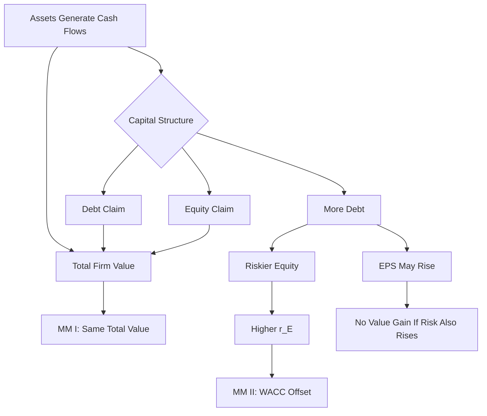

# Ubiquitous Language: Session 09-10 Capital Structure

Source note: `session-09-10-capital-structure.md`
Course: Finance and Investment Management
Definition sources: local lecture deck and generated topic note; enriched with standard corporate-finance usage for standalone exam language.

## Capital-Structure Language

| Term | Definition | Aliases to avoid |
|---|---|---|
| **Capital Structure** | The mix of debt, equity, and other securities used to finance a firm. | project selection |
| **Equity Financing** | Financing through ownership claims; equity holders receive residual cash flows. | free financing |
| **Debt Financing** | Financing through promised payments to lenders. | always cheaper value |
| **Unlevered Firm** | Firm financed entirely with equity. | risk-free firm |
| **Levered Firm** | Firm financed with debt and equity. | better firm automatically |
| **Leverage** | Use of debt in capital structure. | profit increase |
| **Debt-To-Equity Ratio** | Market value of debt divided by market value of equity. | book D/E automatically |

## MM Benchmark Language

| Term | Definition | Aliases to avoid |
|---|---|---|
| **Perfect Capital Market** | Benchmark with competitive prices, no taxes, no transaction/issuance/agency costs, and no financing information effects. | real market |
| **MM Proposition I Without Taxes** | In perfect markets, firm value is independent of capital structure. | debt is irrelevant always |
| **MM Proposition II Without Taxes** | Levered equity cost rises with leverage because equity becomes riskier. | debt lowers WACC always |
| **Law Of One Price** | Two strategies with identical state-contingent cash flows must have the same price. | same accounting profit |
| **Arbitrage** | Riskless profit from price differences for equivalent cash flows. | speculation |
| **Homemade Leverage** | Investor borrowing/lending to replicate or undo corporate leverage personally. | personal preference only |
| **Conservation Of Value** | Financial transactions repackage risk and return but do not create value in perfect markets. | no finance matters ever |

Key formulas:

```text
MM I without taxes: E + D = U = A

MM II without taxes:
r_E = r_U + (D/E) x (r_U - r_D)

Perfect-market WACC:
r_WACC = r_U = r_A
```

## Risk And Return Language

| Term | Definition | Aliases to avoid |
|---|---|---|
| **Cost Of Levered Equity** | Required return on equity when the firm uses debt. | same as unlevered return |
| **Unlevered Cost Of Capital** | Required return on the firm's assets without financial leverage. | WACC after taxes |
| **Asset Cost Of Capital** | Required return for the operating assets' risk. | debt coupon |
| **Weighted Average Cost Of Capital** | Market-value-weighted return required by the firm's securities. | arithmetic average of rates |
| **Equity Beta** | Market-risk beta of equity, amplified by financial leverage. | asset beta |
| **Unlevered Beta** | Beta of the firm's operating assets without financial leverage. | equity beta |

## Fallacy Language

| Term | Definition | Aliases to avoid |
|---|---|---|
| **Leveraged Recapitalization** | Firm borrows and uses proceeds for repurchase or special dividend. | investment project |
| **EPS Fallacy** | Mistake of treating higher EPS from leverage as value creation while ignoring higher equity risk. | EPS rule |
| **Dilution** | More shares divide ownership and earnings; value dilution occurs only if shares are mispriced or funds are wasted. | share-count increase always bad |
| **Fairly Priced Equity Issue** | New shares sold at current fair value, so cash raised offsets additional shares. | shareholder loss automatically |

## Relationships

- **Capital Structure** changes claims on asset cash flows, not the asset cash flows themselves in the MM benchmark.
- **MM Proposition I Without Taxes** is supported by **Law Of One Price** and **Homemade Leverage**.
- **Leverage** raises **Cost Of Levered Equity** because equity receives residual cash flows after debt.
- **Debt Financing** may look cheaper, but **MM Proposition II Without Taxes** explains why **WACC** stays constant.
- **EPS Fallacy** and **Dilution** are exam traps because they focus on accounting/share-count mechanics rather than value and risk.

## Visual Memory Aid



## Example Dialogue

> **Student:** "Debt is cheaper than equity, so a firm should use more debt to lower WACC."
>
> **Professor:** "In the MM perfect-market benchmark, more debt makes equity riskier. The cost of equity rises enough to offset cheap debt, so **WACC** stays constant."
>
> **Student:** "But EPS rises after a repurchase."
>
> **Professor:** "That is the **EPS Fallacy** unless you account for higher risk. More expected EPS is not automatically more value."
>
> **Student:** "Does issuing shares dilute shareholders?"
>
> **Professor:** "It dilutes ownership percentage, but if the shares are issued at a fair price and the funds are used in zero-NPV form, value per share need not fall."

## Flagged Ambiguities

| Ambiguity | Canonical recommendation |
|---|---|
| "Value" | Specify total firm value, equity value, or price per share. |
| "Leverage" | Specify corporate leverage or homemade leverage. |
| "Cheap debt" | State whether you are discussing pre-tax debt cost, after-tax debt cost, or WACC. |
| "Dilution" | Separate ownership dilution from value dilution. |
| "Risk" | Specify asset risk, debt risk, or levered equity risk. |

## Exam Trap Corrections

| Trap | Correction |
|---|---|
| Debt is cheaper, so value must increase. | Under MM without taxes, equity risk rises and WACC stays unchanged. |
| Higher EPS means higher share price. | Higher EPS may simply compensate for higher risk. |
| Equity issuance destroys value by dilution. | Fairly priced issuance adds cash/assets alongside shares. |
| Capital structure changes operating cash flow in MM. | MM assumes financing does not change asset cash flows. |
| Using accounting/book weights. | MM/WACC use market values unless the problem states otherwise. |

## Cheat-Sheet Language

```text
MM without taxes: financing does not create value; it reallocates risk.
MM I: total firm value is unchanged.
MM II: equity gets riskier and required equity return rises with D/E.
EPS and dilution arguments are not value arguments unless risk and fair pricing are handled.
```
