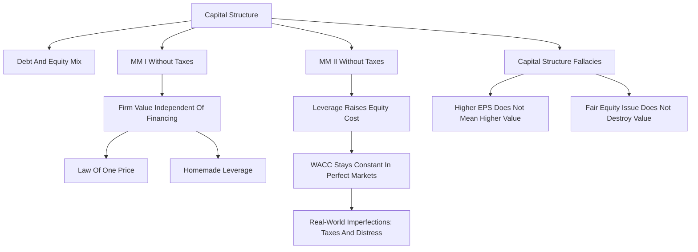

# Session 09-10: Capital Structure

Source file: `finance-and-investment-management/raw/moodle-export-investment-and-financial-management-950881761-s26-20260604/Investment and  950881761 (S26)_2026064_1514/CW 25  16.06. _ 17.06./Lecture 910 Capital Structure.pdf`
Lecture folder: `finance-and-investment-management/`
Date processed: 2026-06-06
Course position: Corporate Finance lecture, sessions 09+10, after Cost of Capital.

## High-Yield 80/20 Summary

Capital structure asks how a firm should finance itself with debt, equity, and other securities. In perfect capital markets, Modigliani-Miller says financing choice does not create value by itself; it only repackages risk and return.

Core exam logic:

1. Capital structure = relative proportions of debt, equity, and other securities.
2. MM Proposition I without taxes: firm value is independent of capital structure.
3. Homemade leverage and the law of one price explain why investors can undo corporate leverage.
4. MM Proposition II without taxes: leverage raises the cost of equity because equity becomes riskier.
5. In perfect markets, WACC stays constant as leverage changes.
6. Higher EPS after leverage does not imply higher share price; risk also increases.
7. Fairly priced equity issuance does not destroy value by "dilution" alone.

The high-yield memory:

```text
Perfect markets: financing slices the pie differently, but does not make the pie bigger.
```

## Capital Structure Decision

After deciding whether to undertake an investment, the firm must decide which security to sell to investors.

Capital structure is the relative mix of:

- equity,
- debt,
- and other securities.

Two benchmark structures:

| Structure | Meaning |
|---|---|
| All-equity / unlevered firm | Firm is financed only with equity |
| Levered firm | Firm is financed with equity and debt |

The key question: is there a capital structure that shareholders prefer?

## MM Assumptions

The lecture begins from a perfect-market benchmark:

- homogeneous expectations,
- homogeneous business risk classes,
- perpetual cash flows,
- competitive security prices equal to PV of future cash flows,
- no taxes,
- no transaction costs,
- no issuance costs,
- no agency costs,
- financing decisions do not change operating cash flows or reveal new information.

This benchmark is intentionally unrealistic, but useful: it shows which real-world imperfections must matter for capital structure to create value.

## MM Proposition I Without Taxes

MM Proposition I:

```text
The market value of a company is not affected by its capital structure.

E + D = U = A
```

Variables:

- `E` = market value of equity in a levered firm.
- `D` = market value of debt in a levered firm.
- `U` = market value of equity in an unlevered firm.
- `A` = market value of the firm's assets.

Interpretation:

```text
Changing debt and equity changes how operating cash flows are split,
but not the total cash flows generated by the assets.
```

## Law Of One Price And Homemade Leverage

The proof uses two ideas.

### Law Of One Price

If two investment strategies produce the same cash flows in every state, they must have the same price. Otherwise arbitrage is possible.

### Homemade Leverage

Investors can borrow or lend in their own portfolios to replicate the leverage choice of the firm.

Implication:

```text
Corporate leverage is not special in perfect markets because investors can create or undo it themselves.
```

## Leveraged Recapitalization

A firm can change capital structure by borrowing money and using it to repurchase shares or pay a special dividend.

Harrison example from the deck:

- Initial all-equity firm.
- 50 million shares at USD 4 each.
- Equity value = USD 200 million.
- Firm borrows USD 80 million and repurchases 20 million shares.

Under MM without taxes:

```text
Total firm value stays USD 200 million.
Debt becomes USD 80 million.
Equity value becomes USD 120 million.
Shares outstanding become 30 million.
Share price stays USD 4.
```

Exam interpretation: borrowing and repurchasing shares does not create value in a perfect market.

## MM Proposition II Without Taxes

MM Proposition II links leverage to the equity cost of capital.

Starting point:

```text
r_U = r_E x E/(D + E) + r_D x D/(D + E)
```

MM Proposition II:

```text
r_E = r_U + (D/E) x (r_U - r_D)
```

Variables:

- `r_E` = return/cost of levered equity.
- `r_U` = return/cost of unlevered equity or assets.
- `r_D` = return/cost of debt.
- `D/E` = market-value debt-to-equity ratio.

Interpretation:

```text
More debt makes equity riskier, so shareholders require a higher return.
```

## WACC Under Perfect Markets

For an unlevered firm:

```text
r_U = r_A
```

For a levered firm in perfect markets:

```text
r_WACC = r_U = r_A
r_WACC = r_E x E/(D + E) + r_D x D/(D + E)
```

As leverage increases:

- debt may look cheaper than equity,
- but equity becomes riskier and more expensive,
- so the WACC remains unchanged in the perfect-market benchmark.

Exam trap: do not say debt is cheaper, therefore firm value must increase. In perfect markets, the rising equity cost offsets the cheaper debt.

## Multiple Securities

If the firm has several securities, WACC is calculated as the weighted average cost of all securities.

General rule:

```text
Use market-value weights and each security's required return.
```

## Levered And Unlevered Betas

Leverage also affects beta:

```text
beta_U = beta_E x E/(E + D) + beta_D x D/(E + D)
```

With debt beta included:

```text
beta_E = beta_U + (D/E) x (beta_U - beta_D)
```

Interpretation:

```text
Financial leverage amplifies the market risk of equity.
```

### Cash Holdings

Cash reduces the average risk of total assets. The deck's Cisco example uses:

```text
net debt = debt - cash
enterprise value = equity value + net debt
```

If net debt is negative, the firm has more cash than debt. Equity can then be less risky than the underlying operating business.

## Capital Structure Fallacy 1: EPS

Debt-financed repurchases can raise expected EPS.

Example logic from LVI:

- No debt: EBIT = USD 10 million, shares = 10 million, EPS = USD 1.00.
- Borrow USD 15 million at 8%, repurchase 2 million shares.
- Interest = USD 1.2 million.
- Earnings after interest = USD 8.8 million.
- Shares = 8 million.
- EPS = USD 1.10.

But shareholders are not automatically better off.

Reason:

```text
Expected EPS rises because equity is riskier.
The higher expected EPS compensates for higher risk, so share price does not rise in a perfect market.
```

## Capital Structure Fallacy 2: Equity Dilution

It is often claimed that issuing equity destroys value by diluting existing shareholders. In a perfect market, that is wrong if new shares are sold at a fair price.

JSA example:

- 500 million shares at USD 16.
- Equity/assets value = USD 8 billion.
- Issue 62.5 million new shares at USD 16 to raise USD 1 billion.
- Assets rise by USD 1 billion.
- Shares rise to 562.5 million.
- Price per share remains USD 16 if shares are fairly priced.

Correct rule:

```text
Fairly priced equity issuance does not create or destroy value by itself.
Value changes come from the NPV of what the firm does with the funds.
```

## Worked Calculations And Analogies

### Calculation 1: Leveraged Recapitalization Under MM I

Decision problem and method choice:

- The firm changes financing but operating assets do not change.
- Under MM I without taxes, total firm value stays constant.

Known inputs:

```text
Initial shares = 50 million
Initial share price = USD 4
Debt issued = USD 80 million
Repurchase price = USD 4 per share
```

Initial value:

```text
Unlevered firm value = shares x price
Unlevered firm value = 50m x 4
Unlevered firm value = USD 200m
```

Repurchase:

```text
Shares repurchased = debt issued / repurchase price
Shares repurchased = 80m / 4
Shares repurchased = 20m

Shares remaining = 50m - 20m
Shares remaining = 30m
```

Post-recapitalization values under MM I:

```text
Total firm value = USD 200m
Debt value = USD 80m
Equity value = 200m - 80m
Equity value = USD 120m

Share price = equity value / shares remaining
Share price = 120m / 30m
Share price = USD 4
```

Interpretation: financing changed who has claims on the firm, but it did not make the operating asset pie bigger.

Analogy: the same pizza is cut into debt and equity slices. Changing the slice labels does not enlarge the pizza in a perfect market.

Exam trap: do not treat the debt cash inflow as value creation. It is matched by a debt claim.

### Calculation 2: MM Proposition II And WACC Offset

Decision problem and method choice:

- The firm adds debt, so equity becomes riskier.
- Use MM II to calculate the levered equity cost and then verify that WACC stays constant in perfect markets.

Known inputs:

```text
r_U = 10%
r_D = 5%
D/E = 1.0
```

Equity cost:

```text
r_E = r_U + (D/E) x (r_U - r_D)
r_E = 10% + 1.0 x (10% - 5%)
r_E = 15%
```

If `D/E = 1.0`, then debt and equity each finance half of firm value:

```text
D/(D+E) = 0.50
E/(D+E) = 0.50
```

WACC check:

```text
r_WACC = r_E x E/(D+E) + r_D x D/(D+E)
r_WACC = 15% x 0.50 + 5% x 0.50
r_WACC = 7.5% + 2.5%
r_WACC = 10%
```

Interpretation: debt appears cheaper, but equity becomes more expensive. The weighted average remains 10%.

Analogy: adding debt is like putting a spring under the equity claim. Shareholders bounce higher in good states and fall harder in bad states, so they demand a higher expected return.

Exam trap: do not say "debt is cheaper, so WACC must fall" under the no-tax MM benchmark.

### Calculation 3: EPS Fallacy

Decision problem and method choice:

- A debt-financed repurchase raises EPS.
- Test whether the EPS increase is value creation or just higher equity risk.

Known inputs:

```text
EBIT = USD 10m
Initial shares = 10m
Debt issued = USD 15m
Interest rate = 8%
Repurchased shares = 2m
Shares after repurchase = 8m
```

Before leverage:

```text
Earnings = EBIT = USD 10m
EPS = 10m / 10m
EPS = USD 1.00
```

After leverage:

```text
Interest = 15m x 8%
Interest = USD 1.2m

Earnings after interest = 10m - 1.2m
Earnings after interest = USD 8.8m

EPS = 8.8m / 8m
EPS = USD 1.10
```

Interpretation: EPS rose from USD 1.00 to USD 1.10, but equity is now riskier because debt holders have a fixed claim. In perfect markets, the higher expected EPS compensates for higher risk and does not automatically raise share price.

Analogy: the remaining shareholders sit in a smaller, riskier boat. They may move faster in calm water, but the boat is more exposed in rough water.

Exam trap: higher EPS is not the same as higher firm value.

### Calculation 4: Fair Equity Issuance

Decision problem and method choice:

- The firm issues shares at fair market value.
- Check whether value per share changes solely from issuing shares.

Known inputs:

```text
Initial shares = 500m
Initial share price = USD 16
Funds raised = USD 1,000m
Issue price = USD 16
```

Before issuance:

```text
Equity value = 500m x 16
Equity value = USD 8,000m
```

New shares:

```text
New shares = funds raised / issue price
New shares = 1,000m / 16
New shares = 62.5m
```

After issuance:

```text
New total equity value = old equity value + cash raised
New total equity value = 8,000m + 1,000m
New total equity value = USD 9,000m

Total shares = 500m + 62.5m
Total shares = 562.5m

Share price = 9,000m / 562.5m
Share price = USD 16
```

Interpretation: ownership percentage is diluted, but value per share is not diluted if shares are fairly priced and the raised cash is worth exactly what investors paid.

Analogy: the company sells new tickets at the fair price and puts the cash into the company. There are more tickets, but also more cash behind the tickets.

Exam trap: dilution of ownership percentage is not automatically dilution of shareholder value.

## Conservation Of Value

In perfect capital markets, financial transactions do not add or destroy value. They repackage risk and return.

If a financial transaction appears to create value, ask which market imperfection is being exploited:

- taxes,
- transaction costs,
- agency problems,
- information asymmetry,
- distress costs,
- regulation,
- market mispricing.

This connects directly to the following lecture on capital structure and taxes.

## Exam Relevance

Likely prompts:

- "State MM Proposition I and its assumptions."
- "Explain homemade leverage."
- "Compute equity value after a leveraged recapitalization."
- "Use MM Proposition II to explain why equity cost rises with leverage."
- "Explain why WACC is constant in perfect markets."
- "Why does higher EPS not imply higher share price?"
- "Does issuing equity dilute value?"

Common traps:

- Saying debt always increases value because it is cheaper.
- Treating EPS as value creation.
- Using book values instead of market values.
- Forgetting that MM without taxes is a benchmark, not a full real-world recommendation.
- Confusing dilution of ownership percentage with loss of shareholder value.

## Visual Knowledge Map



## Subject Knowledge Graph

| Node | Meaning | Exam Relevance |
|---|---|---|
| Capital structure | Mix of debt, equity, and other securities | Core financing decision |
| Unlevered firm | Firm financed only with equity | MM benchmark |
| Levered firm | Firm financed with debt and equity | Leverage analysis |
| MM Proposition I | Firm value independent of capital structure in perfect markets | Main theoretical result |
| Law of one price | Same cash flows must have same price | Arbitrage proof |
| Homemade leverage | Investors replicate/undo firm leverage personally | Explains MM I |
| MM Proposition II | Leverage raises equity cost in proportion to D/E | Required-return calculation |
| WACC | Weighted average security return | Constant under perfect markets |
| Leveraged recapitalization | Borrowing to repurchase shares or pay dividends | Application of MM I |
| EPS fallacy | Higher EPS from leverage does not imply value creation | Common exam trap |
| Equity dilution fallacy | Fair equity issuance does not destroy value by itself | Common exam trap |

| From | Relationship | To | Why It Matters |
|---|---|---|---|
| Capital structure | divides | asset cash flows | Financing changes claims, not operations |
| MM Proposition I | says independent of | firm value | Perfect-market benchmark |
| Homemade leverage | supports | MM Proposition I | Investors can replicate leverage |
| Leverage | increases | equity risk | Debt makes residual claim riskier |
| MM Proposition II | links | leverage and equity cost | Formula for `r_E` |
| Higher equity cost | offsets | cheaper debt | WACC stays constant in perfect markets |
| EPS increase | may reflect | higher equity risk | Not value creation by itself |
| Equity issuance | changes | share count and assets | Fair issue does not dilute value |

## Retrieval Prompts

Closed-book questions:

1. Define capital structure.
2. State MM Proposition I without taxes.
3. What is homemade leverage?
4. State MM Proposition II without taxes.
5. Why does WACC remain unchanged as leverage rises in perfect markets?

Application prompts:

1. A firm worth EUR 200 million borrows EUR 80 million and repurchases shares. What happens to debt, equity value, and total value under MM I?
2. If leverage raises EPS, why might the share price still stay unchanged?
3. A firm issues new shares at fair value to buy an asset. What determines whether old shareholders gain or lose?
4. Why is "debt is cheaper than equity" not enough to prove debt creates value?

## Practice Tasks

1. Compute post-recapitalization equity value and share price under MM I.
2. Use `r_E = r_U + (D/E) x (r_U - r_D)` to calculate levered equity cost.
3. Explain EPS before and after debt-financed repurchase, then state why value is unchanged.
4. Compare dilution of ownership percentage with dilution of value.

## Connections

Previous notes:

- `finance-and-investment-management/wiki/session-07-08-cost-of-capital/session-07-08-cost-of-capital.md`
- `finance-and-investment-management/wiki/session-05-06-capital-budgeting/session-05-06-capital-budgeting.md`

Future note:

- `finance-and-investment-management/wiki/session-11-12-capital-structure-and-taxes/session-11-12-capital-structure-and-taxes.md`

Cross-course links:

- Business Law: securities are contracts with cash-flow rights, but this lecture analyzes them through value and risk.
- Organization: agency and information imperfections later explain why real financing choices may matter.

## Weakness Flags

- First active recall pending.
- Drill MM I versus MM II wording.
- Drill why EPS and dilution arguments are misleading in perfect markets.
- Drill market-value weights and the WACC offset logic.
