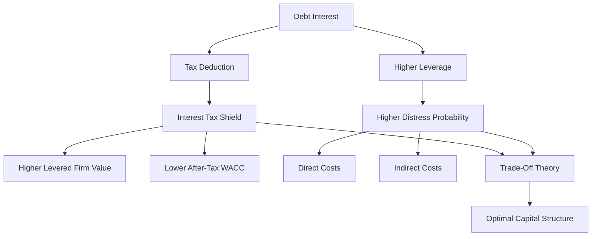

# Ubiquitous Language: Session 11-12 Capital Structure And Taxes

Source note: `session-11-12-capital-structure-and-taxes.md`
Course: Finance and Investment Management
Definition sources: local lecture deck and generated topic note; enriched with standard corporate-finance usage for standalone exam language.

## Tax-Shield Language

| Term | Definition | Aliases to avoid |
|---|---|---|
| **Interest Tax Deduction** | Rule that interest expense reduces taxable corporate profit. | tax-free debt |
| **Interest Tax Shield** | Tax saving caused by deductible interest payments. | interest payment |
| **Corporate Tax Rate** | Marginal tax rate used to value incremental tax savings. | average shareholder tax |
| **Taxable Income** | Income base on which corporate tax is paid after deductible expenses. | free cash flow |
| **Principal Repayment** | Repayment of borrowed amount; not tax deductible in the tax-shield examples. | interest |
| **Permanent Debt** | Debt amount maintained indefinitely. | any debt |
| **Present Value Of Tax Shield** | Value today of expected future tax savings from debt. | annual tax shield |

Core formulas:

```text
Interest tax shield = tau_c x interest payment

MM I with taxes:
V_L = V_U + PV(interest tax shield)

Permanent riskless debt shortcut:
PV(interest tax shield) = tau_c x D
```

## WACC With Taxes Language

| Term | Definition | Aliases to avoid |
|---|---|---|
| **After-Tax Debt Cost** | Debt cost after tax deductibility: `r_D x (1 - tau_c)`. | coupon rate |
| **Pre-Tax WACC** | Unlevered cost of capital before tax-shield benefit. | after-tax WACC |
| **After-Tax WACC** | WACC reduced by the tax deductibility of debt interest. | unlevered return |
| **Target Debt-To-Equity Ratio** | Financing policy where the firm adjusts debt and equity to maintain a leverage target. | fixed debt amount |
| **Levered Firm Value** | Market value of a firm using debt. | equity value |
| **Unlevered Firm Value** | Market value of the same operating assets without debt. | asset book value |

WACC formula:

```text
r_WACC = r_E x E/(D + E) + r_D x D/(D + E) x (1 - tau_c)
```

## Distress And Trade-Off Language

| Term | Definition | Aliases to avoid |
|---|---|---|
| **Financial Distress** | Condition where high debt creates risk of insolvency, constraint, or value loss even before formal bankruptcy. | bankruptcy only |
| **Direct Distress Cost** | Explicit cost of distress proceedings, such as legal and advisory fees. | lost sales |
| **Indirect Distress Cost** | Business damage from distress, such as customer loss, supplier concerns, employee exits, and missed projects. | lawyer fees |
| **Expected Distress Cost** | Probability-weighted value loss from possible distress. | current debt level |
| **Static Trade-Off Theory** | Theory that optimal debt balances tax-shield benefits against expected distress costs. | always borrow more |
| **Optimal Capital Structure** | Debt/equity mix that maximizes firm value or minimizes WACC after considering benefits and costs. | maximum debt |

## Relationships

- **Interest Tax Deduction** creates an **Interest Tax Shield**.
- **Interest Tax Shield** increases **Levered Firm Value** relative to **Unlevered Firm Value**.
- **After-Tax Debt Cost** lowers **After-Tax WACC**.
- **Permanent Debt** allows the shortcut `PV tax shield = tau_c x D`.
- **Financial Distress** limits the benefit of debt.
- **Static Trade-Off Theory** explains **Optimal Capital Structure** as a balance, not an extreme.

## Visual Memory Aid



## Example Dialogue

> **Student:** "If debt creates a tax shield, should every firm use 100% debt?"
>
> **Professor:** "No. **Interest Tax Shield** is the benefit side. **Financial Distress Costs** are the cost side. The optimum balances both."
>
> **Student:** "Can I multiply the tax rate by total debt every time?"
>
> **Professor:** "Only under the **Permanent Debt** shortcut assumptions. Otherwise value the actual expected tax shields."
>
> **Student:** "Is principal repayment tax deductible?"
>
> **Professor:** "No. In this lecture's tax shield, the deduction comes from interest, not principal repayment."

## Flagged Ambiguities

| Ambiguity | Canonical recommendation |
|---|---|
| "Tax shield" | Say annual **Interest Tax Shield** or **Present Value Of Tax Shield**. |
| "Debt benefit" | Specify lower taxes, lower after-tax WACC, or higher levered firm value. |
| "Cost of debt" | Specify pre-tax debt cost or **After-Tax Debt Cost**. |
| "Distress" | Separate **Direct Distress Cost** and **Indirect Distress Cost**. |
| "Optimal leverage" | State the tradeoff: marginal tax benefit versus expected distress cost. |

## Exam Trap Corrections

| Trap | Correction |
|---|---|
| Principal repayment creates a tax shield. | Interest is deductible; principal repayment is not. |
| Use `tau_c x D` for any debt. | Use it for permanent debt under the shortcut assumptions. |
| Taxes mean maximum debt is optimal. | Distress costs and other frictions limit debt. |
| Treat annual tax shield as firm value. | Firm value uses present value of future tax shields. |
| Forget after-tax debt cost in WACC. | Use `r_D x (1 - tau_c)`. |

## Cheat-Sheet Language

```text
Debt creates value through tax savings on interest.
Annual shield = tax rate x interest.
Levered value = unlevered value + PV of tax shield.
Too much debt destroys flexibility and creates distress costs, so the optimum is a tradeoff.
```
