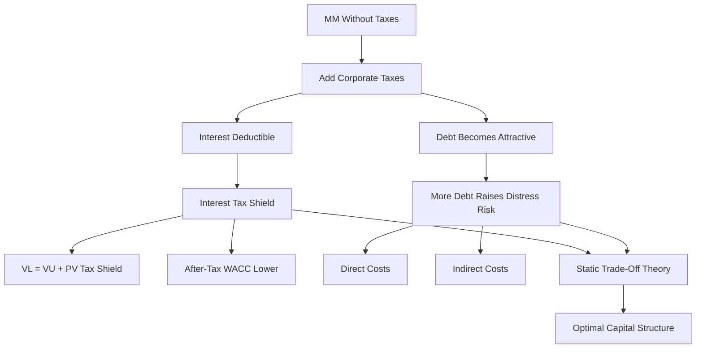

# Session 11-12: Capital Structure And Taxes

Source file: `finance-and-investment-management/raw/moodle-export-investment-and-financial-management-950881761-s26-20260604/Investment and  950881761 (S26)_2026064_1514/CW 27  30.06. _ 01.07./Lecture 1112 Capital Structure with Taxes.pdf`
Lecture folder: `finance-and-investment-management/`
Date processed: 2026-06-06
Course position: Corporate Finance lecture, sessions 11+12, after Capital Structure.

## High-Yield 80/20 Summary

The previous Capital Structure lecture used a perfect-market benchmark where financing does not create value. This lecture adds corporate taxes. Because interest is tax deductible, debt can create value through an interest tax shield. But real firms do not use 100% debt because financial distress costs rise with leverage.

Core exam logic:

1. Interest payments reduce taxable income.
2. The interest tax shield equals `corporate tax rate x interest payments`.
3. MM Proposition I with taxes: `V_L = V_U + PV(interest tax shield)`.
4. For permanent riskless debt, `PV(interest tax shield) = tau_c x D`.
5. With taxes, WACC declines with leverage because the after-tax cost of debt is lower.
6. Optimal capital structure balances tax-shield benefits against expected financial distress costs.

High-yield memory:

```text
Debt creates a tax benefit, but too much debt creates distress risk.
Optimal leverage is a tradeoff, not "always maximum debt."
```

## Interest Tax Deduction

Corporations pay taxes on profits after interest expense is deducted. Therefore, interest reduces corporate taxes.

German example intuition from the slides:

- Marginal tax rate on equity income with full distribution is about 48%.
- Marginal tax rate on debt income is about 30%.
- To generate the same after-tax income, equity financing requires higher before-tax income.

Finance implication:

```text
Tax deductibility makes debt attractive relative to equity.
```

## Interest Tax Shield

Definition:

```text
Interest tax shield = reduction in taxes due to tax-deductible interest
```

Formula:

```text
Interest tax shield = tau_c x interest payments
```

Macy's example logic from the deck:

- Interest expense = USD 400 million.
- Corporate tax rate = 35%.

```text
Tax shield = 35% x 400 million = 140 million
```

Interpretation: leverage lets the firm pay USD 140 million more to investors because less cash goes to taxes.

## Valuing The Tax Shield

When a firm uses debt, cash flows to investors increase by the interest tax shield.

```text
Cash flows to investors with leverage
= cash flows to investors without leverage + interest tax shield
```

The value of the tax shield is the present value of expected future tax savings.

## MM Proposition I With Taxes

With corporate taxes:

```text
V_L = V_U + PV(interest tax shield)
```

Variables:

- `V_L` = market value of levered firm.
- `V_U` = market value of unlevered firm.
- `PV(interest tax shield)` = present value of tax savings from debt.

Interpretation:

```text
Debt can increase firm value because tax savings are an additional cash flow to investors.
```

## Riskless Finite Tax Shield

If interest payments are known and risk-free, value the annual tax shields like an annuity.

DFB example:

- Interest payment = USD 80 million each year for 10 years.
- Tax rate = 25%.
- Risk-free rate = 5%.

Annual shield:

```text
25% x 80 million = 20 million
```

PV setup:

```text
PV(tax shield) = 20 million x [1 / 0.05] x [1 - 1/(1.05)^10]
               = about 154 million
```

Exam trap: principal repayment is not tax deductible, so it does not create an interest tax shield.

## Permanent Debt Tax Shield

If the firm keeps a constant amount of riskless debt permanently:

```text
annual interest tax shield = tau_c x r_f x D
PV(interest tax shield) = (tau_c x r_f x D) / r_f = tau_c x D
```

This is one of the cleanest formulas in the deck:

```text
PV(interest tax shield) = tau_c x D
```

It relies on the special assumption of permanent debt and appropriate discounting of the tax shield.

## WACC With Taxes

With tax-deductible interest:

```text
r_WACC = r_E x E/(D + E) + r_D x D/(D + E) x (1 - tau_c)
```

Expanded intuition:

```text
after-tax debt cost = r_D x (1 - tau_c)
```

Compared with pre-tax WACC, the after-tax WACC is reduced by the interest tax shield.

The deck also states:

```text
pre-tax WACC = unlevered cost of capital = r_U
```

With taxes, WACC is lower than the expected return on assets because part of the debt cost is effectively paid by the tax authority through lower taxes.

## Target Debt-To-Equity Ratio

If the firm adjusts leverage to maintain a target debt-to-equity ratio:

- value levered cash flows by discounting FCF with WACC,
- compare levered value `V_L` to unlevered value `V_U` to infer the tax-shield value.

Exam implication: use the formula that matches the financing policy in the problem. Constant debt and target leverage do not produce the same valuation shortcut.

## Leveraged Recapitalization With Tax Shield

Midco example from the deck:

- No debt.
- 20 million shares.
- Share price = USD 15.
- `V_U = 20 million x 15 = 300 million`.
- Firm borrows USD 100 million permanently.
- Tax rate = 21%.

Tax shield value:

```text
PV(tax shield) = tau_c x D = 21% x 100 million = 21 million
V_L = V_U + tax shield = 300 + 21 = 321 million
```

If debt is issued and shares are repurchased, original shareholders capture the tax-shield benefit when securities are fairly priced.

Important no-arbitrage point:

- The announcement of the repurchase should raise equity value immediately.
- Shareholders who tender and shareholders who hold should both receive the benefit when pricing is fair.

## Optimal Capital Structure

From a pure tax-saving perspective, leverage is attractive until interest equals EBIT, because debt shields taxable income.

But firms rarely use 100% debt.

Reason: financial distress costs.

## Financial Distress Costs

As leverage rises, the probability of insolvency or distress rises.

Real-world distress costs include:

| Cost type | Examples |
|---|---|
| Direct distress costs | lawyers, consultants, insolvency process costs |
| Indirect distress costs | lost customers, lost suppliers, employee exits, asset fire sales, inability to fund good projects |

The deck cites estimates of potential distress costs around 10% to 20% of firm value.

## Static Trade-Off Theory

Static trade-off theory:

```text
Optimal leverage balances the marginal tax-shield benefit of debt
against the marginal expected financial-distress cost.
```

The optimal capital structure minimizes WACC or maximizes firm value.

Managerial intuition:

- Stable firms with predictable taxable income can support more debt.
- Volatile firms, growth firms, or firms with intangible assets may use less debt because distress is more costly.

## Worked Calculations And Analogies

### Calculation 1: Annual Interest Tax Shield

Decision problem and method choice:

- The task asks how much tax is saved because interest is deductible.
- Use `tax rate x interest payment`.

Known inputs:

```text
Interest expense = USD 400m
Corporate tax rate = 35%
```

Formula and arithmetic:

```text
Interest tax shield = tau_c x interest expense
Interest tax shield = 35% x 400m
Interest tax shield = 0.35 x 400m
Interest tax shield = USD 140m
```

Interpretation: the firm pays USD 140m less tax because interest reduces taxable income.

Analogy: interest creates a tax coupon. The higher the deductible interest and tax rate, the larger the coupon.

Exam trap: principal repayment is not the tax shield. Deductibility comes from interest.

### Calculation 2: Finite Riskless Tax Shield PV

Decision problem and method choice:

- Known annual tax shields last for a finite horizon.
- Value them as an annuity at the appropriate risk-free rate when the shields are riskless.

Known inputs:

```text
Annual interest payment = USD 80m
Tax rate = 25%
Annual tax shield = 25% x 80m = USD 20m
Horizon = 10 years
Risk-free rate = 5%
```

Formula, substitution, and arithmetic:

```text
PV(tax shield) = annual shield x [1 - 1/(1+r)^N] / r
PV(tax shield) = 20m x [1 - 1/1.05^10] / 0.05
1.05^10 = 1.62889
1/1.05^10 = 0.61391
[1 - 1/1.05^10] / 0.05 = 7.72173
PV(tax shield) = 20m x 7.72173
PV(tax shield) = USD 154.43m
```

Interpretation: the ten annual USD 20m tax savings are worth USD 154.43m today at a 5% discount rate.

Analogy: the tax shield is a stream of ten tax-saving coupons. Present value prices the whole coupon book today.

Exam trap: do not add `10 x 20m = 200m` without discounting.

### Calculation 3: Permanent Debt Shortcut

Decision problem and method choice:

- The firm keeps a constant amount of riskless debt forever.
- Use the shortcut `PV(tax shield) = tau_c x D`.

Known inputs:

```text
Permanent debt D = USD 100m
Tax rate tau_c = 21%
Unlevered firm value V_U = USD 300m
```

Tax-shield value and levered value:

```text
PV(tax shield) = tau_c x D
PV(tax shield) = 21% x 100m
PV(tax shield) = USD 21m

V_L = V_U + PV(tax shield)
V_L = 300m + 21m
V_L = USD 321m
```

Interpretation: permanent debt adds USD 21m of value under the shortcut assumptions.

Analogy: permanent debt is a machine that produces the same tax-saving coupon forever; the shortcut capitalizes that machine's value.

Exam trap: do not use `tau_c x D` for a finite debt schedule unless the problem's assumptions justify it.

### Calculation 4: Leveraged Recapitalization Share Price With Tax Shield

Decision problem and method choice:

- The firm borrows permanently and repurchases shares.
- Fair pricing means the tax-shield benefit is reflected in the repurchase price.

Known inputs:

```text
Initial shares = 20m
Initial share price = USD 15
V_U = 20m x 15 = USD 300m
Permanent debt raised = USD 100m
PV tax shield = USD 21m
V_L = USD 321m
Debt value = USD 100m
Post-repurchase equity value = 321m - 100m = USD 221m
```

Fair repurchase price `P`:

```text
Shares repurchased = 100m / P
Shares remaining = 20m - 100m/P

P = equity value / shares remaining
P = 221m / (20m - 100m/P)

P x (20m - 100m/P) = 221m
20mP - 100m = 221m
20mP = 321m
P = USD 16.05
```

Interpretation: the price rises from USD 15.00 to USD 16.05 because the tax shield increases total firm value.

Analogy: the debt announcement adds a tax-shield bonus to the firm. Fair pricing spreads that bonus across shareholders whether they sell into the repurchase or keep holding.

Exam trap: do not repurchase shares at the old USD 15 price after a value-increasing tax-shield announcement.

### Calculation 5: After-Tax WACC

Decision problem and method choice:

- Project FCF is valued with WACC when target financing and risk assumptions match.
- Taxes reduce the debt component through `r_D x (1 - tau_c)`.

Known inputs:

```text
E = 200
D = 100
r_E = 12%
r_D = 6%
tau_c = 21%
```

Formula, substitution, and arithmetic:

```text
r_WACC = r_E x E/(D+E) + r_D x D/(D+E) x (1 - tau_c)
r_WACC = 12% x 200/300 + 6% x 100/300 x (1 - 0.21)
r_WACC = 12% x 0.6667 + 6% x 0.3333 x 0.79
r_WACC = 8.00% + 1.58%
r_WACC = 9.58%
```

Interpretation: the debt cost entering WACC is lower after tax because interest deductibility shifts part of the cost away from the firm.

Analogy: after-tax WACC is a blended financing bill where the tax authority pays part of the interest line.

Exam trap: forgetting `(1 - tau_c)` overstates WACC and can make good projects look worse.

## Exam Relevance

Likely prompts:

- "Compute the interest tax shield."
- "Value the tax shield for finite riskless interest payments."
- "Use `V_L = V_U + PV(tax shield)`."
- "Use `PV(tax shield) = tau_c x D` for permanent debt."
- "Explain why WACC declines with leverage when debt interest is tax deductible."
- "Explain why firms do not use 100% debt."
- "State the static trade-off theory."

Common traps:

- Applying `tau_c x D` when debt is not permanent or the assumptions do not fit.
- Treating principal repayment as tax deductible.
- Saying taxes make debt always optimal without distress costs.
- Forgetting that the WACC formula uses after-tax debt cost.
- Confusing tax shield value with accounting interest expense.

## Visual Knowledge Map



## Subject Knowledge Graph

| Node | Meaning | Exam Relevance |
|---|---|---|
| Interest tax deduction | Interest reduces taxable income | Why debt creates tax benefits |
| Interest tax shield | Tax saving from deductible interest | Main calculation |
| Levered firm value | Value of firm with debt | `V_L` formula |
| Unlevered firm value | Value of firm without debt | Benchmark for tax-shield value |
| Permanent debt | Debt level maintained indefinitely | Shortcut `tau_c x D` |
| After-tax WACC | WACC with debt cost multiplied by `(1 - tau_c)` | Discount-rate calculation |
| Target leverage | Financing policy with maintained D/E ratio | Affects tax-shield valuation approach |
| Leveraged recapitalization | Borrowing to repurchase shares | Tax-shield benefit allocation |
| Financial distress cost | Cost created by high leverage and insolvency risk | Limits debt use |
| Static trade-off theory | Optimal debt balances tax benefits and distress costs | Main real-world capital-structure theory |

| From | Relationship | To | Why It Matters |
|---|---|---|---|
| Interest payments | reduce | taxable income | Creates tax shield |
| Interest tax shield | increases | cash flow to investors | Raises levered firm value |
| Corporate taxes | modify | MM Proposition I | Financing can create value |
| Permanent debt | enables | `PV tax shield = tau_c x D` | Common exam shortcut |
| Tax deductibility | lowers | after-tax WACC | Debt can reduce discount rate |
| Leverage | increases | financial distress risk | Prevents unlimited debt |
| Financial distress costs | offset | tax-shield benefits | Drives optimal capital structure |
| Static trade-off theory | balances | tax shield and distress cost | Explains real-world leverage choice |

## Retrieval Prompts

Closed-book questions:

1. Define the interest tax shield and give the formula.
2. State MM Proposition I with corporate taxes.
3. When does `PV(tax shield) = tau_c x D` apply?
4. Why does WACC decline with leverage when interest is tax deductible?
5. Why do firms not use 100% debt?

Application prompts:

1. A firm has EUR 10 million interest expense and a 30% tax rate. Compute the tax shield.
2. A firm borrows EUR 100 million permanently at a 25% tax rate. Compute the tax-shield value.
3. A firm has `V_U = 300`, debt `100`, and tax rate `21%`. Compute `V_L`.
4. Explain why a risky growth firm might choose less debt than a stable utility.
5. Distinguish direct and indirect financial distress costs with examples.

## Practice Tasks

1. Compute finite annuity tax-shield value from interest, tax rate, maturity, and risk-free rate.
2. Use after-tax WACC to calculate a project discount rate.
3. Explain who captures the tax-shield benefit in a fairly priced leveraged recapitalization.
4. Draw the trade-off curve: tax benefit rises with debt, expected distress cost rises with debt, optimum where net value is highest.

## Connections

Previous notes:

- `finance-and-investment-management/wiki/session-09-10-capital-structure/session-09-10-capital-structure.md`
- `finance-and-investment-management/wiki/session-07-08-cost-of-capital/session-07-08-cost-of-capital.md`
- `finance-and-investment-management/wiki/session-05-06-capital-budgeting/session-05-06-capital-budgeting.md`

Cross-course links:

- Business Law: insolvency and creditor rights are legal mechanisms behind distress, but this lecture treats them as value costs.
- Organization: distress can damage stakeholder trust, supplier relationships, employee retention, and strategic flexibility.

## Weakness Flags

- First active recall pending.
- Drill when the permanent-debt tax-shield shortcut is valid.
- Drill principal repayment versus interest tax deductibility.
- Drill why taxes favor debt but distress prevents unlimited debt.
