# German A1.1 Course Knowledge Graph

This file aggregates the German A1.1 concepts learned so far. It is lecture-scoped only.

Last updated: 2026-07-08

## Course-Level Mermaid Graph

```mermaid
graph TD
    GER[German A1.1] --> L1[Lektion 1: Identity And Origin]
    GER --> L2[Lektion 2: Hobbies And Appointments]
    GER --> L3[Lektion 3: City, Articles, Negation, Adjectives]
    GER --> L4[Lektion 4: Food, Shopping, Meals, Accusative]
    GER --> L5[Lektion 5: Time, Family, Appointments, Modal Verbs]
    GER --> L6[Lektion 6: Free Time, Invitations, Separable Verbs]
    GER --> COV[A1.1 CEFR And Goethe Coverage]

    L1 --> GREET[Greeting And Goodbye]
    L1 --> REG[du vs Sie Register]
    L1 --> ID[Name And Identity]
    L1 --> ORIGIN[Origin, Residence, Languages]
    L1 --> NUM[Numbers, Phone, Email, Alphabet]
    L1 --> V2[Verb Position 2]
    L1 --> VERBS1[Present Tense: heißen, kommen, wohnen, sprechen, sein]

    L2 --> HOB[Hobbies And Preferences]
    L2 --> PREF[gern, nicht gern, nicht so gern]
    L2 --> YESNO[Yes/No Questions]
    L2 --> BRACKET[Sentence Bracket]
    L2 --> APPT[Appointment And Course Offer Dialogue]
    L2 --> JOBS[Jobs, Gendered Nouns, Plural]
    L2 --> VERBS2[Present Tense: sein, haben, machen, gehen, spielen]
    L2 --> NUM2[Numbers 20-1000]

    L3 --> CITY[City And Hamburg Vocabulary]
    L3 --> ART[Definite And Indefinite Articles]
    L3 --> NOM[Nominative Subject]
    L3 --> NEG[Negative Articles: kein]
    L3 --> ADJ[Adjective Endings]
    L3 --> DIR[Directions And Places]
    L3 --> QWORDS[Question Words]

    L4 --> FOOD[Lebensmittel]
    L4 --> DRINK[Getränke]
    L4 --> SHOP[Beim Einkaufen]
    L4 --> MEAL[Beim Essen]
    L4 --> QTY[Quantity Phrases]
    L4 --> REQ[Polite Request: ich möchte]
    L4 --> ACC[Accusative Objects]
    L4 --> ACCADJ[Accusative Adjective Endings]
    L4 --> BOSS[Das Verb ist der Boss]
    L4 --> TAKE[nehmen And mögen]
    L4 --> PRICE[Price Question: kosten]
    L4 --> NOTGERN[kein vs nicht gern]

    L5 --> TIME[Wie spät ist es?]
    L5 --> WHEN[Wann? um...]
    L5 --> DUR[Wie lange? von...bis]
    L5 --> FAMILY[Meine Familie]
    L5 --> POSS[Possessive Articles]
    L5 --> TERM[Termin / Verabredung]
    L5 --> MODAL[Modal Verbs: müssen, können, wollen]
    L5 --> INFEND[Infinitive At End]

    L6 --> FREE[Freizeitaktivitäten]
    L6 --> INV[Einladung]
    L6 --> SEP[Trennbare Verben]
    L6 --> PREFIX[Prefix At Sentence End]
    L6 --> PARTY[Party Planning]

    COV --> CEFR[CEFR A1 Boundary]
    COV --> GOETHE[Goethe A1 Vocabulary Domains]
    COV --> VHS[VHS A1 Grammar Sequence]
    COV --> PROD[Production Chunks]

    REG -->|selects form for| ID
    ID -->|uses| VERBS1
    ORIGIN -->|uses| VERBS1
    V2 -->|constrains| ID
    V2 -->|constrains| HOB
    YESNO -->|moves finite verb to start| HOB
    BRACKET -->|splits finite verb and second part| HOB
    JOBS -->|introduces| ART
    ART -->|marks| NOM
    NEG -->|negates noun phrases using article pattern| ART
    ADJ -->|depends on gender/number from| ART
    QWORDS -->|combine with V2 for| DIR

    ART -->|marks article choice for| FOOD
    NEG -->|negates food/drink nouns| FOOD
    QTY -->|combines with| FOOD
    QTY -->|combines with| DRINK
    REQ -->|drives| SHOP
    REQ -->|triggers| ACC
    TAKE -->|triggers| ACC
    ACC -->|extends into| ACCADJ
    BOSS -->|separates| NOM
    BOSS -->|separates| ACC
    NOTGERN -->|contrasts noun negation with| PREF
    PRICE -->|closes| SHOP
    MEAL -->|uses| FOOD
    MEAL -->|uses| DRINK

    APPT -->|extends into| TERM
    TIME -->|supports| TERM
    WHEN -->|answers point time for| TERM
    DUR -->|answers span for| TERM
    FAMILY -->|requires| POSS
    POSS -->|uses article logic from| ART
    MODAL -->|creates| INFEND
    INFEND -->|uses| BRACKET

    FREE -->|uses activity chunks from| HOB
    INV -->|uses| YESNO
    SEP -->|uses| BRACKET
    SEP -->|places| PREFIX
    PARTY -->|reuses| FOOD
    PARTY -->|reuses| TIME
    PARTY -->|uses| INV
    PARTY -->|uses| SEP

    CEFR -->|constrains| PROD
    GOETHE -->|supplies| PROD
    VHS -->|confirms| PROD
```

## Subject Graph Index

| Subject | Wiki Note | Main Visual Logic | Last Updated |
|---|---|---|---|
| Course logistics | `german-a1-1/wiki/_course-logistics.md` | Excluded from conceptual graph | 2026-07-08 |
| Lektion 1 | `german-a1-1/wiki/lektion-01-greetings-identity-and-origin/lektion-01-greetings-identity-and-origin.md` | Identity speech acts flow into verb conjugation and V2 word order | 2026-06-01 |
| Lektion 2 | `german-a1-1/wiki/lektion-02-hobbies-verb-position-and-appointments/lektion-02-hobbies-verb-position-and-appointments.md` | Preferences and appointments use present-tense verbs, yes/no questions, and the sentence bracket | 2026-06-01 |
| Lektion 3 | `german-a1-1/wiki/lektion-03-city-articles-negation-and-adjectives/lektion-03-city-articles-negation-and-adjectives.md` | City descriptions require article choice, negation, adjective endings, and question formulation | 2026-06-01 |
| Lektion 4 | `german-a1-1/wiki/lektion-04-food-drink-shopping-and-meals/lektion-04-food-drink-shopping-and-meals.md` | Food and drink nouns combine with quantity phrases, polite requests, accusative objects, adjective-object phrases, `nehmen`, `mögen`, and price/meal dialogue | 2026-07-08 |
| Lektion 5 | `german-a1-1/wiki/lektion-05-time-family-appointments-and-modal-verbs/lektion-05-time-family-appointments-and-modal-verbs.md` | Time, family, appointments, possessive articles, and modal verbs use the sentence bridge to produce schedulable A1 speech | 2026-07-08 |
| Lektion 6 | `german-a1-1/wiki/lektion-06-free-time-invitations-and-separable-verbs/lektion-06-free-time-invitations-and-separable-verbs.md` | Free-time and party-planning dialogue depends on yes/no questions, invitations, separable verbs, and prefix-at-end word order | 2026-07-08 |
| A1.1 CEFR and Goethe Coverage | `german-a1-1/wiki/a1-1-cefr-goethe-coverage/a1-1-cefr-goethe-coverage.md` | Official/trusted A1 sources define the practical A1.1 production boundary and missing vocabulary/grammar layer | 2026-06-04 |

## Nodes

| Node | Meaning | Source Note |
|---|---|---|
| `du` | Informal second-person address | `lektion-01-greetings-identity-and-origin/lektion-01-greetings-identity-and-origin.md` |
| `Sie` | Formal second-person address | `lektion-01-greetings-identity-and-origin/lektion-01-greetings-identity-and-origin.md` |
| Verb position 2 | Finite verb occupies second sentence position in statements and W-questions | `lektion-01-greetings-identity-and-origin/lektion-01-greetings-identity-and-origin.md` |
| W-question | Information question with words such as `wer`, `wie`, `wo`, `woher`, `was`, `wann` | `lektion-01-greetings-identity-and-origin/lektion-01-greetings-identity-and-origin.md` |
| Yes/no question | Question beginning with the finite verb | `lektion-02-hobbies-verb-position-and-appointments/lektion-02-hobbies-verb-position-and-appointments.md`; `lektion-06-free-time-invitations-and-separable-verbs/lektion-06-free-time-invitations-and-separable-verbs.md` |
| Sentence bracket | German pattern where the finite verb appears near the front and a second verb part appears at the end | `lektion-02-hobbies-verb-position-and-appointments/lektion-02-hobbies-verb-position-and-appointments.md`; `lektion-05-time-family-appointments-and-modal-verbs/lektion-05-time-family-appointments-and-modal-verbs.md` |
| Nominative subject | Case used for the subject | `lektion-03-city-articles-negation-and-adjectives/lektion-03-city-articles-negation-and-adjectives.md`; `lektion-04-food-drink-shopping-and-meals/lektion-04-food-drink-shopping-and-meals.md` |
| Definite article | `der`, `das`, `die`, plural `die` | `lektion-03-city-articles-negation-and-adjectives/lektion-03-city-articles-negation-and-adjectives.md` |
| Indefinite article | `ein`, `ein`, `eine`, zero plural | `lektion-03-city-articles-negation-and-adjectives/lektion-03-city-articles-negation-and-adjectives.md` |
| Negative article | `kein`, `kein`, `keine`, plural `keine` | `lektion-03-city-articles-negation-and-adjectives/lektion-03-city-articles-negation-and-adjectives.md`; `lektion-04-food-drink-shopping-and-meals/lektion-04-food-drink-shopping-and-meals.md` |
| Attributive adjective ending | Ending on an adjective before a noun, now extended into accusative object phrases | `lektion-03-city-articles-negation-and-adjectives/lektion-03-city-articles-negation-and-adjectives.md`; `lektion-04-food-drink-shopping-and-meals/lektion-04-food-drink-shopping-and-meals.md` |
| Lebensmittel | Food items such as bread, cheese, fruit, rice, and pasta | `lektion-04-food-drink-shopping-and-meals/lektion-04-food-drink-shopping-and-meals.md` |
| Getränk | Drink item such as water, coffee, tea, milk, juice, or beer | `lektion-04-food-drink-shopping-and-meals/lektion-04-food-drink-shopping-and-meals.md` |
| Accusative object | Direct object after buying/ordering/needing/liking/having/seeing verbs, with masculine `einen/keinen` as the main A1.1 visible change | `lektion-04-food-drink-shopping-and-meals/lektion-04-food-drink-shopping-and-meals.md` |
| `kein` vs `nicht gern` | Absolute noun negation versus negative preference for an action | `lektion-04-food-drink-shopping-and-meals/lektion-04-food-drink-shopping-and-meals.md` |
| Time point | `um ... Uhr`, `am Freitag`, `wann` | `lektion-05-time-family-appointments-and-modal-verbs/lektion-05-time-family-appointments-and-modal-verbs.md` |
| Duration | `wie lange`, `von ... bis ...` | `lektion-05-time-family-appointments-and-modal-verbs/lektion-05-time-family-appointments-and-modal-verbs.md` |
| Possessive article | `mein/meine`, `dein/deine`, `sein/seine`, `ihr/ihre` | `lektion-05-time-family-appointments-and-modal-verbs/lektion-05-time-family-appointments-and-modal-verbs.md` |
| Modal verb | `müssen`, `können`, `wollen` with infinitive at the end | `lektion-05-time-family-appointments-and-modal-verbs/lektion-05-time-family-appointments-and-modal-verbs.md` |
| Free-time activity | Activity chunks such as `Fußball spielen`, `Fahrrad fahren`, `spazieren gehen` | `lektion-06-free-time-invitations-and-separable-verbs/lektion-06-free-time-invitations-and-separable-verbs.md` |
| Invitation | Social request to come to a party/event | `lektion-06-free-time-invitations-and-separable-verbs/lektion-06-free-time-invitations-and-separable-verbs.md` |
| Separable verb | Verb with prefix moved to the end in a main clause, e.g. `einladen`, `anrufen`, `anfangen` | `lektion-06-free-time-invitations-and-separable-verbs/lektion-06-free-time-invitations-and-separable-verbs.md` |
| Party planning | Integrated social task using invitation, time, food/drink, and separable verbs | `lektion-06-free-time-invitations-and-separable-verbs/lektion-06-free-time-invitations-and-separable-verbs.md` |
| CEFR A1 boundary | Official beginner communication boundary for simple concrete everyday language | `a1-1-cefr-goethe-coverage/a1-1-cefr-goethe-coverage.md` |
| Production chunk | Memorized sentence pattern that combines vocabulary and grammar for active output | `a1-1-cefr-goethe-coverage/a1-1-cefr-goethe-coverage.md` |

## Edges

| From | Relationship | To | Source Note |
|---|---|---|---|
| Register choice | selects | `du` or `Sie` forms | `lektion-01-greetings-identity-and-origin/lektion-01-greetings-identity-and-origin.md` |
| W-question | keeps finite verb in | position 2 | `lektion-01-greetings-identity-and-origin/lektion-01-greetings-identity-and-origin.md` |
| Yes/no question | starts with | finite verb | `lektion-02-hobbies-verb-position-and-appointments/lektion-02-hobbies-verb-position-and-appointments.md`; `lektion-06-free-time-invitations-and-separable-verbs/lektion-06-free-time-invitations-and-separable-verbs.md` |
| Preference statement | uses | `gern`, `nicht gern`, `nicht so gern` | `lektion-02-hobbies-verb-position-and-appointments/lektion-02-hobbies-verb-position-and-appointments.md`; `lektion-04-food-drink-shopping-and-meals/lektion-04-food-drink-shopping-and-meals.md` |
| Sentence bracket | places second verb part at | sentence end | `lektion-02-hobbies-verb-position-and-appointments/lektion-02-hobbies-verb-position-and-appointments.md`; `lektion-05-time-family-appointments-and-modal-verbs/lektion-05-time-family-appointments-and-modal-verbs.md` |
| Article gender | determines | adjective ending | `lektion-03-city-articles-negation-and-adjectives/lektion-03-city-articles-negation-and-adjectives.md` |
| Negative article | follows | indefinite article pattern | `lektion-03-city-articles-negation-and-adjectives/lektion-03-city-articles-negation-and-adjectives.md` |
| Polite request | triggers | accusative object checking | `lektion-04-food-drink-shopping-and-meals/lektion-04-food-drink-shopping-and-meals.md` |
| Accusative object | extends into | adjective-object noun phrases | `lektion-04-food-drink-shopping-and-meals/lektion-04-food-drink-shopping-and-meals.md` |
| `kein` | contrasts with | `nicht gern` | `lektion-04-food-drink-shopping-and-meals/lektion-04-food-drink-shopping-and-meals.md` |
| Time point | answers | appointment scheduling question | `lektion-05-time-family-appointments-and-modal-verbs/lektion-05-time-family-appointments-and-modal-verbs.md` |
| Duration | answers | `wie lange` | `lektion-05-time-family-appointments-and-modal-verbs/lektion-05-time-family-appointments-and-modal-verbs.md` |
| Possessive article | depends on | article gender/number pattern | `lektion-05-time-family-appointments-and-modal-verbs/lektion-05-time-family-appointments-and-modal-verbs.md` |
| Modal verb | requires | infinitive at the end | `lektion-05-time-family-appointments-and-modal-verbs/lektion-05-time-family-appointments-and-modal-verbs.md` |
| Free-time prompt | uses | activity chunks | `lektion-06-free-time-invitations-and-separable-verbs/lektion-06-free-time-invitations-and-separable-verbs.md` |
| Invitation | uses | yes/no question and modal availability | `lektion-06-free-time-invitations-and-separable-verbs/lektion-06-free-time-invitations-and-separable-verbs.md` |
| Separable verb | places | prefix at sentence end | `lektion-06-free-time-invitations-and-separable-verbs/lektion-06-free-time-invitations-and-separable-verbs.md` |
| Party planning | reuses | Lektion 4 food and Lektion 5 time | `lektion-06-free-time-invitations-and-separable-verbs/lektion-06-free-time-invitations-and-separable-verbs.md` |
| CEFR A1 boundary | constrains | A1.1 course-local scope | `a1-1-cefr-goethe-coverage/a1-1-cefr-goethe-coverage.md` |
| Official vocabulary boundary | guides | production chunk selection | `a1-1-cefr-goethe-coverage/a1-1-cefr-goethe-coverage.md` |
