# German A1.1 Course Knowledge Graph

This file aggregates the German A1.1 concepts learned so far. It is lecture-scoped only.

Last updated: 2026-06-04

## Course-Level Mermaid Graph

```mermaid
graph TD
    GER[German A1.1] --> L1[Lektion 1: Identity And Origin]
    GER --> L2[Lektion 2: Hobbies And Appointments]
    GER --> L3[Lektion 3: City, Articles, Negation, Adjectives]
    GER --> L4[Lektion 4: Food, Shopping, Meals]
    GER --> COV[A1.1 CEFR And Goethe Coverage]

    L1 --> GREET[Greeting And Goodbye]
    L1 --> REG[du vs Sie Register]
    L1 --> ID[Name And Identity]
    L1 --> ORIGIN[Origin, Residence, Languages]
    L1 --> NUM[Numbers, Phone, Email, Alphabet]
    L1 --> V2[Verb Position 2]
    L1 --> VERBS1[Present Tense: heißen, kommen, wohnen, sprechen, sein]

    L2 --> HOB[Hobbies And Preferences]
    L2 --> PREF[gern, nicht gern, nicht so gern]
    L2 --> YESNO[Yes/No Questions]
    L2 --> BRACKET[Sentence Bracket With Separable Verb Phrases]
    L2 --> APPT[Appointment And Course Offer Dialogue]
    L2 --> JOBS[Jobs, Gendered Nouns, Plural]
    L2 --> VERBS2[Present Tense: sein, haben, machen, gehen, spielen]
    L2 --> NUM2[Numbers 20-1000]

    L3 --> CITY[City And Hamburg Vocabulary]
    L3 --> ART[Definite And Indefinite Articles]
    L3 --> NOM[Nominative Subject]
    L3 --> NEG[Negative Articles: kein]
    L3 --> ADJ[Adjective Endings After Indefinite Articles]
    L3 --> DIR[Directions And Places]
    L3 --> QWORDS[Question Words]

    L4 --> FOOD[Lebensmittel]
    L4 --> DRINK[Getränke]
    L4 --> SHOP[Beim Einkaufen]
    L4 --> MEAL[Beim Essen]
    L4 --> QTY[Quantity Phrases]
    L4 --> REQ[Polite Request: ich möchte]
    L4 --> ACC[Accusative Objects In Shopping]
    L4 --> TAKE[nehmen And mögen]
    L4 --> PRICE[Price Question: kosten]

    COV --> CEFR[CEFR A1 Boundary]
    COV --> GOETHE[Goethe A1 Vocabulary Domains]
    COV --> VHS[VHS A1 Grammar Sequence]
    COV --> K5[Kapitel 5: Alltag, Time, Family]
    COV --> K6[Kapitel 6: Free Time, Celebrations, Restaurant]
    COV --> PROD[Production Chunks]

    REG -->|selects form for| ID
    ID -->|uses| VERBS1
    ORIGIN -->|uses| VERBS1
    V2 -->|constrains| ID
    V2 -->|constrains| HOB
    YESNO -->|moves finite verb to start| HOB
    BRACKET -->|splits finite verb and infinitive/noun part| HOB
    JOBS -->|introduces| ART
    ART -->|marks| NOM
    NEG -->|negates noun phrases using article pattern| ART
    ADJ -->|depends on gender/number from| ART
    QWORDS -->|combine with V2 for| DIR
    ART -->|marks article choice for| FOOD
    NEG -->|negates food/drink nouns| FOOD
    QTY -->|combines with| FOOD
    QTY -->|combines with| DRINK
    REQ -->|drives| SHOP
    REQ -->|triggers| ACC
    TAKE -->|triggers| ACC
    PRICE -->|closes| SHOP
    MEAL -->|uses| FOOD
    MEAL -->|uses| DRINK
    CEFR -->|constrains| PROD
    GOETHE -->|supplies| PROD
    VHS -->|confirms| PROD
    K5 -->|extends| APPT
    K6 -->|extends| MEAL
```

## Subject Graph Index

| Subject | Wiki Note | Main Visual Logic | Last Updated |
|---|---|---|---|
| Course logistics | `german-a1-1/wiki/_course-logistics.md` | Excluded from conceptual graph | 2026-06-01 |
| Lektion 1 | `german-a1-1/wiki/lektion-01-greetings-identity-and-origin/lektion-01-greetings-identity-and-origin.md` | Identity speech acts flow into verb conjugation and V2 word order | 2026-06-01 |
| Lektion 2 | `german-a1-1/wiki/lektion-02-hobbies-verb-position-and-appointments/lektion-02-hobbies-verb-position-and-appointments.md` | Preferences and appointments use present-tense verbs, yes/no questions, and the sentence bracket | 2026-06-01 |
| Lektion 3 | `german-a1-1/wiki/lektion-03-city-articles-negation-and-adjectives/lektion-03-city-articles-negation-and-adjectives.md` | City descriptions require article choice, negation, adjective endings, and question formulation | 2026-06-01 |
| Lektion 4 | `german-a1-1/wiki/lektion-04-food-drink-shopping-and-meals/lektion-04-food-drink-shopping-and-meals.md` | Food and drink nouns combine with quantity phrases, polite requests, accusative objects, `nehmen`, `mögen`, and price/meal dialogue | 2026-06-04 |
| A1.1 CEFR and Goethe Coverage | `german-a1-1/wiki/a1-1-cefr-goethe-coverage/a1-1-cefr-goethe-coverage.md` | Official/trusted A1 sources define the practical A1.1 production boundary and missing vocabulary/grammar layer | 2026-06-04 |

## Nodes

| Node | Meaning | Source Note |
|---|---|---|
| `du` | Informal second-person address | `lektion-01-greetings-identity-and-origin/lektion-01-greetings-identity-and-origin.md` |
| `Sie` | Formal second-person address | `lektion-01-greetings-identity-and-origin/lektion-01-greetings-identity-and-origin.md` |
| Verb position 2 | Finite verb occupies second sentence position in statements and W-questions | `lektion-01-greetings-identity-and-origin/lektion-01-greetings-identity-and-origin.md` |
| W-question | Information question with words such as `wer`, `wie`, `wo`, `woher`, `was`, `wann` | `lektion-01-greetings-identity-and-origin/lektion-01-greetings-identity-and-origin.md` |
| Yes/no question | Question beginning with the finite verb | `lektion-02-hobbies-verb-position-and-appointments/lektion-02-hobbies-verb-position-and-appointments.md` |
| Sentence bracket | German pattern where the finite verb appears in position 2 and a second verb part appears at the end | `lektion-02-hobbies-verb-position-and-appointments/lektion-02-hobbies-verb-position-and-appointments.md` |
| Nominative | Case used for the subject | `lektion-03-city-articles-negation-and-adjectives/lektion-03-city-articles-negation-and-adjectives.md` |
| Definite article | `der`, `das`, `die`, plural `die` | `lektion-03-city-articles-negation-and-adjectives/lektion-03-city-articles-negation-and-adjectives.md` |
| Indefinite article | `ein`, `ein`, `eine`, zero plural | `lektion-03-city-articles-negation-and-adjectives/lektion-03-city-articles-negation-and-adjectives.md` |
| Negative article | `kein`, `kein`, `keine`, plural `keine` | `lektion-03-city-articles-negation-and-adjectives/lektion-03-city-articles-negation-and-adjectives.md` |
| Attributive adjective ending | Ending on an adjective before a noun, such as `ein langer Zug` | `lektion-03-city-articles-negation-and-adjectives/lektion-03-city-articles-negation-and-adjectives.md` |
| Lebensmittel | Food items such as bread, cheese, fruit, rice, and pasta | `lektion-04-food-drink-shopping-and-meals/lektion-04-food-drink-shopping-and-meals.md` |
| Getränk | Drink item such as water, coffee, tea, milk, juice, or beer | `lektion-04-food-drink-shopping-and-meals/lektion-04-food-drink-shopping-and-meals.md` |
| Quantity phrase | Product amount such as `ein Kilo`, `eine Flasche`, `ein Glas`, or `eine Tasse` | `lektion-04-food-drink-shopping-and-meals/lektion-04-food-drink-shopping-and-meals.md` |
| Polite request | A1 buying/ordering pattern with `ich möchte ...` | `lektion-04-food-drink-shopping-and-meals/lektion-04-food-drink-shopping-and-meals.md` |
| Accusative object | Direct object after buying/ordering/needing/liking verbs, with masculine `einen/keinen` as the main A1.1 visible change | `lektion-04-food-drink-shopping-and-meals/lektion-04-food-drink-shopping-and-meals.md`; `a1-1-cefr-goethe-coverage/a1-1-cefr-goethe-coverage.md` |
| `nehmen` | Restaurant/shop choice pattern, e.g. `Ich nehme die Suppe` | `lektion-04-food-drink-shopping-and-meals/lektion-04-food-drink-shopping-and-meals.md` |
| `mögen` | Liking pattern, e.g. `Ich mag Kaffee`; `Ich mag keinen Fisch` | `lektion-04-food-drink-shopping-and-meals/lektion-04-food-drink-shopping-and-meals.md` |
| Price question | Buying pattern with `Was kostet ...?` | `lektion-04-food-drink-shopping-and-meals/lektion-04-food-drink-shopping-and-meals.md` |
| CEFR A1 boundary | Official beginner communication boundary for simple concrete everyday language | `a1-1-cefr-goethe-coverage/a1-1-cefr-goethe-coverage.md` |
| Production chunk | Memorized sentence pattern that combines vocabulary and grammar for active output | `a1-1-cefr-goethe-coverage/a1-1-cefr-goethe-coverage.md` |
| Daily routine layer | Alltag, time expressions, appointments, and family vocabulary from local Kapitel 5 headings plus official A1 alignment | `a1-1-cefr-goethe-coverage/a1-1-cefr-goethe-coverage.md` |
| Restaurant/social layer | Free time, celebrations, restaurant ordering, paying, and polite social chunks from local Kapitel 6 headings plus official A1 alignment | `a1-1-cefr-goethe-coverage/a1-1-cefr-goethe-coverage.md` |

## Edges

| From | Relationship | To | Source Note |
|---|---|---|---|
| Register choice | selects | `du` or `Sie` forms | `lektion-01-greetings-identity-and-origin/lektion-01-greetings-identity-and-origin.md` |
| W-question | keeps finite verb in | position 2 | `lektion-01-greetings-identity-and-origin/lektion-01-greetings-identity-and-origin.md` |
| Yes/no question | starts with | finite verb | `lektion-02-hobbies-verb-position-and-appointments/lektion-02-hobbies-verb-position-and-appointments.md` |
| Preference statement | uses | `gern`, `nicht gern`, `nicht so gern` | `lektion-02-hobbies-verb-position-and-appointments/lektion-02-hobbies-verb-position-and-appointments.md` |
| Sentence bracket | places second verb part at | sentence end | `lektion-02-hobbies-verb-position-and-appointments/lektion-02-hobbies-verb-position-and-appointments.md` |
| Article gender | determines | adjective ending | `lektion-03-city-articles-negation-and-adjectives/lektion-03-city-articles-negation-and-adjectives.md` |
| Negative article | follows | indefinite article pattern | `lektion-03-city-articles-negation-and-adjectives/lektion-03-city-articles-negation-and-adjectives.md` |
| Question words | drive | city/direction information requests | `lektion-03-city-articles-negation-and-adjectives/lektion-03-city-articles-negation-and-adjectives.md` |
| Article choice | controls | food and drink noun phrases | `lektion-04-food-drink-shopping-and-meals/lektion-04-food-drink-shopping-and-meals.md` |
| Quantity phrase | specifies | food/drink amount | `lektion-04-food-drink-shopping-and-meals/lektion-04-food-drink-shopping-and-meals.md` |
| Polite request | initiates | shopping or ordering dialogue | `lektion-04-food-drink-shopping-and-meals/lektion-04-food-drink-shopping-and-meals.md` |
| Polite request | triggers | accusative object checking | `lektion-04-food-drink-shopping-and-meals/lektion-04-food-drink-shopping-and-meals.md` |
| `nehmen` | triggers | accusative object checking | `lektion-04-food-drink-shopping-and-meals/lektion-04-food-drink-shopping-and-meals.md` |
| `mögen` | supports | food preference statements | `lektion-04-food-drink-shopping-and-meals/lektion-04-food-drink-shopping-and-meals.md` |
| Price question | completes | shopping exchange | `lektion-04-food-drink-shopping-and-meals/lektion-04-food-drink-shopping-and-meals.md` |
| Meal phrase | contextualizes | eating and drinking sentences | `lektion-04-food-drink-shopping-and-meals/lektion-04-food-drink-shopping-and-meals.md` |
| CEFR A1 boundary | constrains | A1.1 course-local scope | `a1-1-cefr-goethe-coverage/a1-1-cefr-goethe-coverage.md` |
| Official vocabulary boundary | guides | production chunk selection | `a1-1-cefr-goethe-coverage/a1-1-cefr-goethe-coverage.md` |
| Daily routine layer | extends | appointment and time language | `a1-1-cefr-goethe-coverage/a1-1-cefr-goethe-coverage.md` |
| Restaurant/social layer | extends | food and meal language | `a1-1-cefr-goethe-coverage/a1-1-cefr-goethe-coverage.md` |
