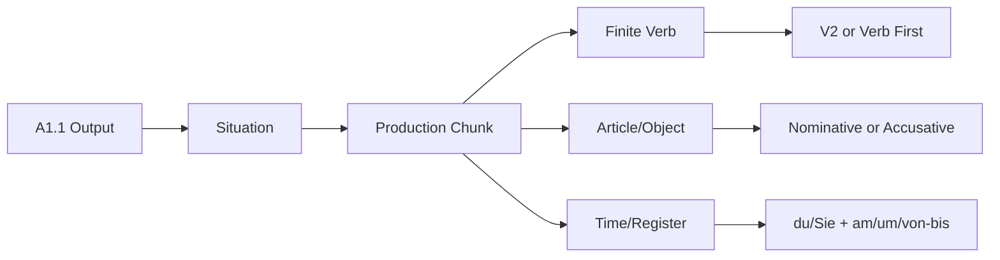

# Context: A1.1 CEFR And Goethe Coverage Roadmap

Source note: `a1-1-cefr-goethe-coverage.md`

## Source Boundary

This file defines the language used for the A1.1 coverage layer. `A1` is the official CEFR level; `A1.1` is the course-local first-half working scope. Terms are marked as `local`, `enriched`, or `verified external` where helpful.

## Level And Study-Scope Terms

| Term | Definition | Aliases to avoid |
|---|---|---|
| CEFR A1 | `verified external`: official beginner level for simple, concrete communication with familiar everyday expressions and helpful slow speech. | treating A1 as fluent conversation |
| A1.1 course-local scope | `local/enriched`: first practical half of A1 in this workspace: identity, classroom repair, hobbies, appointments, articles, food/shopping, daily routine, family, free time, and restaurant basics. | official CEFR A1.1 |
| A1.2 preview | `enriched`: later A1 material that may be useful to recognize but should not dominate recall yet, such as broader dative directions or perfect tense. | urgent active-recall target |
| Active vocabulary | `verified external/enriched`: words and chunks the learner can produce without looking them up. For A1.1, prioritize high-frequency production chunks over full-list memorization. | every word in the Goethe A1 list |
| Passive vocabulary | `verified external/enriched`: words the learner should recognize when reading/listening but may not produce spontaneously. | useless vocabulary |
| Production chunk | `enriched`: a reusable sentence pattern that combines vocabulary and grammar, e.g. `Ich möchte einen Kaffee.` | isolated word |
| Source boundary | `local`: explicit note of whether a term came from local Moodle material, official A1 sources, or enriched reliable beginner German. | unlabelled certainty |

## Grammar Spine

| Term | Definition | Aliases to avoid |
|---|---|---|
| Finite verb | `enriched`: the conjugated verb form that agrees with the subject and anchors German word order. | infinitive when a conjugated form is needed |
| Verb position 2 / V2 | `local/enriched`: in statements and W-questions, the finite verb normally occupies the second sentence position. | "second word" rule |
| W-question | `local/enriched`: information question with `wer`, `was`, `wo`, `woher`, `wie`, `wann`, etc.; finite verb stays in position 2. | subject-first question |
| Yes/no question | `local/enriched`: confirmation question beginning with the finite verb. | W-question |
| Statement inversion | `enriched`: when a time/place phrase comes first, the finite verb still comes second and the subject moves after it. | English-style fronting |
| Sentence bracket / Satzklammer | `local/enriched`: German structure where a finite verb appears early and a separable prefix, infinitive, or noun-like verb part appears later/end-position. | keeping the whole English verb phrase together |
| Present tense | `local/enriched`: default A1 tense for current facts, habits, appointments, preferences, and simple arrangements. | future/past tense as default |
| Stem-changing verb | `enriched`: verb whose `du` and `er/sie/es` forms change the vowel, e.g. `sprechen -> du sprichst`, `fahren -> du fährst`, `essen -> du isst`, `nehmen -> du nimmst`. | regular verb |
| Separable verb | `enriched`: verb with a prefix that can move to the end in main clauses, e.g. `aufstehen -> Ich stehe um sieben Uhr auf.` | modal verb |

## Article And Case Terms

| Term | Definition | Aliases to avoid |
|---|---|---|
| Nominative | `local/enriched`: case for the subject or identity noun phrase in simple sentences like `Das ist ein Zug.` | object case |
| Accusative | `verified external/enriched`: case for many direct objects after verbs like `möchten`, `nehmen`, `brauchen`, `kaufen`, `haben`. At A1.1, masculine singular is the main visible change. | a new article system |
| Definite article | `local/enriched`: `der`, `das`, `die`, plural `die`; used for known/specific nouns. | gender marker only |
| Indefinite article | `local/enriched`: `ein`, `ein`, `eine`; no plural indefinite article. | `ein` before plural |
| Negative article | `local/enriched`: `kein`, `kein`, `keine`, plural `keine`; used to negate noun phrases. | `nicht ein` as default |
| Zero article | `enriched`: no article, especially with plural indefinite nouns or mass nouns: `Restaurants`, `Brot`, `Milch`. | forgotten article |
| Article gender | `local/enriched`: grammatical class of the noun: masculine, neuter, feminine. It must be learned with the noun. | biological gender for objects |
| Plural form | `local/enriched`: noun form for more than one; often unpredictable enough to learn with the noun. | just add `-s` |
| Predicate adjective | `local/enriched`: adjective after `sein` without an ending in basic A1 patterns: `Der Zug ist lang.` | attributive adjective |
| Attributive adjective | `local/enriched`: adjective before a noun with an ending: `ein langer Zug`, `ein gutes Restaurant`. | predicate adjective |

## Function And Situation Terms

| Term | Definition | Aliases to avoid |
|---|---|---|
| Register | `local/enriched`: social choice between informal `du` and formal `Sie`, including matching verb and pronoun forms. | politeness as vocabulary only |
| Repair phrase | `local/enriched`: phrase used when comprehension breaks, e.g. `Wie bitte?`, `Noch einmal bitte.` | filler phrase |
| Identity task | `local/enriched`: A1 task of giving or asking name, origin, residence, languages, contact details, age, or address. | personal essay |
| Appointment task | `local/enriched`: arranging or refusing a simple meeting using day/time and `Zeit haben` or `sich treffen`. | full scheduling negotiation |
| Goods-and-services task | `verified external/enriched`: buying, ordering, asking price, filling forms, or responding to simple service prompts. | business negotiation |
| Daily routine task | `enriched`: speaking about ordinary activities and times: getting up, working/studying, eating, meeting, sleeping. | detailed diary |
| Family task | `enriched`: naming close family and possession/relationship using `mein/meine`, `haben`, and `sein`. | biography |
| Restaurant task | `local/enriched`: ordering, asking/answering what someone wants, commenting on taste, paying. | advanced gastronomy |

## Verb And Pattern Terms

| Term | Definition | Aliases to avoid |
|---|---|---|
| `möchten` | `local/enriched`: polite "would like" request form. Canonical A1 shopping/ordering pattern. | defaulting to `wollen` in service situations |
| `mögen` | `enriched`: to like; useful for food/preferences: `Ich mag Kaffee`, `Ich mag keinen Fisch.` | `möchten` |
| `nehmen` | `enriched`: to take/order in service situations: `Ich nehme die Suppe.` | only physical taking |
| `brauchen` | `local/enriched`: to need, often for shopping lists: `Ich brauche Milch.` | modal auxiliary at A1.1 |
| `kosten` | `local/enriched`: to cost. Use with a subject: `Was kostet das?` | `Wie viel kostet?` without subject |
| `haben Zeit` | `local/enriched`: availability pattern: `Ich habe Zeit`; negative `Ich habe keine Zeit.` | literal ownership only |
| `sich treffen` | `local/enriched`: to meet: `Wir treffen uns am Freitag.` | `treffen` without `uns` in this phrase |
| Possessive article | `enriched`: `mein/meine`, `dein/deine`, `Ihr/Ihre`, later `sein/seine`, `ihr/ihre`, `unser/unsere`; agrees with the noun. | possessive pronoun in isolation |
| Temporal expression | `enriched`: phrase that gives time: `um acht Uhr`, `am Montag`, `von neun bis zehn`, `heute`, `morgen`. | date fact only |

## Relationships Between Canonical Terms

- **CEFR A1** constrains **A1.1 course-local scope**: the learner should stay with simple, concrete communication.
- **Production chunks** combine **active vocabulary** with the **grammar spine**, which is more useful than isolated word lists.
- **Register** selects pronouns and verb forms: `du hast`, but formal `Sie haben`.
- **W-questions** and statements use **V2**; **yes/no questions** start with the finite verb.
- **Goods-and-services tasks** require **accusative** objects after `möchten`, `nehmen`, `brauchen`, `kaufen`, and `haben`.
- **Article gender** determines both **definite/indefinite articles** and **attributive adjective** endings.
- **Daily routine tasks** depend on **temporal expressions** and often introduce **separable verbs**.
- **Family tasks** depend on **possessive articles** and simple `sein`/`haben` sentences.

## Visual Mini-Map



## Example Dialogue

```text
A: Guten Tag. Wie heißen Sie?
B: Ich heiße Arda Erkan.
A: Wo wohnen Sie?
B: Ich wohne in München.
A: Haben Sie am Freitag Zeit?
B: Nein, leider nicht. Ich habe am Freitag keine Zeit.
A: Möchten Sie einen Termin am Samstag?
B: Ja, gern. Um zehn Uhr?
```

Precise language in that dialogue:

- `Sie` triggers `heißen`, `wohnen`, `haben`, `möchten`.
- `am Freitag` and `am Samstag` are temporal expressions.
- `keine Zeit` uses the negative article because `Zeit` is a noun phrase.
- `einen Termin` is accusative masculine singular after `möchten`.

## Flagged Ambiguities

| Ambiguity | Canonical Recommendation |
|---|---|
| `A1.1` sounds official. | Say **A1.1 course-local scope** unless referring to the TUM course label. |
| Goethe A1 word list contains many words. | Treat it as an official A1 boundary, not a list to memorize before speaking. |
| `möchten` and `mögen` look similar. | Use **möchten** for polite requests, **mögen** for liking. |
| `nicht` and `kein` both negate. | Use **kein** for noun phrases with indefinite/zero-article meaning; use **nicht** for verbs, adjectives, or the whole statement. |
| `ein Wasser` vs `einen Kaffee`. | `Wasser` is neuter, so accusative stays `ein`; `Kaffee` is masculine, so it becomes `einen`. |
| City/directions can require dative later. | Keep A1.1 active production short; mark dative directions as preview unless the course reaches them. |

## Exam Traps And Correction Rules

| Trap | Correction Rule |
|---|---|
| `Wo du wohnst?` | W-question = W-word + finite verb + subject: `Wo wohnst du?` |
| `Sie ist Student` for formal address | Formal `Sie` takes plural-form verb: `Sie sind Student/Studentin.` |
| `Ich möchte ein Kaffee` | Masculine direct object: `Ich möchte einen Kaffee.` |
| `Ich habe nicht Zeit` | Use negative article with noun: `Ich habe keine Zeit.` |
| `ein Restaurants` | Plural indefinite has zero article: `Restaurants`, `gute Restaurants`. |
| `Der Zug ist langer` | Predicate adjective has no ending: `Der Zug ist lang.` |
| `Ich gerne schwimme` | Put the finite verb in the right position: `Ich schwimme gern.` |
| `Wir treffen am Freitag` | Use the reflexive chunk: `Wir treffen uns am Freitag.` |

## Cheat-Sheet Language

```text
Statement:        Ich wohne in München.
W-question:       Wo wohnst du?
Yes/no question:  Hast du am Freitag Zeit?
Inversion:        Am Freitag habe ich keine Zeit.
Nominative:       Das ist ein Kaffee.
Accusative:       Ich möchte einen Kaffee.
Negation noun:    Ich habe keine Zeit.
Negation verb:    Ich schwimme nicht gern.
Request:          Ich möchte ...
Order/take:       Ich nehme ...
Appointment:      Wir treffen uns um ...
Repair:           Noch einmal bitte.
```
