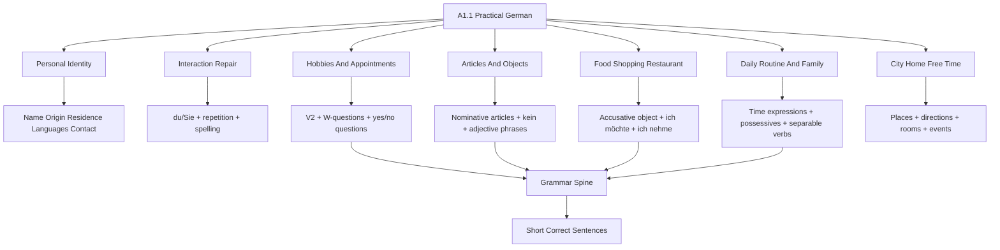

# A1.1 CEFR And Goethe Coverage Roadmap

Source files:

- `german-a1-1/wiki/lektion-01-greetings-identity-and-origin/lektion-01-greetings-identity-and-origin.md`
- `german-a1-1/wiki/lektion-02-hobbies-verb-position-and-appointments/lektion-02-hobbies-verb-position-and-appointments.md`
- `german-a1-1/wiki/lektion-03-city-articles-negation-and-adjectives/lektion-03-city-articles-negation-and-adjectives.md`
- `german-a1-1/wiki/lektion-04-food-drink-shopping-and-meals/lektion-04-food-drink-shopping-and-meals.md`
- `german-a1-1/raw/Deutsch als Fremdsprache - Moodle-Studio A1 (SoSe 2026)_2026061_2249/Vokabeltraining _ Vocabulary Training/Vokabeltraining A1.1 Kapitel 5.html`
- `german-a1-1/raw/Deutsch als Fremdsprache - Moodle-Studio A1 (SoSe 2026)_2026061_2249/Vokabeltraining _ Vocabulary Training/Vokabeltraining A1.1 Kapitel 6.html`

External sources consulted:

- Council of Europe CEFR descriptor search: `https://www.coe.int/en/web/common-european-framework-reference-languages/cefr-descriptors-search`
- Goethe-Institut Goethe-Zertifikat A1: Start Deutsch 1: `https://www.goethe.de/ins/de/en/m/prf/prf/gzsd1.html`
- Goethe-Institut A1 exam training and vocabulary list page: `https://www.goethe.de/ins/us/en/spr/prf/ueb/pa1.html`
- Goethe-Institut Start Deutsch 1 A1 word list PDF: `https://www.goethe.de/pro/relaunch/prf/en/A1_SD1_Wortliste_02.pdf`
- Goethe-Institut Deutsch Online A1 course overview: `https://lernen.goethe.de/deutschonline/A1/PDF/EN/deutschonline_Your_course_at_a_glance.pdf`
- Deutscher Volkshochschul-Verband A1 Themen und Grammatik list: `https://www.vhs-lernportal.de/wws/bin/4007530-4015506-1-dvv_grammatiklisten_a1.pdf`
- telc Deutsch A1 exam page: `https://www.telc.net/sprachpruefungen/zertifikatspruefung/deutsch/start-deutsch-1-/-telc-deutsch-a1/`

Processed: 2026-06-04  
Course: German A1.1  
Topic folder: `german-a1-1/wiki/a1-1-cefr-goethe-coverage/`  
Context file: `CONTEXT.md`  
Vocabulary supplement: `VOCAB-GLOSSARY.md`

## Source Boundary

`A1.1` is a course-local sublevel, not an official CEFR level. The official level is `A1`. In this workspace, use `A1.1` to mean the first half of practical A1 production: short, high-frequency sentences for identity, classroom repair, hobbies, appointments, city objects, food, shopping, meals, daily routine, time, family, free time, and simple restaurant/social situations.

The external sources are used as a boundary and enrichment layer, not as a replacement for the TUM Moodle material. The Goethe word list is an A1 reference list, not a memorization order. The active target here is the half of A1 vocabulary and grammar that supports the course topics and the next likely A1.1 lessons.

## 80/20 Summary

For A1.1, the main goal is not to know grammar labels. The goal is to reliably produce short sentences and questions in predictable everyday situations:

- introduce yourself and ask another person about name, origin, residence, languages, contact details, and well-being
- use `du` and `Sie` correctly enough for classroom and service situations
- ask W-questions and yes/no questions with the finite verb in the correct position
- talk about hobbies, preferences, free time, appointments, jobs, family, and daily routine
- identify and describe simple objects, places, foods, drinks, people, and city locations with articles
- buy or order something politely, ask for a price, and close the exchange
- understand slow, clear A1 speech when the other person is helpful
- write or say very short personal messages, invitations, refusals, and profile-style sentences

The grammar spine is:

```text
subject/person -> finite verb -> article/object/time -> short ending
```

If you can control verb position, present-tense forms, articles, `nicht/kein`, basic accusative objects, and time expressions, most A1.1 situations become manageable.

## Coverage Map

| A1.1 Domain | Current Course Coverage | External Enrichment Needed | Production Target |
|---|---|---|---|
| Identity and contact | Lektion 1 covers name, origin, residence, languages, alphabet, phone/email | Add age, address, birthday/date as recognition and next-step production | `Ich heiße... Ich komme aus... Ich wohne in... Meine Telefonnummer ist...` |
| Register and repair | Lektion 1 covers `du`/`Sie`, repetition phrases | Keep as mandatory survival language across all topics | `Wie bitte? Noch einmal bitte. Können Sie das buchstabieren?` |
| Hobbies and preferences | Lektion 2 covers `gern`, `nicht gern`, yes/no questions | Add wider free-time and invitation/refusal chunks from official A1 sequences | `Was machst du gern? Ich gehe gern ins Kino. Hast du Zeit?` |
| Jobs and roles | Lektion 2 covers selected profession forms | Add more A1-safe job/profile patterns and no-article profession sentences | `Ich bin Student. Sie ist Journalistin. Er arbeitet als...` |
| Articles and nouns | Lektion 3 covers nominative `der/das/die`, `ein/eine`, `kein/keine` | Add plural awareness and basic object-case contrast for buying/ordering | `Das ist ein Restaurant. Ich möchte einen Kaffee.` |
| City and directions | Lektion 3 covers city places, question words, adjectives | Keep later A1 dative/imperative as preview only unless course reaches it | `Wo ist der Bahnhof? Das ist ein modernes Hotel.` |
| Food, drink, shopping | Lektion 4 covers food, drink, `ich möchte`, quantities, price | Add accusative article table, `nehmen`, `mögen`, `essen`, `trinken`, plural and package words | `Ich nehme einen Kaffee. Ich mag keinen Fisch. Was kostet das?` |
| Daily routine and time | Raw Kapitel 5 headings cover Alltag, Uhrzeit, Termine | Add A1.1 routine/time language from official A1 course outlines | `Ich stehe um sieben Uhr auf. Am Montag habe ich einen Termin.` |
| Family | Raw Kapitel 5 heading covers Familie | Add core family nouns and possessive articles `mein/dein/Ihr` | `Das ist meine Mutter. Hast du Geschwister?` |
| Free time, celebrations, restaurant | Raw Kapitel 6 headings cover Freizeit, Feste, Im Restaurant | Add invitation, ordering, paying, celebration phrases | `Kommst du zur Party? Ich möchte bezahlen.` |
| Housing and household | Official A1 sources include Wohnung/Räume/Möbel; current local raw has no full matching A1.1 lesson | Treat as recognition/preview until Moodle material appears | `Das ist mein Zimmer. Die Wohnung ist klein.` |
| Weather, dates, seasons | Lektion 3 mentions seasons; official A1 sources include weather/date/months | Add as compact recognition layer | `Heute ist Montag. Im Sommer ist es warm.` |

## Grammar Checklist

### Must Produce Now

| Grammar Item | Use | Example | Trap |
|---|---|---|---|
| Present tense regular verbs | Basic statements and questions | `Ich wohne in München.` | forgetting `du -st`, `er/sie -t` |
| `sein` | identity, job, descriptions | `Sie ist Journalistin.` | `Sie ist` only for "she"; formal `Sie sind` |
| `haben` | possession, time, appointments | `Ich habe am Freitag Zeit.` | `du hast`, `er/sie hat` |
| `sprechen`, `fahren`, `essen`, `nehmen` | high-frequency stem-changing verbs | `du sprichst`, `du fährst`, `du isst`, `du nimmst` | regularizing the stem |
| W-question word order | ask information | `Wo wohnst du?` | `Wo du wohnst?` |
| Yes/no question word order | ask confirmation | `Schwimmst du gern?` | subject before finite verb |
| Statement V2 | make simple sentences | `Am Freitag spiele ich Fußball.` | forgetting inversion when time comes first |
| Sentence bracket | split multi-part activity | `Ich gehe gern spazieren.` | keeping English phrase order mechanically |
| Definite article nominative | identify known nouns | `Der Zug ist lang.` | learning nouns without article |
| Indefinite article nominative | identify one unknown noun | `Das ist eine Stadt.` | plural has no `ein` |
| Negative article nominative | negate a noun identity | `Das ist kein Hotel.` | using `nicht` before an indefinite noun |
| Accusative article for direct objects | buy/order/need/take something | `Ich möchte einen Kaffee.` | masculine changes: `der/ein/kein` -> `den/einen/keinen` |
| `nicht` vs `kein` | choose negation type | `Ich schwimme nicht gern`; `Ich habe keine Zeit.` | using one negation for every case |
| Possessive articles | family/contact ownership | `meine Mutter`, `mein Bruder`, `Ihre Adresse` | mixing `du` possessives with formal `Sie` |
| Time expressions | appointments and routine | `um acht Uhr`, `am Montag`, `von neun bis zehn` | using `in Montag` |

### Recognition Or Next-Lesson Preview

| Grammar Item | Why It Matters | Active Status |
|---|---|---|
| Separable verbs | daily routine: `aufstehen`, `einkaufen`, `anrufen` | produce with memorized chunks after Kapitel 5 |
| Modal verbs `können`, `müssen`, `wollen` | later A1 ability/necessity/wanting | recognize; produce only high-frequency chunks |
| Imperative | directions, restaurant/family requests | preview only until the course reaches it |
| Dative local prepositions | full city/directions/housing descriptions | preview only; avoid overloading A1.1 recall |
| Perfect tense | full A1/A1.2 past events | out of A1.1 priority unless German course explicitly moves there |

## Accusative Mini-Map For Shopping

For `ich möchte`, `ich nehme`, `ich brauche`, and `ich kaufe`, the thing requested is usually the direct object. At A1.1, the practical change to memorize is masculine singular.

| Gender/Number | Nominative | Accusative Object | Example |
|---|---|---|---|
| masculine | `der/ein/kein` | `den/einen/keinen` | `Ich nehme einen Kaffee.` |
| neuter | `das/ein/kein` | same | `Ich möchte ein Wasser.` |
| feminine | `die/eine/keine` | same | `Ich kaufe eine Banane.` |
| plural | `die/zero/keine` | same | `Ich brauche Eier.` / `Ich brauche keine Eier.` |

Correction rule: if the noun is masculine and it is what you buy, order, need, or take, expect `einen` or `keinen`.

## A1.1 Vocabulary Coverage Targets

Do not try to memorize the complete Goethe A1 list in one block. The high-yield method is to learn vocabulary by production task.

| Task | Need To Know | Example Output |
|---|---|---|
| Introduce yourself | name, country, city, languages, contact details | `Ich heiße Arda. Ich komme aus der Türkei. Ich spreche Türkisch und Englisch.` |
| Ask a classmate questions | `wie`, `wo`, `woher`, `was`, `wann`, `wer` | `Was machst du gern? Wann treffen wir uns?` |
| Make an appointment | weekdays, time, `Zeit haben`, `treffen`, accepting/refusing | `Hast du am Freitag Zeit? Nein, ich habe keine Zeit.` |
| Describe a place | city nouns, articles, adjectives | `Das ist ein modernes Hotel. Die Stadt ist groß.` |
| Shop/order food | food/drink nouns, quantities, prices, `möchte`, `nehme`, `kostet` | `Ich möchte zwei Brötchen und einen Kaffee.` |
| Talk about family | family nouns, possessives, `haben`, `sein` | `Das ist meine Schwester. Ich habe einen Bruder.` |
| Talk about routine | daily activities, times, separable chunks | `Ich stehe um sieben Uhr auf. Ich arbeite am Vormittag.` |
| Restaurant/social eating | menu words, polite phrases, likes/dislikes, paying | `Ich nehme die Suppe. Das schmeckt gut. Ich möchte bezahlen.` |

## Expanded A1.1 Subject Layer

The raw Moodle export already points to Kapitel 5 and 6 vocabulary pages. The local files expose headings, so this note adds a reliable A1.1 production layer without claiming hidden Quizlet card text was parsed.

### Kapitel 5: Alltag, Uhrzeit, Termine, Familie

| Micro-Topic | Production Chunks | Grammar Hook |
|---|---|---|
| daily routine | `Ich stehe um sieben Uhr auf.` `Ich arbeite am Vormittag.` `Ich gehe am Abend nach Hause.` | separable verbs; time phrases |
| time | `Wie spät ist es?` `Es ist acht Uhr.` `Der Kurs ist von zehn bis zwölf.` | `um`, `von...bis`, `am` |
| appointments | `Hast du am Montag Zeit?` `Wir treffen uns um sechs.` `Leider kann ich nicht.` | yes/no question; modal chunk |
| family | `Das ist mein Vater.` `Meine Mutter wohnt in Berlin.` `Ich habe zwei Geschwister.` | possessive articles; nominative/accusative with `haben` |

### Kapitel 6: Freizeit, Feste, Im Restaurant

| Micro-Topic | Production Chunks | Grammar Hook |
|---|---|---|
| free time | `Ich höre gern Musik.` `Ich lese am Wochenende.` | present tense; `gern` position |
| invitations | `Kommst du zur Party?` `Ja, gern.` `Leider habe ich keine Zeit.` | yes/no question; polite refusal |
| celebrations | `Alles Gute zum Geburtstag!` `Die Party ist am Samstag.` | formulaic phrases; date/time |
| restaurant | `Ich nehme die Suppe.` `Ich möchte einen Kaffee.` `Ich möchte bezahlen.` | accusative object; `nehmen`, `möchten` |

## Official-Source Alignment

| External Anchor | What It Adds To This Course |
|---|---|
| CEFR A1 descriptors | A1.1 output should stay simple, concrete, slow-speech, and high-frequency. |
| Goethe A1 exam and vocabulary sources | Vocabulary should be task-based: personal data, food, shopping, work, education, transport, housing, free time, public/private situations. |
| Goethe Deutsch Online A1 overview | Confirms that early A1 grammar is ordered around identity, jobs, objects, hobbies, appointments, city, food, shopping, daily routine, and home/social contexts. |
| DVV/vhs A1 grammar list | Confirms the grammar spine: present tense, pronouns, W-/yes-no questions, articles, `nicht/kein`, accusative, separable verbs, time expressions, possessives. |
| telc A1 exam framing | Confirms that the practical task types are listening, reading, language elements, writing forms/messages, and speaking from simple prompts. |

## Visual Knowledge Map



## Subject Knowledge Graph

| Node | Meaning | Exam Relevance |
|---|---|---|
| CEFR A1 | Official first beginner level | Defines simple everyday communication boundary |
| A1.1 course-local scope | First practical half of A1 for this course | Prevents overloading with full A1/A2 grammar |
| Production chunk | Memorized useful sentence pattern | Best unit for speaking under pressure |
| Verb-position control | V2 statements/W-questions and verb-first yes/no questions | Most common grammar error source |
| Article control | `der/das/die`, `ein/eine`, `kein/keine`, accusative object forms | Makes noun phrases usable |
| Daily routine layer | Alltag, time, appointments | Needed by raw Kapitel 5 headings |
| Family layer | family nouns plus possessives | Needed by raw Kapitel 5 headings and A1 personal-info domain |
| Restaurant/social layer | ordering, restaurant, celebrations | Needed by raw Kapitel 6 headings and A1 goods/services domain |
| Official vocabulary boundary | Goethe A1 word list and course overview | Keeps enrichment aligned with A1 instead of random beginner content |

| From | Relationship | To | Why It Matters |
|---|---|---|---|
| CEFR A1 | constrains | A1.1 course-local scope | Keep language simple, concrete, and high-frequency |
| Goethe A1 inventory | supplies | official vocabulary boundary | Avoid undercoverage of A1 everyday domains |
| DVV A1 grammar list | confirms | grammar spine | Use a trusted grammar sequence |
| Production chunk | combines | vocabulary plus grammar | Helps the learner speak, not just label grammar |
| Article control | enables | shopping/restaurant objects | `Ich möchte einen Kaffee` needs accusative |
| Time expressions | enable | appointments and daily routine | `um`, `am`, `von...bis` drive scheduling tasks |
| Possessive articles | enable | family and personal details | `meine Mutter`, `mein Bruder`, `Ihre Adresse` |

## Retrieval Prompts

Closed-book prompts:

1. Give a four-sentence self-introduction with name, origin, residence, and languages.
2. Ask a classmate three questions: name, hobby, and appointment time.
3. Explain when to use `kein` and when to use `nicht`, with one example each.
4. Give the accusative object forms for `der Kaffee`, `das Wasser`, `die Banane`, and plural `Eier`.
5. Say one daily-routine sentence with a time.
6. Introduce two family members with `mein/meine`.
7. Order one food item and one drink in a restaurant.

Application prompts:

1. You meet a new classmate. Produce a six-line `du` dialogue.
2. You are at a bakery. Buy two bread rolls and one coffee, ask the price, and close politely.
3. You cannot meet on Friday. Refuse and suggest Saturday.
4. Describe Hamburg or Munich with three article/adjective sentences.
5. Build a daily schedule with three times: morning, afternoon, evening.

## Practice Tasks

1. Make one table with the verbs `sein`, `haben`, `sprechen`, `fahren`, `essen`, `nehmen`, `möchten`.
2. Make one article table: nominative and accusative for definite, indefinite, and negative articles.
3. Write a 60-word A1 profile: name, origin, residence, languages, family, hobbies, daily routine.
4. Record yourself speaking a bakery or cafe dialogue; correct only verb position and articles first.
5. Add five unknown words from the Goethe A1 word list only if they fit an active production task.

## Connections

Previous notes from this lecture:

- `../lektion-01-greetings-identity-and-origin/lektion-01-greetings-identity-and-origin.md`
- `../lektion-02-hobbies-verb-position-and-appointments/lektion-02-hobbies-verb-position-and-appointments.md`
- `../lektion-03-city-articles-negation-and-adjectives/lektion-03-city-articles-negation-and-adjectives.md`
- `../lektion-04-food-drink-shopping-and-meals/lektion-04-food-drink-shopping-and-meals.md`

Related companion files:

- `CONTEXT.md`
- `VOCAB-GLOSSARY.md`

## Open Uncertainties

- The TUM course's exact final assessment for German A1.1 is not in the local logistics file. This roadmap therefore optimizes for practical CEFR A1.1 classroom/exam readiness rather than a known TUM exam format.
- The local Moodle-Studio Kapitel 5 and 6 HTML files expose headings and external practice links, but not full flashcard text. Vocabulary for those chapters is marked as enriched A1.1 and should be reconciled if the full course cards or textbook pages become available.
