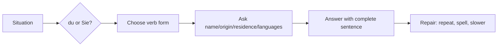

# Context: Lektion 01 Greetings, Identity, Origin, Residence, And Languages

Source note: `lektion-01-greetings-identity-and-origin.md`

## Register And Social Situation

| Term | Definition | Aliases to avoid |
|---|---|---|
| `du` | Informal second-person address for classmates, friends, family, or informal classroom pair work. It triggers informal verb forms such as `du heißt`, `du kommst`, `du bist`. | "casual Sie", "informal you" without verb change |
| `Sie` | Formal second-person address for unknown adults, official settings, or polite distance. It triggers forms like `Sie heißen`, `Sie kommen`, `Sie sind`. | "plural you" when the function is formal address |
| formal greeting | Polite opening such as `Guten Tag`, `Guten Morgen`, or `Guten Abend`. | "official hello" |
| informal greeting | Casual opening such as `Hallo`. | "private greeting" if the issue is just register |
| goodbye | Closing expression such as `Tschüss`, `Ciao`, or `Auf Wiedersehen`. | "farewell formula" |

## Identity And Profile Language

| Term | Definition | Aliases to avoid |
|---|---|---|
| `Ich heiße ...` | Standard A1 sentence for giving your name. `heißen` literally means "to be called". | "I call myself" |
| `Ich bin ...` | Simple identity sentence with `sein`; also used in introductions. | "I am named" |
| `Mein Name ist ...` | More formal name-giving pattern, useful with full name. | "my name means" |
| `Woher kommst du?` | Informal question asking origin: country, city, or place someone comes from. | `Wo kommst du?` |
| `Wo wohnst du?` | Informal question asking current place of residence. | `Woher wohnst du?` |
| `Welche Sprachen sprichst du?` | Informal question asking which languages someone speaks. | `Was Sprachen sprichst du?` |
| `Ich lerne Deutsch.` | Sentence for a language currently being learned. | `Ich studiere Deutsch` when the course means learning |

## Verb Forms

| Term | Definition | Aliases to avoid |
|---|---|---|
| finite verb | The conjugated verb form that matches the subject, e.g. `heiße`, `kommst`, `sind`. | "main word" |
| `heißen` | Verb used for names: `ich heiße`, `du heißt`, `Sie heißen`. | `heissen` in umlaut-aware notes |
| `kommen` | Verb used for origin with `aus`: `ich komme aus ...`. | "arrive" when the source means origin |
| `wohnen` | Verb for living/residing at a place with `in`: `ich wohne in ...`. | "stay" |
| `sprechen` | Verb for speaking a language; irregular in `du sprichst` and `er/sie spricht`. | `du sprechst` |
| `sein` | Irregular verb "to be": `ich bin`, `du bist`, `er/sie ist`, `Sie sind`. | regularized forms like `ich seine` |
| third person singular | `er`, `sie`, or a named person; common endings include `-t`, e.g. `sie wohnt`, but `sie ist` for `sein`. | "he/she form" without grammar role |

## Word Order And Questions

| Term | Definition | Aliases to avoid |
|---|---|---|
| W-question | Information question beginning with `wie`, `wer`, `wo`, `woher`, or `welche`. The finite verb still comes in position 2. | "WH question" if writing German notes |
| verb position 2 | Rule that the finite verb is the second sentence element in German statements and W-questions. | "verb is second word" because position can be a phrase |
| statement | Declarative sentence such as `Ich wohne in München.` The subject often comes first and the verb second. | "answer sentence" |
| `wo` | Location question word: "where". Use for current place. | `woher` |
| `woher` | Origin/direction-from question word: "where from". Use with `kommen aus`. | `wo` |
| `welche Sprachen` | Question phrase meaning "which languages"; the whole phrase counts as position 1 before the verb. | `was Sprachen` |

## Contact Information And Repair Language

| Term | Definition | Aliases to avoid |
|---|---|---|
| Telefonnummer | Phone number; use numbers clearly and chunk long numbers. | "Handy" when asking for number generally |
| E-Mail-Adresse | Email address; requires spelling symbols such as `Punkt`, `Minus`, `Unterstrich`. | "mail" alone |
| buchstabieren | To spell aloud letter by letter. | "spellieren" |
| `Wie bitte?` | Short request for repetition. | "Was?" in polite classroom settings |
| `Noch einmal bitte.` | Polite request to say it again. | "repeat please" in English |
| `Bitte ein bisschen langsamer.` | Request to speak more slowly. | "slowly" alone |

## Relationships Between Canonical Terms

- **Register** selects **`du`** or **`Sie`**, which selects the correct **finite verb**.
- **W-questions** use a **W-question word** in position 1 and keep the **finite verb** in **verb position 2**.
- **Origin** uses **`woher`** plus **`kommen aus`**; **residence** uses **`wo`** plus **`wohnen in`**.
- **Contact information** requires **numbers**, **alphabet**, and **repair language** because misunderstanding names and emails is normal at A1.

## Visual Mini-Map



## Example Dialogue

```text
A: Hallo, ich heiße Arda. Wie heißt du?
B: Ich heiße Nina. Woher kommst du?
A: Ich komme aus der Türkei und wohne in München.
B: Welche Sprachen sprichst du?
A: Ich spreche Türkisch und Englisch. Ich lerne Deutsch.
B: Wie ist deine E-Mail-Adresse?
A: arda Punkt erkan at beispiel Punkt de. Soll ich das buchstabieren?
```

## Exam Traps And Correction Rules

| Trap | Correction Rule |
|---|---|
| `Wo kommst du?` | Use `Woher kommst du?` for origin. |
| `du sprechst` | Use `du sprichst`. |
| `Sie bist` | Use `Sie sind`. |
| `Wo du wohnst?` | Use W-question order: `Wo wohnst du?` |
| informal answer to a formal prompt | Match the register: `Wie heißen Sie?` -> `Ich heiße ...` or `Mein Name ist ...` |

## Cheat-Sheet Language

- `Ich heiße ...`
- `Ich komme aus ...`
- `Ich wohne in ...`
- `Ich spreche ... und lerne Deutsch.`
- `Wie bitte? Noch einmal bitte.`
- `Bitte ein bisschen langsamer.`
