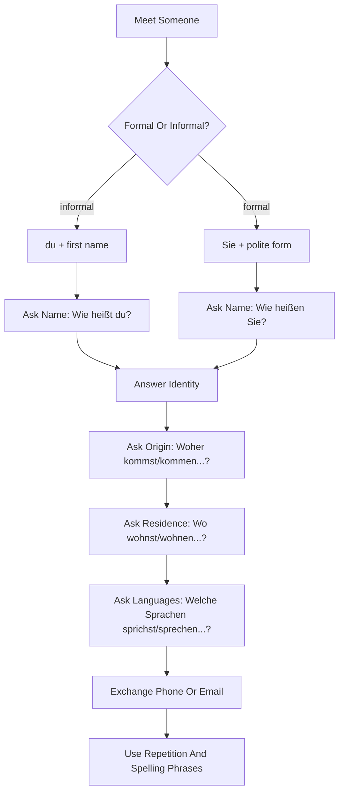

# Lektion 01: Greetings, Identity, Origin, Residence, And Languages

Source files:

- `german-a1-1/raw/Lektion 1 17. April - 24. April 2026/Freitag, der 17. April 2026 (1. Teil).html`
- `german-a1-1/raw/Lektion 1 17. April - 24. April 2026/Freitag (2. Teil).html`
- `german-a1-1/raw/Lektion 1 17. April - 24. April 2026/Freitag, der 24. April 2026.html`
- `german-a1-1/raw/Lektion 1 17. April - 24. April 2026/Zusammenfassung- Ich heiße ..... (Nr. 1).pdf`
- `german-a1-1/raw/Lektion 1 17. April - 24. April 2026/Zusammenfassung (Nr. 2).pdf`
- `german-a1-1/raw/Lektion 1 17. April - 24. April 2026/NWneu A1.1 Kap 1 Kursbuch (2).pdf`
- `german-a1-1/raw/Lektion 1 17. April - 24. April 2026/NWneu A1.1 Kap 1 Arbeitsbuch (2).pdf`

Processed: 2026-06-01
Course: German A1.1
Topic folder: `german-a1-1/wiki/lektion-01-greetings-identity-and-origin/`
Vocabulary glossary: `VOCAB-GLOSSARY.md`

## 80/20 Exam Summary

The high-value goal is to survive the first 60 seconds of a German conversation: greet, choose `du` or `Sie`, say your name, ask the other person's name, say where you come from, where you live, which languages you speak, give a phone number or email address, and ask for repetition when you do not understand.

The grammar load is small but foundational:

- `du` and `Sie` change the verb ending and the social tone.
- The finite verb normally stays in position 2 in statements and W-questions.
- Present-tense forms for `heißen`, `kommen`, `wohnen`, `sprechen`, and `sein` are the main engine.
- `sprechen` and `sein` are traps because they do not follow the simplest regular pattern.
- Numbers, the alphabet, email symbols, and spelling phrases are not decorative; they are needed for real A1 registration, introductions, and contact-information tasks.

## Core Concepts

### Greeting And Goodbye

Use informal greetings with peers and formal greetings in official or unknown situations.

| Situation | Useful German | Function |
|---|---|---|
| Informal start | `Hallo!` | neutral informal greeting |
| Informal goodbye | `Tschüss!`, `Ciao!` | casual goodbye |
| Formal/daytime start | `Guten Tag!`, `Guten Morgen!`, `Guten Abend!` | polite greeting |
| Formal goodbye | `Auf Wiedersehen!` | polite goodbye |
| Night farewell | `Gute Nacht!` | goodbye before sleep/night |

Trap: `Gute Nacht` is not a general evening greeting. Use `Guten Abend` when arriving in the evening; use `Gute Nacht` when leaving for the night.

### `du` Versus `Sie`

`du` is informal and usually combines with first names. `Sie` is formal and combines naturally with title, surname, or official settings.

| Meaning | Informal | Formal |
|---|---|---|
| What is your name? | `Wie heißt du?` | `Wie heißen Sie?` |
| Who are you? | `Wer bist du?` | `Wer sind Sie?` |
| How are you? | `Wie geht es dir?` | `Wie geht es Ihnen?` |
| Where do you come from? | `Woher kommst du?` | `Woher kommen Sie?` |
| Where do you live? | `Wo wohnst du?` | `Wo wohnen Sie?` |
| Which languages do you speak? | `Welche Sprachen sprichst du?` | `Welche Sprachen sprechen Sie?` |

Correction rule: if the question uses `Sie`, answer politely and keep the formal verb form. If the question uses `du`, answer informally.

### Identity Patterns

Use one of three core patterns:

| Pattern | Example | Note |
|---|---|---|
| `Ich heiße ...` | `Ich heiße Arda.` | most direct A1 pattern |
| `Ich bin ...` | `Ich bin Arda.` | also common in introductions |
| `Mein Name ist ...` | `Mein Name ist Arda Erkan.` | more formal, useful with full name |

For another person:

- `Das ist Nina.`
- `Sie kommt aus Deutschland.`
- `Er wohnt in München.`

### Origin, Residence, And Languages

| Question | Answer Pattern | Meaning |
|---|---|---|
| `Woher kommst du?` | `Ich komme aus der Türkei.` | origin |
| `Wo wohnen Sie?` | `Ich wohne in München.` | current residence |
| `Welche Sprachen sprichst du?` | `Ich spreche Türkisch, Englisch und Deutsch.` | languages spoken |
| `Welche Sprachen lernen Sie?` | `Ich lerne Deutsch.` | languages learned |

Important distinction: `woher` asks origin; `wo` asks location/residence.

### Present-Tense Verb Forms

| Verb | `ich` | `du` | `er/sie` | `Sie` |
|---|---|---|---|---|
| `heißen` | `ich heiße` | `du heißt` | `er/sie heißt` | `Sie heißen` |
| `kommen` | `ich komme` | `du kommst` | `er/sie kommt` | `Sie kommen` |
| `wohnen` | `ich wohne` | `du wohnst` | `er/sie wohnt` | `Sie wohnen` |
| `sprechen` | `ich spreche` | `du sprichst` | `er/sie spricht` | `Sie sprechen` |
| `sein` | `ich bin` | `du bist` | `er/sie ist` | `Sie sind` |

Exam trap: do not say `du sprechst` or `Sie ist`. The course explicitly flags `sprechen` and `sein` as special.

## Mechanisms And Logic

### W-Question Word Order

German W-questions use this pattern:

```text
W-word + finite verb + subject + rest?
```

Examples:

- `Wie heißt du?`
- `Wo wohnst du?`
- `Woher kommen Sie?`

The source emphasizes that the verb is always in the second position. The first position can be one word such as `wo` or `wie`, or a phrase such as `welche Sprachen`.

### Statement Word Order

Basic statement pattern:

```text
subject + finite verb + rest.
```

Examples:

- `Ich heiße Arda.`
- `Ich wohne in München.`
- `Sie spricht Deutsch.`

### Alphabet, Email, And Clarification Phrases

The lesson includes phone numbers, email addresses, the alphabet, and phrases for asking again. These are practical survival tools.

| Situation | German |
|---|---|
| Ask for repetition | `Wie bitte?` |
| Ask again politely | `Entschuldigung, noch einmal bitte.` |
| Say you do not understand | `Das verstehe ich nicht.` |
| Ask for slower speech | `Bitte ein bisschen langsamer.` |
| Ask for spelling | `Kannst du das buchstabieren?` |
| Email symbol | `@` = `at` |
| Dot | `Punkt` |
| Hyphen | `Minus` |
| Underscore | `Unterstrich` |

## Diagrams, Tables, And Visuals

The textbook and workbook pages visually pair dialogues with social situations. The underlying exam logic is:

1. identify whether the situation is formal or informal,
2. choose `du` or `Sie`,
3. choose the correct verb form,
4. answer with a complete A1 sentence,
5. ask for repetition if you miss a name, number, or email address.

## Visual Knowledge Map



## Subject Knowledge Graph

| Node | Meaning | Exam Relevance |
|---|---|---|
| Greeting | Opening or closing a conversation | Often first line in oral A1 tasks |
| Register | Choice between `du` and `Sie` | Controls verb ending and politeness |
| Identity sentence | `Ich heiße`, `Ich bin`, `Mein Name ist` | Core self-introduction |
| Origin question | `Woher kommst du?` | Tests `kommen aus` |
| Residence question | `Wo wohnst du?` | Tests `wohnen in` |
| Language question | `Welche Sprachen sprichst du?` | Tests `sprechen`, including `du sprichst` |
| Verb position 2 | Finite verb in second position | Basic German word-order anchor |
| Alphabet and numbers | Contact-information handling | Useful in listening/speaking tasks |

| From | Relationship | To | Why It Matters |
|---|---|---|---|
| Register | determines | verb form | `du heißt` but `Sie heißen` |
| W-question | requires | verb position 2 | `Wo wohnst du?`, not `Wo du wohnst?` |
| Identity sentence | uses | `heißen` or `sein` | Both are common but conjugate differently |
| Origin | uses | `kommen aus` | Separates origin from current city |
| Residence | uses | `wohnen in` | Separates current location from nationality |
| Language ability | uses | `sprechen` | `du sprichst` is irregular |
| Contact exchange | depends on | alphabet and numbers | Needed for phone and email tasks |

## Real-Life Examples

At a university language class:

- `Hallo, ich heiße Arda. Wie heißt du?`
- `Ich komme aus der Türkei und wohne in München.`
- `Ich spreche Türkisch und Englisch. Ich lerne Deutsch.`

At an office or registration desk:

- `Guten Tag. Mein Name ist Arda Erkan.`
- `Wie heißen Sie bitte?`
- `Entschuldigung, noch einmal bitte. Können Sie das buchstabieren?`

## Exam Relevance

Likely A1 prompts:

- Introduce yourself in three sentences.
- Ask another person their name, origin, residence, and languages.
- Convert informal questions into formal questions.
- Fill in missing verb forms for `heißen`, `kommen`, `wohnen`, `sprechen`, and `sein`.
- Listen to or read a profile and complete a table with name, country, city, and languages.

Common traps:

- confusing `wo` and `woher`
- using `du` verb endings with `Sie`
- forgetting `du sprichst`
- placing the subject before the verb in a W-question
- using `Gute Nacht` as a general greeting

High-scoring answer structure:

1. Choose register.
2. Use a complete sentence.
3. Put the finite verb in the right place.
4. Use a memorized verb form.
5. Add one detail: country, city, or language.

## Retrieval Prompts

Closed-book questions:

1. How do you ask `What is your name?` informally and formally?
2. Conjugate `sein` for `ich`, `du`, `er/sie`, and `Sie`.
3. What is the difference between `wo` and `woher`?
4. Which verb form is correct: `du sprechst` or `du sprichst`?
5. Give three phrases for asking someone to repeat or speak more slowly.

Application prompts:

1. Introduce yourself with name, origin, residence, and languages in four German sentences.
2. Turn `Wie heißt du?` into the formal version.
3. Ask a classmate for their phone number and email address.
4. Read this profile and produce three sentences: `Nina / Deutschland / Berlin / Deutsch, Englisch`.

## Practice Tasks

1. Write a formal mini-dialogue between a student and a course administrator.
2. Write an informal mini-dialogue between two classmates.
3. Make a table with `ich`, `du`, `er/sie`, `Sie` for `heißen`, `kommen`, `wohnen`, `sprechen`, `sein`.
4. Dictate your email address out loud using `Punkt`, `Minus`, and `Unterstrich`.

## Connections

Previous notes from this lecture:

- None. This is the first German A1.1 topic in the workspace.

Companion files:

- `CONTEXT.md`
- `VOCAB-GLOSSARY.md`

Future notes from this lecture:

- `../lektion-02-hobbies-verb-position-and-appointments/lektion-02-hobbies-verb-position-and-appointments.md`
- `../lektion-03-city-articles-negation-and-adjectives/lektion-03-city-articles-negation-and-adjectives.md`

Cross-course links:

- Presentation discipline from business courses helps here: short, complete, audience-appropriate sentences.
- Marketing and organization courses use introductions and identity labels differently, but German A1.1 focuses on grammatical accuracy and communicative survival.

## Weakness Flags

- First active recall is still pending.
- Watch `du`/`Sie` consistency.
- Watch `sprechen` and `sein` forms.
- Watch W-question word order.
