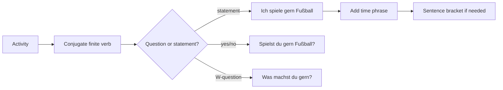

# Context: Lektion 02 Hobbies, Verb Position, Appointments, Jobs, And Numbers

Source note: `lektion-02-hobbies-verb-position-and-appointments.md`

## Hobbies And Preferences

| Term | Definition | Aliases to avoid |
|---|---|---|
| Hobby | Free-time activity such as dancing, swimming, hiking, going to the cinema, playing football, or playing chess. | "sport" when the activity is not only sport |
| `gern` | Preference marker meaning "like to"; placed with the verb phrase: `Ich tanze gern.` | "goodly", "gladly" as a literal translation in exam answers |
| `nicht gern` | Negative preference meaning "do not like to". | `kein gern` |
| `nicht so gern` | Softened negative preference: "do not like so much". | `nicht sehr gern` unless intentionally saying "not very gladly" |
| activity phrase | Verb plus possible noun/infinitive component, e.g. `Fußball spielen`, `spazieren gehen`. | "hobby verb" |

## Question Patterns

| Term | Definition | Aliases to avoid |
|---|---|---|
| W-question | Information question with a W-word such as `was` or `wann`; finite verb in position 2. | English "wh-question" |
| yes/no question | Question that can be answered with `ja` or `nein`; finite verb comes first. | "normal question" |
| finite verb | Conjugated verb matching the subject, e.g. `machst`, `schwimmst`, `gehen`. | "doing word" |
| inversion | In A1 question language, moving the finite verb before the subject for yes/no questions. | "flip everything" |
| full-sentence answer | Answer that repeats enough grammar to train the pattern, e.g. `Ja, ich schwimme gern.` | one-word answer |

## Sentence Bracket And Word Order

| Term | Definition | Aliases to avoid |
|---|---|---|
| `Satzklammer` | German sentence bracket: the finite verb forms the left bracket; a second verb part, separable prefix, infinitive, or noun component may appear near the end. | "bracket sentence" |
| `Satzbrücke` | Course synonym/visual metaphor for the same bridge-like structure from finite verb to end element. Use `Satzklammer` as canonical. | treating it as a separate grammar rule |
| second verb part | Non-finite or separated part at the end, e.g. `spazieren` in `Peter geht spazieren`. | "second verb" when it is a noun like `Fußball` |
| time phrase | Phrase such as `am Freitag` or `am Wochenende`; often sits in the middle field. | "date word" |
| middle field | Material between finite verb and final element in bracket patterns. | "everything else" |

## Appointments, Jobs, And Numbers

| Term | Definition | Aliases to avoid |
|---|---|---|
| `eine Verabredung treffen` | To make an appointment or arrange to meet. At A1, this means activity plus simple time and yes/no response. | "make a promise" |
| course offer | Short offer or schedule that the learner chooses from. | "advertisement" when used as class exercise |
| profession noun | Job label such as `Journalist`, `Journalistin`; often needs article and gender/number awareness. | "job verb" |
| masculine job form | Commonly `der Journalist` for a male journalist or generic masculine form in examples. | "male article" |
| feminine job form | Commonly `die Journalistin`; often has `-in`. | "woman version" |
| plural | Form for more than one; professions may use endings such as `-en` or `-innen`. | "many-form" |
| numbers 20-1000 | Number range needed for phone, schedules, age, prices, and course offers. German two-digit numbers say ones before tens. | "big numbers" |

## Relationships Between Canonical Terms

- **Preference markers** modify an **activity phrase** but do not replace the **finite verb**.
- **W-questions** keep the **finite verb** in position 2; **yes/no questions** put the **finite verb** first.
- **Satzklammer** appears when the sentence has a **second verb part** or activity component at the end.
- **Appointment dialogue** combines **activity phrase**, **time phrase**, and a **yes/no response**.
- **Profession nouns** prepare the article and plural logic that becomes central in Lektion 3.

## Visual Mini-Map



## Example Dialogue

```text
A: Was machst du gern?
B: Ich gehe gern spazieren. Und du?
A: Ich spiele nicht gern Fußball, aber ich gehe gern ins Kino.
B: Gehst du am Freitag ins Kino?
A: Nein, ich habe keine Zeit. Ich spiele am Freitag Fußball.
```

## Exam Traps And Correction Rules

| Trap | Correction Rule |
|---|---|
| `Was du machst gern?` | W-question pattern is `Was machst du gern?` |
| `Schwimmst gern du?` | Yes/no pattern is finite verb + subject: `Schwimmst du gern?` |
| `Ich gern tanze` | Use `Ich tanze gern.` |
| `Ich spiele Fußball am Freitag` as default | Course board trains bracket rhythm: `Ich spiele am Freitag Fußball.` |
| `Peter spazieren geht` | Finite verb in position 2: `Peter geht spazieren.` |
| `du haben` | Use `du hast`; `haben` is not fully regular in the high-frequency forms. |

## Cheat-Sheet Language

- `Was machst du gern?`
- `Ich tanze gern.`
- `Ich schwimme nicht gern.`
- `Ich wandere nicht so gern.`
- `Schwimmst du gern?`
- `Ja, ich schwimme gern.`
- `Ich spiele am Freitag Fußball.`
- `Peter geht mit Susanne spazieren.`
