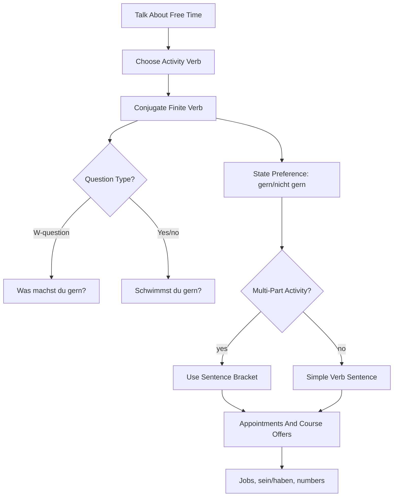

# Lektion 02: Hobbies, Verb Position, Appointments, Jobs, And Numbers

Source files:

- `german-a1-1/raw/Lektion 2 08. Mai - 15. Mai 2026/Freitag, der 08. Mai 2026.html`
- `german-a1-1/raw/Lektion 2 08. Mai - 15. Mai 2026/Freitag, der 15. Mai 2026.html`
- `german-a1-1/raw/Lektion 2 08. Mai - 15. Mai 2026/1. Tafelbild- Wortposition- Was machst du gern_.pdf`
- `german-a1-1/raw/Lektion 2 08. Mai - 15. Mai 2026/3. Tafelbild- Wortposition- Was___u gern_ Schwimmst du gern_.pdf`
- `german-a1-1/raw/Lektion 2 08. Mai - 15. Mai 2026/Satzklammer 1. Teil  Zusammenfassung.pdf`

Processed: 2026-06-01
Course: German A1.1
Topic folder: `german-a1-1/wiki/lektion-02-hobbies-verb-position-and-appointments/`
Vocabulary glossary: `VOCAB-GLOSSARY.md`

## 80/20 Exam Summary

This lesson moves from identity to doing things: hobbies, preferences, short invitations, course offers, jobs, `sein`/`haben`, and larger numbers. The most important language pattern is not a vocabulary list; it is the ability to produce a correct sentence or question with the finite verb in the right position.

High-yield targets:

- say what you like, do not like, or do not like so much: `gern`, `nicht gern`, `nicht so gern`
- ask W-questions: `Was machst du gern?`
- ask yes/no questions: `Schwimmst du gern?`, `Gehst du gern ins Kino?`
- use separable or multi-part activity expressions with the sentence bracket: `Ich spiele am Freitag Fußball.`
- talk about hobbies, friends, appointments, jobs, and course offers
- distinguish masculine/feminine job labels and plural forms at nominative level
- produce numbers from 20 to 1000

## Core Concepts

### Hobbies And Preference Strength

| Function | Pattern | Example |
|---|---|---|
| ask preference | `Was machst du gern?` | What do you like doing? |
| positive preference | `Ich ... gern.` | `Ich tanze gern.` |
| negative preference | `Ich ... nicht gern.` | `Ich schwimme nicht gern.` |
| softer negative | `Ich ... nicht so gern.` | `Ich wandere nicht so gern.` |

`gern` does the preference work. The verb still needs normal conjugation.

### W-Question Versus Yes/No Question

| Question Type | Pattern | Example |
|---|---|---|
| W-question | W-word + finite verb + subject + rest? | `Was machst du gern?` |
| Yes/no question | finite verb + subject + rest? | `Schwimmst du gern?` |

Answer yes/no questions with a full sentence:

- `Ja, ich schwimme gern.`
- `Nein, ich schwimme nicht gern.`
- `Nein, ich schwimme nicht so gern.`

### Verb Position And Sentence Bracket

The lesson's board notes frame German word order as a `Satzklammer` or `Satzbrücke`: the conjugated verb appears early, and the second part of a verb phrase often appears at the end.

| Activity | German Pattern | Sentence |
|---|---|---|
| play football | `Fußball spielen` | `Ich spiele am Freitag Fußball.` |
| ride a bike | `Fahrrad fahren` | `Du fährst am Wochenende Fahrrad.` |
| go for a walk | `spazieren gehen` | `Peter geht mit Susanne spazieren.` |

Mental model:

```text
Subject | finite verb | time/person/detail | second verb part
Ich     | spiele       | am Freitag         | Fußball.
Peter   | geht         | mit Susanne        | spazieren.
```

Trap: English keeps "play football" together. German may split the useful activity phrase across the sentence.

### Appointments And Course Offers

The Moodle agendas mention `eine Verabredung treffen`, partner work, and selecting a course offer. For A1, this means:

- ask whether someone wants to do something,
- accept or reject simply,
- state a time or activity,
- choose a suitable offer from short information.

Useful production:

- `Gehen wir ins Kino?`
- `Ja, gern.`
- `Nein, ich habe keine Zeit.`
- `Wann treffen wir uns?`
- `Am Freitag spiele ich Fußball.`

### Jobs, Articles, And Plurals

The lesson introduces job vocabulary and gendered job forms.

| Concept | Example |
|---|---|
| masculine profession | `der Journalist` |
| feminine profession | `die Journalistin` |
| plural masculine/mixed | `die Journalisten` |
| plural feminine | `die Journalistinnen` |

Exam trap: do not treat article gender as optional. Job labels are a bridge into the article system that becomes central in Lektion 3.

### `sein` And `haben`

This lesson revisits core irregular verbs:

| Verb | `ich` | `du` | `er/sie` | `Sie` |
|---|---|---|---|---|
| `sein` | `bin` | `bist` | `ist` | `sind` |
| `haben` | `habe` | `hast` | `hat` | `haben` |

Use `sein` for identity or job statements:

- `Ich bin Student.`
- `Sie ist Journalistin.`

Use `haben` for possession, availability, and time:

- `Ich habe am Freitag Zeit.`
- `Hast du ein Hobby?`

## Mechanisms And Logic

### How To Build A Hobby Sentence

1. Choose subject: `ich`, `du`, `er/sie`, `Sie`.
2. Conjugate the finite verb.
3. Place `gern`, `nicht gern`, or `nicht so gern` after the core verb phrase.
4. Put the second part of multi-part activities at the end when needed.

Examples:

- `Ich tanze gern.`
- `Ich spiele nicht gern Fußball.`
- `Gehst du gern ins Kino?`

### How To Answer A Yes/No Question

Yes/no question:

```text
Schwimmst du gern?
```

Answer:

```text
Ja, ich schwimme gern.
Nein, ich schwimme nicht gern.
```

Do not answer only with `Ja` or `Nein` during study practice. Full-sentence answers train conjugation and word order.

### Numbers 20-1000

The lesson schedules numbers from 20 to 1000. The key German trap is that two-digit numbers put the ones before the tens:

- `21` = `einundzwanzig`
- `35` = `fünfunddreißig`
- `99` = `neunundneunzig`

Use numbers for phone numbers, dates, prices, course times, and exercises.

## Diagrams, Tables, And Visuals

The source board PDFs are essentially word-order diagrams. The lesson's visual memory should be the sentence bracket:

```text
front field        bracket left         middle             bracket right
Ich                spiele               am Freitag         Fußball.
Peter              geht                 mit Susanne        spazieren.
```

## Visual Knowledge Map



## Subject Knowledge Graph

| Node | Meaning | Exam Relevance |
|---|---|---|
| Hobby | Free-time activity | Common A1 speaking topic |
| Preference marker | `gern`, `nicht gern`, `nicht so gern` | Shows like/dislike |
| W-question | Question with `was`, `wann`, etc. | Tests finite verb in position 2 |
| Yes/no question | Question beginning with finite verb | Tests inversion pattern |
| Sentence bracket | Finite verb early, second part at sentence end | Core German word-order concept |
| Appointment | Simple plan or meeting | Combines time, activity, and response |
| Job noun | Profession label with article and possible gendered ending | Prepares article/adjective work |
| Number 20-1000 | Larger number range | Used in schedules, phone, course offers |

| From | Relationship | To | Why It Matters |
|---|---|---|---|
| Hobby statement | uses | present-tense verb | `Ich tanze`, `ich schwimme`, `ich spiele` |
| Preference marker | modifies | activity | `gern` changes meaning without changing verb form |
| Yes/no question | starts with | finite verb | `Schwimmst du gern?` |
| Multi-part activity | creates | sentence bracket | `spazieren` moves to the end |
| Appointment dialogue | combines | activity plus time | `am Freitag`, `am Wochenende` |
| Job noun | introduces | article gender | `der Journalist`, `die Journalistin` |
| Number practice | supports | real information exchange | times, phone numbers, course offers |

## Real-Life Examples

At a language-course break:

- `Was machst du gern?`
- `Ich gehe gern spazieren. Und du?`
- `Ich spiele nicht so gern Fußball, aber ich gehe gern ins Kino.`

Planning:

- `Gehst du am Freitag ins Kino?`
- `Nein, ich habe keine Zeit. Ich spiele am Freitag Fußball.`

Job introduction:

- `Ich bin Student.`
- `Sie ist Journalistin.`

## Exam Relevance

Likely A1 prompts:

- Ask a partner what they like doing.
- Answer a yes/no question about a hobby.
- Put jumbled words into correct German word order.
- Fill in `sein` or `haben` forms.
- Match profession nouns with `der`, `die`, and plural forms.
- Read a short course offer and choose the right one.
- Write or understand numbers up to 1000.

Common traps:

- writing `Was du machst gern?` instead of `Was machst du gern?`
- answering `Ja, ich gern schwimme` instead of `Ja, ich schwimme gern`
- forgetting the end position in `spazieren gehen`
- confusing `nicht gern` and `nicht`
- treating `der Journalist` and `die Journalistin` as the same form

How to structure a high-scoring answer:

1. Use the correct question pattern.
2. Conjugate the finite verb.
3. Add the preference marker.
4. Place the second part at the end if the activity has two parts.
5. Add time or partner detail only after the core sentence is correct.

## Retrieval Prompts

Closed-book questions:

1. What is the difference between a W-question and a yes/no question in German word order?
2. Where does the finite verb go in `Was machst du gern?`
3. How do you say `I do not really like hiking` using `nicht so gern`?
4. Build a sentence with `Fußball spielen` and `am Freitag`.
5. Conjugate `haben` for `ich`, `du`, `er/sie`, and `Sie`.

Application prompts:

1. Ask a classmate if they like swimming.
2. Answer: `Gehst du gern ins Kino?`
3. Say three hobbies you like and two you do not like.
4. Make an appointment sentence with `am Wochenende`.
5. Describe a job with the correct article and person form.

## Practice Tasks

1. Transform W-question to yes/no question: `Was machst du gern?` -> ask specifically about swimming.
2. Jumbled sentence: `spiele / ich / am Freitag / Fußball` -> write the correct German sentence.
3. Fill in: `Peter ___ mit Susanne spazieren.`
4. Build three `gern`, three `nicht gern`, and three `nicht so gern` sentences.
5. Say these numbers aloud: 21, 35, 48, 99, 100, 250, 1000.

## Connections

Previous notes from this lecture:

- `../lektion-01-greetings-identity-and-origin/lektion-01-greetings-identity-and-origin.md`

Companion files:

- `CONTEXT.md`
- `VOCAB-GLOSSARY.md`

Future notes from this lecture:

- `../lektion-03-city-articles-negation-and-adjectives/lektion-03-city-articles-negation-and-adjectives.md`

Cross-course links:

- This is a communication-pattern topic: like finance formulas, the first step is choosing the correct structure before filling details.

## Weakness Flags

- First active recall is still pending.
- Watch yes/no question word order.
- Watch sentence bracket endings.
- Watch `gern` placement.
- Watch `sein`/`haben` forms.
