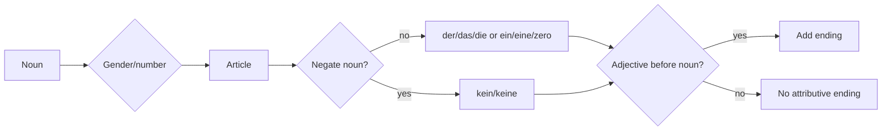

# Context: Lektion 03 City Vocabulary, Articles, Negative Articles, Directions, And Adjectives

Source note: `lektion-03-city-articles-negation-and-adjectives.md`

## Noun Phrase Building Blocks

| Term | Definition | Aliases to avoid |
|---|---|---|
| nominative | Case used for the subject or identity noun phrase in basic sentences such as `Das ist ein Zug.` | "first case" without function |
| subject | Person or thing the sentence is about; in this lesson, often introduced by `Das ist...` or `Die Stadt ist...`. | "topic" when grammar role matters |
| gender | German noun class: masculine, neuter, or feminine. It controls article choice. | biological gender when talking about objects |
| singular | One noun item/person. | "single form" |
| plural | More than one noun item/person. In nominative definite form, plural uses `die`. | "many" only |

## Articles

| Term | Definition | Aliases to avoid |
|---|---|---|
| definite article | Article for known/specific nouns: `der`, `das`, `die`, plural `die`. | "the-word" in final notes |
| indefinite article | Article for one/unspecified noun: `ein`, `ein`, `eine`; no article in plural. | "a-word" without plural caveat |
| zero article | Absence of article, especially plural indefinite: `Das sind gute Restaurants.` | "missing article" |
| negative article | `kein`, `kein`, `keine`, plural `keine`; negates noun phrases. | `nicht ein` as the default |
| noun phrase | Article plus optional adjective plus noun, e.g. `ein modernes Hotel`. | "noun group" |

## Adjectives

| Term | Definition | Aliases to avoid |
|---|---|---|
| predicate adjective | Adjective after `sein`; in the basic pattern it has no ending: `Der Zug ist lang.` | "after-adjective" |
| attributive adjective | Adjective before the noun; it takes an ending: `ein langer Zug`. | "describing word" without position |
| adjective ending | Final letters added to attributive adjectives, e.g. `-er`, `-es`, `-e`. | "suffix" if not tied to gender/number |
| masculine ending after `ein` | Usually `-er` in the source pattern: `ein langer Zug`. | `ein lange Zug` |
| neuter ending after `ein` | Usually `-es` in the source pattern: `ein gutes Restaurant`. | `ein gute Restaurant` |
| feminine ending after `eine` | Usually `-e`: `eine große Stadt`. | `eine groß Stadt` |
| plural ending without article | Usually `-e`: `gute Restaurants`, `kleine Kinder`. | `ein gute Restaurants` |

## City And Question Language

| Term | Definition | Aliases to avoid |
|---|---|---|
| city vocabulary | Place and city-description language from Hamburg/Munich tasks: city, station, hotel, restaurant, direction, season, presentation. | pure grammar topic |
| direction | Language for asking or explaining where something is or where someone goes. | "navigation" if not tied to German sentence patterns |
| `wer` | Question word for people: who. | `was` for people |
| `was` | Question word for things/actions: what. | `wer` for things |
| `wo` | Question word for location: where. | `woher` |
| `woher` | Question word for origin/from where. | `wo` |
| `wann` | Question word for time: when. | `wenn` at A1 if the task asks a question word |

## Relationships Between Canonical Terms

- **Gender** and **number** select the **article**.
- **Indefinite articles** and **zero article** shape the **attributive adjective ending**.
- **Negative articles** follow the same gender/number grid as **indefinite articles**, with plural `keine`.
- **Predicate adjectives** do not take the source lesson's attributive endings; **attributive adjectives** do.
- **City vocabulary** gives real nouns that force article and adjective choices.

## Visual Mini-Map



## Example Dialogue

```text
A: Was ist das?
B: Das ist ein Restaurant.
A: Ist das Restaurant gut?
B: Ja, das Restaurant ist gut. Das ist ein gutes Restaurant.
A: Sind das auch Restaurants?
B: Nein, das sind keine Restaurants. Das sind Hotels.
```

## Exam Traps And Correction Rules

| Trap | Correction Rule |
|---|---|
| `ein Stadt` | Feminine nouns use `eine`: `eine Stadt`. |
| `ein gute Restaurant` | Neuter adjective after `ein` uses `-es`: `ein gutes Restaurant`. |
| `eine Restaurants` | Plural indefinite uses zero article: `Restaurants`, `gute Restaurants`. |
| `Das ist nicht Zug` | Negate noun phrase with `kein`: `Das ist kein Zug.` |
| `Der Zug ist langer` | Predicate adjective has no attributive ending: `Der Zug ist lang.` |
| `Wer ist das?` for a thing | Use `Was ist das?` for things; `Wer ist das?` for people. |

## Cheat-Sheet Language

- `der Zug`, `das Restaurant`, `die Stadt`, `die Restaurants`
- `ein Zug`, `ein Restaurant`, `eine Stadt`, `Restaurants`
- `kein Zug`, `kein Restaurant`, `keine Stadt`, `keine Restaurants`
- `Der Zug ist lang.`
- `Das ist ein langer Zug.`
- `Das Restaurant ist gut.`
- `Das ist ein gutes Restaurant.`
- `Das sind gute Restaurants.`
