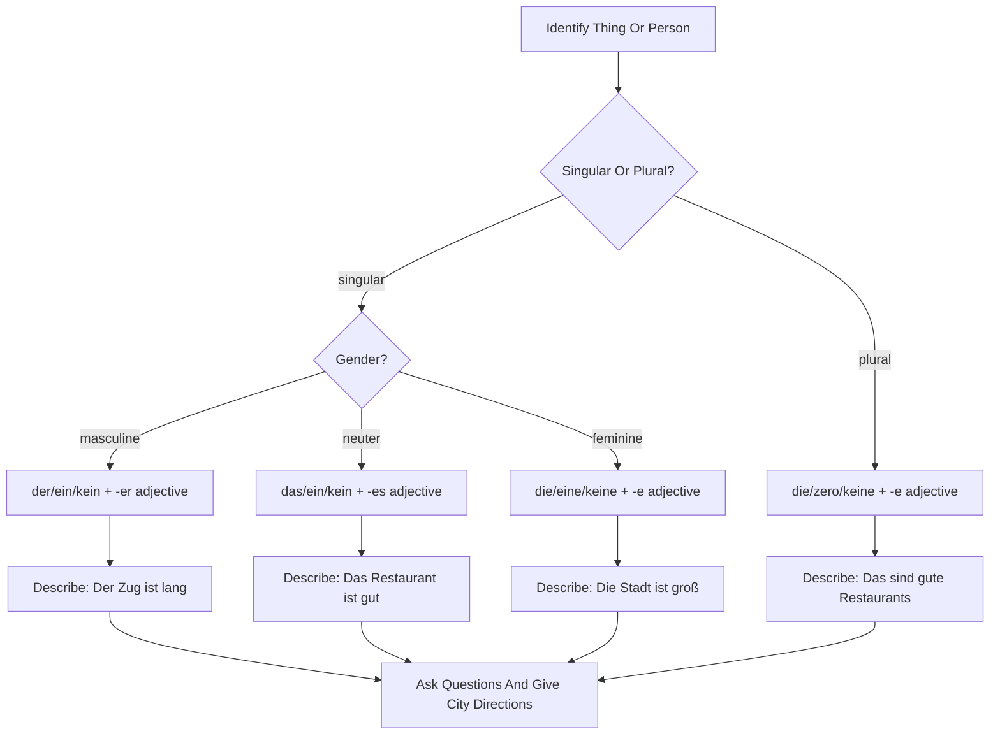

# Lektion 03: City Vocabulary, Articles, Negative Articles, Directions, And Adjectives

Source files:

- `german-a1-1/raw/Lektion 3 22. Mai - 29. Mai 2026/Freitag, der 22. Mai 2026.html`
- `german-a1-1/raw/Lektion 3 22. Mai - 29. Mai 2026/Freitag, der 29. Mai 2026.html`
- `german-a1-1/raw/Lektion 3 22. Mai - 29. Mai 2026/Artikel  Adjektive.pdf`
- `german-a1-1/raw/Lektion 3 22. Mai - 29. Mai 2026/Tafelbild - Adjektive (neu).pdf`

Processed: 2026-06-01
Course: German A1.1
Topic folder: `german-a1-1/wiki/lektion-03-city-articles-negation-and-adjectives/`
Vocabulary glossary: `VOCAB-GLOSSARY.md`

## 80/20 Exam Summary

This lesson adds noun-phrase control. You need to identify things and people in a city context, choose the right article, negate nouns with `kein`, describe nouns with simple adjectives, ask basic questions, and understand short directions or city descriptions.

Highest-value content:

- `der`, `das`, `die`, plural `die` for nominative nouns
- `ein`, `ein`, `eine`, zero article in plural
- `kein`, `kein`, `keine`, plural `keine` for negating noun phrases
- adjective endings after indefinite articles: `ein langer Zug`, `ein gutes Restaurant`, `eine große Stadt`, plural `gute Restaurants`
- `Was ist das?`, `Wer ist das?`, `Was sind das?`, `Wer sind das?`
- city and place vocabulary from the Hamburg/Munich activities
- question formulation with `wer`, `wo`, `woher`, `wie`, `was`, `wann`, plus yes/no starts like `Gehst du...?`

## Core Concepts

### Nominative Means Subject

The board explicitly labels `Nominativ = Subjekt`. In these lessons, nominative means the noun phrase is the thing/person being identified or described:

- `Das ist ein Zug.`
- `Der Zug ist lang.`
- `Das sind gute Restaurants.`

For A1, focus on producing the correct article and adjective ending in simple subject/identity sentences.

### Definite Articles

| Gender/Number | Definite Article | Example |
|---|---|---|
| masculine singular | `der` | `der Zug`, `der Mann` |
| neuter singular | `das` | `das Restaurant`, `das Kind` |
| feminine singular | `die` | `die Stadt`, `die Frau` |
| plural | `die` | `die Züge`, `die Restaurants`, `die Städte` |

Definite articles are useful when the noun is known or already identified.

### Indefinite Articles

| Gender/Number | Indefinite Article | Example |
|---|---|---|
| masculine singular | `ein` | `ein Zug`, `ein Mann` |
| neuter singular | `ein` | `ein Restaurant`, `ein Kind` |
| feminine singular | `eine` | `eine Stadt`, `eine Frau` |
| plural | no article | `Züge`, `Restaurants`, `Städte` |

Trap: plural indefinite has no `ein`. Use zero article: `Das sind gute Restaurants.`

### Negative Articles

`kein` negates nouns. It follows the indefinite article logic:

| Gender/Number | Negative Article | Example |
|---|---|---|
| masculine singular | `kein` | `Das ist kein Zug.` |
| neuter singular | `kein` | `Das ist kein Restaurant.` |
| feminine singular | `keine` | `Das ist keine Stadt.` |
| plural | `keine` | `Das sind keine Restaurants.` |

Use `nicht` to negate verbs, adjectives, or whole statements; use `kein` to negate noun phrases with an indefinite/zero-article meaning.

### Attributive Adjective Endings After `ein`

The source examples show adjective endings directly before the noun:

| Gender/Number | Pattern | Example |
|---|---|---|
| masculine | `ein + adjective-er + noun` | `ein langer Zug`, `ein sportlicher Mann` |
| neuter | `ein + adjective-es + noun` | `ein gutes Restaurant`, `ein kleines Kind`, `ein modernes Hotel` |
| feminine | `eine + adjective-e + noun` | `eine große Stadt`, `eine aktive Frau` |
| plural, no article | `adjective-e + noun` | `gute Restaurants`, `kleine Kinder`, `große Städte` |

Mental model: if the article does not clearly show gender, the adjective often has to carry more information. At A1, memorize the patterns above rather than trying to derive the full adjective-declension system.

### City, Directions, Seasons, And Questions

The Moodle agendas include Hamburg, a Munich tour film, directions, seasons, city presentations, and repeated question formulation.

High-value question words:

| German | Function |
|---|---|
| `Wer ...?` | asks about a person |
| `Was ...?` | asks about a thing/action |
| `Wo ...?` | asks location |
| `Woher ...?` | asks origin/from where |
| `Wie ...?` | asks name, manner, condition |
| `Wann ...?` | asks time |
| `Gehst du ...?` | yes/no question about going |
| `Kommst du ...?` | yes/no question about coming |

## Mechanisms And Logic

### How To Identify A Thing Or Person

1. Decide whether it is one item/person or plural.
2. For singular, know the noun gender.
3. Use `Das ist ...` for singular and `Das sind ...` for plural.
4. Choose article: definite, indefinite, or negative.
5. Add adjective ending only if the adjective comes before the noun.

Examples:

- `Das ist ein Zug.`
- `Der Zug ist lang.`
- `Das ist ein langer Zug.`
- `Das sind gute Restaurants.`

### Predicate Adjective Versus Attributive Adjective

Predicate adjective after `sein` usually does not take an ending:

- `Der Zug ist lang.`
- `Das Restaurant ist gut.`
- `Die Stadt ist groß.`

Attributive adjective before the noun takes an ending:

- `Das ist ein langer Zug.`
- `Das ist ein gutes Restaurant.`
- `Das ist eine große Stadt.`

Trap: do not add the same ending in both positions. `Der Zug ist langer` is wrong for the simple A1 pattern.

### Negative Article Decision

Use this decision rule:

```text
Are you negating a noun phrase like "a train / a restaurant / a city / restaurants"?
Yes -> use kein/keine.
No -> use nicht.
```

Examples:

- `Das ist kein Zug.`
- `Das ist keine Stadt.`
- `Das sind keine Restaurants.`
- `Der Zug ist nicht lang.`

## Diagrams, Tables, And Visuals

The source board PDF groups the same pattern by gender and number. The visual memory should be a grid:

| Meaning | Masculine | Neuter | Feminine | Plural |
|---|---|---|---|---|
| known noun | `der Zug` | `das Restaurant` | `die Stadt` | `die Restaurants` |
| one/unknown noun | `ein Zug` | `ein Restaurant` | `eine Stadt` | `Restaurants` |
| not a noun | `kein Zug` | `kein Restaurant` | `keine Stadt` | `keine Restaurants` |
| adjective phrase | `ein langer Zug` | `ein gutes Restaurant` | `eine große Stadt` | `gute Restaurants` |

## Visual Knowledge Map



## Subject Knowledge Graph

| Node | Meaning | Exam Relevance |
|---|---|---|
| Nominative | Subject/identity case in these A1 examples | Selects article forms |
| Definite article | `der`, `das`, `die`, plural `die` | Required with known nouns |
| Indefinite article | `ein`, `ein`, `eine`, zero plural | Required for first identification |
| Negative article | `kein`, `kein`, `keine`, plural `keine` | Required for "not a/no" noun phrases |
| Predicate adjective | Adjective after `sein` without ending in the basic pattern | `Der Zug ist lang` |
| Attributive adjective | Adjective before noun with ending | `ein langer Zug` |
| City vocabulary | Places, city names, directions, seasons | Supports speaking/listening tasks |
| Question formulation | `wer`, `wo`, `woher`, `wie`, `was`, `wann` plus yes/no starts | Needed for active classroom use |

| From | Relationship | To | Why It Matters |
|---|---|---|---|
| Noun gender | determines | article | `der`, `das`, `die` are not interchangeable |
| Indefinite article | shapes | adjective ending | `ein langer`, `ein gutes`, `eine große` |
| Plural indefinite | uses | zero article | `gute Restaurants`, not `eine Restaurants` |
| Negative article | negates | noun phrase | `kein Restaurant`, `keine Stadt` |
| Predicate adjective | differs from | attributive adjective | `ist gut` vs `ein gutes Restaurant` |
| Question word | selects | information type | `wo` location, `woher` origin |
| City topic | requires | articles plus adjectives | describe places accurately |

## Real-Life Examples

Describing a city:

- `Hamburg ist eine große Stadt.`
- `Das ist ein modernes Hotel.`
- `Die Restaurants sind gut.`
- `Das sind gute Restaurants.`

Correcting identification:

- `Ist das ein Zug?`
- `Nein, das ist kein Zug. Das ist eine U-Bahn.`

Asking directions or city questions:

- `Wo ist der Bahnhof?`
- `Gehst du ins Zentrum?`
- `Wann kommst du?`

## Exam Relevance

Likely A1 prompts:

- Choose the correct article for a noun.
- Turn `Der Zug ist lang` into `Das ist ein langer Zug`.
- Negate a noun phrase with `kein`.
- Distinguish `Was ist das?` and `Wer ist das?`
- Write city-description sentences with articles and adjectives.
- Form questions using `wer`, `wo`, `woher`, `wie`, `was`, or `wann`.

Common traps:

- using `eine` with masculine or neuter nouns
- writing `ein gute Restaurant` instead of `ein gutes Restaurant`
- writing `ein Restaurants` for plural
- using `nicht` where `kein` is needed: `Das ist nicht Restaurant`
- putting adjective endings after `sein`: `Der Zug ist langer`

High-scoring answer structure:

1. Identify noun gender and number.
2. Choose article type: definite, indefinite, negative.
3. Decide whether adjective is before noun or after `sein`.
4. Apply the memorized A1 ending.
5. Keep the sentence short and correct.

## Retrieval Prompts

Closed-book questions:

1. Give the nominative definite articles for masculine, neuter, feminine, and plural.
2. What is the plural indefinite article in German?
3. When do you use `kein` instead of `nicht`?
4. What is the difference between `Der Zug ist lang` and `Das ist ein langer Zug`?
5. Which question word asks origin: `wo` or `woher`?

Application prompts:

1. Say: "That is a modern hotel."
2. Say: "Those are good restaurants."
3. Negate: `Das ist eine Stadt.`
4. Ask where the train station is.
5. Ask whether someone is going to the cinema.

## Practice Tasks

1. Fill the grid: `der/das/die/plural die`, `ein/ein/eine/zero`, `kein/kein/keine/keine`.
2. Transform predicate to attributive adjective:
   - `Der Mann ist sportlich.` -> `Das ist ...`
   - `Das Kind ist klein.` -> `Das ist ...`
   - `Die Stadt ist groß.` -> `Das ist ...`
3. Write five city sentences using `Das ist ...` and `Das sind ...`.
4. Write one question with each: `wer`, `wo`, `woher`, `wie`, `was`, `wann`.

## Connections

Previous notes from this lecture:

- `../lektion-01-greetings-identity-and-origin/lektion-01-greetings-identity-and-origin.md`
- `../lektion-02-hobbies-verb-position-and-appointments/lektion-02-hobbies-verb-position-and-appointments.md`

Companion files:

- `CONTEXT.md`
- `VOCAB-GLOSSARY.md`

Cross-course links:

- Like legal issue spotting, the first move is classification: gender/number and article type before applying the rule.

## Weakness Flags

- First active recall is still pending.
- Watch `kein` versus `nicht`.
- Watch adjective before noun versus after `sein`.
- Watch plural zero article.
- Watch question-word selection.
