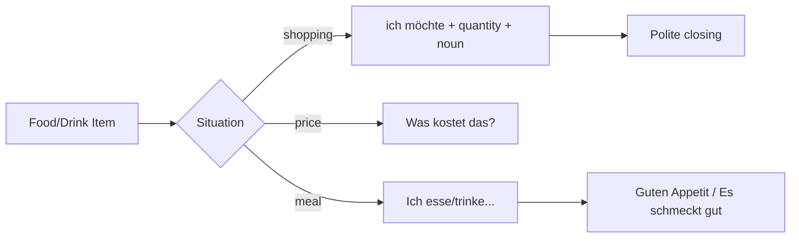

# Context: Lektion 04 Food, Drink, Shopping, And Meals

Source note: `lektion-04-food-drink-shopping-and-meals.md`

## Source Boundary

The local Moodle-Studio source provides the chapter structure and Quizlet links for `Lebensmittel`, `Beim Einkaufen`, and `Beim Essen`, but not the full card text. Terms below are marked as `local` when directly supported by headings and as `enriched A1.1` when added as reliable beginner German needed to make the topic usable.

## Food And Drink Categories

| Term | Definition | Aliases to avoid |
|---|---|---|
| Lebensmittel | `local`: food items/groceries; the broad category for edible products. | "meal" when the item is a grocery |
| Getränk | `enriched A1.1`: drink/beverage such as water, coffee, tea, juice, milk, beer. | "food" for liquids |
| Essen | `local`: food/eating/meal context depending on use. In `Beim Essen`, it means during eating or at the meal. | treating every `Essen` as a single food item |
| Beim Einkaufen | `local`: shopping/buying context, especially asking for products, quantities, and price. | restaurant ordering if the task is buying groceries |
| Beim Essen | `local`: meal/table context, especially eating, drinking, and polite meal phrases. | grocery shopping |

## Shopping And Ordering Patterns

| Term | Definition | Aliases to avoid |
|---|---|---|
| `ich möchte ...` | `enriched A1.1`: polite request pattern meaning "I would like ...". | `ich will` as default polite customer language |
| `Was kostet ...?` | `enriched A1.1`: price question: "What does ... cost?" | `Wie viel kostet?` without a subject |
| `Sonst noch etwas?` | `enriched A1.1`: shopkeeper/server question meaning "anything else?" | literal word-by-word translation |
| `Das ist alles, danke.` | `enriched A1.1`: customer closing phrase meaning "That is all, thank you." | ending the dialogue without closing |
| `bitte` | `enriched A1.1`: please/here you are depending on context; in requests it softens the sentence. | translating it only one way |
| `danke` | `enriched A1.1`: thank you. | omitting politeness in customer dialogue |

## Quantity And Container Language

| Term | Definition | Aliases to avoid |
|---|---|---|
| Quantity phrase | `enriched A1.1`: phrase that says how much/how many: `zwei Brötchen`, `ein Kilo Kartoffeln`. | isolated noun without amount in shopping tasks |
| `ein Kilo` | `enriched A1.1`: one kilogram; useful with potatoes, apples, cheese. | treating it as count noun plural |
| `eine Flasche` | `enriched A1.1`: one bottle; useful with water, juice, milk. | `ein Flasche` |
| `ein Glas` | `enriched A1.1`: one glass; useful with juice, water, beer. | `eine Glas` |
| `eine Tasse` | `enriched A1.1`: one cup; useful with coffee or tea. | `ein Tasse` |

## Eating And Meal Language

| Term | Definition | Aliases to avoid |
|---|---|---|
| `essen` | `local/enriched A1.1`: to eat; use with food. | using it for drinks |
| `trinken` | `enriched A1.1`: to drink; use with beverages. | using it for solid food |
| Frühstück | `enriched A1.1`: breakfast. | "early food" |
| Mittagessen | `enriched A1.1`: lunch/midday meal. | "middle food" |
| Abendessen | `enriched A1.1`: dinner/evening meal. | "night food" |
| `Guten Appetit!` | `enriched A1.1`: polite phrase before eating: enjoy your meal. | greeting or goodbye |
| `Es schmeckt gut.` | `enriched A1.1`: It tastes good. | `Es ist gut` when evaluating taste specifically |

## Relationships Between Canonical Terms

- **Lebensmittel** are the noun inventory; **Beim Einkaufen** turns them into requests with **quantity phrases** and **price questions**.
- **Getränke** often combine with **container language**: **eine Flasche**, **ein Glas**, **eine Tasse**.
- **Beim Essen** uses **essen**, **trinken**, **meal nouns**, and polite table phrases.
- **ich möchte** is the safest A1 request frame for both shopping and ordering.

## Visual Mini-Map



## Example Dialogue

```text
A: Guten Tag. Was möchten Sie?
B: Ich möchte zwei Brötchen und eine Flasche Wasser.
A: Sonst noch etwas?
B: Ja, ein Stück Käse bitte. Was kostet das?
A: Das kostet fünf Euro.
B: Danke.
```

## Flagged Ambiguities

| Ambiguity | Recommendation |
|---|---|
| The local HTML has Quizlet embeds but no card text. | Treat the exact Quizlet vocabulary as external practice; use this file as the local A1.1 production companion. |
| `Essen` can mean food, eating, or a meal. | Use **Lebensmittel** for grocery item category and **Beim Essen** for meal context. |
| `Ich will ...` is grammatically possible. | Use **ich möchte** as canonical polite A1 customer language. |

## Exam Traps And Correction Rules

| Trap | Correction Rule |
|---|---|
| food nouns without articles | Learn article and plural together: `der Apfel`, `die Äpfel`. |
| `Ich will ein Kaffee` | Prefer `Ich möchte einen Kaffee.` |
| `eine Glas Wasser` | `Glas` is neuter: `ein Glas Wasser`. |
| using `essen` for drinks | Use `trinken`: `Ich trinke Wasser.` |
| `Wie viel kostet?` | Use `Was kostet das?` or `Was kostet der Käse?` |

## Cheat-Sheet Language

- `Ich möchte ...`
- `Was kostet das?`
- `Sonst noch etwas?`
- `Das ist alles, danke.`
- `Ich esse ...`
- `Ich trinke ...`
- `Guten Appetit!`
- `Es schmeckt gut.`
