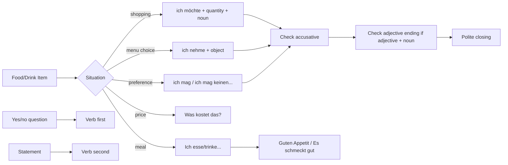

# Context: Lektion 04 Food, Drink, Shopping, And Meals

Source note: `lektion-04-food-drink-shopping-and-meals.md`
Updated: 2026-07-08 with Lektion 4 classroom export.

## Source Boundary

The local Moodle-Studio source provides the chapter structure and Quizlet links for `Lebensmittel`, `Beim Einkaufen`, and `Beim Essen`, but not the full card text. The 2026-07-08 classroom export adds direct course evidence for nominative subject, accusative object, yes/no question order, adjective endings in object noun phrases, `kein`, `nicht gern`, `mögen`, and the "Das Verb ist der Boss" mental model. Terms below are marked as `local` when directly supported by source headings/handouts, `enriched A1.1` when added as reliable beginner German needed to make the topic usable, and `verified external` when aligned with official/trusted A1 grammar or exam resources.

## Food And Drink Categories

| Term | Definition | Aliases to avoid |
|---|---|---|
| Lebensmittel | `local`: food items/groceries; the broad category for edible products. | "meal" when the item is a grocery |
| Getränk | `enriched A1.1`: drink/beverage such as water, coffee, tea, juice, milk, beer. | "food" for liquids |
| Essen | `local`: food/eating/meal context depending on use. In `Beim Essen`, it means during eating or at the meal. | treating every `Essen` as a single food item |
| Beim Einkaufen | `local`: shopping/buying context, especially asking for products, quantities, and price. | restaurant ordering if the task is buying groceries |
| Beim Essen | `local`: meal/table context, especially eating, drinking, and polite meal phrases. | grocery shopping |

## Shopping And Ordering Patterns

| Term | Definition | Aliases to avoid |
|---|---|---|
| `ich möchte ...` | `enriched A1.1`: polite request pattern meaning "I would like ...". | `ich will` as default polite customer language |
| `ich nehme ...` | `verified external/enriched`: restaurant or shopping choice pattern meaning "I will take / I will have ...". | only physical taking |
| `mögen` | `verified external/enriched`: verb for liking food, drinks, or activities: `Ich mag Kaffee`; negative with accusative noun: `Ich mag keinen Fisch.` | `möchten` |
| `Was kostet ...?` | `enriched A1.1`: price question: "What does ... cost?" | `Wie viel kostet?` without a subject |
| `Sonst noch etwas?` | `enriched A1.1`: shopkeeper/server question meaning "anything else?" | literal word-by-word translation |
| `Das ist alles, danke.` | `enriched A1.1`: customer closing phrase meaning "That is all, thank you." | ending the dialogue without closing |
| `bitte` | `enriched A1.1`: please/here you are depending on context; in requests it softens the sentence. | translating it only one way |
| `danke` | `enriched A1.1`: thank you. | omitting politeness in customer dialogue |

## Object Grammar For Buying And Ordering

| Term | Definition | Aliases to avoid |
|---|---|---|
| Das Verb ist der Boss | `local`: course mental model: first identify the finite verb, then attach the needed subject and, for many verbs, the object. | memorizing words without sentence role |
| Nominative subject | `local/verified external`: the person or thing that performs or carries the verb; the source marks subjects as nominative. | object |
| Direct object | `verified external/enriched`: the thing bought, ordered, needed, taken, liked, or possessed after verbs such as `möchten`, `nehmen`, `brauchen`, `kaufen`, `mögen`, and `haben`. | subject |
| Accusative | `verified external/enriched`: direct-object case. In A1.1 shopping language, the main visible change is masculine singular: `einen Kaffee`, `keinen Fisch`. | a completely new word |
| Masculine accusative | `verified external/enriched`: `der/ein/kein` becomes `den/einen/keinen` when the masculine noun is the object. | `ein Kaffee` after `ich möchte` |
| Neuter/feminine/plural accusative | `verified external/enriched`: forms normally look the same as nominative at this level: `ein Wasser`, `eine Banane`, `keine Eier`. | changing every article |
| Accusative adjective ending | `local/enriched A1.1`: adjective ending inside an object noun phrase: `einen langen Zug`, `ein gutes Restaurant`, `eine große Stadt`, `gute Restaurants`. | leaving the adjective uninflected |

## Word Order And Negation Control

| Term | Definition | Aliases to avoid |
|---|---|---|
| Yes/no question | `local`: question with the finite verb in first position: `Möchtest du eine Cola?`, `Trinkst du Tee?` | English-style `Du möchtest...?` as default exam form |
| Statement order | `local`: finite verb in second position: `Ich möchte einen Apfelkuchen`; if time comes first, the subject follows the verb: `Am Morgen trinke ich Kaffee`. | treating "second position" as second word only |
| `kein` | `local/verified external`: negative article for noun phrases; in the lesson handout it means a clear "no/not any" object: `keinen Fisch`, `keine Bananen`. | `nicht gern` |
| `nicht gern` | `local`: negates liking/preference for the action: `Ich esse nicht gern Fisch`; softer than saying no fish at all. | `kein` for every negative |
| verb + `gern` | `local`: pattern for liking an activity: `Ich tanze gern`; `Ich esse gern Schokolade`. | `Ich mag tanzen` as the course-local pattern |

## Quantity And Container Language

| Term | Definition | Aliases to avoid |
|---|---|---|
| Quantity phrase | `enriched A1.1`: phrase that says how much/how many: `zwei Brötchen`, `ein Kilo Kartoffeln`. | isolated noun without amount in shopping tasks |
| `ein Kilo` | `enriched A1.1`: one kilogram; useful with potatoes, apples, cheese. | treating it as count noun plural |
| `eine Flasche` | `enriched A1.1`: one bottle; useful with water, juice, milk. | `ein Flasche` |
| `ein Glas` | `enriched A1.1`: one glass; useful with juice, water, beer. | `eine Glas` |
| `eine Tasse` | `enriched A1.1`: one cup; useful with coffee or tea. | `ein Tasse` |

## Eating And Meal Language

| Term | Definition | Aliases to avoid |
|---|---|---|
| `essen` | `local/enriched A1.1`: to eat; use with food. | using it for drinks |
| `trinken` | `enriched A1.1`: to drink; use with beverages. | using it for solid food |
| Frühstück | `enriched A1.1`: breakfast. | "early food" |
| Mittagessen | `enriched A1.1`: lunch/midday meal. | "middle food" |
| Abendessen | `enriched A1.1`: dinner/evening meal. | "night food" |
| `Guten Appetit!` | `enriched A1.1`: polite phrase before eating: enjoy your meal. | greeting or goodbye |
| `Es schmeckt gut.` | `enriched A1.1`: It tastes good. | `Es ist gut` when evaluating taste specifically |

## Relationships Between Canonical Terms

- **Lebensmittel** are the noun inventory; **Beim Einkaufen** turns them into requests with **quantity phrases** and **price questions**.
- **Getränke** often combine with **container language**: **eine Flasche**, **ein Glas**, **eine Tasse**.
- **Beim Essen** uses **essen**, **trinken**, **meal nouns**, and polite table phrases.
- **ich möchte** is the safest A1 request frame for both shopping and ordering.
- **ich möchte**, **ich nehme**, **ich brauche**, **ich kaufe**, **ich mag**, and **ich habe** often create a **direct object**, so masculine nouns need **masculine accusative**.
- **mögen** means liking generally; **möchten** means wanting or ordering now.
- **Das Verb ist der Boss** links word order and case: find the verb, then identify the **nominative subject** and possible **accusative object**.
- **Yes/no questions** move the finite verb to the front; **statements** keep the finite verb in second position.
- **kein** negates the noun itself; **nicht gern** negates the preference for doing/eating/drinking.
- **Accusative adjective endings** reuse the article/case decision inside the object noun phrase.

## Visual Mini-Map



## Example Dialogue

```text
A: Guten Tag. Was möchten Sie?
B: Ich möchte zwei Brötchen und eine Flasche Wasser.
A: Sonst noch etwas?
B: Ja, einen Kaffee und ein Stück Käse bitte. Was kostet das?
A: Das kostet fünf Euro.
B: Danke.
```

## Flagged Ambiguities

| Ambiguity | Recommendation |
|---|---|
| The local HTML has Quizlet embeds but no card text. | Treat the exact Quizlet vocabulary as external practice; use this file as the local A1.1 production companion. |
| `Essen` can mean food, eating, or a meal. | Use **Lebensmittel** for grocery item category and **Beim Essen** for meal context. |
| `Ich will ...` is grammatically possible. | Use **ich möchte** as canonical polite A1 customer language. |
| `mögen` and `möchten` look similar. | Use **mögen** for liking, **möchten** for polite requests. |
| `ein Kaffee` appears possible from the base article. | In ordering/requesting, use **einen Kaffee** because it is masculine accusative. |
| `kein` and `nicht gern` both feel like "not". | Use **kein** for "no/not any noun"; use **nicht gern** for "do not like doing/eating/drinking". |
| `Ich mag tanzen` sounds plausible from English. | In this course layer, use **Ich tanze gern** for liking an activity. |
| "Verb position 2" can be misread as "second word". | Count sentence fields: `Am Morgen` is one first-position unit, so `trinke` is still position 2. |

## Exam Traps And Correction Rules

| Trap | Correction Rule |
|---|---|
| food nouns without articles | Learn article and plural together: `der Apfel`, `die Äpfel`. |
| `Ich will ein Kaffee` | Prefer `Ich möchte einen Kaffee.` |
| `Ich nehme ein Salat` | Masculine object: `Ich nehme einen Salat.` |
| `Ich möchte keinen Wasser` | Neuter object stays `kein`: `Ich möchte kein Wasser.` |
| `Ich sehe einen lang Zug` | Add the adjective ending: `Ich sehe einen langen Zug.` |
| `Du möchtest eine Cola?` as default question | Use verb-first question order: `Möchtest du eine Cola?` |
| `Ich mag tanzen` | Use verb + `gern`: `Ich tanze gern.` |
| `Ich esse nicht Fisch` | If you mean no fish as an object, use `Ich esse keinen Fisch.` |
| `eine Glas Wasser` | `Glas` is neuter: `ein Glas Wasser`. |
| using `essen` for drinks | Use `trinken`: `Ich trinke Wasser.` |
| `Wie viel kostet?` | Use `Was kostet das?` or `Was kostet der Käse?` |

## Cheat-Sheet Language

- `Ich möchte ...`
- `Ich nehme ...`
- `Ich mag ...`
- `Ich mag keinen/kein/keine ...`
- `Ich esse/trinke nicht gern ...`
- `einen Kaffee`, `einen Apfel`, `keinen Fisch`
- `einen langen Zug`, `ein gutes Restaurant`, `eine große Stadt`, `gute Restaurants`
- `Möchtest du ...?`
- `Was kostet das?`
- `Sonst noch etwas?`
- `Das ist alles, danke.`
- `Ich esse ...`
- `Ich trinke ...`
- `Guten Appetit!`
- `Es schmeckt gut.`
