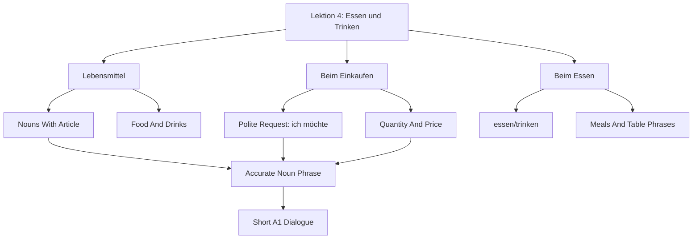

# Lektion 04: Food, Drink, Shopping, And Meals

Source files:

- `german-a1-1/raw/Deutsch als Fremdsprache - Moodle-Studio A1 (SoSe 2026)_2026061_2249/Essen und Trinken _ Food and Drink (A1.1 - Kapitel 4)/Vokabeln Essen und Trinken.html`
- `german-a1-1/raw/Deutsch als Fremdsprache - Moodle-Studio A1 (SoSe 2026)_2026061_2249/Vokabeltraining _ Vocabulary Training/Vokabeltraining A1.1 Kapitel 4.html`

Processed: 2026-06-01
Course: German A1.1
Topic folder: `german-a1-1/wiki/lektion-04-food-drink-shopping-and-meals/`
Vocabulary glossary: `VOCAB-GLOSSARY.md`

## Source Assessment

The local Moodle-Studio HTML is mainly an index page with embedded Quizlet cards. The local source exposes the chapter structure and external practice links, but not the full card text. The detailed vocabulary below is therefore a course-local A1.1 study layer enriched from the exposed chapter headings and standard A1 food/shopping/restaurant language.

Embedded source sections:

| Section | Local Heading | External Practice |
|---|---|---|
| 1 | Lebensmittel | `https://quizlet.com/494923420/flashcards/embed?i=18et1p&x=1jj1` |
| 2 | Beim Einkaufen | `https://quizlet.com/494925530/flashcards/embed?i=18et1p&x=1jj1` |
| 3 | Beim Essen | `https://quizlet.com/494927414/flashcards/embed?i=18et1p&x=1jj1` |

## 80/20 Exam Summary

This topic is about surviving three everyday A1 situations: naming food and drinks, buying food, and ordering or talking during a meal.

The highest-value output is a short, correct exchange:

```text
A: Was möchten Sie?
B: Ich möchte ein Wasser und einen Kaffee.
A: Sonst noch etwas?
B: Nein, danke. Was kostet das?
```

Core skills:

- recognize and produce common food/drink nouns with article and plural where useful
- ask for things politely with `ich möchte ...`
- handle quantity words such as `ein`, `eine`, `zwei`, `ein Kilo`, `eine Flasche`, `ein Glas`
- ask about price with `Was kostet ...?`
- use meal phrases: `Frühstück`, `Mittagessen`, `Abendessen`, `Guten Appetit`
- distinguish food-shopping language from restaurant/table language

## Core Concepts

### Lebensmittel

`Lebensmittel` are food items. At A1, learn them with article and a simple use sentence.

| German | English | Article/Plural | Example |
|---|---|---|---|
| `das Brot` | bread | plural usually `die Brote` for loaves/types | `Ich kaufe Brot.` |
| `das Brötchen` | bread roll | `die Brötchen` | `Ich möchte zwei Brötchen.` |
| `der Käse` | cheese | usually mass noun | `Ich esse Käse.` |
| `die Wurst` | sausage/cold cut | `die Würste` | `Ich kaufe Wurst.` |
| `das Ei` | egg | `die Eier` | `Ich esse ein Ei.` |
| `der Apfel` | apple | `die Äpfel` | `Ich möchte einen Apfel.` |
| `die Banane` | banana | `die Bananen` | `Ich kaufe eine Banane.` |
| `die Kartoffel` | potato | `die Kartoffeln` | `Ich kaufe Kartoffeln.` |
| `der Reis` | rice | mass noun | `Ich esse Reis.` |
| `die Nudeln` | pasta/noodles | plural | `Ich esse Nudeln.` |

### Getränke

| German | English | Article/Plural | Example |
|---|---|---|---|
| `das Wasser` | water | usually mass noun | `Ich möchte ein Wasser.` |
| `der Kaffee` | coffee | `die Kaffees` for cups/types | `Ich trinke Kaffee.` |
| `der Tee` | tea | `die Tees` for types | `Ich trinke Tee.` |
| `die Milch` | milk | mass noun | `Ich brauche Milch.` |
| `der Saft` | juice | `die Säfte` | `Ich möchte Orangensaft.` |
| `das Bier` | beer | `die Biere` | `Ich trinke kein Bier.` |

### Beim Einkaufen

Shopping language combines a product, quantity, price, and polite request.

| Function | German Pattern | Example |
|---|---|---|
| ask for something | `Ich möchte ...` | `Ich möchte ein Brot.` |
| ask price | `Was kostet ...?` | `Was kostet der Käse?` |
| say need | `Ich brauche ...` | `Ich brauche Milch und Eier.` |
| ask if there is more | `Sonst noch etwas?` | shopkeeper phrase |
| close purchase | `Das ist alles, danke.` | customer phrase |

### Beim Essen

Meal language is about eating, drinking, ordering, and polite table phrases.

| German | Meaning | Use |
|---|---|---|
| `essen` | to eat | `Ich esse Brot.` |
| `trinken` | to drink | `Ich trinke Wasser.` |
| `das Frühstück` | breakfast | morning meal |
| `das Mittagessen` | lunch | midday meal |
| `das Abendessen` | dinner | evening meal |
| `Guten Appetit!` | enjoy your meal | before eating |
| `Es schmeckt gut.` | It tastes good. | meal evaluation |

## Mechanisms And Logic

### How To Build A Shopping Sentence

1. Decide whether you are asking politely or stating a need.
2. Use `ich möchte` for a polite request.
3. Add the noun phrase with correct article/quantity.
4. Ask price if needed.

Examples:

- `Ich möchte ein Brötchen.`
- `Ich möchte eine Banane.`
- `Ich möchte einen Kaffee.`
- `Was kostet das?`

### Quantity Phrases

| Quantity | Example | Use |
|---|---|---|
| `ein/eine` | `ein Brot`, `eine Banane` | one item |
| `zwei` | `zwei Brötchen` | countable plural |
| `ein Kilo` | `ein Kilo Kartoffeln` | weight |
| `eine Flasche` | `eine Flasche Wasser` | bottled drinks |
| `ein Glas` | `ein Glas Saft` | served drink |
| `eine Tasse` | `eine Tasse Kaffee` | hot drink |

### Food Versus Restaurant Context

Same vocabulary, different task:

- Food list task: name and classify items: `das Brot`, `der Käse`, `die Milch`.
- Shopping task: request and pay: `Ich möchte ... Was kostet ...?`
- Meal task: eat/drink/evaluate: `Ich esse ... Es schmeckt gut.`

## Visual Knowledge Map



## Subject Knowledge Graph

| Node | Meaning | Exam Relevance |
|---|---|---|
| Lebensmittel | food items | naming and shopping tasks |
| Getränk | drink | ordering and meal tasks |
| Quantity phrase | `ein Kilo`, `eine Flasche`, `ein Glas`, `eine Tasse` | makes shopping realistic |
| `ich möchte` | polite request form | core A1 buying/ordering pattern |
| `brauchen` | to need | shopping-list pattern |
| `kosten` | to cost | price questions |
| `essen` | to eat | meal sentence |
| `trinken` | to drink | drink sentence |
| Meal noun | breakfast/lunch/dinner word | daily routine and meal context |

| From | Relationship | To | Why It Matters |
|---|---|---|---|
| Lebensmittel | require | article and quantity | `ein Brot`, `eine Banane`, `zwei Brötchen` |
| Drinks | combine with | container words | `ein Glas Saft`, `eine Tasse Kaffee` |
| Shopping dialogue | uses | `ich möchte` | polite and high-frequency |
| Price question | uses | `kosten` | practical buying task |
| Meal context | uses | `essen` and `trinken` | separates eating from buying |
| Restaurant/table phrase | supports | social politeness | `Guten Appetit`, `Es schmeckt gut` |

## Real-Life Examples

At a bakery:

```text
A: Guten Tag. Was möchten Sie?
B: Ich möchte zwei Brötchen und ein Brot.
A: Sonst noch etwas?
B: Nein, danke. Was kostet das?
```

At a cafe:

```text
A: Was möchtest du trinken?
B: Ich möchte einen Kaffee und ein Wasser.
A: Möchtest du auch Kuchen?
B: Nein, danke.
```

At home:

```text
Ich frühstücke um acht Uhr. Ich esse Brot mit Käse und trinke Kaffee.
```

## Exam Relevance

Likely A1 prompts:

- name food and drink items with articles
- write a short shopping dialogue
- ask and answer what someone eats or drinks
- ask for price
- match quantity expressions to products
- decide whether a word belongs to `Lebensmittel`, `Beim Einkaufen`, or `Beim Essen`

Common traps:

- learning food nouns without articles
- using `Ich will` where polite A1 buying language expects `Ich möchte`
- forgetting plural/quantity after numbers: `zwei Brötchen`
- confusing `essen` and `trinken`
- asking `Wie viel kostet?` without a subject; use `Was kostet das?`

How to structure a high-scoring answer:

1. Choose situation: food list, shop, or meal.
2. Use one memorized sentence pattern.
3. Add article/quantity.
4. Keep the sentence short.
5. Close politely with `bitte`, `danke`, or `Guten Appetit`.

## Retrieval Prompts

Closed-book questions:

1. Name five foods with articles.
2. Name three drinks with articles.
3. How do you politely say "I would like ..." in German?
4. How do you ask "What does that cost?"
5. What is the difference between `essen` and `trinken`?

Application prompts:

1. Buy two bread rolls and one coffee.
2. Ask the price of cheese.
3. Say what you eat for breakfast.
4. Order a glass of juice.
5. Tell someone the food tastes good.

## Practice Tasks

1. Build a shopping list with five German nouns and articles.
2. Write a four-line bakery dialogue.
3. Transform food nouns into quantity phrases: `Wasser`, `Kaffee`, `Kartoffeln`, `Brötchen`.
4. Make three sentences with `essen`, three with `trinken`, and three with `ich möchte`.

## Connections

Previous notes from this lecture:

- `../lektion-01-greetings-identity-and-origin/lektion-01-greetings-identity-and-origin.md`
- `../lektion-02-hobbies-verb-position-and-appointments/lektion-02-hobbies-verb-position-and-appointments.md`
- `../lektion-03-city-articles-negation-and-adjectives/lektion-03-city-articles-negation-and-adjectives.md`

Companion files:

- `CONTEXT.md`
- `VOCAB-GLOSSARY.md`

Cross-course links:

- Like business-case prompts, the first move is context: shop, restaurant, or home meal. The same noun can behave differently depending on the task.

## Weakness Flags

- First active recall is still pending.
- Watch article and quantity together.
- Watch `ich möchte` instead of too-direct `ich will`.
- Watch `essen` versus `trinken`.
- Watch price question pattern: `Was kostet das?`
