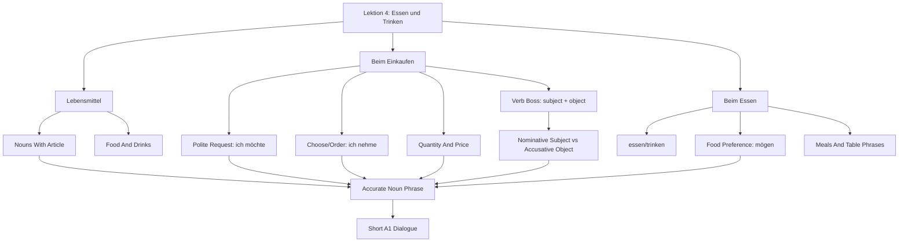

# Lektion 04: Food, Drink, Shopping, And Meals

Source files:

- `german-a1-1/raw/Deutsch als Fremdsprache - Moodle-Studio A1 (SoSe 2026)_2026061_2249/Essen und Trinken _ Food and Drink (A1.1 - Kapitel 4)/Vokabeln Essen und Trinken.html`
- `german-a1-1/raw/Deutsch als Fremdsprache - Moodle-Studio A1 (SoSe 2026)_2026061_2249/Vokabeltraining _ Vocabulary Training/Vokabeltraining A1.1 Kapitel 4.html`
- `german-a1-1/raw/Deutsch als Fremdsprache A1.1 (Bakker) (SoSe 2026)_2026078_1100/Lektion 4 05. Juni - 12. Juni 2026/Freitag, der 05. Juni 2026.html`
- `german-a1-1/raw/Deutsch als Fremdsprache A1.1 (Bakker) (SoSe 2026)_2026078_1100/Lektion 4 05. Juni - 12. Juni 2026/Freitag, der 12. Juni 2026.html`
- `german-a1-1/raw/Deutsch als Fremdsprache A1.1 (Bakker) (SoSe 2026)_2026078_1100/Lektion 4 05. Juni - 12. Juni 2026/Akkusativ - Adjektive.pdf`
- `german-a1-1/raw/Deutsch als Fremdsprache A1.1 (Bakker) (SoSe 2026)_2026078_1100/Lektion 4 05. Juni - 12. Juni 2026/Nom  Akk.pdf`
- `german-a1-1/raw/Deutsch als Fremdsprache A1.1 (Bakker) (SoSe 2026)_2026078_1100/Lektion 4 05. Juni - 12. Juni 2026/Das Verb ist der Boss (Zusammenfassung).pdf`

Processed: 2026-06-01
Enriched: 2026-06-04 with official/trusted A1 source alignment for accusative objects, `nehmen`, and `mögen`.
Updated: 2026-07-08 with Lektion 4 classroom export from 2026-06-05 and 2026-06-12.
Course: German A1.1
Topic folder: `german-a1-1/wiki/lektion-04-food-drink-shopping-and-meals/`
Vocabulary glossary: `VOCAB-GLOSSARY.md`

## Source Assessment

The local Moodle-Studio HTML is mainly an index page with embedded Quizlet cards. The local source exposes the chapter structure and external practice links, but not the full card text. The detailed vocabulary below is therefore a course-local A1.1 study layer enriched from the exposed chapter headings and standard A1 food/shopping/restaurant language.

The 2026-07-08 classroom export adds the missing course-local grammar layer: `Das Verb ist der Boss`, nominative subject versus accusative object, yes/no question order, food/party-planning tasks, accusative adjective endings, `kein` versus `nicht gern`, and the difference between `mögen` and `gern` with verbs. These source files confirm that Lektion 4 is not only food vocabulary; it is also the first practical direct-object/case checkpoint.

External A1 alignment from the Goethe/DVV/telc coverage check confirms that this topic should also train basic direct-object language for buying and ordering. In practice, that means `ich möchte`, `ich nehme`, `ich brauche`, and `ich kaufe` plus the accusative article pattern, especially masculine `einen/keinen`.

Embedded source sections:

| Section | Local Heading | External Practice |
|---|---|---|
| 1 | Lebensmittel | `https://quizlet.com/494923420/flashcards/embed?i=18et1p&x=1jj1` |
| 2 | Beim Einkaufen | `https://quizlet.com/494925530/flashcards/embed?i=18et1p&x=1jj1` |
| 3 | Beim Essen | `https://quizlet.com/494927414/flashcards/embed?i=18et1p&x=1jj1` |

## 80/20 Exam Summary

This topic is about surviving three everyday A1 situations: naming food and drinks, buying food, and ordering or talking during a meal.

The highest-value output is a short, correct exchange:

```text
A: Was möchten Sie?
B: Ich möchte ein Wasser und einen Kaffee.
A: Sonst noch etwas?
B: Nein, danke. Was kostet das?
```

Core skills:

- recognize and produce common food/drink nouns with article and plural where useful
- ask for things politely with `ich möchte ...`
- order/choose with `ich nehme ...`
- express food preferences with `mögen`: `Ich mag Kaffee`; `Ich mag keinen Fisch`
- control the basic accusative object pattern: `einen Kaffee`, `einen Apfel`, but `ein Wasser`, `eine Banane`
- distinguish nominative subject from accusative object: `Der Kaffee ist gut` versus `Ich möchte einen Kaffee`
- build yes/no questions with the finite verb first: `Möchtest du eine Cola?`
- keep statement word order: subject or time phrase first, finite verb in position 2, object after the verb
- use `kein` for "no/not any noun" and `nicht gern` for "do not like doing/eating/drinking"
- handle quantity words such as `ein`, `eine`, `zwei`, `ein Kilo`, `eine Flasche`, `ein Glas`
- ask about price with `Was kostet ...?`
- use meal phrases: `Frühstück`, `Mittagessen`, `Abendessen`, `Guten Appetit`
- distinguish food-shopping language from restaurant/table language

## Core Concepts

### Lebensmittel

`Lebensmittel` are food items. At A1, learn them with article and a simple use sentence.

| German | English | Article/Plural | Example |
|---|---|---|---|
| `das Brot` | bread | plural usually `die Brote` for loaves/types | `Ich kaufe Brot.` |
| `das Brötchen` | bread roll | `die Brötchen` | `Ich möchte zwei Brötchen.` |
| `der Käse` | cheese | usually mass noun | `Ich esse Käse.` |
| `die Wurst` | sausage/cold cut | `die Würste` | `Ich kaufe Wurst.` |
| `das Ei` | egg | `die Eier` | `Ich esse ein Ei.` |
| `der Apfel` | apple | `die Äpfel` | `Ich möchte einen Apfel.` |
| `die Banane` | banana | `die Bananen` | `Ich kaufe eine Banane.` |
| `die Kartoffel` | potato | `die Kartoffeln` | `Ich kaufe Kartoffeln.` |
| `der Reis` | rice | mass noun | `Ich esse Reis.` |
| `die Nudeln` | pasta/noodles | plural | `Ich esse Nudeln.` |

### Getränke

| German | English | Article/Plural | Example |
|---|---|---|---|
| `das Wasser` | water | usually mass noun | `Ich möchte ein Wasser.` |
| `der Kaffee` | coffee | `die Kaffees` for cups/types | `Ich trinke Kaffee.` |
| `der Tee` | tea | `die Tees` for types | `Ich trinke Tee.` |
| `die Milch` | milk | mass noun | `Ich brauche Milch.` |
| `der Saft` | juice | `die Säfte` | `Ich möchte Orangensaft.` |
| `das Bier` | beer | `die Biere` | `Ich trinke kein Bier.` |

### Beim Einkaufen

Shopping language combines a product, quantity, price, and polite request.

| Function | German Pattern | Example |
|---|---|---|
| ask for something | `Ich möchte ...` | `Ich möchte ein Brot.` |
| choose/order | `Ich nehme ...` | `Ich nehme die Suppe.` |
| ask price | `Was kostet ...?` | `Was kostet der Käse?` |
| say need | `Ich brauche ...` | `Ich brauche Milch und Eier.` |
| ask if there is more | `Sonst noch etwas?` | shopkeeper phrase |
| close purchase | `Das ist alles, danke.` | customer phrase |

### Accusative In Shopping And Ordering

After `möchte`, `nehme`, `brauche`, `kaufe`, and `habe`, the thing requested or possessed is usually the direct object. At this level, the important visible change is masculine singular:

| Gender/Number | Nominative | Accusative Object | Example |
|---|---|---|---|
| masculine | `der/ein/kein` | `den/einen/keinen` | `Ich möchte einen Kaffee.` |
| neuter | `das/ein/kein` | same | `Ich möchte ein Wasser.` |
| feminine | `die/eine/keine` | same | `Ich kaufe eine Banane.` |
| plural | `die/zero/keine` | same | `Ich brauche Eier.` / `Ich brauche keine Eier.` |

Correction rule: if it is masculine and it is what you buy, order, need, take, or have, use `einen` or `keinen`: `einen Apfel`, `einen Tee`, `keinen Fisch`.

### Das Verb Ist Der Boss

The classroom handout uses the idea "the verb is the boss" to control sentence architecture.

Every verb needs a subject. The subject is nominative:

| Function | Pattern | Example |
|---|---|---|
| subject with `sein` | nominative only | `Der Tee ist kalt.` |
| subject with action verb | nominative + verb | `Ich trinke Tee.` |
| subject after time phrase | time phrase + verb + subject | `Am Morgen trinke ich Kaffee.` |

Many verbs also need an object. In A1.1, the direct object is accusative:

| Verb Type | Examples | Object Check |
|---|---|---|
| buying/ordering/needing | `möchten`, `nehmen`, `kaufen`, `brauchen` | `einen Kaffee`, `ein Wasser`, `eine Pizza` |
| eating/drinking/liking | `essen`, `trinken`, `mögen` | `keinen Fisch`, `einen Tee`, `keine Bananen` |
| having/finding/writing/reading | `haben`, `finden`, `schreiben`, `lesen` | masculine singular changes to `den/einen/keinen` |

Fast exam rule: first find the finite verb, then ask `Wer?` for the subject and `Was?` or `Wen?` for the object.

### Yes/No Questions And Statement Order

| Sentence Type | Word Order | Model |
|---|---|---|
| yes/no question | finite verb + subject + object | `Möchtest du eine Cola?` |
| statement | subject + finite verb + object | `Ich möchte einen Apfelkuchen.` |
| statement with time first | time phrase + finite verb + subject + object | `Am Abend esse ich eine Pizza.` |

Common trap: English lets the subject stay before the verb in questions. German A1 yes/no questions do not: say `Trinkst du Tee?`, not `Du trinkst Tee?` in exam form.

### Accusative Adjectives

Lektion 3 introduced adjective endings in nominative descriptions. Lektion 4 extends the same noun-phrase logic into the accusative object.

| Gender/Number | Nominative Description | Accusative Object |
|---|---|---|
| masculine | `Der Zug ist lang.` | `Ich sehe einen langen Zug.` |
| neuter | `Das Restaurant ist gut.` | `Ich sehe ein gutes Restaurant.` |
| feminine | `Die Stadt ist groß.` | `Ich sehe eine große Stadt.` |
| plural | `Die Restaurants sind gut.` | `Ich sehe gute Restaurants.` |

Production rule: after `Ich sehe ...`, check whether the noun phrase is the object. Masculine singular changes twice: article `ein` -> `einen`, adjective `lang` -> `langen`.

### Beim Essen

Meal language is about eating, drinking, ordering, and polite table phrases.

| German | Meaning | Use |
|---|---|---|
| `essen` | to eat | `Ich esse Brot.` |
| `trinken` | to drink | `Ich trinke Wasser.` |
| `das Frühstück` | breakfast | morning meal |
| `das Mittagessen` | lunch | midday meal |
| `das Abendessen` | dinner | evening meal |
| `Guten Appetit!` | enjoy your meal | before eating |
| `Es schmeckt gut.` | It tastes good. | meal evaluation |

### Liking Food With `mögen`

Use `mögen` to say what you like or do not like as a food preference:

| Function | Pattern | Example |
|---|---|---|
| like | `Ich mag ...` | `Ich mag Kaffee.` |
| do not like a noun | `Ich mag keinen/keine/kein ...` | `Ich mag keinen Fisch.` |
| ask preference | `Magst du ...?` | `Magst du Tee?` |

Do not confuse `mögen` and `möchten`: `Ich mag Kaffee` means you like coffee generally; `Ich möchte einen Kaffee` means you want/order one now.

The classroom source also separates `kein` from `nicht gern`:

| Meaning | German | Use |
|---|---|---|
| no/not any noun | `kein/keinen/keine` | `Ich esse keinen Fisch.` |
| do not like doing it | `nicht gern` | `Ich esse nicht gern Fisch.` |
| like a noun generally | `mögen` | `Ich mag Schokolade.` |
| like doing an activity | verb + `gern` | `Ich tanze gern.` |

Trap: do not say `Ich mag tanzen` for the course-local A1 pattern. Use `Ich tanze gern.`

## Mechanisms And Logic

### How To Build A Shopping Sentence

1. Decide whether you are asking politely or stating a need.
2. Use `ich möchte` for a polite request or `ich nehme` when choosing from a menu.
3. Add the noun phrase with correct article/quantity.
4. Check whether the object is masculine singular and therefore needs `einen/keinen`.
5. Ask price if needed.

Examples:

- `Ich möchte ein Brötchen.`
- `Ich möchte eine Banane.`
- `Ich möchte einen Kaffee.`
- `Ich nehme die Suppe.`
- `Ich mag keinen Fisch.`
- `Was kostet das?`

### How To Build A Party-Planning Sentence

The 12 June class task asks: what do you need, who buys what, and where do you buy it? Use short production frames.

| Task | Pattern | Example |
|---|---|---|
| need something | `Wir brauchen ...` | `Wir brauchen Milch und Eier.` |
| someone buys something | `[Person] kauft ...` | `Ali kauft einen Kuchen.` |
| place of purchase | `bei/im ...` | `Ich kaufe Brot beim Bäcker.` |
| meal statement | `Am Morgen/Abend esse/trinke ich ...` | `Am Abend esse ich einen Salat.` |

### Quantity Phrases

| Quantity | Example | Use |
|---|---|---|
| `ein/eine` | `ein Brot`, `eine Banane` | one item |
| `zwei` | `zwei Brötchen` | countable plural |
| `ein Kilo` | `ein Kilo Kartoffeln` | weight |
| `eine Flasche` | `eine Flasche Wasser` | bottled drinks |
| `ein Glas` | `ein Glas Saft` | served drink |
| `eine Tasse` | `eine Tasse Kaffee` | hot drink |

### Food Versus Restaurant Context

Same vocabulary, different task:

- Food list task: name and classify items: `das Brot`, `der Käse`, `die Milch`.
- Shopping task: request and pay: `Ich möchte ... Was kostet ...?`
- Meal task: eat/drink/evaluate: `Ich esse ... Es schmeckt gut.`

## Visual Knowledge Map



## Subject Knowledge Graph

| Node | Meaning | Exam Relevance |
|---|---|---|
| Lebensmittel | food items | naming and shopping tasks |
| Getränk | drink | ordering and meal tasks |
| Quantity phrase | `ein Kilo`, `eine Flasche`, `ein Glas`, `eine Tasse` | makes shopping realistic |
| `ich möchte` | polite request form | core A1 buying/ordering pattern |
| Accusative object | noun phrase after request/buy/order verbs | `einen Kaffee`, `einen Apfel`, `keinen Fisch` |
| `nehmen` | to take/order/choose | common restaurant and shopping pattern |
| `mögen` | to like | food and drink preference |
| `brauchen` | to need | shopping-list pattern |
| `kosten` | to cost | price questions |
| `essen` | to eat | meal sentence |
| `trinken` | to drink | drink sentence |
| Meal noun | breakfast/lunch/dinner word | daily routine and meal context |
| Verb boss | finite verb controls sentence order and required complements | prevents English word-order transfer |
| Nominative subject | who/what performs or carries the verb | separates `Der Tee ist kalt` from `Ich trinke einen Tee` |
| Accusative adjective ending | adjective ending inside an object noun phrase | `einen langen Zug`, `ein gutes Restaurant` |
| `kein` versus `nicht gern` | noun negation versus dislike of an action | prevents `kein` from replacing every negative |

| From | Relationship | To | Why It Matters |
|---|---|---|---|
| Lebensmittel | require | article and quantity | `ein Brot`, `eine Banane`, `zwei Brötchen` |
| Drinks | combine with | container words | `ein Glas Saft`, `eine Tasse Kaffee` |
| Shopping dialogue | uses | `ich möchte` | polite and high-frequency |
| Shopping dialogue | triggers | accusative object | `einen Kaffee` after `möchte/nehme` |
| Restaurant ordering | uses | `nehmen` | `Ich nehme die Suppe` |
| Food preference | uses | `mögen` | `Ich mag keinen Fisch` |
| Price question | uses | `kosten` | practical buying task |
| Meal context | uses | `essen` and `trinken` | separates eating from buying |
| Restaurant/table phrase | supports | social politeness | `Guten Appetit`, `Es schmeckt gut` |
| Verb boss | separates | nominative subject and accusative object | makes article changes predictable |
| Yes/no question | starts with | finite verb | `Möchtest du eine Cola?` |
| Accusative object | can contain | adjective ending | `einen langen Zug`, `eine große Stadt` |
| `kein` | negates | noun phrases absolutely | `keinen Fisch`, `keine Bananen` |
| `nicht gern` | negates | liking/preference for an action | `Ich trinke nicht gern Tee` |

## Real-Life Examples

At a bakery:

```text
A: Guten Tag. Was möchten Sie?
B: Ich möchte zwei Brötchen und ein Brot.
A: Sonst noch etwas?
B: Nein, danke. Was kostet das?
```

At a cafe:

```text
A: Was möchtest du trinken?
B: Ich möchte einen Kaffee und ein Wasser.
A: Möchtest du auch Kuchen?
B: Nein, danke.
```

At home:

```text
Ich frühstücke um acht Uhr. Ich esse Brot mit Käse und trinke Kaffee.
```

## Exam Relevance

Likely A1 prompts:

- name food and drink items with articles
- write a short shopping dialogue
- choose or order from a simple menu
- change nominative noun phrases into accusative shopping objects
- ask and answer what someone eats or drinks
- say what you like or do not like eating/drinking
- ask for price
- match quantity expressions to products
- decide whether a word belongs to `Lebensmittel`, `Beim Einkaufen`, or `Beim Essen`

Common traps:

- learning food nouns without articles
- using `Ich will` where polite A1 buying language expects `Ich möchte`
- saying `Ich möchte ein Kaffee` instead of `Ich möchte einen Kaffee`
- confusing `Ich mag Kaffee` with `Ich möchte einen Kaffee`
- using `Ich mag tanzen`; course-local correction: `Ich tanze gern`
- using `kein` when the task asks "not gladly"; use `nicht gern`
- forgetting question word order: `Möchtest du ...?`, `Trinkst du ...?`
- forgetting adjective endings in accusative object phrases: `einen langen Zug`, `ein gutes Restaurant`
- forgetting plural/quantity after numbers: `zwei Brötchen`
- confusing `essen` and `trinken`
- asking `Wie viel kostet?` without a subject; use `Was kostet das?`

How to structure a high-scoring answer:

1. Choose situation: food list, shop, or meal.
2. Use one memorized sentence pattern.
3. Add article/quantity.
4. Check masculine accusative objects.
5. Keep the sentence short.
6. Close politely with `bitte`, `danke`, or `Guten Appetit`.

## Retrieval Prompts

Closed-book questions:

1. Name five foods with articles.
2. Name three drinks with articles.
3. How do you politely say "I would like ..." in German?
4. How do you ask "What does that cost?"
5. What is the difference between `essen` and `trinken`?
6. Why is it `einen Kaffee` but `ein Wasser`?
7. What is the difference between `mögen` and `möchten`?
8. What is the subject and object in `Ich möchte einen Kaffee`?
9. Turn `Der Zug ist lang` into an accusative object sentence with `Ich sehe ...`.
10. What is the difference between `Ich esse keinen Fisch` and `Ich esse nicht gern Fisch`?

Application prompts:

1. Buy two bread rolls and one coffee.
2. Ask the price of cheese.
3. Say what you eat for breakfast.
4. Order a glass of juice.
5. Tell someone the food tastes good.
6. Say you do not like fish.
7. Choose soup from a menu and ask to pay.
8. Ask a yes/no question about cola.
9. Plan one party-shopping sentence: who buys what?
10. Say what you eat in the morning and evening.

## Practice Tasks

1. Build a shopping list with five German nouns and articles.
2. Write a four-line bakery dialogue.
3. Transform food nouns into quantity phrases: `Wasser`, `Kaffee`, `Kartoffeln`, `Brötchen`.
4. Make three sentences with `essen`, three with `trinken`, and three with `ich möchte`.
5. Make an accusative mini-table for `Kaffee`, `Wasser`, `Banane`, `Eier`.
6. Mark subject, verb, and object in five shopping sentences.
7. Build adjective-object phrases for `Zug`, `Restaurant`, `Stadt`, and `Restaurants`.

## Connections

Previous notes from this lecture:

- `../lektion-01-greetings-identity-and-origin/lektion-01-greetings-identity-and-origin.md`
- `../lektion-02-hobbies-verb-position-and-appointments/lektion-02-hobbies-verb-position-and-appointments.md`
- `../lektion-03-city-articles-negation-and-adjectives/lektion-03-city-articles-negation-and-adjectives.md`

Companion files:

- `CONTEXT.md`
- `VOCAB-GLOSSARY.md`

Cross-course links:

- Like business-case prompts, the first move is context: shop, restaurant, or home meal. The same noun can behave differently depending on the task.

## Weakness Flags

- First active recall was completed on 2026-06-04, but the D+1 repair is still open.
- Watch article and quantity together.
- Watch `ich möchte` instead of too-direct `ich will`.
- Watch `essen` versus `trinken`.
- Watch price question pattern: `Was kostet das?`
- Add the new 2026-07-08 repair targets: nominative subject versus accusative object, adjective endings in object noun phrases, yes/no question order, and `kein` versus `nicht gern`.
