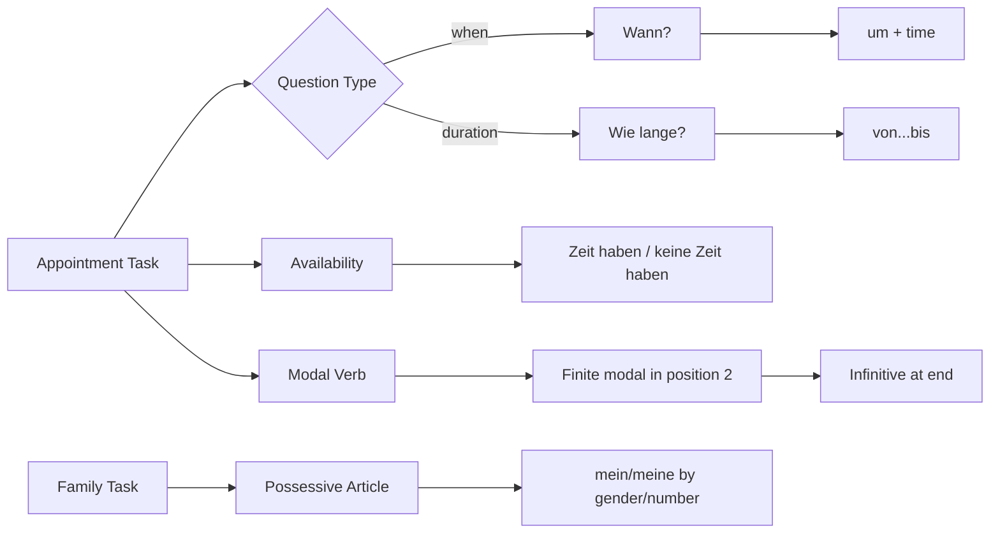

# Context: Lektion 05 Time, Family, Appointments, And Modal Verbs

Source note: `lektion-05-time-family-appointments-and-modal-verbs.md`
Processed: 2026-07-08

## Source Boundary

The local source consists of two class agenda HTML files and the `Satzbrücke.pdf` handout. The agendas identify the course targets: `Wie spät ist es?`, family, appointments, possessive articles, `wann/um`, `wie lange/von...bis`, modal verbs, and a hairdresser appointment dialogue. Definitions below are marked `local` when directly supported by the export and `enriched A1.1` when supplied as reliable beginner German needed to make the source tasks productive.

## Time And Duration Language

| Term | Definition | Aliases to avoid |
|---|---|---|
| `Wie spät ist es?` | `local`: question asking the current clock time. | "How late is it?" as literal output |
| `Es ist ... Uhr.` | `enriched A1.1`: safe exact-time answer frame. | omitting `Uhr` in formal written practice |
| `wann` | `local`: question word for the point in time when something happens. | `wie lange` |
| `um ... Uhr` | `local`: point-time phrase for clock time: `um 15 Uhr`. | `von` for a single appointment time |
| `wie lange` | `local`: asks duration, not the appointment start point. | `wann` |
| `von ... bis ...` | `local`: duration/span frame: `von 10 Uhr bis 12 Uhr`. | using it for one clock point |
| `nächste Woche` | `local`: next week; used for writing upcoming appointments. | vague "soon" |

## Family And Possessives

| Term | Definition | Aliases to avoid |
|---|---|---|
| `die Familie` | `local`: family; source task includes presentations about `Meine Familie`. | friend group |
| `der Vater` | `enriched A1.1`: father. | `die Vater` |
| `die Mutter` | `enriched A1.1`: mother. | `der Mutter` |
| `der Bruder` | `enriched A1.1`: brother. | article-free memorization |
| `die Schwester` | `enriched A1.1`: sister. | article-free memorization |
| `die Eltern` | `enriched A1.1`: parents; plural. | singular article |
| Possessive article | `local/enriched`: article-like ownership/relationship word such as `mein/meine`, `dein/deine`, `sein/seine`, `ihr/ihre`. | possessive pronoun as a full replacement noun |
| `mein` | `local`: masculine/neuter nominative possessive article: `mein Vater`, `mein Kind`. | `meine Vater` |
| `meine` | `local`: feminine/plural nominative possessive article: `meine Mutter`, `meine Eltern`. | `mein Mutter` |

## Appointment And Availability Language

| Term | Definition | Aliases to avoid |
|---|---|---|
| `der Termin` | `local`: appointment; used in service and calendar contexts. | casual meeting only |
| `die Verabredung` | `local`: arrangement/date/appointment with another person. | formal office appointment only |
| `Zeit haben` | `local`: to have time/be available. | translating "be free" word-for-word |
| `keine Zeit haben` | `local`: to have no time/not be available. | `nicht Zeit haben` |
| `sich treffen` | `enriched A1.1`: to meet; A1 frame: `Wir treffen uns ...`. | forgetting `uns` |
| `Kann ich einen Termin haben?` | `local`: polite service appointment request. | `Ich will Termin` |
| `Beim Friseur` | `local`: at the hairdresser; source writing context for appointment dialogue. | grocery shopping context |

## Modal Verb And Satzbrücke Language

| Term | Definition | Aliases to avoid |
|---|---|---|
| Satzbrücke / Satzklammer | `local`: sentence bridge/bracket: finite verb near the front, second verb part or infinitive at the end. | random word order |
| finite verb | `enriched A1.1`: conjugated verb that agrees with the subject and sits in position 2 in statements. | infinitive |
| infinitive at the end | `local`: unconjugated action after modal verbs: `arbeiten`, `ins Kino gehen`, `schlafen`. | conjugating both verbs |
| `müssen` | `local`: modal verb for obligation: `Ich muss arbeiten.` | wanting or liking |
| `können` | `local`: modal verb for ability/availability: `Ich kann am Freitag.` / `Ich kann ins Kino gehen.` | permission only |
| `wollen` | `local`: modal verb for intention/wanting: `Ich will schlafen.` | polite request default |

## Relationships Between Canonical Terms

- **wann** asks the appointment point; **um ... Uhr** answers it.
- **wie lange** asks duration; **von ... bis ...** answers it.
- **Family nouns** require article/gender memory; **possessive articles** copy the `ein/eine` pattern.
- **Appointments** combine **availability**, **point time**, and sometimes **duration**.
- **Modal verbs** open a **Satzbrücke**: the modal is finite in position 2, and the main action appears as an **infinitive at the end**.

## Visual Mini-Map



## Example Dialogue

```text
A: Hast du am Freitag Zeit?
B: Nein, ich habe keine Zeit. Ich muss arbeiten.
A: Kannst du am Samstag?
B: Ja. Wir treffen uns um 15 Uhr.
```

## Flagged Ambiguities

| Ambiguity | Recommendation |
|---|---|
| `Termin` and `Verabredung` both point to meetings. | Use **Termin** for scheduled/service appointments; use **Verabredung** for an arrangement with a person. |
| `wann` and `wie lange` both relate to time. | Use **wann** for the start/point; use **wie lange** for duration. |
| `können` can mean ability or availability. | In appointment tasks, first read it as availability: `Ich kann am Freitag.` |
| `wollen` is grammatically correct but can sound direct. | Use it for intention sentences; use **möchten** from Lektion 4 for polite requests. |

## Exam Traps And Correction Rules

| Trap | Correction Rule |
|---|---|
| `meine Vater` | Masculine nominative: `mein Vater`. |
| `mein Mutter` | Feminine nominative: `meine Mutter`. |
| `Ich habe nicht Zeit` | Use negative article: `Ich habe keine Zeit.` |
| `Ich kann gehen ins Kino` | Modal structure: `Ich kann ins Kino gehen.` |
| `Der Termin ist um 10 bis 12 Uhr` | Duration: `Der Termin ist von 10 Uhr bis 12 Uhr.` |
| `Wann dauert der Kurs?` | Point = `Wann`; duration = `Wie lange`. |

## Cheat-Sheet Language

- `Wie spät ist es?`
- `Es ist ... Uhr.`
- `Hast du am Freitag Zeit?`
- `Ich habe keine Zeit.`
- `Wir treffen uns um ... Uhr.`
- `Der Termin ist von ... bis ...`
- `Kann ich einen Termin haben?`
- `mein Vater`, `meine Mutter`, `meine Eltern`
- `Ich muss arbeiten.`
- `Ich kann ins Kino gehen.`
- `Ich will schlafen.`
