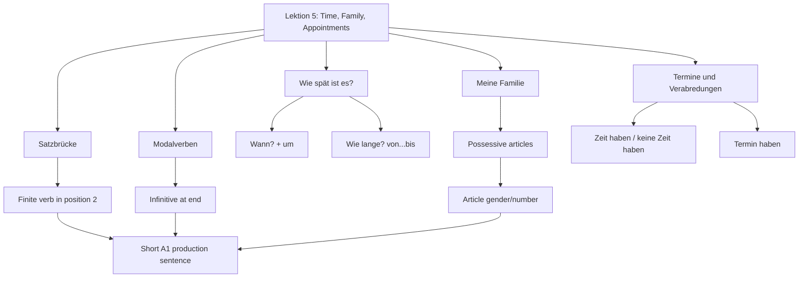

# Lektion 05: Time, Family, Appointments, And Modal Verbs

Source files:

- `german-a1-1/raw/Deutsch als Fremdsprache A1.1 (Bakker) (SoSe 2026)_2026078_1100/Lektion 5 19. Juni - 26. Juni 2026/Freitag, der 19. Juni 2026.html`
- `german-a1-1/raw/Deutsch als Fremdsprache A1.1 (Bakker) (SoSe 2026)_2026078_1100/Lektion 5 19. Juni - 26. Juni 2026/Freitag, der 26. Juni 2026.html`
- `german-a1-1/raw/Deutsch als Fremdsprache A1.1 (Bakker) (SoSe 2026)_2026078_1100/Lektion 5 19. Juni - 26. Juni 2026/Satzbrücke.pdf`

Processed: 2026-07-08
Course: German A1.1
Topic folder: `german-a1-1/wiki/lektion-05-time-family-appointments-and-modal-verbs/`
Context file: `CONTEXT.md`
Vocabulary glossary: `VOCAB-GLOSSARY.md`

## Source Assessment

The two class agenda pages identify the classroom sequence for Lektion 5: time, family, appointments, possessive articles, appointment duration, modal verbs, and appointment-dialogue writing. The `Satzbrücke` handout is a reusable grammar scaffold that shows three patterns:

- compound activity phrases such as `Fußball spielen`, `Fahrrad fahren`, and `spazieren gehen`
- modal verbs with infinitive at the end: `müssen`, `können`, `wollen`
- separable verbs such as `einladen`, `anrufen`, and `anfangen`

Because the agenda references textbook/workbook tasks without including all textbook text, this note uses the local agenda as the scope source and adds compact A1.1 production language where needed. Hidden textbook exercise content is not reproduced.

## 80/20 Exam Summary

Lektion 5 turns basic German into scheduling German. The high-value output is a short appointment exchange:

```text
A: Wie spät ist es?
B: Es ist zehn Uhr.
A: Hast du am Freitag Zeit?
B: Nein, ich muss arbeiten. Ich kann am Samstag.
A: Wann treffen wir uns?
B: Um 15 Uhr.
```

Core skills:

- ask and answer the time: `Wie spät ist es?` / `Es ist ... Uhr`
- ask for an appointment or meeting: `Kann ich einen Termin haben?`
- say when something happens: `um 15 Uhr`, `am Freitag`, `nächste Woche`
- say duration: `von 10 Uhr bis 12 Uhr`
- talk about family: `meine Mutter`, `mein Vater`, `meine Schwester`
- use possessive articles: `mein`, `meine`, `dein`, `deine`, `sein`, `seine`, `ihr`, `ihre`
- use modal verbs with a second verb at the end: `Ich muss arbeiten`; `Ich kann ins Kino gehen`; `Ich will schlafen`
- preserve sentence-bracket logic: finite verb in position 2, infinitive or verb part at the end

## Core Concepts

### Time Questions

| Function | Pattern | Example |
|---|---|---|
| ask current time | `Wie spät ist es?` | `Wie spät ist es?` |
| answer exact hour | `Es ist ... Uhr.` | `Es ist zehn Uhr.` |
| ask when | `Wann ...?` | `Wann treffen wir uns?` |
| point in time | `um ... Uhr` | `Wir treffen uns um 15 Uhr.` |
| duration | `von ... bis ...` | `Der Kurs ist von 10 Uhr bis 12 Uhr.` |

Practical rule: use `wann` when you want the appointment point, and `wie lange` when you want the duration.

### Family And Possessive Articles

Family vocabulary is useful because the class included presentations about `meine Familie` and the textbook section `Familie und Termine`.

| German | English | Possessive Example |
|---|---|---|
| `die Mutter` | mother | `meine Mutter` |
| `der Vater` | father | `mein Vater` |
| `die Schwester` | sister | `meine Schwester` |
| `der Bruder` | brother | `mein Bruder` |
| `die Eltern` | parents | `meine Eltern` |
| `die Familie` | family | `meine Familie` |

The possessive article behaves like `ein/eine`: masculine and neuter use `mein`; feminine and plural use `meine` in nominative.

| Noun Type | Article Pattern | Example |
|---|---|---|
| masculine | `mein` | `mein Vater` |
| neuter | `mein` | `mein Kind` |
| feminine | `meine` | `meine Mutter` |
| plural | `meine` | `meine Eltern` |

### Appointments And Calendar Language

| Function | Pattern | Example |
|---|---|---|
| ask if someone has time | `Hast du ... Zeit?` | `Hast du am Freitag Zeit?` |
| say no time | `Ich habe keine Zeit.` | `Ich habe am Freitag keine Zeit.` |
| say a meeting | `Wir treffen uns ...` | `Wir treffen uns am Samstag.` |
| ask for an appointment | `Kann ich einen Termin haben?` | `Kann ich einen Termin haben?` |
| say next week | `nächste Woche` | `Ich habe nächste Woche drei Termine.` |

At A1 level, keep the time phrase close to the verb and use a complete sentence:

- `Ich habe am Montag einen Termin.`
- `Am Dienstag muss ich arbeiten.`
- `Wir treffen uns um 16 Uhr.`

### Modal Verbs: `müssen`, `können`, `wollen`

Modal verbs are the main new grammar mechanism in the 26 June agenda and the `Satzbrücke` handout.

| Modal Verb | Meaning | A1 Function | Example |
|---|---|---|---|
| `müssen` | must / have to | obligation | `Ich muss arbeiten.` |
| `können` | can / be able to | availability or ability | `Ich kann am Freitag ins Kino gehen.` |
| `wollen` | want to | intention | `Ich will schlafen.` |

Sentence structure:

```text
Subject / Time Phrase + modal verb in position 2 + other information + infinitive at the end
```

Examples:

- `Mara muss am Wochenende arbeiten.`
- `Ich kann am Freitag mit Suse ins Kino gehen.`
- `Der Vater will am Sonntagmorgen schlafen.`

### Satzbrücke: Why The End Matters

The `Satzbrücke` handout shows that German often places the finite verb near the front and the second verb part at the end.

| Type | Position 2 | End |
|---|---|---|
| noun-verb activity | `Ich spiele ...` | `Fußball` |
| motion/activity phrase | `Du fährst ...` | `Fahrrad` |
| multiword verb phrase | `Peter geht ...` | `spazieren` |
| modal verb | `Ich kann ...` | `ins Kino gehen` |

This is not decoration. It is the backbone of A1 sentence production. When you hear or write a modal verb, wait for the infinitive at the end.

## Mechanisms And Logic

### Appointment Builder

1. Decide if the task is availability, appointment request, or duration.
2. Use a complete A1 frame.
3. Put the finite verb in position 2.
4. If there is a modal verb, put the action at the end.
5. Include one precise time phrase.

Examples:

| Situation | Model Answer |
|---|---|
| ask about Friday | `Hast du am Freitag Zeit?` |
| refuse because of work | `Nein, ich muss arbeiten.` |
| propose Saturday | `Ich kann am Samstag.` |
| set the meeting | `Wir treffen uns um 15 Uhr.` |
| state duration | `Der Termin ist von 15 Uhr bis 16 Uhr.` |

### Family Presentation Builder

Use short sentences, not a word list:

```text
Das ist meine Familie.
Mein Vater heißt Mehmet.
Meine Mutter wohnt in München.
Ich habe einen Bruder und eine Schwester.
```

If the source prompt asks for `Meine Familie`, the exam target is likely production accuracy: possessive article, noun capitalization, and verb position.

### Friseur Appointment Dialogue

The class agenda ends with a writing task `Beim Friseur`. The safest A1 dialogue frame is:

```text
A: Guten Tag. Kann ich einen Termin haben?
B: Ja, wann haben Sie Zeit?
A: Ich kann am Freitag um 15 Uhr.
B: Gut. Der Termin ist am Freitag um 15 Uhr.
A: Vielen Dank.
```

## Visual Knowledge Map



## Subject Knowledge Graph

| Node | Meaning | Exam Relevance |
|---|---|---|
| Time question | `Wie spät ist es?` | asks and answers clock time |
| Appointment point | `wann`, `um ... Uhr`, `am Freitag` | schedules an event |
| Duration | `wie lange`, `von ... bis ...` | states how long something lasts |
| Family noun | mother, father, siblings, parents | personal presentation tasks |
| Possessive article | `mein/meine`, `dein/deine`, etc. | marks ownership/relationship |
| Appointment | `der Termin`, `die Verabredung` | meeting/dialogue tasks |
| Modal verb | `müssen`, `können`, `wollen` | obligation, ability, intention |
| Sentence bracket | finite verb near front, second verb part at end | protects German word order |
| Infinitive at end | unconjugated action after modal | required modal-verb structure |

| From | Relationship | To | Why It Matters |
|---|---|---|---|
| Time question | leads to | appointment point | `Wann?` and `um ... Uhr` answer scheduling prompts |
| Duration question | uses | `von ... bis ...` | avoids confusing point with span |
| Family noun | requires | possessive article | `mein Vater`, `meine Mutter` |
| Possessive article | depends on | gender/number | same logic as `ein/eine` |
| Appointment dialogue | uses | availability phrase | `Hast du Zeit?`, `Ich habe keine Zeit` |
| Modal verb | creates | infinitive at end | `Ich muss arbeiten` |
| Sentence bracket | constrains | appointment sentence | prevents English word order |

## Real-Life Examples

Planning with a classmate:

```text
A: Hast du am Freitag Zeit?
B: Nein, ich muss arbeiten.
A: Kannst du am Samstag?
B: Ja, wir treffen uns um 14 Uhr.
```

Family presentation:

```text
Das ist meine Familie. Mein Vater arbeitet in Ankara. Meine Mutter wohnt in München. Ich habe eine Schwester.
```

Hairdresser appointment:

```text
A: Guten Tag. Kann ich einen Termin haben?
B: Ja, wann haben Sie Zeit?
A: Am Montag um 10 Uhr.
```

## Exam Relevance

Likely A1 prompts:

- answer clock-time questions
- write five sentences about next week's appointments
- describe family with `mein/meine`
- transform availability into appointment dialogue
- choose `um` versus `von ... bis`
- form modal-verb sentences with the infinitive at the end
- ask for a service appointment politely

Common traps:

- `Ich muss am Freitag` without the missing action; add the infinitive if needed: `Ich muss am Freitag arbeiten`
- confusing point and duration: `um 10 Uhr` versus `von 10 Uhr bis 12 Uhr`
- `meine Vater`; masculine nominative is `mein Vater`
- English modal word order: `Ich kann gehen ins Kino`; German: `Ich kann ins Kino gehen`
- forgetting noun capitalization: `der Termin`, `die Familie`, `die Mutter`

## Retrieval Prompts

Closed-book prompts:

1. Ask "What time is it?"
2. Say "It is ten o'clock."
3. Ask whether someone has time on Friday.
4. Say you have no time on Friday.
5. Say "my father" and "my mother."
6. Explain the difference between `wann` and `wie lange`.
7. Give one sentence each with `müssen`, `können`, and `wollen`.

Application prompts:

1. Write a four-line appointment dialogue with a friend.
2. Write three family sentences using `mein/meine`.
3. Say you must work on the weekend.
4. Say you can go to the cinema on Friday.
5. Ask for a hairdresser appointment.
6. Write five next-week appointments with `am`, `um`, and one modal verb.

## Practice Tasks

1. Build a time table for one week: five days, five appointments.
2. Turn each appointment into a sentence: `Am Montag habe ich um 10 Uhr Deutschkurs.`
3. Write a family mini-presentation in four sentences.
4. Convert three English modal sentences into German sentence-bracket form.
5. Mark finite verb and end-position infinitive in five German sentences.

## Connections

Previous notes:

- `../lektion-02-hobbies-verb-position-and-appointments/lektion-02-hobbies-verb-position-and-appointments.md`
- `../lektion-04-food-drink-shopping-and-meals/lektion-04-food-drink-shopping-and-meals.md`

Forward connection:

- Lektion 6 reuses the same `Satzbrücke` logic for invitations, separable verbs, and party planning.

Companion files:

- `CONTEXT.md`
- `VOCAB-GLOSSARY.md`

## Open Uncertainties

- The source references textbook/workbook tasks, but the full textbook pages are not included in this export. This note does not claim to reproduce hidden exercise content.
- The `Satzbrücke.pdf` appears identically in Lektion 5 and Lektion 6. It is treated here as a shared grammar scaffold.

## Weakness Flags

- First active recall is pending. Do not set `First Pass` until a real production session is completed.
- High-risk production checks: `mein/meine`, `um` versus `von ... bis`, modal verb plus infinitive at the end, and complete appointment sentences.
