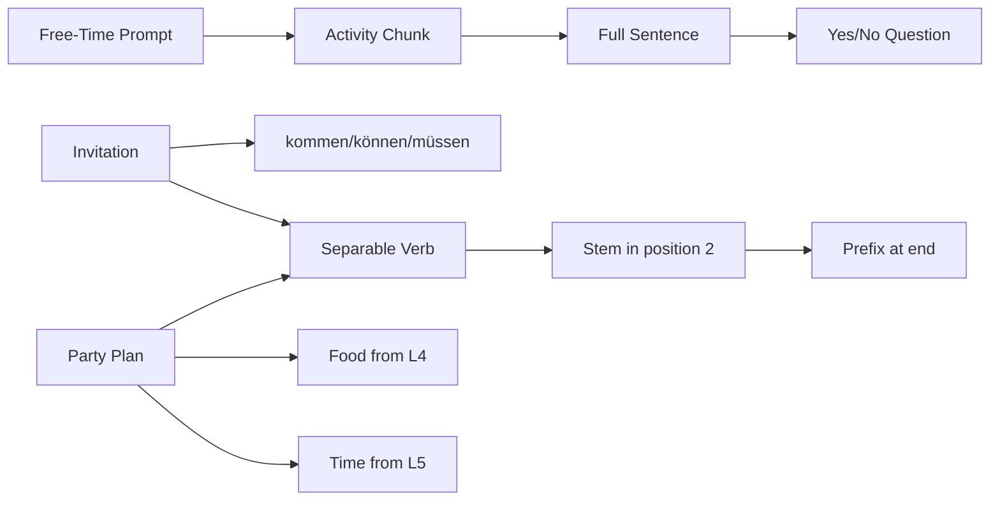

# Context: Lektion 06 Free Time, Invitations, And Separable Verbs

Source note: `lektion-06-free-time-invitations-and-separable-verbs.md`
Processed: 2026-07-08

## Source Boundary

The local source includes the 2026-07-03 agenda and the shared `Satzbrücke.pdf`. It does not include a Lektion 7 folder and does not include a 2026-07-10 agenda page even though the folder title mentions that date. Terms below are marked `local` when directly supported by source headings or the handout, and `enriched A1.1` when supplied as reliable beginner German needed for the identified free-time, invitation, and party-planning tasks.

## Free-Time And Social Activity Language

| Term | Definition | Aliases to avoid |
|---|---|---|
| `die Freizeit` | `local`: free time/leisure time; source asks what learners do in free time. | working time |
| `Was machen Sie in Ihrer Freizeit?` | `local`: formal question asking free-time activities. | asking current action only |
| `Fußball spielen` | `local`: to play football/soccer; activity chunk. | separating the noun randomly |
| `Fahrrad fahren` | `local`: to ride a bike; note stem change in `du fährst`. | `Fahrrad spielen` |
| `spazieren gehen` | `local`: to go for a walk; second part at the end in the sentence bridge. | one-word verb |
| `ins Kino gehen` | `local`: to go to the cinema; useful invitation/free-time chunk. | `in Kino gehen` |

## Invitation And Party Language

| Term | Definition | Aliases to avoid |
|---|---|---|
| `die Einladung` | `local`: invitation; source reading task. | appointment service request |
| `die Party` | `local`: party; source planning task. | formal appointment |
| `kommen` | `enriched A1.1`: to come; used to accept or ask about attending. | `gehen` when coming to the speaker/event |
| `Kommst du ...?` | `enriched A1.1`: yes/no question asking whether someone is coming. | `Du kommst ...?` as default exam question |
| `Ich komme gern.` | `enriched A1.1`: simple acceptance: I am happy to come. | overlong explanation |
| `Ich kann nicht.` | `enriched A1.1`: simple refusal: I cannot. | leaving refusal unexplained in practice |
| `Wann fängt ... an?` | `local/enriched`: asks when an event starts. | `Wann ist Anfang?` |

## Separable Verb Language

| Term | Definition | Aliases to avoid |
|---|---|---|
| Trennbares Verb | `local`: separable verb whose prefix moves to the end in a main clause. | fixed one-piece verb in every sentence |
| Prefix | `local/enriched`: first part of the separable verb, e.g. `ein-`, `an-`; it appears at the sentence end in simple main clauses. | preposition always |
| `einladen` | `local`: to invite; main clause `Ich lade Hannes ein.` | `Ich einlade Hannes` |
| `anrufen` | `local`: to call by phone; main clause `Peter ruft Mara an.` | `Peter anruft Mara` |
| `anfangen` | `local`: to begin/start; main clause `Der Unterricht fängt um 8 Uhr an.` | forgetting umlaut/stem change |

## Word Order Control

| Term | Definition | Aliases to avoid |
|---|---|---|
| Ja-Nein-Frage | `local`: yes/no question; finite verb comes first. | W-question |
| finite verb first | `local`: question pattern: `Kommst du?`, `Kannst du kommen?` | English subject-first question |
| finite verb in position 2 | `local`: statement pattern: `Ich lade Hannes ein`; `Peter ruft Mara an`. | putting prefix in position 2 |
| second part at end | `local`: sentence-bracket endpoint for separable prefix or infinitive. | dropping the second part |

## Relationships Between Canonical Terms

- **Free-time activities** supply the content for **yes/no questions** and short self-description.
- **Invitations** use **kommen**, **können**, and **müssen** to accept, decline, or explain availability.
- **Separable verbs** are a special case of the **Satzbrücke**: the finite stem sits in position 2 and the **prefix** goes to the end.
- **Party planning** combines Lektion 4 food/drink vocabulary, Lektion 5 time/modal language, and Lektion 6 invitation/separable-verb language.

## Visual Mini-Map



## Example Dialogue

```text
A: Kommst du am Samstag zur Party?
B: Nein, ich kann nicht. Ich muss arbeiten.
A: Schade. Ich rufe dich nächste Woche an.
```

## Flagged Ambiguities

| Ambiguity | Recommendation |
|---|---|
| The folder title mentions 2026-07-10, but no 10 July agenda file is present. | Treat this note as a 2026-07-03 Lektion 6 note, not the full completed lesson. |
| `an` in `anrufen` looks like a preposition. | Treat `an-` as the separable prefix of the verb in this pattern. |
| `wollen` and invitations can sound direct. | Use `kommen`, `können`, and `gern` for simple acceptance/refusal; reserve `wollen` for intention statements. |
| Free-time chunks can look like noun + verb. | Learn them as production chunks: `Fußball spielen`, `Fahrrad fahren`, `spazieren gehen`. |

## Exam Traps And Correction Rules

| Trap | Correction Rule |
|---|---|
| `Ich einlade Hannes` | Split the verb: `Ich lade Hannes ein.` |
| `Peter anruft Mara` | Finite stem in position 2, prefix at end: `Peter ruft Mara an.` |
| `Die Party anfangt um 20 Uhr` | Use correct stem and prefix: `Die Party fängt um 20 Uhr an.` |
| `Du kommst zur Party?` as default written question | Use finite verb first: `Kommst du zur Party?` |
| `Ich fahre Fußball` | Use the correct chunk: `Fußball spielen`; `Fahrrad fahren`. |
| missing event time | Add `am Samstag` or `um 20 Uhr` in party-planning answers. |

## Cheat-Sheet Language

- `Was machst du in deiner Freizeit?`
- `Ich spiele gern Fußball.`
- `Ich fahre Fahrrad.`
- `Ich gehe spazieren.`
- `Kommst du am Samstag zur Party?`
- `Ja, ich komme gern.`
- `Nein, ich kann nicht. Ich muss arbeiten.`
- `Ich lade Hannes ein.`
- `Peter ruft Mara an.`
- `Die Party fängt um 20 Uhr an.`
