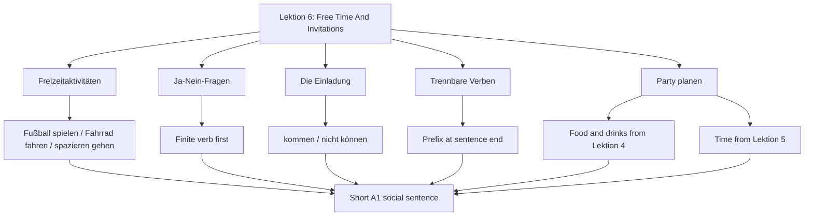

# Lektion 06: Free Time, Invitations, And Separable Verbs

Source files:

- `german-a1-1/raw/Deutsch als Fremdsprache A1.1 (Bakker) (SoSe 2026)_2026078_1100/Lektion 6 03. Juli - 10. Juli 2026/Freitag, der 03. Juli 2026.html`
- `german-a1-1/raw/Deutsch als Fremdsprache A1.1 (Bakker) (SoSe 2026)_2026078_1100/Lektion 6 03. Juli - 10. Juli 2026/Satzbrücke.pdf`

Processed: 2026-07-08
Course: German A1.1
Topic folder: `german-a1-1/wiki/lektion-06-free-time-invitations-and-separable-verbs/`
Context file: `CONTEXT.md`
Vocabulary glossary: `VOCAB-GLOSSARY.md`

## Source Assessment

The export contains one Lektion 6 agenda page for 2026-07-03 plus the shared `Satzbrücke.pdf` handout. The folder name also mentions 2026-07-10, but no 2026-07-10 agenda file was present. The source therefore supports a first Lektion 6 note on free time, yes/no questions, invitations, separable verbs, and party planning, but it does not cover a complete two-session Lektion 6 arc.

The `Satzbrücke` handout is identical to the Lektion 5 handout and is treated here as the grammar bridge into separable verbs:

- `Ich lade Hannes ein.`
- `Peter ruft Mara am Dienstag an.`
- `Der Unterricht fängt um 8.00 Uhr an.`

## 80/20 Exam Summary

Lektion 6 moves from scheduling into social planning. The high-value output is a short invitation/party-planning exchange:

```text
A: Was machst du in deiner Freizeit?
B: Ich spiele Fußball und fahre Fahrrad.
A: Kommst du am Samstag zur Party?
B: Ja, ich kann kommen. Wann fängt die Party an?
A: Die Party fängt um 20 Uhr an.
```

Core skills:

- ask and answer free-time activities: `Was machst du in deiner Freizeit?`
- use yes/no questions: finite verb first
- understand and write invitation language: `die Einladung`, `Kommst du?`
- use separable verbs in statements: prefix at the end
- combine free-time activities with sentence-bracket logic: `Fußball spielen`, `Fahrrad fahren`, `spazieren gehen`
- plan a party with short A1 sentences: who invites, who calls, what starts when, what people buy

## Core Concepts

### Free-Time Activities

The source prompt asks `Was machen Sie in Ihrer Freizeit?` and asks learners to write five activities.

| German | English | Example |
|---|---|---|
| `Fußball spielen` | to play football/soccer | `Ich spiele gern Fußball.` |
| `Fahrrad fahren` | to ride a bike | `Ich fahre am Wochenende Fahrrad.` |
| `spazieren gehen` | to go for a walk | `Ich gehe mit Susanne spazieren.` |
| `ins Kino gehen` | to go to the cinema | `Ich kann am Freitag ins Kino gehen.` |
| `arbeiten` | to work | `Ich muss am Wochenende arbeiten.` |
| `schlafen` | to sleep | `Am Sonntagmorgen will der Vater schlafen.` |

These are production chunks. Learn them as sentence pieces, not isolated dictionary entries.

### Yes/No Questions

The agenda explicitly revisits `Ja-Nein-Fragen`.

| Statement | Yes/No Question |
|---|---|
| `Du spielst Fußball.` | `Spielst du Fußball?` |
| `Du fährst Fahrrad.` | `Fährst du Fahrrad?` |
| `Du kommst zur Party.` | `Kommst du zur Party?` |
| `Du hast Zeit.` | `Hast du Zeit?` |
| `Du kannst kommen.` | `Kannst du kommen?` |

Production rule: if the answer can be `ja` or `nein`, the finite verb goes first.

### Invitations

The source lists `Die Einladung` and party planning. At A1, the invitation task is about simple social action:

| Function | Pattern | Example |
|---|---|---|
| invite someone | `Ich lade ... ein.` | `Ich lade Hannes ein.` |
| ask if someone comes | `Kommst du ...?` | `Kommst du am Samstag zur Party?` |
| accept | `Ja, ich komme gern.` | `Ja, ich komme gern.` |
| decline | `Nein, ich kann nicht.` | `Nein, ich kann nicht. Ich muss arbeiten.` |
| ask start time | `Wann fängt ... an?` | `Wann fängt die Party an?` |

### Separable Verbs

Separable verbs split in main clauses. The prefix goes to the end.

| Infinitive | Meaning | Main-Clause Pattern |
|---|---|---|
| `einladen` | to invite | `Ich lade Hannes ein.` |
| `anrufen` | to call | `Peter ruft Mara am Dienstag an.` |
| `anfangen` | to begin/start | `Der Unterricht fängt um 8 Uhr an.` |

This is the same sentence-bridge logic from earlier lessons: finite verb near the front, second part at the end.

### Party Planning

The 3 July agenda ends with `Planen Sie eine Party!`. Use short A1 sentences:

| Planning Task | Example |
|---|---|
| invite people | `Wir laden Freunde ein.` |
| call someone | `Ich rufe Maria an.` |
| buy food/drinks | `Ali kauft Getränke.` |
| state start time | `Die Party fängt um 20 Uhr an.` |
| say obligation | `Ich muss Kuchen kaufen.` |
| say availability | `Ich kann am Samstag kommen.` |

## Mechanisms And Logic

### Separable-Verb Builder

1. Start from the infinitive: `anrufen`.
2. Split prefix and verb stem: `an` + `rufen`.
3. Conjugate the verb stem in position 2: `Ich rufe`.
4. Put the prefix at the end: `Ich rufe Maria an.`

Examples:

- `einladen` -> `Ich lade Hannes ein.`
- `anrufen` -> `Peter ruft Mara an.`
- `anfangen` -> `Die Party fängt um 20 Uhr an.`

### Invitation Dialogue Builder

Use a simple social sequence:

1. Invite or ask if the person is coming.
2. Give availability with `können` or obligation with `müssen`.
3. Ask or state start time.
4. Close politely.

```text
A: Kommst du am Samstag zur Party?
B: Ja, ich kann kommen. Wann fängt die Party an?
A: Die Party fängt um 20 Uhr an.
B: Super, bis Samstag.
```

### Party-Planning Production Chain

The cleanest A1 answer links Lektion 4 food with Lektion 5 time and Lektion 6 social planning:

```text
Wir planen eine Party.
Ich lade Hannes ein.
Mara kauft Getränke.
Peter ruft Lena an.
Die Party fängt um 20 Uhr an.
```

## Visual Knowledge Map



## Subject Knowledge Graph

| Node | Meaning | Exam Relevance |
|---|---|---|
| Free-time activity | hobby/leisure action | speaking prompt about personal life |
| Yes/no question | finite verb first question | `Kommst du?`, `Kannst du?` |
| Invitation | social request to attend | party/dialogue task |
| Separable verb | verb with detachable prefix | `einladen`, `anrufen`, `anfangen` |
| Prefix at end | separated prefix in main clause | key A1 word-order trap |
| Party planning | combined social task | integrates food, time, modal verbs, invitations |

| From | Relationship | To | Why It Matters |
|---|---|---|---|
| Free-time prompt | uses | activity chunks | answers `Was machst du in deiner Freizeit?` |
| Yes/no question | starts with | finite verb | creates `Kommst du?`, `Kannst du?` |
| Invitation | uses | separable verb `einladen` | `Ich lade Hannes ein` |
| Separable verb | places | prefix at end | prevents `Ich einlade Hannes` |
| Party planning | reuses | food vocabulary | `Getränke`, `Kuchen`, `Pizza` |
| Party planning | reuses | time language | `um 20 Uhr`, `am Samstag` |
| Modal verb | supports | accept/decline | `Ich kann kommen`, `Ich muss arbeiten` |

## Real-Life Examples

Free-time answer:

```text
In meiner Freizeit spiele ich Fußball. Am Wochenende fahre ich Fahrrad.
```

Invitation:

```text
A: Kommst du am Samstag zur Party?
B: Nein, ich kann nicht. Ich muss arbeiten.
```

Party planning:

```text
Wir laden Freunde ein. Ich rufe Maria an. Die Party fängt um 19 Uhr an.
```

## Exam Relevance

Likely A1 prompts:

- answer what you do in your free time
- form yes/no questions from statements
- write or complete an invitation dialogue
- split a separable verb correctly
- plan a party using food, time, and invitation language
- accept or decline with `können` and `müssen`

Common traps:

- `Ich einlade Hannes`; correct: `Ich lade Hannes ein`
- `Peter anruft Mara`; correct: `Peter ruft Mara an`
- forgetting stem changes: `Du fährst Fahrrad`, not `Du fahrst Fahrrad`
- English question order: `Du kommst?`; exam-safe A1 form: `Kommst du?`
- missing the second part of a verb phrase: `Ich spiele am Freitag` if the intended chunk is `Fußball spielen`
- missing the 2026-07-10 source boundary; do not assume unprovided class content was processed

## Retrieval Prompts

Closed-book prompts:

1. Ask someone what they do in their free time.
2. Give three free-time activities in full German sentences.
3. Turn `Du kommst zur Party` into a yes/no question.
4. Split `einladen` in a sentence.
5. Say "Peter calls Mara on Tuesday."
6. Say "The party starts at 20:00."
7. Decline an invitation because you must work.

Application prompts:

1. Write a four-line party invitation dialogue.
2. Plan a party in five German sentences.
3. Use `einladen`, `anrufen`, and `anfangen` once each.
4. Combine Lektion 4 and Lektion 6: say who buys food and who invites friends.
5. Combine Lektion 5 and Lektion 6: say when the party starts and whether you can come.

## Practice Tasks

1. Make five free-time activity flashcards with full sentences.
2. Convert five statements into yes/no questions.
3. Write a separable-verb table: infinitive, finite verb, prefix at end.
4. Write one acceptance and one refusal for an invitation.
5. Create a party plan with `Getränke`, `Kuchen`, `Freunde`, `um 20 Uhr`, and one separable verb.

## Connections

Previous notes:

- `../lektion-04-food-drink-shopping-and-meals/lektion-04-food-drink-shopping-and-meals.md`
- `../lektion-05-time-family-appointments-and-modal-verbs/lektion-05-time-family-appointments-and-modal-verbs.md`

Companion files:

- `CONTEXT.md`
- `VOCAB-GLOSSARY.md`

## Open Uncertainties

- The corrected export contains no Lektion 7 source files.
- The Lektion 6 folder name includes 2026-07-10, but only the 2026-07-03 agenda file was available.
- The source references textbook/workbook tasks and a film/listening/reading sequence; this note captures the available agenda scope and does not reproduce hidden textbook content.

## Weakness Flags

- First active recall is pending. Do not set `First Pass` until a real production session is completed.
- High-risk production checks: verb-first yes/no questions, separable prefix at the end, `fährt` stem change, modal acceptance/refusal, and complete party-planning sentences.
