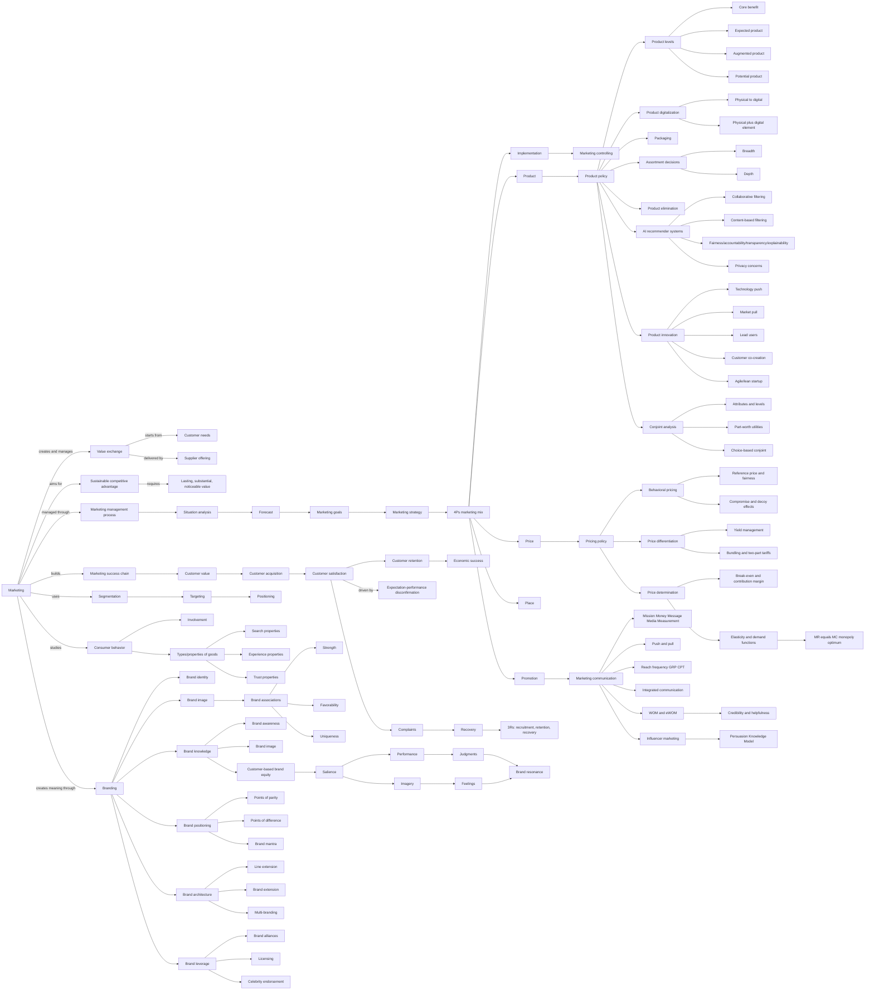
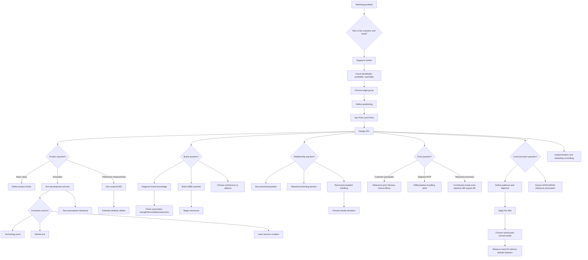

# Marketing Course Knowledge Graph

This file aggregates the Marketing concepts learned so far. It is graph-view-first for visual recall.

Scope: Marketing only. Do not add cross-lecture global concepts unless needed to explain Marketing material.

## Course Graph View

## Decision Flow View

## Subject Graph Index

| Subject / Deck | Wiki Note | Main Visual Logic | Last Updated |
|---|---|---|---|
| Chapter 01 Basic Concepts Of Marketing | `chapter-01-basic-concepts-of-marketing/chapter-01-basic-concepts-of-marketing.md` | Value exchange -> marketing process -> 4Ps/3Rs -> satisfaction/segmentation/consumer behavior | 2026-05-14 |
| Chapter 02 Branding | `chapter-02-branding/chapter-02-branding.md` | Brand knowledge -> associations -> positioning -> CBBE -> architecture/leverage | 2026-05-14 |
| Chapter 03 Product | `chapter-03-product/chapter-03-product.md` | Product levels -> digitalization/packaging/assortment -> innovation/co-creation/agile -> conjoint | 2026-05-14 |
| Chapter 04 Price | `chapter-04-price/chapter-04-price.md` | Behavioral evaluation -> differentiation/bundling -> break-even/elasticity -> profit decision | 2026-06-12 |
| Chapter 05 Promotion And Communication | `chapter-05-promotion-communication/chapter-05-promotion-communication.md` | 5Ms -> media planning/measurement -> WOM/eWOM -> influencer persuasion knowledge | 2026-06-12 |

## Supporting Node Reference

| Node | Meaning | Source Note |
|---|---|---|
| Marketing | Market-oriented management of value exchange | `chapter-01-basic-concepts-of-marketing/chapter-01-basic-concepts-of-marketing.md` |
| 4Ps | Product, Price, Promotion, Place | `chapter-01-basic-concepts-of-marketing/chapter-01-basic-concepts-of-marketing.md` |
| 3Rs | Recruitment, Retention, Recovery | `chapter-01-basic-concepts-of-marketing/chapter-01-basic-concepts-of-marketing.md` |
| Customer Satisfaction | Expectation-performance emotional reaction | `chapter-01-basic-concepts-of-marketing/chapter-01-basic-concepts-of-marketing.md` |
| Disconfirmation | Difference between expectations and perceived performance | `chapter-01-basic-concepts-of-marketing/chapter-01-basic-concepts-of-marketing.md` |
| Segmentation | Dividing markets into targetable groups | `chapter-01-basic-concepts-of-marketing/chapter-01-basic-concepts-of-marketing.md` |
| Brand | Identifier and differentiator with associations and meaning | `chapter-02-branding/chapter-02-branding.md` |
| Brand Knowledge | Brand awareness plus brand image | `chapter-02-branding/chapter-02-branding.md` |
| CBBE | Differential consumer response caused by brand knowledge | `chapter-02-branding/chapter-02-branding.md` |
| Points of Parity | Category legitimacy associations | `chapter-02-branding/chapter-02-branding.md` |
| Points of Difference | Distinctive choice-driving associations | `chapter-02-branding/chapter-02-branding.md` |
| Product | Bundle of attributes offering benefit | `chapter-03-product/chapter-03-product.md` |
| Product Levels | Core, generic, expected, augmented, potential layers | `chapter-03-product/chapter-03-product.md` |
| Product Digitalization | Physical-to-digital transformation or digital augmentation | `chapter-03-product/chapter-03-product.md` |
| Product Assortment | Breadth and depth decisions | `chapter-03-product/chapter-03-product.md` |
| Lead Users | Users ahead of mainstream needs | `chapter-03-product/chapter-03-product.md` |
| Co-Creation | Customer participation in product/value creation | `chapter-03-product/chapter-03-product.md` |
| Conjoint Analysis | Preference measurement through attribute tradeoffs | `chapter-03-product/chapter-03-product.md` |
| Reference Price | Benchmark used to evaluate an observed price | `chapter-04-price/chapter-04-price.md` |
| Price Differentiation | Different prices designed to capture heterogeneous willingness to pay | `chapter-04-price/chapter-04-price.md` |
| Contribution Margin | Revenue remaining after variable cost | `chapter-04-price/chapter-04-price.md` |
| Price Elasticity | Percentage demand response to a percentage price change | `chapter-04-price/chapter-04-price.md` |
| 5Ms | Mission, Money, Message, Media, and Measurement | `chapter-05-promotion-communication/chapter-05-promotion-communication.md` |
| Weighted CPT | Contact cost adjusted for target-group fit | `chapter-05-promotion-communication/chapter-05-promotion-communication.md` |
| eWOM | Online consumer communication available to broad audiences | `chapter-05-promotion-communication/chapter-05-promotion-communication.md` |
| Persuasion Knowledge | Consumer knowledge of persuasion goals and tactics | `chapter-05-promotion-communication/chapter-05-promotion-communication.md` |

## Supporting Edge Reference

| From | Relationship | To | Source Note |
|---|---|---|---|
| Marketing | creates | Customer Value | `chapter-01-basic-concepts-of-marketing/chapter-01-basic-concepts-of-marketing.md` |
| Customer Value | drives | Acquisition/Satisfaction/Retention | `chapter-01-basic-concepts-of-marketing/chapter-01-basic-concepts-of-marketing.md` |
| Expectations | compared with | Perceived Performance | `chapter-01-basic-concepts-of-marketing/chapter-01-basic-concepts-of-marketing.md` |
| Disconfirmation | determines | Satisfaction | `chapter-01-basic-concepts-of-marketing/chapter-01-basic-concepts-of-marketing.md` |
| Segmentation | enables | Targeting | `chapter-01-basic-concepts-of-marketing/chapter-01-basic-concepts-of-marketing.md` |
| Brand Knowledge | creates | Customer-Based Brand Equity | `chapter-02-branding/chapter-02-branding.md` |
| Brand Associations | evaluated by | Strength/Favorability/Uniqueness | `chapter-02-branding/chapter-02-branding.md` |
| Positioning | requires | Points of Parity and Difference | `chapter-02-branding/chapter-02-branding.md` |
| Brand Elements | build/protect | Brand Equity | `chapter-02-branding/chapter-02-branding.md` |
| Product Levels | structure | Customer value layers | `chapter-03-product/chapter-03-product.md` |
| Digitalization | changes | Product form and business model | `chapter-03-product/chapter-03-product.md` |
| Lead Users | reveal | Future market needs | `chapter-03-product/chapter-03-product.md` |
| Co-Creation | provides | Need and solution information | `chapter-03-product/chapter-03-product.md` |
| Conjoint Analysis | estimates | Attribute-level utilities | `chapter-03-product/chapter-03-product.md` |
| Reference Price | shapes | Price Fairness | `chapter-04-price/chapter-04-price.md` |
| Heterogeneous WTP | enables | Price Differentiation | `chapter-04-price/chapter-04-price.md` |
| Contribution Margin | determines | Break-Even Volume | `chapter-04-price/chapter-04-price.md` |
| Marginal Revenue | equals at optimum | Marginal Cost | `chapter-04-price/chapter-04-price.md` |
| Communication Mission | guides | Message Media Measurement | `chapter-05-promotion-communication/chapter-05-promotion-communication.md` |
| Target-Group Fit | corrects | CPT | `chapter-05-promotion-communication/chapter-05-promotion-communication.md` |
| Satisfaction And Trust | generate | eWOM | `chapter-05-promotion-communication/chapter-05-promotion-communication.md` |
| Persuasion Recognition | activates | Coping Response | `chapter-05-promotion-communication/chapter-05-promotion-communication.md` |
