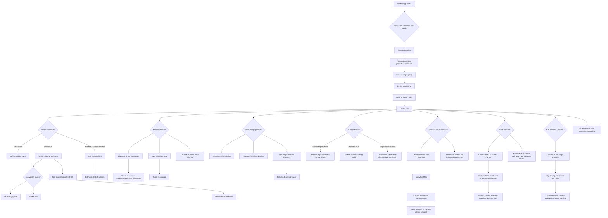

# Marketing Course Knowledge Graph

This file aggregates the Marketing concepts learned so far. It is graph-view-first for visual recall.

Scope: Marketing only. Do not add cross-lecture global concepts unless needed to explain Marketing material.

## Course Graph View

```mermaid
graph LR
    Marketing[Marketing] -->|creates and manages| ValueExchange[Value exchange]
    ValueExchange -->|starts from| CustomerNeeds[Customer needs]
    ValueExchange -->|delivered by| Offering[Supplier offering]
    Marketing -->|aims for| CompetitiveAdvantage[Sustainable competitive advantage]
    CompetitiveAdvantage -->|requires| NoticeableValue[Lasting, substantial, noticeable value]

    Marketing -->|managed through| ManagementProcess[Marketing management process]
    ManagementProcess --> Situation[Situation analysis]
    Situation --> Forecast[Forecast]
    Forecast --> Goals[Marketing goals]
    Goals --> Strategy[Marketing strategy]
    Strategy --> MarketingMix[4Ps marketing mix]
    MarketingMix --> ProductP[Product]
    MarketingMix --> PriceP[Price]
    MarketingMix --> PromotionP[Promotion]
    MarketingMix --> PlaceP[Place]
    MarketingMix --> Implementation[Implementation]
    Implementation --> Controlling[Marketing controlling]

    Marketing -->|builds| SuccessChain[Marketing success chain]
    SuccessChain --> CustomerValue[Customer value]
    CustomerValue --> Acquisition[Customer acquisition]
    Acquisition --> Satisfaction[Customer satisfaction]
    Satisfaction --> Retention[Customer retention]
    Retention --> EconomicSuccess[Economic success]
    Satisfaction -->|driven by| Disconfirmation[Expectation-performance disconfirmation]
    Satisfaction --> Complaints[Complaints]
    Complaints --> Recovery[Recovery]
    Recovery --> ThreeRs[3Rs: recruitment, retention, recovery]

    Marketing -->|uses| Segmentation[Segmentation]
    Segmentation --> Targeting[Targeting]
    Targeting --> Positioning[Positioning]
    Marketing -->|studies| ConsumerBehavior[Consumer behavior]
    ConsumerBehavior --> Involvement[Involvement]
    ConsumerBehavior --> GoodsTypes[Types/properties of goods]
    GoodsTypes --> SearchGoods[Search properties]
    GoodsTypes --> ExperienceGoods[Experience properties]
    GoodsTypes --> TrustGoods[Trust properties]

    Marketing -->|creates meaning through| Branding[Branding]
    Branding --> BrandIdentity[Brand identity]
    Branding --> BrandImage[Brand image]
    BrandImage --> BrandAssociations[Brand associations]
    BrandAssociations --> Strength[Strength]
    BrandAssociations --> Favorability[Favorability]
    BrandAssociations --> Uniqueness[Uniqueness]
    Branding --> BrandKnowledge[Brand knowledge]
    BrandKnowledge --> Awareness[Brand awareness]
    BrandKnowledge --> Image[Brand image]
    BrandKnowledge --> CBBE[Customer-based brand equity]
    CBBE --> Salience[Salience]
    Salience --> Performance[Performance]
    Salience --> Imagery[Imagery]
    Performance --> Judgments[Judgments]
    Imagery --> Feelings[Feelings]
    Judgments --> Resonance[Brand resonance]
    Feelings --> Resonance
    Branding --> BrandPositioning[Brand positioning]
    BrandPositioning --> POP[Points of parity]
    BrandPositioning --> POD[Points of difference]
    BrandPositioning --> BrandMantra[Brand mantra]
    Branding --> BrandArchitecture[Brand architecture]
    BrandArchitecture --> LineExtension[Line extension]
    BrandArchitecture --> BrandExtension[Brand extension]
    BrandArchitecture --> Multibranding[Multi-branding]
    Branding --> BrandLeverage[Brand leverage]
    BrandLeverage --> Alliances[Brand alliances]
    BrandLeverage --> Licensing[Licensing]
    BrandLeverage --> Endorsement[Celebrity endorsement]

    ProductP --> ProductPolicy[Product policy]
    ProductPolicy --> ProductLevels[Product levels]
    ProductLevels --> CoreBenefit[Core benefit]
    ProductLevels --> ExpectedProduct[Expected product]
    ProductLevels --> AugmentedProduct[Augmented product]
    ProductLevels --> PotentialProduct[Potential product]
    ProductPolicy --> Digitalization[Product digitalization]
    Digitalization --> DigitalProduct[Physical to digital]
    Digitalization --> HybridProduct[Physical plus digital element]
    ProductPolicy --> Packaging[Packaging]
    ProductPolicy --> Assortment[Assortment decisions]
    Assortment --> Breadth[Breadth]
    Assortment --> Depth[Depth]
    ProductPolicy --> Elimination[Product elimination]
    ProductPolicy --> Recommenders[AI recommender systems]
    Recommenders --> Collaborative[Collaborative filtering]
    Recommenders --> ContentBased[Content-based filtering]
    Recommenders --> FATE[Fairness/accountability/transparency/explainability]
    Recommenders --> Privacy[Privacy concerns]
    ProductPolicy --> Innovation[Product innovation]
    Innovation --> TechPush[Technology push]
    Innovation --> MarketPull[Market pull]
    Innovation --> LeadUsers[Lead users]
    Innovation --> CoCreation[Customer co-creation]
    Innovation --> Agile[Agile/lean startup]
    ProductPolicy --> Conjoint[Conjoint analysis]
    Conjoint --> Attributes[Attributes and levels]
    Conjoint --> Utilities[Part-worth utilities]
    Conjoint --> CBC[Choice-based conjoint]

    PriceP --> Pricing[Pricing policy]
    Pricing --> Behavioral[Behavioral pricing]
    Behavioral --> ReferencePrice[Reference price and fairness]
    Behavioral --> ChoiceEffects[Compromise and decoy effects]
    Pricing --> Differentiation[Price differentiation]
    Differentiation --> Yield[Yield management]
    Differentiation --> Bundling[Bundling and two-part tariffs]
    Pricing --> Determination[Price determination]
    Determination --> BreakEven[Break-even and contribution margin]
    Determination --> Elasticity[Elasticity and demand functions]
    Elasticity --> Monopoly[MR equals MC monopoly optimum]

    PromotionP --> Communication[Marketing communication]
    Communication --> FiveMs[Mission Money Message Media Measurement]
    Communication --> PushPull[Push and pull]
    Communication --> MediaMetrics[Reach frequency GRP CPT]
    Communication --> Integrated[Integrated communication]
    Communication --> WOM[WOM and eWOM]
    WOM --> Credibility[Credibility and helpfulness]
    Communication --> Influencer[Influencer marketing]
    Influencer --> PKM[Persuasion Knowledge Model]

    PlaceP --> Distribution[Distribution policy]
    Distribution --> Channels[Distribution channel system]
    Channels --> Intermediaries[Merchants agents facilitators]
    Channels --> DirectIndirect[Direct versus indirect distribution]
    Channels --> Coverage[Intensive selective exclusive selling]
    Distribution --> Conflict[Manufacturer-retailer conflict]
    Distribution --> RetailTech[Retail technology and personalization]
    RetailTech --> StorePersonalization[Human and technology-enabled personalization]
    RetailTech --> StoreTracking[In-store tracking methods]
    RetailTech --> Metaverse[Metaverse retail self-expansion]
    RetailTech --> Haptics[Consumer touch and haptics]

    Marketing -->|adapts to| B2B[B2B marketing]
    B2B --> BuyingGroup[Buying group]
    B2B --> ICP[Ideal customer profile]
    B2B --> ABM[Account-based marketing]
    B2B --> Confidence[Decision confidence]
    B2B --> LearningSystem[Marketing learning system]
    B2B --> PartnerEcosystem[Partner ecosystem]

    Marketing -->|tests through| MockExam[Mock exam practice]
    MockExam -->|checks| Kano[Kano model]
    MockExam -->|checks| BrandAssociations
    MockExam -->|checks| Segmentation
    MockExam -->|checks| Conjoint
    MockExam -->|checks| Behavioral
    MockExam -->|checks| Conflict
    MockExam -->|checks| DirectIndirect
    MockExam -->|checks| Innovation
    MockExam -->|checks| Agile
    Marketing -->|integrates through| Mock30[30-question all-chapter mock]
    Mock30 -->|samples| ManagementProcess
    Mock30 -->|samples| Branding
    Mock30 -->|samples| ProductPolicy
    Mock30 -->|samples| Pricing
    Mock30 -->|samples| Communication
    Mock30 -->|samples| Distribution
    Marketing -->|diagnoses through| Example2025[Example exam 2025]
    Example2025 -->|tests| Branding
    Example2025 -->|tests| SuccessChain
    Example2025 -->|tests| ProductPolicy
    Example2025 -->|tests| Pricing
    Example2025 -->|tests| Communication
    Example2025 -->|tests| Distribution
    Example2025 -->|bridges to| InnovationMgmt[Innovation management]
    InnovationMgmt --> Tacit[Tacit knowledge]
    InnovationMgmt --> Leadership[Innovation leadership]
    InnovationMgmt --> Agile
    InnovationMgmt --> Delphi[Delphi and trend extrapolation]
```

## Decision Flow View

## Subject Graph Index

| Subject / Deck | Wiki Note | Main Visual Logic | Last Updated |
|---|---|---|---|
| Chapter 01 Basic Concepts Of Marketing | `chapter-01-basic-concepts-of-marketing/chapter-01-basic-concepts-of-marketing.md` | Value exchange -> marketing process -> 4Ps/3Rs -> satisfaction/segmentation/consumer behavior | 2026-05-14 |
| Chapter 02 Branding | `chapter-02-branding/chapter-02-branding.md` | Brand knowledge -> associations -> positioning -> CBBE -> architecture/leverage | 2026-05-14 |
| Chapter 03 Product | `chapter-03-product/chapter-03-product.md` | Product levels -> digitalization/packaging/assortment -> innovation/co-creation/agile -> conjoint | 2026-05-14 |
| Chapter 04 Price | `chapter-04-price/chapter-04-price.md` | Behavioral evaluation -> differentiation/bundling -> break-even/elasticity -> profit decision | 2026-06-12 |
| Chapter 05 Promotion And Communication | `chapter-05-promotion-communication/chapter-05-promotion-communication.md` | 5Ms -> media planning/measurement -> WOM/eWOM -> influencer persuasion knowledge | 2026-06-12 |
| Chapter 06 Place And Distribution | `chapter-06-place-distribution/chapter-06-place-distribution.md` | Channel actors -> direct/indirect routes -> coverage/control -> retail technology and touch | 2026-07-11 |
| Guest Lecture Modern B2B Marketing | `guest-lecture-modern-b2b-marketing/guest-lecture-modern-b2b-marketing.md` | Buying group -> ICP/ABM -> confidence proof -> data/partner learning system | 2026-07-11 |
| Mock Exam Questions | `mock-exam-questions/mock-exam-questions.md` | Statement-count MCQ discipline -> Kano/brand/segmentation/research/pricing/channel/innovation traps | 2026-07-21 |
| Mock Exam 30 Questions - All Marketing Chapters | `mock-exam-30-all-chapters/mock-exam-30-all-chapters.md` | 5 questions per Chapter 01-06 -> value/brand/product/price/promotion/place trap repair | 2026-07-21 |
| Example Exam Marketing 2025 | `example-exam-marketing-2025/example-exam-marketing-2025.md` | 35-question historical exam -> branding/customer-success/product/price/promotion/place/innovation-management diagnostic | 2026-07-21 |

## Supporting Node Reference

| Node | Meaning | Source Note |
|---|---|---|
| Marketing | Market-oriented management of value exchange | `chapter-01-basic-concepts-of-marketing/chapter-01-basic-concepts-of-marketing.md` |
| 4Ps | Product, Price, Promotion, Place | `chapter-01-basic-concepts-of-marketing/chapter-01-basic-concepts-of-marketing.md` |
| 3Rs | Recruitment, Retention, Recovery | `chapter-01-basic-concepts-of-marketing/chapter-01-basic-concepts-of-marketing.md` |
| Customer Satisfaction | Expectation-performance emotional reaction | `chapter-01-basic-concepts-of-marketing/chapter-01-basic-concepts-of-marketing.md` |
| Disconfirmation | Difference between expectations and perceived performance | `chapter-01-basic-concepts-of-marketing/chapter-01-basic-concepts-of-marketing.md` |
| Segmentation | Dividing markets into targetable groups | `chapter-01-basic-concepts-of-marketing/chapter-01-basic-concepts-of-marketing.md` |
| Brand | Identifier and differentiator with associations and meaning | `chapter-02-branding/chapter-02-branding.md` |
| Brand Knowledge | Brand awareness plus brand image | `chapter-02-branding/chapter-02-branding.md` |
| CBBE | Differential consumer response caused by brand knowledge | `chapter-02-branding/chapter-02-branding.md` |
| Points of Parity | Category legitimacy associations | `chapter-02-branding/chapter-02-branding.md` |
| Points of Difference | Distinctive choice-driving associations | `chapter-02-branding/chapter-02-branding.md` |
| Product | Bundle of attributes offering benefit | `chapter-03-product/chapter-03-product.md` |
| Product Levels | Core, generic, expected, augmented, potential layers | `chapter-03-product/chapter-03-product.md` |
| Product Digitalization | Physical-to-digital transformation or digital augmentation | `chapter-03-product/chapter-03-product.md` |
| Product Assortment | Breadth and depth decisions | `chapter-03-product/chapter-03-product.md` |
| Lead Users | Users ahead of mainstream needs | `chapter-03-product/chapter-03-product.md` |
| Co-Creation | Customer participation in product/value creation | `chapter-03-product/chapter-03-product.md` |
| Conjoint Analysis | Preference measurement through attribute tradeoffs | `chapter-03-product/chapter-03-product.md` |
| Reference Price | Benchmark used to evaluate an observed price | `chapter-04-price/chapter-04-price.md` |
| Price Differentiation | Different prices designed to capture heterogeneous willingness to pay | `chapter-04-price/chapter-04-price.md` |
| Contribution Margin | Revenue remaining after variable cost | `chapter-04-price/chapter-04-price.md` |
| Price Elasticity | Percentage demand response to a percentage price change | `chapter-04-price/chapter-04-price.md` |
| 5Ms | Mission, Money, Message, Media, and Measurement | `chapter-05-promotion-communication/chapter-05-promotion-communication.md` |
| Weighted CPT | Contact cost adjusted for target-group fit | `chapter-05-promotion-communication/chapter-05-promotion-communication.md` |
| eWOM | Online consumer communication available to broad audiences | `chapter-05-promotion-communication/chapter-05-promotion-communication.md` |
| Persuasion Knowledge | Consumer knowledge of persuasion goals and tactics | `chapter-05-promotion-communication/chapter-05-promotion-communication.md` |
| Distribution Channel System | Organizations involved in making the offer available | `chapter-06-place-distribution/chapter-06-place-distribution.md` |
| Merchant | Intermediary that takes title and resells | `chapter-06-place-distribution/chapter-06-place-distribution.md` |
| Agent | Intermediary that searches or negotiates without taking title | `chapter-06-place-distribution/chapter-06-place-distribution.md` |
| Facilitator | Distribution support actor without title or negotiation role | `chapter-06-place-distribution/chapter-06-place-distribution.md` |
| Intensive/Selective/Exclusive Selling | Alternative market-coverage choices with different control and reach | `chapter-06-place-distribution/chapter-06-place-distribution.md` |
| Retail Personalization | Human or technology-enabled tailoring of physical-store experiences | `chapter-06-place-distribution/chapter-06-place-distribution.md` |
| Self-Expansion | Metaverse mechanism linking playfulness/connectedness to virtual purchase intention | `chapter-06-place-distribution/chapter-06-place-distribution.md` |
| Haptics | Consumer touch experience across actual, device-mediated, imaginal, and language-based cues | `chapter-06-place-distribution/chapter-06-place-distribution.md` |
| Buying Group | Multi-role organizational decision unit in B2B purchases | `guest-lecture-modern-b2b-marketing/guest-lecture-modern-b2b-marketing.md` |
| Ideal Customer Profile | Account-level description of best-fit companies | `guest-lecture-modern-b2b-marketing/guest-lecture-modern-b2b-marketing.md` |
| Account-Based Marketing | Coordinated operating model for selected target accounts | `guest-lecture-modern-b2b-marketing/guest-lecture-modern-b2b-marketing.md` |
| Decision Confidence | Confidence that a B2B solution is useful, credible, and low-risk | `guest-lecture-modern-b2b-marketing/guest-lecture-modern-b2b-marketing.md` |
| Marketing Learning System | Signals -> models -> decisions -> activation -> learning loop | `guest-lecture-modern-b2b-marketing/guest-lecture-modern-b2b-marketing.md` |
| Mock Exam Practice | Timed multiple-choice diagnostic across the Marketing chapters | `mock-exam-questions/mock-exam-questions.md` |
| Statement-Count MCQ | Question type where every statement must be classified before choosing the count option | `mock-exam-questions/mock-exam-questions.md` |
| Innovation Forecasting | Scenario, Delphi, and trend-extrapolation logic for uncertain product futures | `mock-exam-questions/mock-exam-questions.md` |
| All-Chapter Mock Exam | Generated 30-question diagnostic with 5 MCQs per core Marketing chapter | `mock-exam-30-all-chapters/mock-exam-30-all-chapters.md` |
| Example Exam 2025 | Historical scanned 35-question Marketing and Innovation Management exam | `example-exam-marketing-2025/example-exam-marketing-2025.md` |
| Tacit Knowledge | Difficult-to-articulate know-how transferred through observation and participation | `example-exam-marketing-2025/example-exam-marketing-2025.md` |
| Innovation Leadership | Leadership enabling experimentation, curiosity, learning, and exploration/exploitation balance | `example-exam-marketing-2025/example-exam-marketing-2025.md` |

## Supporting Edge Reference

| From | Relationship | To | Source Note |
|---|---|---|---|
| Marketing | creates | Customer Value | `chapter-01-basic-concepts-of-marketing/chapter-01-basic-concepts-of-marketing.md` |
| Customer Value | drives | Acquisition/Satisfaction/Retention | `chapter-01-basic-concepts-of-marketing/chapter-01-basic-concepts-of-marketing.md` |
| Expectations | compared with | Perceived Performance | `chapter-01-basic-concepts-of-marketing/chapter-01-basic-concepts-of-marketing.md` |
| Disconfirmation | determines | Satisfaction | `chapter-01-basic-concepts-of-marketing/chapter-01-basic-concepts-of-marketing.md` |
| Segmentation | enables | Targeting | `chapter-01-basic-concepts-of-marketing/chapter-01-basic-concepts-of-marketing.md` |
| Brand Knowledge | creates | Customer-Based Brand Equity | `chapter-02-branding/chapter-02-branding.md` |
| Brand Associations | evaluated by | Strength/Favorability/Uniqueness | `chapter-02-branding/chapter-02-branding.md` |
| Positioning | requires | Points of Parity and Difference | `chapter-02-branding/chapter-02-branding.md` |
| Brand Elements | build/protect | Brand Equity | `chapter-02-branding/chapter-02-branding.md` |
| Product Levels | structure | Customer value layers | `chapter-03-product/chapter-03-product.md` |
| Digitalization | changes | Product form and business model | `chapter-03-product/chapter-03-product.md` |
| Lead Users | reveal | Future market needs | `chapter-03-product/chapter-03-product.md` |
| Co-Creation | provides | Need and solution information | `chapter-03-product/chapter-03-product.md` |
| Conjoint Analysis | estimates | Attribute-level utilities | `chapter-03-product/chapter-03-product.md` |
| Reference Price | shapes | Price Fairness | `chapter-04-price/chapter-04-price.md` |
| Heterogeneous WTP | enables | Price Differentiation | `chapter-04-price/chapter-04-price.md` |
| Contribution Margin | determines | Break-Even Volume | `chapter-04-price/chapter-04-price.md` |
| Marginal Revenue | equals at optimum | Marginal Cost | `chapter-04-price/chapter-04-price.md` |
| Communication Mission | guides | Message Media Measurement | `chapter-05-promotion-communication/chapter-05-promotion-communication.md` |
| Target-Group Fit | corrects | CPT | `chapter-05-promotion-communication/chapter-05-promotion-communication.md` |
| Satisfaction And Trust | generate | eWOM | `chapter-05-promotion-communication/chapter-05-promotion-communication.md` |
| Persuasion Recognition | activates | Coping Response | `chapter-05-promotion-communication/chapter-05-promotion-communication.md` |
| Distribution Policy | designs | Channel System | `chapter-06-place-distribution/chapter-06-place-distribution.md` |
| Direct Distribution | increases | Manufacturer Control And Customer Data | `chapter-06-place-distribution/chapter-06-place-distribution.md` |
| Indirect Distribution | increases | Reach Through Intermediaries | `chapter-06-place-distribution/chapter-06-place-distribution.md` |
| Coverage Choice | balances | Reach And Control | `chapter-06-place-distribution/chapter-06-place-distribution.md` |
| Manufacturer Goals | can conflict with | Retailer Goals | `chapter-06-place-distribution/chapter-06-place-distribution.md` |
| Retail Personalization | depends on | Human Service And Data Technology | `chapter-06-place-distribution/chapter-06-place-distribution.md` |
| Playfulness And Connectedness | increase | Self-Expansion | `chapter-06-place-distribution/chapter-06-place-distribution.md` |
| Haptic Cues | influence | Product Experience | `chapter-06-place-distribution/chapter-06-place-distribution.md` |
| Ideal Customer Profile | selects | Target Accounts | `guest-lecture-modern-b2b-marketing/guest-lecture-modern-b2b-marketing.md` |
| Buying Group | requires | Role-Specific Proof | `guest-lecture-modern-b2b-marketing/guest-lecture-modern-b2b-marketing.md` |
| Account-Based Marketing | coordinates | Marketing Sales Partners And Learning | `guest-lecture-modern-b2b-marketing/guest-lecture-modern-b2b-marketing.md` |
| B2B Marketing | reduces | Decision Risk | `guest-lecture-modern-b2b-marketing/guest-lecture-modern-b2b-marketing.md` |
| AI And Analytics | scale | Insight And Personalization | `guest-lecture-modern-b2b-marketing/guest-lecture-modern-b2b-marketing.md` |
| Partner Ecosystem | enables | Adoption And Value Realization | `guest-lecture-modern-b2b-marketing/guest-lecture-modern-b2b-marketing.md` |
| Mock Exam Practice | tests | Kano, Brand Associations, Segmentation, Research Methods, Behavioral Pricing, Distribution, Innovation, Agile/Waterfall | `mock-exam-questions/mock-exam-questions.md` |
| Statement-Count MCQ | requires | True/False Classification Per Statement | `mock-exam-questions/mock-exam-questions.md` |
| Brand Recall | is not sufficient for | Brand Relationship | `mock-exam-questions/mock-exam-questions.md` |
| Omnichannel Strategy | integrates | Online And Offline Channels | `mock-exam-questions/mock-exam-questions.md` |
| Requirement Uncertainty | favors | Agile Mindset | `mock-exam-questions/mock-exam-questions.md` |
| All-Chapter Mock Exam | samples | Chapter 01, Chapter 02, Chapter 03, Chapter 04, Chapter 05, Chapter 06 | `mock-exam-30-all-chapters/mock-exam-30-all-chapters.md` |
| All-Chapter Mock Exam | reinforces | Marketing Boundary Traps | `mock-exam-30-all-chapters/mock-exam-30-all-chapters.md` |
| Example Exam 2025 | tests | Marketing And Innovation Management Integration | `example-exam-marketing-2025/example-exam-marketing-2025.md` |
| Example Exam 2025 | requires | Calculation And Statement-Count Discipline | `example-exam-marketing-2025/example-exam-marketing-2025.md` |
| Tacit Knowledge | transfers through | Mentorship And Informal Networks | `example-exam-marketing-2025/example-exam-marketing-2025.md` |
| Delphi Method | reduces | Dominant-Personality Bias | `example-exam-marketing-2025/example-exam-marketing-2025.md` |
