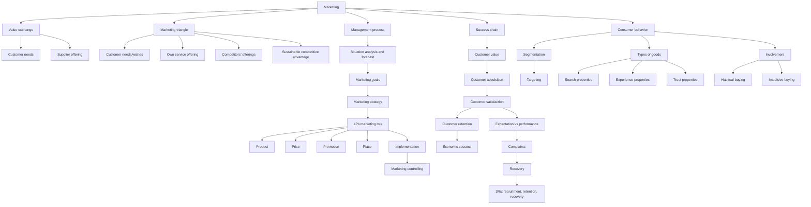

# Chapter 01: Basic Concepts Of Marketing

Source file: `marketing/raw/GM 2026 Chapter1.pdf`

Course: Marketing
Processed: 2026-05-14
Wiki note: `marketing/wiki/chapter-01-basic-concepts-of-marketing/chapter-01-basic-concepts-of-marketing.md`

Course logistics checked: the Marketing exam is a 90-minute written exam covering all lecture materials, with special focus on research papers discussed in class. This chapter is foundational because later branding, product, price, promotion, and place topics build on customer orientation, segmentation, satisfaction, and marketing management logic.

## 80/20 Exam Summary

Marketing is not just advertising or selling. It is a market-oriented management process for creating customer value, selecting target groups, shaping exchange relationships, and converting customer value into long-term economic success.

High-yield points:

- Marketing connects customer needs and supplier offerings through value exchange.
- The goal is sustainable competitive advantage through lasting, substantial, and noticeable customer-value advantages.
- The 4Ps are `Product`, `Price`, `Promotion`, and `Place`.
- The 3Rs are `Recruitment`, `Retention`, and `Recovery`.
- Customer value should lead to acquisition, satisfaction, retention, and economic success.
- Customer satisfaction is mainly explained by the confirmation-disconfirmation paradigm.
- Complaint handling matters because recovery can prevent churn and public reputation damage.
- Segmentation divides the market into identifiable, profitable, and reachable target groups.
- Consumer behavior studies how consumers search, evaluate, purchase, and use products.
- Purchase behavior differs by involvement, good type, decision role, and decision context.

## Core Logic Of Marketing

### Supply-Demand Exchange

The lecture presents marketing through an exchange logic between consumers and suppliers.

Consumers provide:

- money
- income potential
- information
- time

Suppliers provide:

- goods and services
- service
- pre-processing and production processes
- staff and know-how
- financial resources

Two principles matter:

```text
Needs principle: Which needs do market partners have?
Gratification principle: Which incentives exist for market partners?
```

Managerial meaning:

```text
Marketing starts with need understanding, not with pushing products.
```

### Definitions And Modern Understanding

Marketing includes planning and executing conception, pricing, promotion, and distribution to create exchanges that satisfy individual and organizational objectives.

Modern lecture emphasis:

- create, communicate, and deliver value
- manage customer relationships
- benefit the organization and stakeholders
- adapt the organization to target-market needs better than competitors

Exam-safe wording:

```text
Marketing is the management of value-creating exchange relationships with selected target customers.
```

## What Marketing Is And Is Not

Marketing is:

- more than promotion and selling
- close market orientation
- selling customer value and problem solutions
- targeting selected groups, not pleasing everyone
- long-term economic success, not only short-term sales

Marketing is not:

- just advertising
- just sales pressure
- trying to serve every possible customer
- maximizing short-term profit at the expense of retention and trust

## Customer Value To Economic Success

The lecture chain:

```text
Customer value -> customer acquisition -> customer satisfaction -> customer retention -> economic success
```

Interpretation:

- Customer value attracts customers.
- Satisfaction confirms the choice.
- Retention increases lifetime value and efficient use of the acquired customer base.
- Economic success follows if the firm repeatedly creates value better than alternatives.

## Marketing Triangle

The marketing triangle links:

```text
Customer needs/wishes
Own service offering
Competitors' service offerings
```

The goal:

```text
Create and maintain sustainable competitive advantages through lasting, substantial, and noticeable performance/customer-value advantages.
```

Exam trap:

```text
A feature is not automatically a competitive advantage. It must matter to customers and be noticeable relative to competitors.
```

## Marketing Success Chain And Moderators

Core chain:

```text
Marketing activities -> customer acquisition -> customer satisfaction -> customer retention -> economic success
```

External moderators include:

- heterogeneity of customer needs
- market dynamics
- market complexity
- variety-seeking
- brand image
- number of alternatives
- willingness to pay
- customer fluctuation
- customer need for service

Internal moderators include:

- service specificity
- service complexity
- switching barriers
- contractual ties
- functional interconnection of services
- customer information systems
- employee turnover
- price-setting restrictions
- breadth of services

Managerial implication:

```text
The same marketing activity can produce different results depending on market and firm context.
```

## Switching Barriers

Switching barriers are obstacles that make it difficult or costly for customers to change providers.

Types:

- contractual barriers, such as termination fees
- technological or compatibility barriers
- positive barriers, such as loyalty rewards
- negative barriers, such as fees, lost data, or lock-in

Examples:

- telecom contracts with termination fees
- Apple or Google ecosystems where apps, data, subscriptions, and devices create compatibility costs

Critical nuance:

```text
Switching barriers can support retention, but excessive switching costs can harm consumer welfare and attract regulatory attention.
```

## Marketing Mix: The 4Ps

### Product

Typical questions:

- How do consumers perceive products?
- How do consumers use products?
- What emotions do consumers associate with products?

Instruments:

- product innovation
- product improvement or variation
- product differentiation
- product elimination
- branding
- naming
- services
- assortment planning
- packaging

### Price

Typical questions:

- How do consumers perceive price?
- How price-sensitive are consumers?
- How do consumers react to price changes?

Instruments:

- price
- bonuses and discounts
- delivery terms
- payment conditions
- financing offers
- price bundling

### Promotion

Typical questions:

- How do consumers process information?
- When do consumers search for information?
- When do they react to emotional stimuli?

Instruments:

- advertising
- sales promotion
- direct marketing
- public relations
- sponsoring
- personal communication
- trade fairs
- events
- social media communication

### Place

Typical questions:

- How do consumers perceive distribution channels?
- How does channel choice affect purchase behavior?

Instruments:

- distribution system
- sales locations
- logistics
- direct sales
- delivery services

## Customer Equity

Customer equity consists of several value potentials:

- potential sales volume
- cross-selling potential
- information potential
- reference potential

### Reference Potential

Reference potential is the customer’s ability to bring in new customers by recommending the brand.

Example:

```text
A satisfied gym member refers friends; the customer creates value beyond their own membership fee.
```

### Information Potential

Information potential is the value of data, feedback, and insight customers provide.

Examples:

- product feedback guiding innovation
- browsing and purchase data improving targeting
- user communities sharing problems and solutions
- co-creation in product development

## Customer Acquisition

Motives:

- grow sales
- exploit economies of scale
- grow profit and return rates
- compensate for customer turnover
- deal with long repurchase cycles
- reach specific target groups

Key questions:

- Which customers should be targeted?
- Which arguments and channels should be used?
- Which goods and services should be offered?

Exam implication:

```text
Acquisition is not only about volume. The firm must target customers whose value and fit justify acquisition cost.
```

## Customer Retention

Customer retention includes actual behavior and behavioral intentions.

Actual behavior:

- purchase behavior
- recommendation behavior

Behavioral intentions:

- repurchase intentions
- additional purchase intentions
- recommendation intentions

Retention mechanisms:

- loyalty programs
- fixed price systems
- customer clubs
- customer magazines
- service hotlines
- training courses

Key sentence:

```text
Customer retention is a central determinant for efficient utilization of the acquired customer base.
```

## The 3Rs And 4Ps

The lecture connects marketing instruments to three relationship phases:

```text
Recruitment -> Retention -> Recovery
```

Examples:

| 4P | Recruitment | Retention | Recovery |
|---|---|---|---|
| Product | product value, branding, packaging | differentiation, service standards, warranties | innovation, value-added services, individual services |
| Price | low prices, special offers, discounts | price-performance ratio, guarantees, bundling | discounts, one-time payments, special conditions |
| Promotion | mass communication, direct mail, sales promotion | magazines, direct mailing, sponsoring, clubs | direct mail, personal conversation, events |
| Place | sampling, POS promotions, direct sales | direct marketing, regular visits, delivery | exclusive sales, key account management |

Managerial meaning:

```text
A good marketing plan should not only acquire customers; it should retain them and recover them after problems.
```

## Customer Satisfaction

### Confirmation-Disconfirmation Paradigm

Customer satisfaction is a positive emotional reaction to a corporate service in an exchange process.

The comparison:

```text
Expectations (E) vs perceived performance (P)
```

Outcomes:

```text
E > P -> negative disconfirmation -> dissatisfaction
E = P -> confirmation -> satisfaction around confirmation level
E < P -> positive disconfirmation -> high satisfaction
```

Key insight:

```text
Disconfirmation is a robust predictor of satisfaction.
```

Managerial implication:

- do not overpromise
- communicate capabilities clearly
- manage implicit and explicit expectations
- understand that expectations adapt after experience

Real example:

```text
If a hotel promises luxury but delivers only standard service, guests may be dissatisfied even if the room is objectively clean. If the same room was positioned honestly as basic-but-reliable, satisfaction may be higher.
```

### Kano Model

The Kano model distinguishes how different attributes affect satisfaction.

Exam-safe structure:

- basic/must-be attributes: absence creates dissatisfaction, presence is taken for granted
- performance attributes: more performance increases satisfaction
- excitement/delighter attributes: unexpected features can create high satisfaction

Managerial implication:

```text
Firms must satisfy basic needs before investing in delighters.
```

## Complaints And Recovery

### Complaint Types

Complaints can be private or public, voiced or hidden.

| Type | Meaning |
|---|---|
| Privately voiced | Direct complaint through face-to-face, phone, email, or postal mail |
| Publicly voiced | Direct complaint via public channels such as social media pages or hashtags |
| Privately hidden | Complaints to friends/family or switching without telling the firm |
| Publicly hidden | Review sites, blogs, Facebook walls, third-party action not directly addressed to the firm |

Public hidden complaints are dangerous because the firm may not control or even notice the narrative.

### Social Media Customer Service

Good practices:

- monitor mentions
- follow through completely
- be proactive and reactive
- be personal
- use dedicated service accounts
- guide customers clearly
- provide speedy support
- use the right tone
- be transparent

### Effective Social Media Complaint Handling

Four pillars from the lecture:

- willingness to interact
- transparency
- human voice and human touch
- authenticity and credibility

Important concept:

```text
Avoid double deviation.
```

Double deviation means the original service failure is followed by a poor recovery response. This can damage trust more than the original failure.

## Marketing As A Management Process

The lecture process:

```text
Situation analysis
-> Forecast
-> Marketing goals
-> Marketing strategy
-> Marketing mix: Product, Price, Place, Promotion
-> Implementation
-> Marketing controlling
```

Grouped logic:

- analysis and decision preparation
- strategic planning
- operative planning
- realization
- performance review and feedback

Exam implication:

```text
The 4Ps are not strategy by themselves. They operationalize a strategy after analysis and goal setting.
```

## Consumer Behavior

Consumer behavior studies consumers’ choices during searching, evaluating, purchasing, and using products/services that they believe satisfy their needs.

Key questions:

- Who initiates the purchase?
- Who decides?
- Who buys?
- What is bought?
- When is it bought?
- Where is it bought?
- How much is bought?
- Why is it bought?
- What are repurchase consequences?

Goal:

```text
Develop if-then statements valid under certain conditions.
```

Example:

```text
If consumers face low involvement and high familiarity, they may buy habitually. If risk and price are high, they search more extensively.
```

## Segmentation And Targeting

Segmentation divides the market into targetable groups based on consumer information and behavior.

Possible variables:

- demographics: age, gender, social class, occupation, religion
- geography: region, country
- psychography: personality, lifestyle, values
- behavior: loyalty, usage duration, expectations

Good segments should be:

```text
identifiable
profitable
reachable
```

Managerial purpose:

```text
Segmentation exists to formulate marketing strategies, not merely to describe consumers.
```

## Phygital Natives

Gen Z and Gen Alpha are described as phygital natives.

Characteristics:

- constantly connected across screens
- move seamlessly between online and offline worlds
- use gaming, social media, and short-form content
- prefer personalized content
- ignore irrelevant long-form advertising
- express identity digitally and physically
- value authenticity, sustainability, diversity, and self-expression

Marketing implications:

- integrate online and offline touchpoints
- emphasize authenticity and values without appearing staged
- personalize communication
- avoid irrelevant mass messaging

## Purchasing Decision Types

The lecture distinguishes purchase context by decision maker and buyer type.

| Context | Meaning |
|---|---|
| Individual household | Private consumer decision |
| Individual company/institution | Representative buys for organization |
| Group household | Family/community decision |
| Group organization | Buying center, common in B2B |

## Types Of Goods

### Convenience Goods

Bought frequently with little hesitation, low information search, and limited comparison.

Example:

```text
toothpaste, snacks, bottled water
```

### Shopping Goods

Consumers compare alternatives based on price/performance, quality, or fit.

Example:

```text
household appliances, furniture, laptops
```

### Specialty Goods

Unique characteristics, high purchase effort, high information costs, strong identification or budget impact.

Example:

```text
cars, luxury watches, high-end cameras
```

## Search, Experience, And Trust Properties

| Property | Customer can assess performance... | Example |
|---|---|---|
| Search | before purchase | screen size, color, listed specs |
| Experience | after purchase/use | restaurant taste, hotel comfort |
| Trust | not easily before or after purchase | medical treatment quality, legal advice |

Marketing implication:

```text
As evaluation becomes harder, trust, reputation, reviews, guarantees, and branding become more important.
```

## Involvement And Decision Behavior

Cognitive involvement:

```text
Intensity of information search.
```

Emotional involvement:

```text
Strength of emotional reaction.
```

### Habitual Buying

Characteristics:

- based on habits
- prefabricated decisions converted into purchases
- strong preference for one brand or alternative
- fast decisions
- low-risk convenience purchases
- long-term brand/product/company loyalty

Drivers:

- own user experience
- recommendations
- need to simplify life

### Impulsive Buying

Characteristics:

- high emotional activation
- unplanned rapid action
- little mental control

Stimuli:

- product placement
- presentation
- product design
- displays

## Mermaid Visual Map



## Subject Knowledge Graph

### Nodes

| Node | Meaning |
|---|---|
| Marketing | Market-oriented management of value exchange |
| Customer Value | Benefit or problem solution perceived by customer |
| Marketing Triangle | Customer needs, own offering, competitor offerings |
| Sustainable Competitive Advantage | Lasting, substantial, noticeable customer-value advantage |
| 4Ps | Product, Price, Promotion, Place |
| 3Rs | Recruitment, Retention, Recovery |
| Customer Equity | Sales, cross-selling, reference, and information potential |
| Switching Barriers | Obstacles or costs that make switching providers harder |
| Customer Satisfaction | Emotional reaction from expectation-performance comparison |
| Disconfirmation | Gap between expectations and perceived performance |
| Complaint Recovery | Handling failures to prevent churn and reputation loss |
| Segmentation | Dividing markets into targetable groups |
| Consumer Behavior | Study of search, evaluation, purchase, and use decisions |
| Involvement | Cognitive/emotional intensity of decision process |
| Goods Properties | Search, experience, and trust characteristics |

### Edges

| From | Relationship | To |
|---|---|---|
| Marketing | creates and manages | Customer Value |
| Customer Value | drives | Customer Acquisition |
| Customer Acquisition | enables | Customer Satisfaction |
| Customer Satisfaction | supports | Customer Retention |
| Customer Retention | contributes to | Economic Success |
| Marketing Triangle | identifies | Competitive Advantage |
| 4Ps | operationalize | Marketing Strategy |
| 3Rs | structure | Relationship Management |
| Switching Barriers | increase | Customer Retention |
| Excessive Switching Barriers | may reduce | Consumer Welfare |
| Expectations | compared with | Perceived Performance |
| Disconfirmation | determines | Customer Satisfaction |
| Complaint Recovery | prevents | Double Deviation |
| Segmentation | enables | Targeting |
| Goods Properties | influence | Information Search |
| Involvement | shapes | Decision Behavior |

## Exam Relevance

Likely question types:

- Define marketing and explain why it is broader than selling.
- Explain the marketing triangle with a real brand example.
- Apply the 4Ps to recruitment, retention, or recovery.
- Explain switching barriers and discuss positive vs negative forms.
- Use the confirmation-disconfirmation paradigm to diagnose satisfaction.
- Classify complaint types and propose a recovery response.
- Explain segmentation criteria and evaluate whether a segment is useful.
- Distinguish convenience, shopping, and specialty goods.
- Distinguish search, experience, and trust properties.
- Explain habitual vs impulsive buying.

Common mistakes:

- Treating promotion as the whole of marketing.
- Listing 4Ps without connecting them to strategy.
- Assuming all retention barriers are good for customers.
- Confusing satisfaction with loyalty; satisfaction can support retention but does not guarantee it.
- Ignoring expectations in satisfaction analysis.
- Segmenting by demographics only without profitability or reachability.

## Practice Questions

1. In your own words, why is marketing more than advertising?
2. Apply the marketing triangle to Apple, Aldi, or Netflix.
3. What is the difference between customer acquisition and customer retention?
4. Explain the confirmation-disconfirmation paradigm using a hotel example.
5. What is double deviation and why is it dangerous?
6. Give one example of a positive and one example of a negative switching barrier.
7. How would marketing differ for convenience goods versus specialty goods?
8. Why are trust properties important for branding?

## Short Answer Guide

1. Marketing includes selecting customers, creating value, pricing, distribution, communication, retention, and recovery.
2. Identify customer needs, own offering, competitors, and a noticeable advantage.
3. Acquisition brings customers in; retention keeps and monetizes the customer base over time.
4. Satisfaction depends on perceived performance relative to expectations.
5. Double deviation is poor recovery after an initial failure; it compounds dissatisfaction.
6. Positive: loyalty rewards; negative: termination fees or data lock-in.
7. Convenience goods need availability and habit cues; specialty goods need information, trust, and differentiation.
8. When quality is hard to assess, brands reduce risk and provide orientation.
