# Chapter 02: Branding

Source file: `marketing/raw/GM 2026 Chapter2.pdf`

Course: Marketing
Processed: 2026-05-14
Wiki note: `marketing/wiki/chapter-02-branding/chapter-02-branding.md`

Course logistics checked: the Marketing exam covers all lecture materials and places special focus on research papers discussed in class. This chapter includes a research deep dive on Jung & Dubois (2023) about slow motion and luxury perceptions; preserve it as examinable application material.

## 80/20 Exam Summary

A brand is more than a product. It is a set of identifiers and associations that differentiate an offering, reduce customer risk, create meaning, and shape customer response to marketing activities.

High-yield points:

- A brand identifies and differentiates a seller’s goods or services.
- A product satisfies a need; a brand adds meaning, associations, image, risk reduction, and differentiation.
- Brand equity is the added value a brand gives to a product.
- Customer-based brand equity depends on what resides in consumers’ minds and hearts.
- Brand knowledge consists of brand awareness and brand image.
- Brand image depends on strength, favorability, and uniqueness of associations.
- Brand positioning designs the offer and image to occupy a distinct, valued place in target customers’ minds.
- Points of parity make the brand legitimate in the category; points of difference make it distinctive.
- Keller’s CBBE pyramid moves from salience to performance/imagery, judgments/feelings, and resonance.
- Brand elements should be memorable, meaningful, likable, transferable, adaptable, and protectable.
- Brand architecture choices include line extension, brand extension, multi-branding, and new brands/new lines.
- Brand alliances, co-branding, ingredient branding, licensing, and celebrity endorsement leverage external associations but create fit and dilution risks.

## Brand Versus Product

### Brand Definition

A brand is a name, term, sign, symbol, design, or combination of these intended to identify and differentiate a seller’s goods or services.

Brand components include:

- name
- logo
- symbol
- package design
- other identifying characteristics

Brands can be based on:

- people
- places
- things
- abstract images

### Product Definition

A product is anything available in the market for use or consumption that may satisfy a need or want.

Product levels:

- core benefit
- generic product
- expected product
- augmented product
- potential product

### Key Difference

```text
A product satisfies a need. A brand differentiates and gives meaning to that product in customers' minds.
```

Example:

```text
Many shoes protect feet. Nike adds performance, identity, athlete associations, design meaning, and social status.
```

## Brand Identity And Brand Image

Brand identity:

```text
How the firm wants the brand to be perceived.
```

Brand image:

```text
How consumers actually perceive the brand.
```

Managerial goal:

```text
Align intended identity with actual image, while keeping the brand differentiated and credible.
```

Exam trap:

```text
Brand image is not fully controlled by the firm. It is co-created through customer experience, communication, competitors, reviews, culture, and media.
```

## Benefits Of Branding

### For Brand Leaders

- differentiation from competition
- quality signal
- customer preference and loyalty
- market entry barriers
- price premium
- platform for new products

### For Marketing Intermediaries

- reduced sales risk
- image transfer from the brand to the intermediary
- lower need for own consulting activity

### For Consumers

- orientation in information gathering
- risk reduction
- quality signal
- experiential quality
- self-expression of taste, group membership, or social status

## Brand Effects On The 4Ps

### Product

A strong brand can positively affect product evaluation through halo effects and perceived quality.

### Price

Strong brands can:

- demand price premiums
- reduce price elasticity
- become relatively more immune to price competition

### Place

Strong brands have a higher chance of being accepted by channels and gaining shelf space.

### Promotion

Positive brand feelings can bias advertising evaluation. Committed customers may counter-argue negative information.

## Brand Knowledge And Associative Network Memory

Brand equity depends on brand knowledge in consumer memory.

Associative network model:

- nodes represent stored information/concepts
- links represent association strength
- brand associations are informational nodes linked to the brand node

Example:

```text
Apple -> design -> innovation -> premium -> ecosystem -> creativity -> simplicity
```

The stronger and more favorable the network, the stronger the brand’s ability to shape consumer response.

## Brand Image Dimensions

### Strength Of Brand Associations

Associations become stronger when consumers think deeply about product information and connect it to existing brand knowledge.

### Favorability Of Brand Associations

Associations are favorable when the brand has relevant attributes and benefits that satisfy needs and wants.

### Uniqueness Of Brand Associations

Unique associations create a sustainable competitive advantage.

Exam-safe sentence:

```text
Brand image is strategically valuable when associations are strong, favorable, and unique.
```

## Dimensions Of Brand Knowledge

Keller’s structure:

```text
Brand knowledge = brand awareness + brand image
```

Brand awareness:

- brand recall
- brand recognition

Brand image:

- types of associations: attributes, benefits, attitudes
- favorability
- strength
- uniqueness

## Brand Positioning

Brand positioning is designing the company’s offer and image so that it occupies a distinct and valued place in target customers’ minds.

It answers:

- Who is the target customer?
- What frame of reference/category is the brand in?
- What makes the brand similar enough to be legitimate?
- What makes the brand different and valuable?

## Points Of Parity And Points Of Difference

Points of parity:

```text
Associations necessary to be considered a credible category member.
```

Points of difference:

```text
Associations that are unique, favorable, and strongly held, giving the brand a reason to choose it over competitors.
```

Example:

```text
A luxury watch must have accurate timekeeping and craftsmanship as parity. Rolex differentiates through prestige, heritage, status, and recognizability.
```

Exam trap:

```text
A brand cannot only be different. It must first meet category expectations.
```

## Brand Mantra

A brand mantra is a short three-to-five-word phrase capturing the essence or spirit of brand positioning.

It guides:

- what products to introduce
- which ad campaigns to run
- where and how the brand should be sold

Good brand mantras are internal decision tools, not just slogans.

## Brand Equity

Brand equity is the added value endowed to a product by the brand.

Principles:

- differences in outcomes arise from added value
- added value can be created in many ways
- brand equity helps interpret marketing strategy
- brand value can be exploited to benefit the firm

### Customer-Based Brand Equity

Customer-based brand equity approaches brand equity from the consumer perspective.

Core idea:

```text
The power of a brand lies in what resides in customers' minds and hearts.
```

Definition logic:

```text
CBBE is the differential effect that brand knowledge has on consumer response to the marketing of that brand.
```

Example:

```text
If the same coffee tastes better, seems more premium, or justifies a higher price when Starbucks is shown on the cup, that is customer-based brand equity.
```

## Customer-Based Brand Equity Pyramid

Keller’s pyramid can be remembered as a sequence of customer questions.

### Brand Salience: Who Are You?

Breadth and depth of awareness:

- how likely the brand comes to mind
- in which purchase and usage situations it comes to mind

Strategic question:

```text
Not only whether consumers recall the brand, but when, where, how often, and in what category structure.
```

### Brand Performance: What Are You?

Functional performance:

- quality
- reliability
- utilitarian value
- aesthetic value
- economic value

### Brand Imagery: What Do You Mean?

Non-functional and symbolic associations:

- user profiles
- usage situations
- personality
- values
- heritage
- experiences

### Brand Judgments: What Do I Think?

Consumer evaluations such as:

- quality
- credibility
- consideration
- superiority

### Brand Feelings: What Do I Feel?

Emotional responses and social currency evoked by the brand.

### Brand Resonance: What Relationship Do We Have?

Highest level:

- behavioral loyalty
- attitudinal attachment
- sense of community
- active engagement

Exam-safe logic:

```text
Strong brands move from awareness to meaning, then response, then relationship.
```

## Building Brand Equity Through Brand Elements

Six criteria:

| Criterion | Role |
|---|---|
| Memorability | Helps recall and recognition |
| Meaningfulness | Communicates category or benefits |
| Likability | Creates positive affect |
| Transferability | Works across products, markets, or cultures |
| Adaptability | Can be updated over time |
| Protectability | Can be legally and competitively defended |

Offensive strategy:

```text
memorability, meaningfulness, likability -> build brand equity
```

Defensive role:

```text
transferability, adaptability, protectability -> leverage and maintain brand equity
```

## Brand Names And Logos

Names matter because they shape expectations, associations, memorability, and perceived fit.

Exam interpretation:

```text
Brand names and logos are not decorative. They are memory and meaning devices.
```

## Brand Architecture

Strategic options are based on existing/new brand and existing/new product line.

| Brand | Product line | Strategy |
|---|---|---|
| Existing | Existing | Line extension |
| Existing | New | Brand extension |
| New | Existing | Multi-branding |
| New | New | Creation of new brands and lines |

### Line Extension

Existing brand used for new variants in existing product line.

Example:

```text
Coca-Cola Zero, Diet Coke
```

### Brand Extension

Existing brand used in a new product line.

Example:

```text
Virgin moving from music to airlines or telecom
```

### Multi-Branding

New brand in an existing product category.

Example:

```text
A consumer goods company offering multiple detergent brands to target different segments.
```

### New Brand And New Line

A new brand is created for a new category when fit with existing brands is weak or risk of dilution is high.

## Brand Alliances

Brand alliances involve simultaneous, buyer-focused presentation of two or more brands to increase sales potential by exploiting existing brand values.

Forms:

- co-promotions
- co-branding
- ingredient branding

Goals:

- competitive advantage
- new markets
- innovative product concepts
- image change or improvement
- brand repositioning

### Co-Branding

Two or more brands are combined into a joint product or marketed together.

Example:

```text
A fashion brand and sports brand launching a joint sneaker.
```

### Ingredient Branding

Creates brand equity for materials, components, or parts inside other branded products.

Benefits:

- quality signal
- risk reduction
- predictability

Example:

```text
Intel Inside in laptops.
```

## Licensing

Licensing creates contractual arrangements where firms use names, logos, characters, or brand assets of other brands for a fee.

Benefits:

- access to known associations
- faster market attention
- legal protection through trademark arrangements

Risk:

```text
Overexposure can dilute the trademark or weaken brand meaning.
```

## Celebrity Endorsement

A celebrity can:

- draw attention
- shape brand perceptions through celebrity associations

Good endorsers have:

- high visibility
- rich useful associations, judgments, and feelings
- fit with brand positioning

Exam trap:

```text
Visibility alone is not enough. Endorser-brand fit matters.
```

## Trademark Piracy

Trademark piracy is counterfeit production aiming to imitate an original product and benefit from brand advantages.

Why it matters:

- harms brand equity
- creates consumer confusion
- may damage perceived quality
- exploits brand investments

## Research Deep Dive: Slow Motion And Luxury Perceptions

Lecture-assigned paper:

```text
Jung, S., & Dubois, D. (2023). When and How Slow Motion Makes Products More Luxurious. Journal of Marketing Research, 60(6), 1177-1196.
```

The slide asks students to identify:

- what effect the authors investigate
- why the effect matters for practitioners
- what research method/approach they use

Exam preparation note:

```text
This paper likely matters because the course overview says research papers discussed in class receive special exam focus. Be prepared to explain the phenomenon, managerial takeaway, and research approach once the paper text or class discussion notes are available.
```

Current inference from the lecture title only:

```text
The paper investigates whether and how slow-motion presentation can increase perceived product luxury. This matters because advertising execution style may change perceived brand/product positioning without changing the product itself.
```

Open uncertainty:

```text
The exact mechanism and method should be verified from the paper abstract/introduction if provided later.
```

## Mermaid Visual Map

```mermaid
flowchart TD
    Brand[Brand] --> Identity[Brand identity: intended meaning]
    Brand --> Image[Brand image: consumer perception]
    Brand --> Product[More than product]
    Product --> Differentiation[Differentiation]
    Product --> Meaning[Associations and meaning]

    Brand --> Benefits[Brand benefits]
    Benefits --> Firm[For firm: loyalty, price premium, entry barriers]
    Benefits --> Intermediary[For intermediaries: lower risk, image transfer]
    Benefits --> Consumer[For consumers: orientation, risk reduction, self-expression]

    Brand --> Knowledge[Brand knowledge]
    Knowledge --> Awareness[Brand awareness]
    Awareness --> Recall[Recall]
    Awareness --> Recognition[Recognition]
    Knowledge --> BrandImage[Brand image]
    BrandImage --> Strength[Strength]
    BrandImage --> Favorability[Favorability]
    BrandImage --> Uniqueness[Uniqueness]

    Brand --> Positioning[Brand positioning]
    Positioning --> POP[Points of parity]
    Positioning --> POD[Points of difference]
    Positioning --> Mantra[Brand mantra]

    Brand --> CBBE[CBBE pyramid]
    CBBE --> Salience[Salience]
    Salience --> Performance[Performance]
    Salience --> Imagery[Imagery]
    Performance --> Judgments[Judgments]
    Imagery --> Feelings[Feelings]
    Judgments --> Resonance[Resonance]
    Feelings --> Resonance

    Brand --> Elements[Brand elements]
    Elements --> Build[Memorable, meaningful, likable]
    Elements --> Defend[Transferable, adaptable, protectable]

    Brand --> Architecture[Brand architecture]
    Architecture --> LineExtension[Line extension]
    Architecture --> BrandExtension[Brand extension]
    Architecture --> Multibranding[Multi-branding]
    Architecture --> NewBrand[New brands and lines]

    Brand --> Leverage[Brand leverage]
    Leverage --> Alliances[Brand alliances]
    Leverage --> Licensing[Licensing]
    Leverage --> Endorsement[Celebrity endorsement]
    Leverage --> Piracy[Trademark piracy risk]
```



## Subject Knowledge Graph

### Nodes

| Node | Meaning |
|---|---|
| Brand | Identifier and differentiator with associations and meaning |
| Product | Offering satisfying a need or want |
| Brand Identity | Desired brand meaning from firm perspective |
| Brand Image | Actual consumer perception |
| Brand Equity | Added value endowed by brand |
| CBBE | Differential consumer response caused by brand knowledge |
| Brand Knowledge | Awareness plus image |
| Brand Awareness | Recall and recognition |
| Brand Associations | Nodes linked to brand in memory |
| Strength | How strongly associations are linked |
| Favorability | Whether associations satisfy needs/wants |
| Uniqueness | Whether associations differentiate brand |
| Positioning | Distinct and valued place in target customers’ minds |
| Points of Parity | Category legitimacy associations |
| Points of Difference | Distinctive choice-driving associations |
| Brand Mantra | Short internal essence of positioning |
| Brand Elements | Name, logo, symbols, design, etc. |
| Brand Architecture | Structure of brands and product lines |
| Brand Alliance | Leveraging multiple brands together |
| Trademark Piracy | Counterfeit imitation exploiting brand value |

### Edges

| From | Relationship | To |
|---|---|---|
| Brand | differentiates | Product |
| Brand Identity | should align with | Brand Image |
| Brand Knowledge | creates | CBBE |
| Brand Awareness | contributes to | Brand Knowledge |
| Brand Image | contributes to | Brand Knowledge |
| Brand Associations | vary by | Strength/Favorability/Uniqueness |
| Strong Favorable Unique Associations | create | Competitive Advantage |
| Positioning | defines | Points of Parity |
| Positioning | defines | Points of Difference |
| Brand Mantra | guides | Marketing decisions |
| CBBE Pyramid | builds toward | Brand Resonance |
| Brand Elements | build and protect | Brand Equity |
| Brand Architecture | manages | Extension and dilution risk |
| Brand Alliances | transfer | Brand associations |
| Licensing | monetizes | Brand assets |
| Trademark Piracy | damages | Brand Equity |

## Exam Relevance

Likely question types:

- Define brand and distinguish it from product.
- Explain why brands matter for firms, intermediaries, and consumers.
- Use brand associative memory to explain brand equity.
- Explain strength, favorability, and uniqueness with an example.
- Apply points of parity and points of difference to a brand.
- Explain Keller’s CBBE pyramid.
- Evaluate a brand element using the six criteria.
- Classify brand architecture strategies.
- Compare co-branding, ingredient branding, and licensing.
- Discuss celebrity endorsement fit.
- Explain trademark piracy as a brand-equity threat.
- Discuss the Jung & Dubois paper if provided in class.

Common mistakes:

- Treating a brand as only a logo.
- Confusing brand identity with brand image.
- Listing brand associations without evaluating strength, favorability, and uniqueness.
- Ignoring points of parity when explaining differentiation.
- Assuming brand extension is always beneficial; fit and dilution risk matter.
- Assuming celebrity awareness alone guarantees effectiveness.

## Practice Questions

1. Why is a brand more than a product?
2. Explain CBBE in one sentence.
3. Give three Apple associations and classify whether they are strong, favorable, and unique.
4. What is the difference between points of parity and points of difference?
5. Apply the CBBE pyramid to Nike or Rolex.
6. What makes a brand element good?
7. Classify Coca-Cola Zero as line extension or brand extension.
8. Why can licensing damage a brand?
9. What should you check before using a celebrity endorser?

## Short Answer Guide

1. A brand adds identification, differentiation, associations, risk reduction, and meaning to a product.
2. CBBE is the differential effect of brand knowledge on consumer response to marketing.
3. Example: design, innovation, ecosystem; evaluate based on memory strength, customer value, and distinctiveness.
4. POPs establish category legitimacy; PODs drive distinctive preference.
5. Salience -> performance/imagery -> judgments/feelings -> resonance.
6. Memorable, meaningful, likable, transferable, adaptable, protectable.
7. Line extension: existing brand, existing product line with a new variant.
8. Overexposure or poor fit can dilute associations and weaken meaning.
9. Visibility, association set, credibility, brand fit, and risk of negative spillover.
