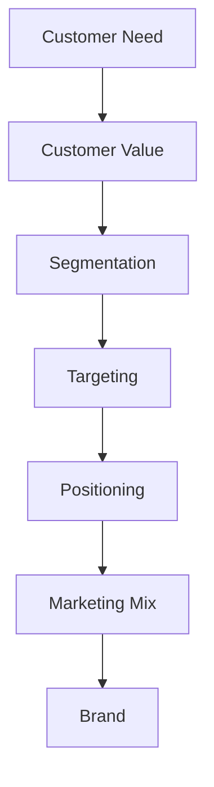

# Ubiquitous Language: Chapter 03: Product

Source note: `chapter-03-product.md`
Course: Marketing
Definition sources: local topic note and raw material for term discovery; enriched with standard domain knowledge where the local note names a term without fully defining it.

This file is a standalone terminology and formula companion. It follows Matt Pocock style: canonical terms, aliases to avoid, relationships, example dialogue, and flagged ambiguities.

## Market Language

| Term | Definition | Aliases to avoid |
|---|---|---|
| **Customer Need** | A problem, desire, or job-to-be-done that motivates purchase behavior. | product feature |
| **Customer Value** | The perceived benefit a customer receives relative to the sacrifice required to obtain it. | price only, quality only |
| **Segmentation** | Dividing a heterogeneous market into groups with similar needs, behaviors, or responses. | targeting |
| **Targeting** | Choosing which segments the firm will serve. | segmentation |
| **Positioning** | Designing the offering and message so the target market associates the brand with a distinct value. | advertising slogan |
| **Marketing Mix** | The controllable set of product, price, place, and promotion decisions used to implement strategy. | marketing campaign only |
| **Brand** | A name, symbol, promise, and association system that identifies and differentiates an offering. | logo only |

## Performance Language

| Term | Definition | Aliases to avoid |
|---|---|---|
| **Customer Satisfaction** | The customer evaluation of whether perceived performance meets or exceeds expectations. | happiness only |
| **Customer Retention** | The continued relationship or repeat purchasing of existing customers. | loyalty always |
| **Customer Equity** | The total value of the firm customer relationships, often treated as the sum of customer lifetime values. | brand equity |

## Product Language

| Term | Definition | Aliases to avoid |
|---|---|---|
| **Product** | A bundle of tangible and intangible benefits offered to satisfy a customer need. | physical item only |
| **Product Line** | A group of related products sold by the same firm. | single product |
| **Product Mix** | The full set of product lines and items a firm offers. | marketing mix |
| **New Product Development** | The process of generating, screening, developing, testing, and launching new offerings. | innovation idea only |
| **Product Life Cycle** | A model describing sales and profit patterns across introduction, growth, maturity, and decline. | project timeline |
| **Cannibalization** | Sales loss of an existing product caused by the firm own new product. | competition |

## Relationships

- **Customer Need** should be distinguished from **Customer Value** when writing exam answers.
- **Customer Value** should be distinguished from **Segmentation** when writing exam answers.
- **Segmentation** should be distinguished from **Targeting** when writing exam answers.
- **Targeting** should be distinguished from **Positioning** when writing exam answers.
- **Positioning** should be distinguished from **Marketing Mix** when writing exam answers.
- **Marketing Mix** should be distinguished from **Brand** when writing exam answers.
- A strong answer defines the canonical term, applies the rule or formula, and states the managerial, legal, or analytical implication.

## Visual Memory Aid



## Example Dialogue

> **Student:** "I see **Customer Need** and **Customer Value** in the note. Are they interchangeable?"
>
> **Professor:** "No. Use **Customer Need** for its precise technical meaning, and use **Customer Value** only when the facts match that definition."
>
> **Student:** "So in an exam answer I should name the exact term first?"
>
> **Professor:** "Yes. Name the canonical term, apply the decision rule or mechanism, then state the implication."

## Flagged Ambiguities

- Do not use broad labels like "concept", "factor", or "thing" when a canonical term above fits.
- Do not use aliases listed in the tables unless you are explicitly explaining why they are misleading.
- If a formula symbol appears, define its unit, timing, and decision role before calculating.
- If a legal, theoretical, or framework term has a common everyday meaning, use the technical course meaning in exam answers.

## Exam Trap Corrections

| Trap | Correction |
|---|---|
| Naming a term without applying it. | Define it briefly, then apply it to the facts, formula, or decision. |
| Treating examples as definitions. | Use examples only after the canonical definition is clear. |
| Mixing related terms. | State the boundary between the terms before comparing them. |
| Copying a formula without variable meaning. | Define each variable and unit before substitution. |

## Cheat-Sheet Language

```text
Start with customer, need, value proposition, target segment, and strategic tradeoff before describing tactics.
For every technical term: define it, identify when it applies, and state the common confusion to avoid.
```
