# Chapter 03: Product

Source file: `marketing/raw/GM 2026 Chapter3.pdf`

Course: Marketing
Processed: 2026-05-14
Wiki note: `marketing/wiki/chapter-03-product/chapter-03-product.md`

Course logistics checked: the Marketing exam covers all lecture materials and has special focus on research papers discussed in class. This chapter includes Hoyer et al. (2020), Shin (2021), Heidenreich et al. (2015), and product-development/lead-user research references, so paper-based conceptual questions are plausible.

## 80/20 Exam Summary

Product policy is about designing, modifying, bundling, eliminating, and researching offerings so that they solve customer problems and create value. A product is not just the physical object; it includes core benefit, expected features, augmentation, brand, service, packaging, and future potential.

High-yield points:

- A product is a bundle of attributes offering observable benefit.
- Customers often want the underlying solution, not the product itself.
- Product levels move from core product to generic, expected, augmented, and potential product.
- Digitalization transforms physical products into digital products or augments physical products with digital elements.
- Packaging has protection, branding, logistics, sales, usage, sustainability, and augmentation functions.
- Product assortment decisions concern breadth and depth.
- Product elimination can improve focus but creates risks for image, fixed-cost coverage, alliances, know-how, suppliers, and customers.
- AI recommender systems use collaborative and content-based filtering but create fairness, accountability, transparency, explainability, and privacy concerns.
- Product development follows stages from idea generation to commercialization.
- Innovation can come from technology push or market pull.
- Lead users are valuable because they experience needs earlier and may develop solutions.
- Co-creation can improve fit and willingness to pay, but can fail through expectation and management problems.
- Agile/lean startup approaches test assumptions iteratively instead of following a purely linear waterfall model.
- Conjoint analysis measures preferences by forcing consumers to trade off product attributes.

## What Is A Product?

A product is a bundle of attributes that offers observable benefit to its user.

Important quote logic from the lecture:

```text
The producer of drills may believe the customer needs a drill machine. What the customer really wants is a hole in the wall.
```

Managerial meaning:

```text
Do not confuse the physical product with the customer problem being solved.
```

Product attributes can include:

- core product
- product value
- quality/design
- brand and image
- packaging
- price
- guarantees
- accessories
- service/delivery

## Product Levels

Using the hotel example:

| Product level | Meaning | Hotel example |
|---|---|---|
| Core product | Fundamental benefit | rest and sleep |
| Generic product | Basic product form | hotel room with bed, bathroom, towels, closet |
| Expected product | Must-have features | clean bed, clean bathroom, fresh towels |
| Augmented product | Extra features exceeding expectations | high service level, free Wi-Fi |
| Potential product | Future evolution | personalized digital concierge, smart-room experience |

Exam trap:

```text
Customer satisfaction can fail at the expected-product level even if augmented features are impressive.
```

## Experiential Value From New Technologies

Hoyer et al. (2020) distinguish three dimensions of experiential value.

### Cognitive Value

Value from information processing and decision-making.

Example:

```text
An AR furniture app helps customers understand whether a sofa fits their room.
```

### Sensory/Emotional Value

Value from sensory stimulation and emotional attachment.

Example:

```text
A VR travel preview makes customers feel excitement before booking.
```

### Social Value

Value from connection to the social world enabled by technology.

Example:

```text
A fitness app lets users share achievements and compete with friends.
```

Research-paper relevance:

```text
If Hoyer et al. (2020) is discussed in class, be prepared to explain how technology changes customer experience dimensions, not just list technologies.
```

## Product Digitalization

### Strategy 1: Transform Physical Products Into Digital Products

Examples:

| Category | Physical product | Digital product |
|---|---|---|
| Software | boxes, CD/DVD, printed manuals | download, PDF manuals, YouTube tutorials |
| Music | CDs, vinyl records | downloads, streaming |
| Books | printed books | eBooks |
| Movies/videos | DVDs, Blu-ray | downloads, streaming |

Managerial effects:

- lower marginal distribution cost
- new pricing models
- instant delivery
- platform dependence
- piracy and licensing concerns
- changed ownership/use experience

### Strategy 2: Augment Physical Products With Digital Elements

Examples:

- B2B machines with sensors and software enabling predictive maintenance
- cars with entertainment and driver assistance systems
- toothbrushes with sensors and apps for children

Managerial effects:

- product becomes service platform
- recurring data and service revenue
- stronger lock-in
- privacy and cybersecurity issues

## Packaging

Packaging includes all measures involved in wrapping/enwrapping products.

Functions:

- protect and safeguard products during transport/storage
- support branding and communication
- dimension products for sales process
- present goods and increase point-of-sale sales
- fulfill economic and societal requirements
- rationalize inventory management between industry and POS
- facilitate usage during consumption
- create an augmented product

Example: Puma Clever Little Bag

The lecture uses Puma’s packaging redesign as an example of packaging that supports sustainability, logistics, branding, and reuse. The core insight is not the exact numbers but the multi-functionality of packaging.

Exam-safe sentence:

```text
Packaging is both a physical logistics tool and a marketing communication/product-augmentation tool.
```

## Product Assortment Decisions

Assortment decisions concern breadth and depth.

### Product Mix Breadth

Number of product lines or product groups.

Examples:

- producer: detergent, cosmetics, glue, industrial coating
- point of sale: groceries, household hardware, shoes, textiles

### Product Mix Depth

Number of articles within a product line or product group.

Examples:

- detergent line: light-duty, heavy-duty, wool, color, fabric softener
- textiles group: women, men, children

Managerial tradeoff:

```text
More breadth/depth can serve heterogeneous needs, but it increases complexity, inventory, cannibalization risk, and decision overload.
```

## Product Elimination

### Causes

- shrinking market
- competitors’ increasing advantages
- new legal requirements
- declining sales, market share, contribution margin, or profitability
- capacity reduction
- negative test results or headlines
- excessive customer service costs
- scarce resources

### Consequences And Risks

- reduced fixed-cost coverage
- image damage if eliminating a classic/image carrier
- image gain if eliminating questionable products
- impairment of profitable purchasing alliances
- know-how gaps
- supplier/customer relationship damage

Exam implication:

```text
Product elimination is not just deleting an unprofitable item. It can affect brand image, operations, capabilities, and relationships.
```

## AI-Based Recommender Systems

### Filtering Methods

Collaborative filtering:

```text
Recommendations based on patterns from similar users.
```

Example:

```text
Users similar to you watched this movie.
```

Content-based filtering:

```text
Recommendations based on attributes of items the user liked before.
```

Example:

```text
You watched political thrillers, so the system recommends another political thriller.
```

Netflix thumbnail personalization is an example of AI adapting presentation to user preferences.

## Consumer Perception Of AI Recommenders

### FAT/FATE

FAT or FATE refers to:

- fairness
- accountability
- transparency
- explainability

### Fairness

Algorithms should not create discriminatory or unjust consequences.

### Accountability

Providers of automated decision systems should be responsible for outcomes and harms.

### Transparency

Algorithmic decisions should be clear and understandable to users.

### Explainability

The inner mechanism or reasoning of the algorithm can be explained in human language.

Managerial implication:

```text
Better recommendation performance is not enough. Trust depends on perceived fairness, accountability, transparency, and explainability.
```

## Privacy Concerns In Recommender Systems

Privacy concern drivers:

| Driver | Meaning |
|---|---|
| Creepiness | Emotional unease when technology exceeds expectations or feels too invasive |
| Need for privacy | Individual concern about confidentiality, use, or disclosure of private information |
| Perceived risk | Belief that AI systems may leak or misuse data, especially sensitive data |

Example:

```text
A customer may appreciate personalized recommendations until the system reveals it knows more than expected, creating creepiness.
```

## Stages Of Product Development

The lecture presents a stage-gate process:

1. Idea generation: is the idea worth considering?
2. Idea screening: does it fit company objectives, strategies, and resources?
3. Concept development and testing: can we find a concept consumers would try?
4. Marketing strategy development: can we find a cost-effective and affordable marketing strategy?
5. Business analysis: will it meet profit goals?
6. Product development: is the product technically and commercially sound?
7. Market testing: have product sales met expectations?
8. Commercialization: are product sales meeting expectations?

Decision logic:

```text
At each stage, weak ideas can be dropped, modified, or sent back for development.
```

## Sources Of Product Innovation

### Technology Push

Innovation starts from R&D, production, or technical possibilities and then searches for market need.

Typical logic:

```text
Customers do not know what is technically possible.
```

Associated lecture examples/quotes:

- Henry Ford/faster horse quote
- Steve Jobs/customer knowledge skepticism
- Gillette multi-blade innovation trajectory
- Apple rise/fall/rise examples

### Market Pull

Innovation starts from expressed market need and works backward toward product/technology.

Typical logic:

```text
Determine what customers need and work backward.
```

Exam-safe comparison:

```text
Technology push can create radical solutions customers did not imagine, but risks missing real needs. Market pull improves market fit, but can become incremental if it only follows expressed needs.
```

## Context Variables In Innovation

Innovation processes vary depending on:

- sector
- firm size
- national innovation system
- lifecycle stage of technology or industry
- degree of novelty: continuous vs discontinuous innovation
- external actors such as regulators

Managerial meaning:

```text
There is no one universal innovation process. Context changes what works.
```

## Lead Users

Lead users are valuable for idea generation because they:

- recognize requirements early
- expect high benefits from solutions
- develop their own innovations/applications
- are perceived as pioneering and innovative

Why they matter:

```text
Lead users experience future mainstream needs earlier than ordinary users.
```

### Lead User Integration Process

1. Goal generation and team formation
2. Trend research
3. Lead user pyramid networking
4. Lead user workshop and idea improvement

Evidence mentioned:

- lead-user-generated products may be preferred over traditional concepts
- 3M lead-user idea generation produced high-grade innovations
- lead-user commitment can make innovation faster and cheaper

## Customer Co-Creation

### Benefits For Firms

- easier access to need and solution information
- better fit with customer needs
- lower failure rates
- increased willingness to pay through the made-it-myself effect
- shared learning processes

### Benefits For Customers

- material rewards
- fun/challenge
- acceptance from others
- connection with people with similar interests

### Why Co-Creation Fails

- tends to produce incremental innovation
- too many suggestions become inefficient to manage
- community expects ideas to reach shelves quickly
- different parties expect different outcomes
- failed co-created services can create stronger dissatisfaction due to higher expectations

Exam-safe conclusion:

```text
Co-creation is useful when firms can manage expectations, select ideas, and turn customer input into feasible offerings. It is not automatically successful.
```

## Challenges In Product Development

Common challenges:

- high failure rates
- too much technology-push focus
- high R&D, research, and launch costs
- organizational resistance
- timing risk: too early vs too late
- product complexity from excessive innovation

## Agile Product Development And Lean Startup

Agile/lean startup logic:

```text
Divide assumptions, test them separately, interact with customers throughout the process, and improve through iterations.
```

Contrast with waterfall:

- waterfall: plan -> specify -> design -> code/build -> test -> deploy
- agile: release smaller increments, gather feedback, adapt repeatedly

Important lecture sentence:

```text
Agile is a mindset, not a methodology.
```

Managerial implication:

```text
When customer needs vary or assumptions are uncertain, iterative testing reduces risk compared with waiting until the final product is complete.
```

## Concept Development And Testing

Concept testing evaluates whether customers understand, value, and intend to try a product concept before full launch.

Exam angle:

```text
Concept testing reduces uncertainty but does not guarantee market success because stated intention can differ from real purchase behavior.
```

## Conjoint Analysis

Conjoint analysis is a preference measurement approach that helps estimate how customers value product attributes and attribute levels.

### Aims

- determine optimal products as combinations of attractive attribute levels
- measure utility values of attribute levels
- measure contribution of attributes to total utility
- predict market shares
- identify segments
- identify market opportunities
- estimate price response functions

### Preference Model Assumption

Overall product utility can be decomposed into part-worth utilities of product attributes and levels.

```text
Total utility = utility(attribute level 1) + utility(attribute level 2) + ...
```

### Attribute And Level Selection

Sources not based on pre-study:

- manager intuition
- websites
- product reviews
- advertising leaflets

Qualitative pre-studies:

- process tracking
- interviews
- focus groups

Quantitative pre-studies:

- direct ratings of attribute importance
- repertory-grid technique

Open issue:

```text
How many attributes should be included?
```

Too many attributes create overload; too few miss important tradeoffs.

### Advantages

- realistic because respondents evaluate whole products
- flexible experimental setup
- forces tradeoff decisions

### Disadvantages

- best for simple products with few attributes
- laborious
- risk of information overload

## Choice-Based Conjoint Analysis

Choice-based conjoint asks respondents to choose between product concepts across repeated choice tasks.

Why useful:

- closest to actual marketplace behavior
- can estimate a no-choice option
- flexible design of stimuli, including shelf designs
- also known as discrete choice modeling

Exam-safe sentence:

```text
Choice-based conjoint is powerful because it measures preferences through tradeoffs in choice situations rather than asking consumers directly what is important.
```

## Mermaid Visual Map

```mermaid
flowchart TD
    Product[Product policy] --> ProductLevels[Product levels]
    ProductLevels --> Core[Core benefit]
    ProductLevels --> Generic[Generic product]
    ProductLevels --> Expected[Expected product]
    ProductLevels --> Augmented[Augmented product]
    ProductLevels --> Potential[Potential product]

    Product --> Digitalization[Product digitalization]
    Digitalization --> Transform[Physical to digital]
    Digitalization --> Augment[Physical plus digital elements]

    Product --> Packaging[Packaging]
    Packaging --> Protection[Protection/logistics]
    Packaging --> Branding[Branding/communication]
    Packaging --> Usage[Usage and augmentation]
    Packaging --> Sustainability[Sustainability]

    Product --> Assortment[Assortment decisions]
    Assortment --> Breadth[Product mix breadth]
    Assortment --> Depth[Product mix depth]
    Product --> Elimination[Product elimination]

    Product --> Recommenders[AI recommender systems]
    Recommenders --> Collaborative[Collaborative filtering]
    Recommenders --> ContentBased[Content-based filtering]
    Recommenders --> FATE[Fairness, accountability, transparency, explainability]
    Recommenders --> Privacy[Privacy concerns]

    Product --> Development[Product development]
    Development --> Stages[Stage-gate process]
    Development --> InnovationSources[Innovation sources]
    InnovationSources --> TechPush[Technology push]
    InnovationSources --> MarketPull[Market pull]
    InnovationSources --> LeadUsers[Lead users]
    InnovationSources --> CoCreation[Customer co-creation]

    Development --> Agile[Agile/lean startup]
    Agile --> Iteration[Test assumptions iteratively]
    Agile --> Feedback[Customer feedback]

    Product --> Research[Preference measurement]
    Research --> Conjoint[Conjoint analysis]
    Conjoint --> Attributes[Attributes and levels]
    Conjoint --> Utilities[Part-worth utilities]
    Conjoint --> ChoiceBased[Choice-based conjoint]
```



## Subject Knowledge Graph

### Nodes

| Node | Meaning |
|---|---|
| Product | Bundle of attributes offering benefit |
| Core Product | Fundamental customer benefit |
| Augmented Product | Extra features beyond expectations |
| Potential Product | Future product evolution |
| Digital Product | Product transformed into digital form |
| Hybrid Product | Physical product augmented by digital elements |
| Packaging | Wrapping decisions with logistics and marketing functions |
| Assortment Breadth | Number of product lines/groups |
| Assortment Depth | Number of articles in a line/group |
| Product Elimination | Removing products from offering |
| Recommender System | AI system suggesting products/content |
| Collaborative Filtering | Recommendations based on similar users |
| Content-Based Filtering | Recommendations based on item attributes |
| FATE | Fairness, accountability, transparency, explainability |
| Product Development | Process from idea to commercialization |
| Technology Push | Innovation starting from technical possibilities |
| Market Pull | Innovation starting from customer need |
| Lead Users | Users ahead of market needs with high benefit expectations |
| Co-Creation | Customers participate in value/product creation |
| Agile Development | Iterative customer-feedback-based development |
| Conjoint Analysis | Preference measurement through attribute tradeoffs |
| Choice-Based Conjoint | Conjoint using repeated choice tasks |

### Edges

| From | Relationship | To |
|---|---|---|
| Product | delivers | Core Benefit |
| Product Levels | structure | Customer value layers |
| Digitalization | transforms | Product form and business model |
| Packaging | supports | Protection, branding, usage, sales |
| Assortment Breadth | increases | Market coverage and complexity |
| Assortment Depth | increases | Segment fit and complexity |
| Product Elimination | can improve | Focus/profitability |
| Product Elimination | can damage | Image and relationships |
| Recommender Systems | personalize | Product discovery |
| FATE | influences | Trust in AI recommenders |
| Privacy Concerns | reduce | Acceptance of personalization |
| Product Development | filters | Ideas into market launches |
| Technology Push | risks | Missing market need |
| Market Pull | risks | Incrementalism |
| Lead Users | reveal | Future market needs |
| Co-Creation | provides | Need and solution information |
| Co-Creation Failure | increases | Disconfirmation |
| Agile Development | reduces | Assumption risk |
| Conjoint Analysis | estimates | Attribute-level utilities |
| Choice-Based Conjoint | simulates | Marketplace choice tradeoffs |

## Exam Relevance

Likely question types:

- Explain product levels using an example.
- Distinguish physical-to-digital transformation from hybrid product augmentation.
- Explain packaging functions beyond protection.
- Distinguish product mix breadth and depth.
- Diagnose whether a product should be eliminated and discuss risks.
- Compare collaborative vs content-based filtering.
- Explain FATE and privacy concerns in AI recommenders.
- Describe product development stages.
- Compare technology push and market pull.
- Explain why lead users are valuable.
- Discuss benefits and risks of co-creation.
- Compare waterfall and agile/lean startup logic.
- Explain conjoint analysis and choice-based conjoint.

Common mistakes:

- Treating the product as only the physical item.
- Ignoring expected product basics while focusing on delighters.
- Seeing packaging as only protection.
- Confusing assortment breadth with depth.
- Assuming co-creation always improves innovation.
- Treating AI recommendation accuracy as enough, ignoring trust and privacy.
- Using conjoint analysis with too many attributes and causing overload.

## Practice Questions

1. Explain the drill-machine quote in marketing terms.
2. Apply the five product levels to Spotify, a hotel, or an electric car.
3. Give one example of physical-to-digital transformation and one example of physical product augmentation.
4. Why can packaging be part of the augmented product?
5. What is the difference between assortment breadth and depth?
6. Why might a firm keep a product with declining sales?
7. Compare collaborative and content-based filtering.
8. Why does transparency matter for AI recommenders?
9. Compare technology push and market pull using Apple or Gillette.
10. Why are lead users useful for product innovation?
11. What are the main risks of customer co-creation?
12. Why does choice-based conjoint force tradeoffs?

## Short Answer Guide

1. Customers buy problem solutions/benefits, not just physical objects.
2. Identify core benefit, generic, expected, augmented, and potential layers.
3. Music CDs to streaming; cars with driver-assistance software.
4. It can create convenience, brand meaning, sustainability value, and use experience.
5. Breadth = number of lines/groups; depth = number of variants within a line/group.
6. It may cover fixed costs, support image, preserve know-how, or maintain relationships.
7. Collaborative uses similar users; content-based uses item attributes and past preferences.
8. Users need to understand and trust how decisions affect them.
9. Technology push starts from technical possibilities; market pull starts from customer need.
10. They experience needs early and may already have solution ideas.
11. Suggestion overload, unrealistic expectations, incremental output, failed-service dissatisfaction.
12. Respondents choose whole products, revealing implicit utility tradeoffs among attributes.
