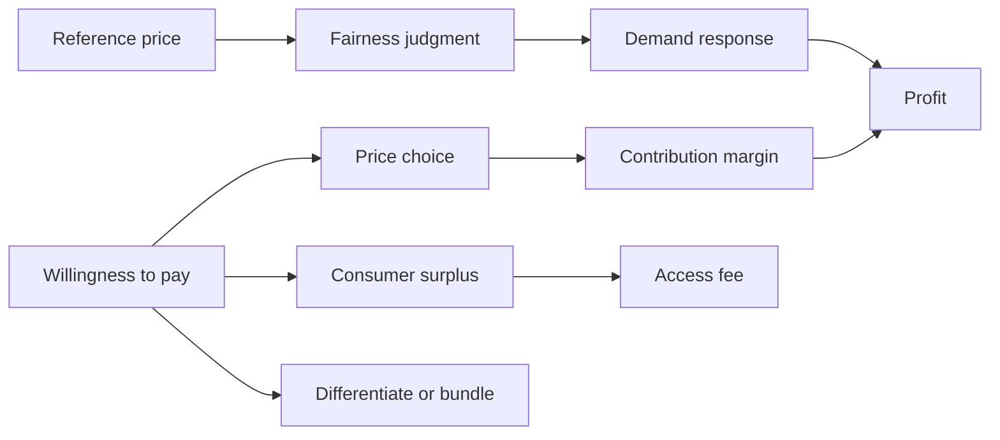

# Ubiquitous Language: Chapter 04 Price

Source note: `chapter-04-price.md`

Definition source: local lecture deck and note, enriched with standard pricing terminology where needed.

## Behavioral Price Language

| Term | Definition | Aliases to avoid |
|---|---|---|
| **Willingness To Pay (WTP)** | Maximum sacrifice a customer accepts for an offering. | market price, actual payment |
| **Reference Price** | Internal or external benchmark used to evaluate an observed price. | fair price always |
| **Price Fairness** | Judgment about whether a price and the process producing it are acceptable. | low price |
| **Compromise Effect** | Increased choice of an intermediate option after an extreme alternative is introduced. | decoy effect |
| **Decoy Effect** | Preference shift caused by an asymmetrically dominated option that favors a target. | compromise effect |
| **Price Threshold** | Price at which evaluation or demand changes discontinuously. | average price |
| **Price Knowledge** | Price-related information stored in long-term memory. | perfect recall |
| **Marginal Willingness To Pay** | Maximum amount the customer would pay for the next additional unit. It often falls as quantity consumed rises. | dynamic WTP over time |
| **Consumer Surplus** | Difference between WTP and actual payment. In a two-part tariff, the access fee can capture this surplus. | profit, revenue |

## Strategy Language

| Term | Definition | Aliases to avoid |
|---|---|---|
| **Price Differentiation** | Charging different prices for the same or slightly modified benefit to capture heterogeneous WTP. | any discount |
| **Quantity-Based Pricing** | Price varies with purchased or consumed quantity, such as volume discounts, flat rates, or two-part tariffs. | only bulk discount |
| **Dynamic Pricing** | Algorithmic or managerial adjustment of price as market conditions change. | yield management always |
| **Yield Management** | Joint control of price and perishable capacity using demand forecasts and booking information. | surge pricing only |
| **Skimming Pricing** | High introductory price followed by reductions across the life cycle; used to capture high-WTP early buyers and recover fixed/development investment. | premium pricing permanently, covering marginal cost faster |
| **Penetration Pricing** | Low introductory price intended to accelerate diffusion and market share. | predatory pricing |
| **Two-Part Tariff** | Fixed access fee plus per-unit usage price. | bundle |
| **Access Fee** | Fixed fee paid for the right to buy or use the service. It can capture consumer surplus. | unit price |
| **Per-Unit Usage Price** | Price paid for each unit consumed after access is granted. In the clean two-part tariff example, it is set near marginal cost. | access fee |
| **Full Bundling** | Products are available only as a package. | mixed bundling |
| **Mixed Bundling** | Products are available separately and as a package. | quantity discount |

## Formula Language

| Symbol or term | Meaning and unit | Decision role |
|---|---|---|
| `p` | price per unit | revenue and contribution per sale |
| `x` | units sold in the planning period | demand response |
| `c_var` | variable cost per unit | marginal cost in the simple model |
| `C_fix` | fixed cost per planning period | amount contribution must cover |
| `p - c_var` | contribution margin per unit | funds fixed cost and profit |
| `CMR` | contribution margin divided by revenue | share of each revenue euro available for fixed cost and profit |
| `epsilon` | percentage quantity response divided by percentage price change | demand sensitivity |
| `MR` | marginal revenue, the extra revenue from one more unit | profit-maximizing price rule |
| `MC` | marginal cost, the extra cost of one more unit | benchmark for `MR` in monopoly optimization |
| **Expected Profit** | probability-weighted average of possible profit outcomes | compare uncertain price/competitor scenarios |
| **Inverse Demand Function** | demand written as price depending on quantity, such as `p(x)` | used to build revenue `R = p(x)*x` |

```text
Profit = (p - c_var)x - C_fix
x_crit = C_fix/(p - c_var)
CMR = (p - c_var)/p
R_crit = C_fix/CMR
epsilon = (dx/dp)(p/x)
Expected profit = sum(probability_j * profit_j)
Revenue from inverse demand: R(x) = p(x)*x
Monopoly optimum: MR = MC
```

## Canonical Relationships

- **Customer value** supports **WTP**, but WTP is also shaped by alternatives, context, and fairness.
- **Reference price** influences **price fairness** and perceived savings.
- **Price differentiation** requires heterogeneous **WTP** plus segment separation.
- **Bundling** pools WTP across products; **two-part tariffs** separate access from usage.
- In a clean **two-part tariff**, **per-unit usage price** near marginal cost supports efficient consumption, while the **access fee** captures **consumer surplus**.
- **Contribution margin** links price to **break-even volume**.
- **Price elasticity** links price changes to demand response; contribution or profit calculations decide whether the change is attractive.
- **Expected profit** weights profit outcomes by probability, not sales volume alone.
- **Marginal revenue** comes from differentiating revenue, not the demand function alone.

## Visual Memory Aid



## Example Dialogue

> **Manager:** "Our algorithm says demand is high, so should we raise the airport price?"
>
> **Analyst:** "First separate **dynamic pricing** from customer acceptance. Estimate elasticity and contribution, then test the **reference price** and **price fairness** response."
>
> **Manager:** "And if business travelers value flexibility more?"
>
> **Analyst:** "That supports benefit-based **price differentiation**, provided the segment can self-select and resale is controlled."

## Flagged Ambiguities

- Use **revenue** for `p*x`; use **profit** only after subtracting variable and fixed cost.
- Use **contribution margin** for revenue remaining after variable cost; it is not net profit.
- Use **dynamic pricing** broadly; reserve **yield management** for demand-and-capacity control of perishable inventory.
- Use **price differentiation** for a deliberate WTP/segment mechanism, not every temporary discount.
- The lecture's `a` and `b` depend on whether demand is written as `x(p)` or inverse demand `p(x)`; define the chosen function before calculating.
- In the beer/two-part tariff example, say **decreasing marginal WTP** or **diminishing marginal utility**, not "dynamic consumer surplus by time."
- In the PapaTurk example, the `2x` term comes from differentiating `x^2`; it is not created by arbitrarily doubling demand.

## Exam Trap Corrections

| Trap | Correction |
|---|---|
| Price cut of 10% means volume need rise 10%. | Recalculate contribution per unit; required volume can rise far more. |
| Break-even revenue and volume are identical. | `R_crit` is currency; `x_crit` is units. |
| Revenue maximum equals profit maximum. | Profit includes cost; optimize with `MR = MC`. |
| Inelastic demand means quantity does not change. | It changes proportionally less than price. |
| High WTP proves a price is fair. | Fairness is a separate judgment about level and procedure. |
| Skimming covers marginal cost faster. | Skimming captures high early WTP and helps recover fixed/development investment faster; marginal cost is covered unit by unit. |
| Expected value uses probability only. | Probability weights each profit outcome; contribution margin and fixed cost still determine each outcome. |
| `p = 5 - x/3000` becomes `2x` because price doubles. | `R = p*x = 5x - x^2/3000`; `MR = dR/dx = 5 - 2x/3000`. |

## Cheat-Sheet Language

```text
Price decision = contribution economics + demand response + competitor response + fairness.
Two-part tariff = access fee captures surplus + usage price guides consumption.
Elasticity forecasts quantity response; contribution/profit decides whether the price move works.
For calculations: formula -> substitution -> result -> unit -> managerial interpretation.
```
